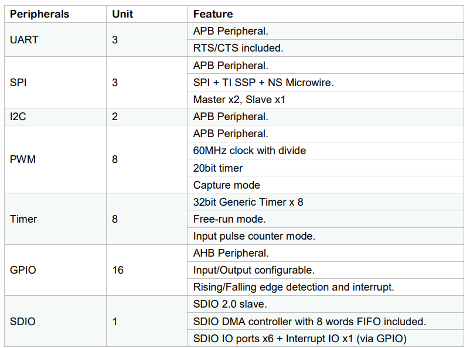
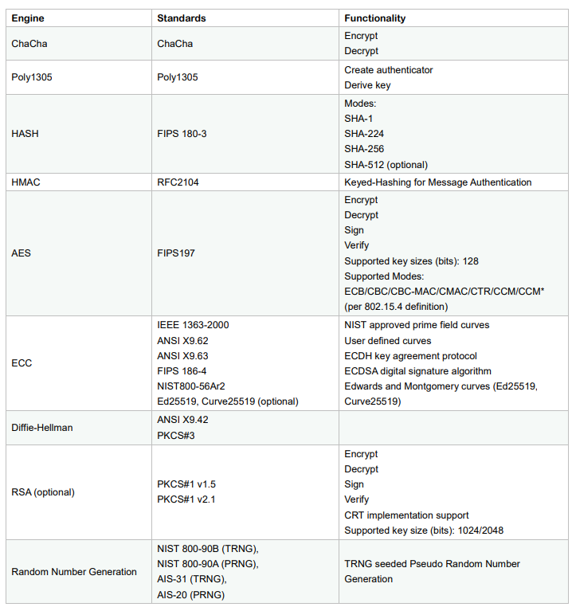
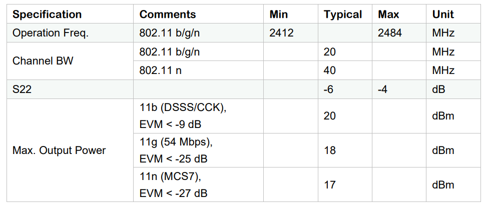
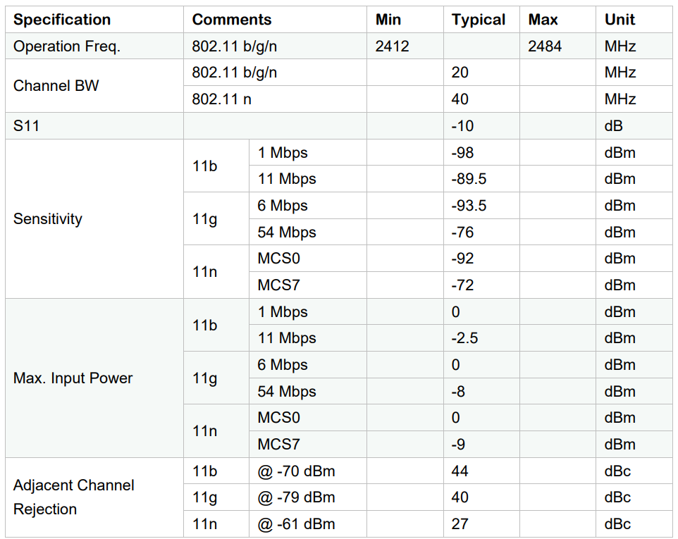
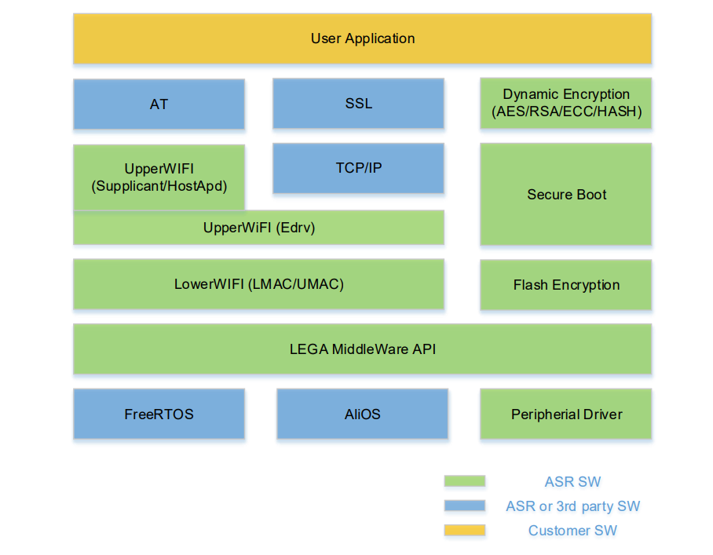
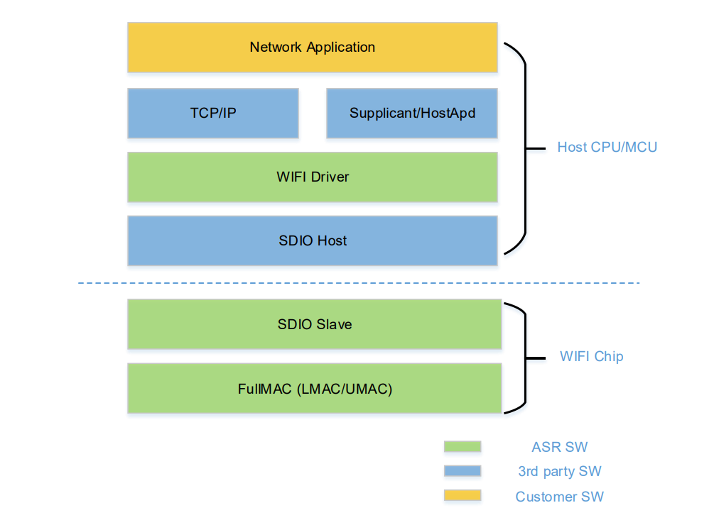
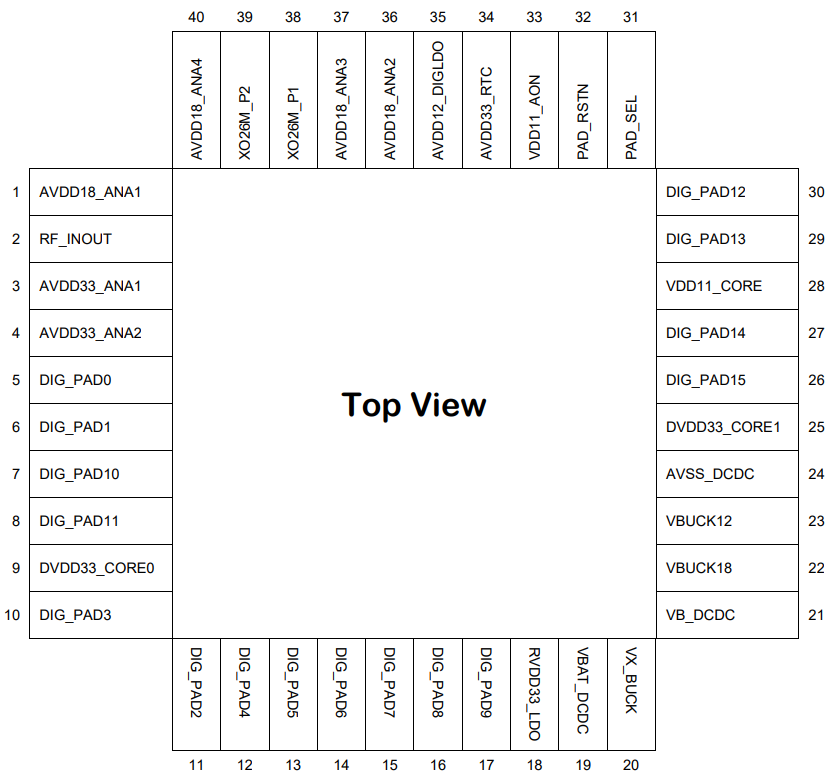

ASR5502S Datasheet
==================

Introduction
------------

**About This Document**

This document introduces the specifications of loT Wi-Fi SoC ASR5502S.

**Intended Readers**

This document is mainly for engineers who use this chip to develop their own platform and products, for instance:

-  PCB Hardware Development Engineer
-  Software Engineer
-  Technical Support Engineer

**Included Chip Models**

The product models corresponding to this document are as follows.

+----------+-----------+---------------+--------------+-----------------------------------------------------------+
| Model    | SiP Flash | Package       | Protocol     | Operating Modes                                           |
+==========+===========+===============+==============+===========================================================+
| ASR5502S | Yes       | QFN40, 5*5 mm | 802.11 b/g/n | Support Station/SoftAP/Sniffer Support IoT mode/SDIO mode |
+----------+-----------+---------------+--------------+-----------------------------------------------------------+

**Copyright Notice**

© 2023 ASR Microelectronics Co., Ltd. All rights reserved. No part of this document can be reproduced, transmitted, transcribed, stored, or translated into any languages in any form or by any means without the written permission of ASR Microelectronics Co., Ltd.

**Trademark Statement**

ASR and ASR Microelectronics Co., Ltd. are trademarks of ASR Microelectronics Co., Ltd. 

Other trade names, trademarks and registered trademarks mentioned in this document are property of their respective owners.

**Electrostatic Discharge (ESD) Warning**

This product can be damaged by Electrostatic Discharge (ESD). When handling with this device, the people should be very careful to conduct the ESD protection to avoid any device damage caused by ESD event.

**Disclaimer**

ASR does not give any warranty of any kind and may make improvements and/or changes in this document or in the product described in this document at any time.

This document is only used as a guide, and no contents in the document constitute any form of warranty. Information in this document is subject to change without notice.

All liability, including liability for infringement of any proprietary rights caused by using the information in this document is disclaimed.

**ASR Microelectronics Co., Ltd.**

Address: 9F, Building 10, No. 399 Keyuan Road, Zhangjiang High-tech Park, Pudong New Area, Shanghai, 201203, China

Homepage: http://www.asrmicro.com/

**Revision History**

======= ======= ===================================================
Date    Version Release Notes
======= ======= ===================================================
2023.02 V2.7.2  Updated Chapter 7.
======= ======= ===================================================

1. Overview
-----------

1.1 General
~~~~~~~~~~~

ASR550X family is a highly integrated, high performance and low cost 1x1 IEEE 802.11 b/g/n System-on-Chip (SoC) for the Internet of Things (IoT). ASR550X integrates RF transceiver, 802.11 PHY+MAC, ARM Cortex-M4F, advanced peripheral interfaces, Real Time Counter (RTC) and power management circuits. The integrated RF and analog circuit incorporate T/R switch, RF balun, power amplifier, low-noise amplifier, and entire power management modules. Therefore, ASR550X provides a small form-factor solution with minimal external components for the IoT applications, such as smart lighting, security, remote control, appliances and more.

With the complete and self-contained 802.11 b/g/n WLAN networking capabilities, the chip can perform either as a standalone IoT application with Supplicant/HostAP/Sniffer mode, or as a slave with SDIO interface.

**Solution Highlights:**

-  **Fully Integrated Power Management Circuits**

The chip includes an on-chip DCDC associated with LDOs to provide noise isolated power supplies for digital and analog modules. The DCDC has a single, wide-range (3.3~5 V) supply input and dual outputs (1.2 V, 1.8 V) to extremely minimize Bill of Material (BoM). Moreover, the chip provides two UART interfaces that can follow the DCDC supply to adjust interface voltage range from 3.3 V to 5V.

-  **Entire Security System**

A completed security infrastructure, including AES/RSA/ECC crypto engine, hash engine and True Random Generator (TRNG), is also integrated. ASR550X can provide a comprehensive security solution as Security Boot flow, Flash Image Protection and dynamic encryption/decryption for customer data.

-  **Entire Software Solution**

ASR550X provides an entire software solution, such as RTOS/TCPIP/SSL/MQTT/Wi-Fi/AT and more. The customer just needs to simply develop applications then go to market.

In pass through application scenario, the customer needs no any code developing in ASR550X, but controls ASR550X with AT command through UART interface. In master-control application scenario, the customer just needs to focus on their own application developing, with the OS/ communication layer/ Security already supported in ASR550X SDK, and easily calling the 550X’s API.

1.2 Part Number Information
~~~~~~~~~~~~~~~~~~~~~~~~~~~

The following table gives ASR550X part number information (Note that the number is a temporary version).

+-------------+------------+------------------------+-----------+----------------------------+------------------------------------------------+
| Part Number | Pin Number | Package Size (mm x mm) | Flash SiP | DIG_PAD0~3 DVDD IO Voltage | Descriptions                                   |
+=============+============+========================+===========+============================+================================================+
| ASR5502S    | 40         | 5x5                    | Yes       | Follow VBAT Supply         | DIG_PAD0~3 DVDD IO voltage follows VBAT supply |
+-------------+------------+------------------------+-----------+----------------------------+------------------------------------------------+

1.3 Features
~~~~~~~~~~~~

-  **Power Management Unit (PMU)**

   -  Integrated DCDC and LDO, no need of off-chip PMU device
   -  Support single supply input, range from 3.3 V ~ 5 V

-  **IEEE 802.11 Features**

   -  Integrated Power Amplifier (PA) with internal power detector and closed loop power calibration
   -  Integrated T/R switch and RF balun, no need of off-chip matching network
   -  Support 802.11 b/g/n compatible WLAN
   -  Support 802.11e QoS enhancement (WMM)
   -  Support 802.11i (WPA/WPA2 PSK), Open/WEP/TKIP/CCMP
   -  Support power saving mechanism

-  **SoC Features**

   -  ARM Cortex-M4F associated with 16 KB instruction cache
   -  256 KB RAM Configurable for Instruction and Data
   -  24 KB Boot ROM is integrated
   -  4K-bit OTP is integrated
   -  MCU Core Clock: 240 MHz
   -  XTAL Clock: 26/40 MHz
   -  Low-Power Clock: XO 32.768 KHz Clock, RC 32.768 KHz Clock
   -  Support eXecute-in-Place (XiP) on flash and external SPI flash
   -  External SPI NOR Flash is supported up to 128 MB
   -  Support Category: Winbond, MXIC, XTX and GigaDevice
   -  Support OTA

-  **Security**

   -  ARM TrustZone , CryptoCell 310 Security Engine
   -  AES/RSA/ECC/MAC/HMAC/SHA1/SHA-224/SHA256/SHA512/D-H library
   -  True Random Number Generator (TRNG)/PRNG
   -  Flash Image Integrated Encryption/Decryption
   -  Dynamic Encryption/Decryption for Customer Data
   -  Integrated eFuse OTP

-  **Peripherals**

   -  UART/SPI/ I2C/PWM/Timer
   -  SDIO
   -  Generic AUXADC x8 Channels
   -  Watchdog
   -  RTC

1.4 Block Diagram
~~~~~~~~~~~~~~~~~

|image1|

1.5 Applications
~~~~~~~~~~~~~~~~

-  Smart Plugs and Lights
-  Wearable Electronics
-  Home Appliances
-  Home Automation
-  802.11 WLAN Location-aware Devices
-  Security ID Tags
-  802.11 WLAN Position System Beacons
-  Mesh Network
-  Industrial Wireless Control
-  Sensor Networks

2. System Function Description
------------------------------

2.1 PMU
~~~~~~~

ASR550X can support 3.3 V ~ 5 V single power supply, which can come from a battery or a DC-DC convertor or an AC-DC convertor directly. There is no need of any other off-chip DCDC or LDO device. The PMU consists of Always-ON (AON) control logic, RTC circuits, DCDC, and LDOs. All these circuits have characters of low noise and low quiescent current performances.

DCDC is powered by single power supply and it generates two BUCK voltages of 1.2 V and 1.8 V. 1.2 V BUCK is supply for Digital LDO (DLDO). 1.8 V BUCK is supply for all Analog LDOs (ALDO). The LDO33 has 3.3 V output that provide supply for DVDD IO, RTC LDO (RLDO) and 3.3 V analog circuits.

ASR550X's PMU provides several low power modes: modem sleep, light sleep, and deep sleep. These modes meet the different application requirements.

2.2 Clock
~~~~~~~~~

ASR550X supports 26M or 40M XO frequency to generate all high performance clock signals in on-chip RF/Analog PLL. In RTC, circuits support two low power clock sources, the single-ended input 32.768KHz XO and the RC Oscillator (RCO). The customer can use RCO as RTC reference clock to save the BoM. The RCO frequency can be auto-calibrated on-chip.

2.3 CPU Functions
~~~~~~~~~~~~~~~~~

.. _introduction-1:

2.3.1 Introduction
^^^^^^^^^^^^^^^^^^

ASR550X includes an integrated ARM Cortex™-M4 processor with internal RAM and ROM. The high-performance ARM Cortex-M4 processor provides a low-cost platform that meets the needs of minimal memory implementation, reduced pin count, and low power consumption, while delivering outstanding computational performance and exceptional system response to interrupts. The Cortex-M4 includes optional floating point arithmetic functionality.

.. _features-1:

2.3.2 Features
^^^^^^^^^^^^^^

The inside ARM Cortex-M4 core has Floating Point Unit (FPU) and Memory Protection Unit (MPU) and with the following features:

-  A 32-bit ARM Cortex Thumb® instruction set optimized for embedded applications

-  A Nested Vectored Interrupt Controller (NVIC) closely integrated with the processor core to achieve low latency interrupt processing.

-  A low-cost debug solution featuring with serial wire debug port (SW-DP) or serial wire JTAG debug port (SWJ-DP) debug access

-  Multiple high-performance bus interfaces.

2.4 Memory
~~~~~~~~~~

2.4.1 ROM
^^^^^^^^^

The internal 24 KB ROM of ASR550X device is at address 0x0000_0000 of the device memory. It stored the boot rom image, mainly used to program the flash image/take secure boot function/take non-secure boot function according to the Mode Selection.

2.4.2 SRAM
^^^^^^^^^^

ASR550X family provides up to 256 KB of on-chip SRAM. The internal RAM is not only used for code and data memory, but also used for shared memory for Wi-Fi packet buffer. It can be configured by software remap register. Internal RAM is capable of selective retention during power save mode. This internal SRAM is located at offset 0x0800_0000 of the device memory map.

2.4.3 FLASH
^^^^^^^^^^^

ASR5502S provides 2 MB of System-in-Package (SiP) QSPI Flash and supports up to external 128 MB QSPI flash devices with hardware encryption and flash remapping functions to protect developers’ programs and data.

The Cortex-M4 processor can access the QSPI flash through high-speed caches.

2.4.4 One-Time Programmable Memory
^^^^^^^^^^^^^^^^^^^^^^^^^^^^^^^^^^

ASR550X family provides 4K-bit One-Time Programmable (OTP) memory.

Hardware configuration parameters including Flash-Encryption may be stored in first internal 2Kbit OTP memory, which is read by system software after device reset. In addition, customer-specific parameters can be stored, depending on the specific board design in reserved 2Kbit OTP memory.

2.4.5 Memory Mapping
^^^^^^^^^^^^^^^^^^^^

The following table describes the various MCU peripherals and how they are mapped to the processor memory.

================== ============= ================================================
Description        Start Address                              End Address
================== ============= ================================================
ROM                0x0000_0000                                0x0000_5FFF
SRAM               0x0800_0000                               0x0803_FFFF
FLASH              0x1000_0000                               0x17FF_FFFF
SYS_CON            0x4000_0000                           0x4000_0FFF
GPIO0              0x4000_1000                              0x4000_1FFF
GPIO1              0x4000_2000                             0x4000_2FFF
QSPI_CFG           0x4000_3000                          0x4000_3FFF
DMA_CFG            0x4000_4000                          0x4000_4FFF
OTP                0x4000_5000                                 0x4000_5FFF
SEC_FLASH_CTRL_CFG 0x4000_6000                         0x4000_6FFF
SDIO               0x4000_7000                                  0x4000_7FFF
RETENTION_MST      0x4000_8000                        0x4000_8FFF
WDT                0x4001_0000                              0x4001_FFFF
UART0              0x4001_1000                             0x4001_1FFF
UART1              0x4001_2000                            0x4001_2FFF
UART2              0x4001_3000                           0x4001_3FFF
SPI0               0x4001_4000                             0x4001_4FFF
SPI1               0x4001_5000                           0x4001_5FFF
SPI2               0x4001_6000                            0x4001_6FFF
TIMER              0x4001_7000                          0x4001_7FFF
PWM                0x4001_8000                             0x4001_8FFF
ADC                0x4001_9000                             0x4001_9FFF
I2C0               0x4001_A000                            0x4001_AFFF
I2C1               0x4001_B000                            0x4001_BFFF
CACHE_CFG          0x4001_C000                         0x4001_CFFF
CYPT310_CFG        0x4001_D000                         0x4001_DFFF
Share mem          0x6000_0000                          0x607F_FFFF
MAC/PHY            0x6080_0000                           0x61FF_FFFF
================== ============= ================================================

2.5 Peripherals
~~~~~~~~~~~~~~~
The following table gives a summary of all peripherals of ASR5502S.

|image2|

2.5.1 PIN MUX
^^^^^^^^^^^^^

All GPIO can be reconfigured via software control. The PIN MUX table is shown as follows:

+------+-----------+-------------+-------------+-------------+-------------+-------------+
| Num. | Pin Name  | GPIO Func=0 | GPIO Func=1 | GPIO Func=2 | GPIO Func=3 | GPIO Func=4 |
+======+===========+=============+=============+=============+=============+=============+
| 1    | DIG_PAD0  | GPIO0       | UART0_TXD   | SWC         | SPI1_CSN    | PWM5        |
+------+-----------+-------------+-------------+-------------+-------------+-------------+
| 2    | DIG_PAD1  | GPIO1       | UART0_RXD   | SWD         | SPI1_SCK    | PWM7        |
+------+-----------+-------------+-------------+-------------+-------------+-------------+
| 3    | DIG_PAD2  | GPIO2       | UART1_TXD   | UART1_TXD   | SPI1_MISO   | I2C0_SCL    |
+------+-----------+-------------+-------------+-------------+-------------+-------------+
| 4    | DIG_PAD3  | GPIO3       | UART1_RXD   | SDIO_INT    | SPI1_MOSI   | I2C0_SDA    |
+------+-----------+-------------+-------------+-------------+-------------+-------------+
| 5    | DIG_PAD4  | SWC         | GPIO4       | SDIO_CMD    | UART0_TXD   | PWM0        |
+------+-----------+-------------+-------------+-------------+-------------+-------------+
| 6    | DIG_PAD5  | SWD         | GPIO5       | SDIO_CLK    | UART0_RXD   | PWM2        |
+------+-----------+-------------+-------------+-------------+-------------+-------------+
| 7    | DIG_PAD6  | GPIO6       | SPI0_CSN    | SDIO_DATA0  | UART0_CTS   | PWM4        |
+------+-----------+-------------+-------------+-------------+-------------+-------------+
| 8    | DIG_PAD7  | GPIO7       | SPI0_SCK    | SDIO_DATA1  | UART0_RTS   | PWM6        |
+------+-----------+-------------+-------------+-------------+-------------+-------------+
| 9    | DIG_PAD8  | GPIO8       | SPI0_MOSI   | SDIO_DATA2  | I2C1_SCL    | UART1_TXD   |
+------+-----------+-------------+-------------+-------------+-------------+-------------+
| 10   | DIG_PAD9  | GPIO9       | SPI0_MISO   | SDIO_DATA3  | I2C1_SDA    | UART1_RXD   |
+------+-----------+-------------+-------------+-------------+-------------+-------------+
| 11   | DIG_PAD10 | MODE_SEL3   | PWM1        | GPIO10      | UART2_CTS   | SPI2_SCK    |
+------+-----------+-------------+-------------+-------------+-------------+-------------+
| 12   | DIG_PAD11 | GPIO11      | PWM3        | SDIO_INT    | UART2_RTS   | SPI2_MOSI   |
+------+-----------+-------------+-------------+-------------+-------------+-------------+
| 13   | DIG_PAD12 | GPIO12      | GPIO12      | SPI2_CSN    | UART2_TXD   | GPIO12      |
+------+-----------+-------------+-------------+-------------+-------------+-------------+
| 14   | DIG_PAD13 | GPIO13      | GPIO13      | SPI2_MISO   | UART2_RXD   | GPIO13      |
+------+-----------+-------------+-------------+-------------+-------------+-------------+
| 15   | DIG_PAD14 | STRAP/SEL1  | PWM0        | SPI2_SCK    | UART1_CTS   | GPIO14      |
+------+-----------+-------------+-------------+-------------+-------------+-------------+
| 16   | DIG_PAD15 | STRAP/SEL2  | PWM2        | SPI2_MOSI   | UART1_RTS   | GPIO15      |
+------+-----------+-------------+-------------+-------------+-------------+-------------+

2.5.2 PWM
^^^^^^^^^

Pulse Width Modulation (PWM) is to generate pulse sequences with programmable frequency and duty cycle for LCD, Vibrators and other devices. The PWM provides eight PWM channels and four of them can be configured as input capture function.

Features:

-  8 PWM generators with 16-bit counter
-  Prescaler divider by 1/2/4/8/16/32/64/128
-  Up or up/down mode for PWM output
-  Dead-band generator, and it can be bypassed
-  16-bit input capture (edge/time) mode
-  16-bit timer mode

2.5.3 SPI
^^^^^^^^^

ASR550X supports four-wire and full-duplex Motorola Serial Peripheral Interface (SPI) protocol. There are three SPI, two of them are master and the other one is slave. They support two options of clock polarity (CPOL) and clock phase (CPHA).

Features:

-  Support normal Motorola SPI mode at the clock range of 0~10 MHz in master mode
-  The maximum sck_in is 6.6(4.3) MHz when both transmit and receive in slave mode
-  The frame format is configurable by different CPOL and CPHA
-  Configurable frame size by 4~32 bits
-  TX/RX FIFO are independent and the max depth is 32 Bytes
-  Programmable delay on the sample time of the rxd signal, and max delay is 8 sclk cycles, only in master mode
-  The slave select signal will be toggled between frames when CPHA=0
-  Support DMA mode

2.5.4 UART
^^^^^^^^^^

ASR550X provides three Universal Asynchronous Receiver Transmitter (UART) controllers. Two of them with auto-flow control are used for communication with external devices and the other one is for debug.

Features:

-  TX/RX FIFO depth is 16 Bytes
-  Support auto flow control mode
-  Programmable frame properties, such as number of data bits per frame (5~8), optional parity bit (odd/even), number of stop bits (1,1.5,2)
-  Include additional FIFO status registers and shadow registers, that can be accessed by software
-  Loopback mode for test
-  Support DMA mode

2.5.5 I2C
^^^^^^^^^

The Inter-Integrated Circuits (I2C) bus is two wires, serial data (SDA) and serial clock (SCL). It carries information between the devices connected to the bus. Each device is recognized by a unique address and can operate as either a transmitter or receiver, depending on the function of the device.

Features:

-  Support SS mode (100 KHz), FS mode (400 KHz), FS mode plus (1 MHz), and HS mode (2 MHz)
-  Support master or slave I2C operation
-  Support 7-bit/10-bit addressing
-  TX/RX FIFO depth is 32 Bytes
-  Support clock stretch when TX FIFO is empty or RX FIFO is full
-  Support DMA mode

2.5.6 DMAC
^^^^^^^^^^

Direct Memory Access (DMA) is used to provide high-speed data transfer between peripherals and memory, and between memory and memory, without CPU’s operations. It provides two DMA channels and sixteen handshakes with peripheral.

Features:

-  Two Advanced High Performance Bus (AHB) masters, one is to access memory and the other is to access peripheral
-  Two DMA channels
-  Sixteen handshakes with peripherals
-  Allow the AHB slave interface to return an error response when an illegal access is attempted
-  Maximum block size in source transfer widths is 4095
-  Programmable channel x’s source transfer and destination transfer width
-  FIFO depth is 8 bytes for each channel
-  Support multi-block DMA transfers on each channel
-  Support LLP mode

2.5.7 SDIO
^^^^^^^^^^

Secure Digital Input and Output (SDIO) block is designed to be a SDIO slave device to work with SDIO host for bi-directional data transfer. All command should be issued by host device. It has an AHB master interface connect to memory controller, while has an AHB slave interface connect to Advanced eXtensible Interface (AXI) fabric for CPU access.

Features:

-  Support SDIO 2.0 specification
-  Support 1-bit, 4-bit SDIO transfer mode at the clock range of 0~40 MHz
-  Configurable clock edge for sampling and driving
-  Configurable block size from 1 to 512 Bytes (in multiples of 4)
-  Supply card to host interrupt by GPIO
-  Support multi-ports DMA mode
-  Support aggregation DMA mode

2.5.8 GPIO
^^^^^^^^^^

General purpose Input / Output (GPIO) pins are fully configurable. They are multiplexed with other interfaces, such as I2C, SPI, UART and etc. The GPIO pins support the below features:

-  Input mode: the input value can be read through register.
-  Output mode: the output value can be set through register.
-  Interrupt: the input can be set to edge-trigger or level-trigger to generate CPU interrupt. Support 4 types of trigger: Low level, high level, falling edge and rising edge.
-  Internal pull-up or pull-down configurable

2.5.9 TIMER and WatchDog
^^^^^^^^^^^^^^^^^^^^^^^^

ASR550X provides 2 independent HW timer (besides, PWM block provides 4 timers, RTC block provides 1 real-time timer and 1 low-power timer). Each Timer integrates 32-bit or 16-bit counter (software configured). Each Timer support the below modes:

-  Free-running mode: it is the default mode, the counter counts from max value (0xFFFF of 16bit mode or 0xFFFFFFFF of 32bit mode) to 0, then continue from max value to 0, when it counts to 0, an interrupt is generated to CPU.
-  Periodic timer mode: the counter counts from software configured value to 0, then continue from the setting value to 0, when it counts to 0, an interrupt is generated to CPU.
-  One-shot timer mode: the counter counts from the software configured value to 0, then stop counting and generate an interrupt to CPU.

The Watch Dog Timer is used to resume the controller operation when it had been disturbed by malfunctions such as noise and system errors. It can generate a general reset or an interrupt request.

2.5.10 CRYPTO ENGINE
^^^^^^^^^^^^^^^^^^^^

Crypto Engine block is an integrated security core and provides a comprehensive security infrastructure that enables system wide protection that includes use cases inside and outside the device.

Function features are shown in below table.
|image3|

3. Wi-Fi Subsystem Descriptions
-------------------------------

ASR550X supports features specified in the IEEE 802.11 base standard, and amended by IEEE 802.11n.

3.1 Wi-Fi MAC
~~~~~~~~~~~~~

ASR550X WLAN Media Access Control (MAC) is designed to support high throughput operation with low power consumption.

-  Transmission and reception of aggregated MPDUs (A-MPDU)
-  Support for power management schemes, including WMM power-save
-  Support for immediate ACK and Block-ACK policies
-  Interframe space timing support, including RIFS
-  Support for RTS/CTS and CTS-to-self frame sequences for protecting frame exchanges
-  Back-off counters in hardware for supporting multiple priorities as specified in the WMM specification
-  Timing synchronization function (TSF), network allocation vector (NAV) maintenance, and target beacon transmission time (TBTT) generation in hardware
-  Hardware off-load for AES-CCMP, legacy WPA TKIP, legacy WEP ciphers, WAPI, and support for key management
-  Statistics counters for MIB support
-  802.11 e: QoS for wireless multimedia technology
-  Monitor mode: sniff all frames from the medium

3.2 Wi-Fi PHY
~~~~~~~~~~~~~

ASR550X WLAN Digital Port Physical Layer (PHY) is designed to comply with IEEE 802.11 b/g/n single stream to provide wireless LAN connectivity or low-power applications.

-  Supports IEEE 802.11b, 11g, 11n single-stream standards
-  Supports 802.11n MCS0-7 in both 20 MHz and 40 MHz bandwidth
-  Supports Optional Greenfield mode in Tx and Rx
-  Algorithms achieve low power, enhanced sensitivity, range and reliability
-  Automatic gain control scheme for blocking and non-blocking application scenario.

3.3 Wi-Fi RF
~~~~~~~~~~~~

ASR550X integrates fully 802.11 b/g/n RF transceiver, including T/R switch, matching network, PA, Low Noise Amplifier (LNA), and RF synthesizer. There is no need of off-chip matching network, which saves the BoM and module Print Circuit Board (PCB) size.

The transceiver has auto-calibration and sensor circuits to guarantee the RF performance in mass production. These calibrations include transmit power, IQ imbalance, LO leakage, DC offset, filter bandwidth and etc. The temperature sensor and process sensor are also integrated on-chip.

The following table shows Wi-Fi RF TX and RX specification respectively.

.. raw:: html

   

Wi-Fi TX Specification
|image4|

Wi-Fi RX Specification
|image5|

.. raw:: html

   

4. Software Descriptions
------------------------

ASR550X software supports two modes: XiP mode and SDIO mode.

4.1 XiP Mode
~~~~~~~~~~~~

The XiP mode is mainly used in IOT scenario, the SoC can used as master control module as well as transfer module, supporting multi-functions, such as security, RTOS, TCPIP stack, Wi-Fi, AT, peripherals drivers, OTA etc.

Under the XIP mode, the image mainly runs in Flash, can effectively reduce the SRAM consuming and support the larger image.

The software architecture is as below:

|image6|

4.2 SDIO mode
~~~~~~~~~~~~

The SDIO mode is mainly used as High Speed Wi-Fi Device, provide higher throughput compared with XiP mode.

Under the SDIO mode, the Wi-Fi chip will connect with Application Process chip with SDIO interface, the firmware images all run in SRAM, can effectively meet the high speed requirement. 
The Software Architecture is as below:

|image7|

5. Electrical Characteristics
-----------------------------

5.1 Absolute Maximum Rating
~~~~~~~~~~~~~~~~~~~~~~~~~~~

=========================== ========= ==== ==== ==== ====
Parameter                   Symbol    Min. Typ. Max. Unit
=========================== ========= ==== ==== ==== ====
Power supply                VBAT_DCDC -0.3      5.8  V
Storage temperature range   TSTR      -40       125  °C
Operating temperature range TOPR      -40       85   *°C*
=========================== ========= ==== ==== ==== ====

5.2 Recommended Operating Conditions
~~~~~~~~~~~~~~~~~~~~~~~~~~~~~~~~~~~~

=========================== ========= ==== ======== ==== ====
Parameter                   Symbol    Min. Typ.     Max. Unit
=========================== ========= ==== ======== ==== ====
Power supply                VBAT_DCDC 3    3.6 or 5 5.2  V
Operating temperature range TOPR      -40           85   °C
=========================== ========= ==== ======== ==== ====

6. Package Specifications
-------------------------

6.1 QFN40 Mechanical Parameters
~~~~~~~~~~~~~~~~~~~~~~~~~~~~~~~

ASR5502S uses 5 mm x 5 mm QFN package of 40 pin with 0.4 mm pitch.

|image8|

6.2 QFN40 Pin Assignment and Description
~~~~~~~~~~~~~~~~~~~~~~~~~~~~~~~~~~~~~~~~

The chip top view and pin descriptions of ASR5502S are shown as follows.

|image9|

.. raw:: html

   

ASR5502S Pin Descriptions

.. raw:: html

   

+-------------------------+---------------+---------------------------------+---------+
| Num.                    | Name          | Pin Description                 | I/O     |
+=========================+===============+=================================+=========+
| **Power, Clock**        |               |                                 |         |
+-------------------------+---------------+---------------------------------+---------+
| 33                      | VDD11_AON     | 1.1V digital always-on supply   | Power   |
+-------------------------+---------------+---------------------------------+---------+
| 28                      | VDD11_CORE    | 1.1V digital core domain supply | Power   |
+-------------------------+---------------+---------------------------------+---------+
| 35                      | AVDD12_DIGLDO | 1.2V digital core LDO supply    | Power   |
+-------------------------+---------------+---------------------------------+---------+
| 1                       | AVDD18_ANA1   | 1.8V analog supply              | Power   |
+-------------------------+---------------+---------------------------------+---------+
| 36                      | AVDD18_ANA2   | 1.8V analog supply              | Power   |
+-------------------------+---------------+---------------------------------+---------+
| 37                      | AVDD18_ANA3   | 1.8V analog supply              | Power   |
+-------------------------+---------------+---------------------------------+---------+
| 40                      | AVDD18_ANA4   | 1.8V analog supply              | Power   |
+-------------------------+---------------+---------------------------------+---------+
| 3                       | AVDD33_ANA1   | 3.3V analog supply              | Power   |
+-------------------------+---------------+---------------------------------+---------+
| 4                       | AVDD33_ANA2   | 3.3V analog supply              | Power   |
+-------------------------+---------------+---------------------------------+---------+
| 34                      | AVDD33_RTC    | 3.3V RTC domain supply          | Power   |
+-------------------------+---------------+---------------------------------+---------+
| 9                       | DVDD33_CORE0  | 3.3V digital IO supply          | Power   |
+-------------------------+---------------+---------------------------------+---------+
| 25                      | DVDD33_CORE1  | 3.3V digital IO supply          | Power   |
+-------------------------+---------------+---------------------------------+---------+
| 38                      | XO26M_P1      | 26MHz clock input               | Analog  |
+-------------------------+---------------+---------------------------------+---------+
| 39                      | XO26M_P2      | 26MHz clock input               | Analog  |
+-------------------------+---------------+---------------------------------+---------+
| **DCDC, LDO**           |               |                                 |         |
+-------------------------+---------------+---------------------------------+---------+
| 18                      | RVDD33_LDO    | 3.3V LDO output                 | Analog  |
+-------------------------+---------------+---------------------------------+---------+
| 19                      | VBAT_DCDC     | 3.3~5V DCDC/LDO supply          | Power   |
+-------------------------+---------------+---------------------------------+---------+
| 20                      | VX_BUCK       | DCDC signal                     | Analog  |
+-------------------------+---------------+---------------------------------+---------+
| 21                      | VB_DCDC       | DCDC signal                     | Analog  |
+-------------------------+---------------+---------------------------------+---------+
| 22                      | VBUCK18       | 1.8V DCDC buck output           | Analog  |
+-------------------------+---------------+---------------------------------+---------+
| 23                      | VBUCK12       | 1.2V DCDC buck output           | Analog  |
+-------------------------+---------------+---------------------------------+---------+
| 24                      | AVSS_DCDC     | DCDC ground                     | Power   |
+-------------------------+---------------+---------------------------------+---------+
| **GPIO, Reset, Select** |               |                                 |         |
+-------------------------+---------------+---------------------------------+---------+
| 5                       | DIG_PAD0      | GPIO                            | Digital |
+-------------------------+---------------+---------------------------------+---------+
| 6                       | DIG_PAD1      | GPIO                            | Digital |
+-------------------------+---------------+---------------------------------+---------+
| 11                      | DIG_PAD2      | GPIO                            | Digital |
+-------------------------+---------------+---------------------------------+---------+
| 10                      | DIG_PAD3      | GPIO                            | Digital |
+-------------------------+---------------+---------------------------------+---------+
| 12                      | DIG_PAD4      | GPIO                            | Digital |
+-------------------------+---------------+---------------------------------+---------+
| 13                      | DIG_PAD5      | GPIO                            | Digital |
+-------------------------+---------------+---------------------------------+---------+
| 14                      | DIG_PAD6      | GPIO                            | Digital |
+-------------------------+---------------+---------------------------------+---------+
| 15                      | DIG_PAD7      | GPIO                            | Digital |
+-------------------------+---------------+---------------------------------+---------+
| 16                      | DIG_PAD8      | GPIO                            | Digital |
+-------------------------+---------------+---------------------------------+---------+
| 17                      | DIG_PAD9      | GPIO                            | Digital |
+-------------------------+---------------+---------------------------------+---------+
| 7                       | DIG_PAD10     | GPIO                            | Digital |
+-------------------------+---------------+---------------------------------+---------+
| 8                       | DIG_PAD11     | GPIO                            | Digital |
+-------------------------+---------------+---------------------------------+---------+
| 30                      | DIG_PAD12     | GPIO                            | Digital |
+-------------------------+---------------+---------------------------------+---------+
| 29                      | DIG_PAD13     | GPIO                            | Digital |
+-------------------------+---------------+---------------------------------+---------+
| 27                      | DIG_PAD14     | GPIO                            | Digital |
+-------------------------+---------------+---------------------------------+---------+
| 26                      | DIG_PAD15     | GPIO                            | Digital |
+-------------------------+---------------+---------------------------------+---------+
| 31                      | PAD_SEL       | Mode select                     | Digital |
+-------------------------+---------------+---------------------------------+---------+
| 32                      | PAD_RSTN      | Reset                           | Digital |
+-------------------------+---------------+---------------------------------+---------+
| **RF Interface**        |               |                                 |         |
+-------------------------+---------------+---------------------------------+---------+
| 2                       | RF_INOUT      | Wi-Fi RF input/output           | Analog  |
+-------------------------+---------------+---------------------------------+---------+

7. Reference Application Circuits
---------------------------------

Take ASR5502S as an example, the reference PCB design is shown in following diagram.

The chip is powered by single supply input "VCC" with range from 3.3~5 V. The inside PMU can generate 1.2/1.8/3.3 V voltage for the core function circuits and digital IO voltage. There is no need of other PMU IC, but just total 9 passive LC devices.

|image10|

.. |image1| image:: ../../img/5502S_DS/图1-1.png

.. |image8| image:: ../../img/5502S_DS/图6-1.png

.. |image10| image:: ../../img/5502S_DS/图7-1.png