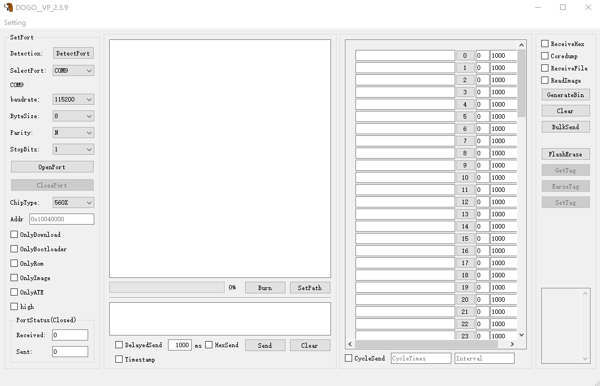
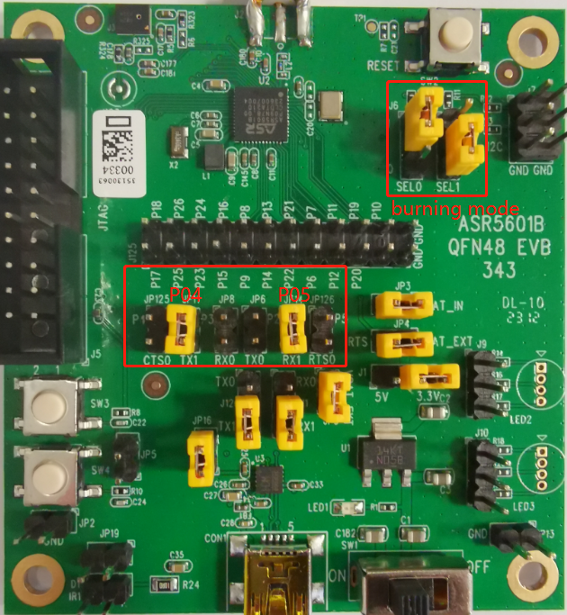
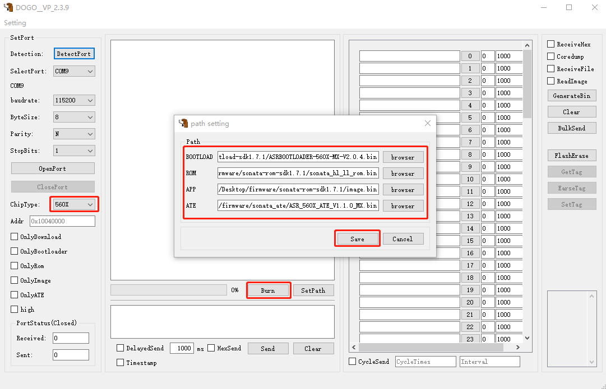
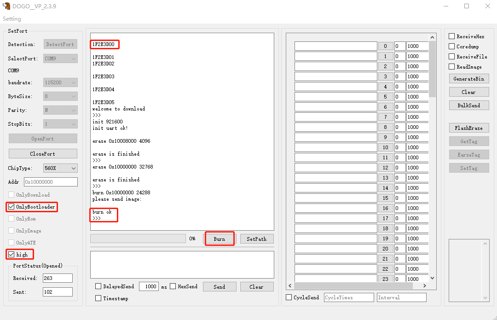
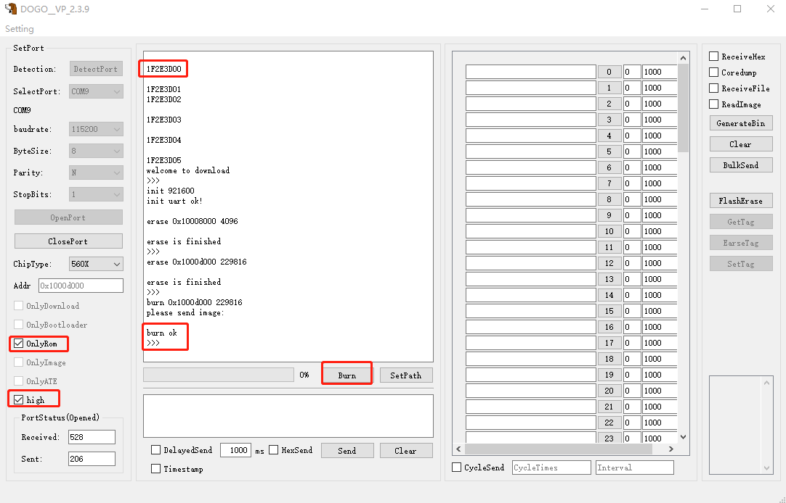
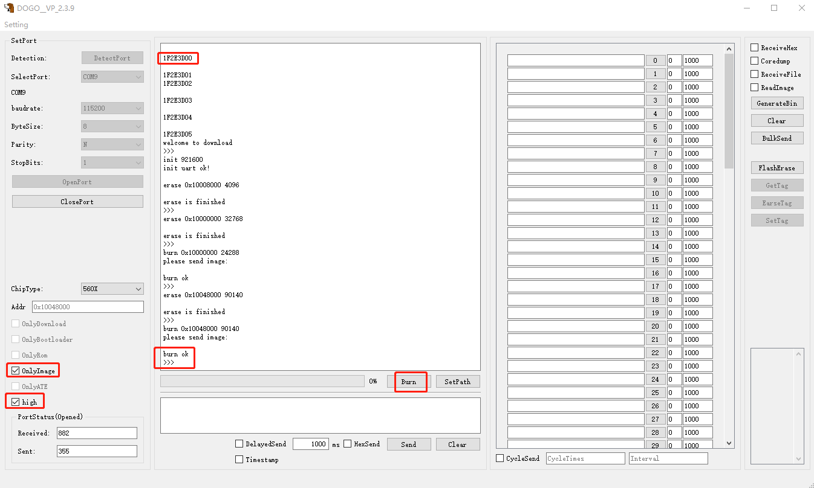
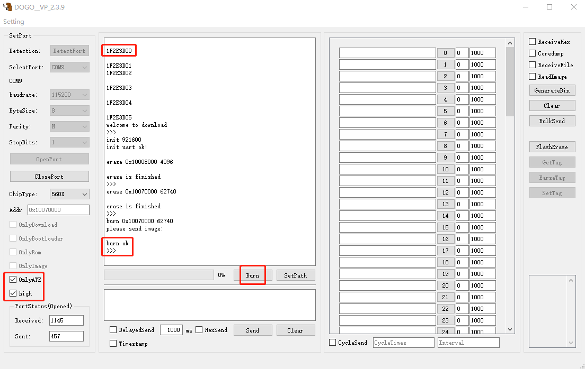
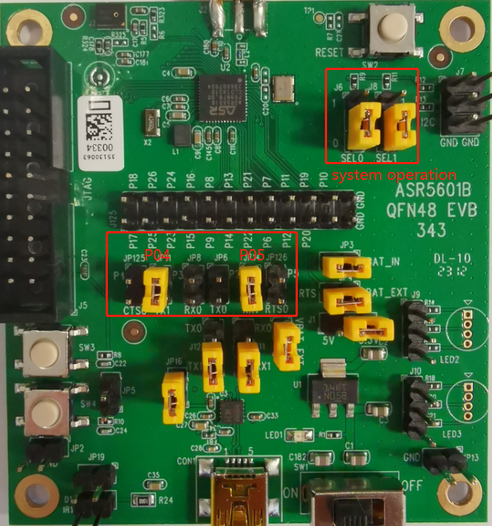
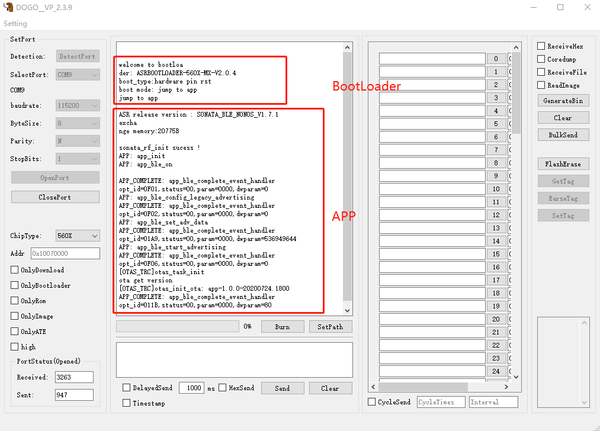
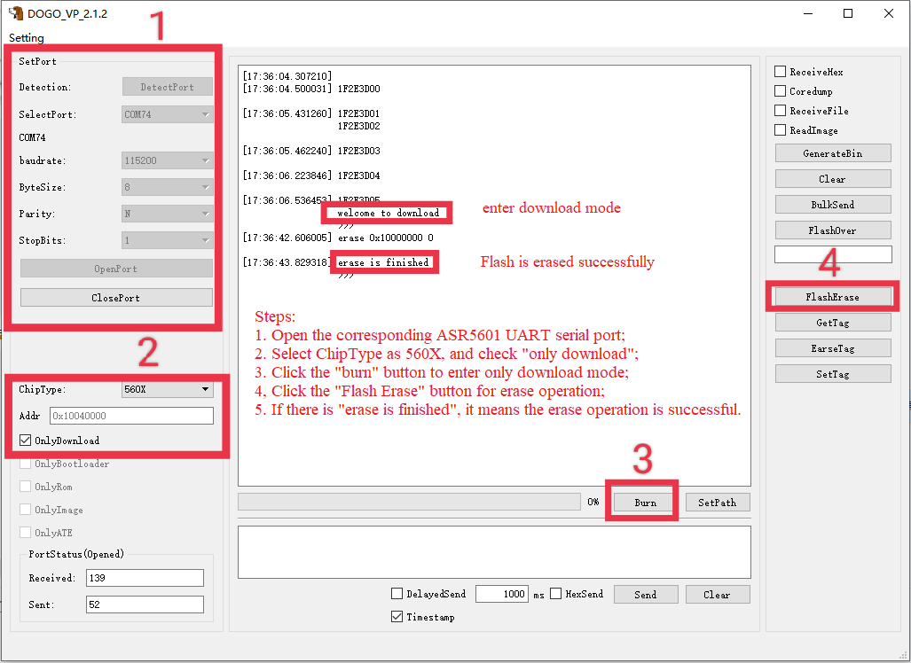

ASR560X Series BLE Programming Tool User Manual
===================================================
`简体中文 <https://asriot-cn.readthedocs.io/zh/latest/ASR560X/BLE 编程工具用户手册.html>`_

Introduction
------------

**About this Document**

This document mainly introduces the configuration and use of the DOGO tool for ASR560X series BLE chip development.

**Intended Readers**

This document is mainly for engineers who use this chip to develop their own platform and products, for instance:

-  PCB Hardware Development Engineer

-  Software Engineer

-  Technical Support Engineer

**Included Chip Models**

The product models corresponding to this document are as follows.

+---------+----------------------------------------------------------------------------------------+----------+--------------+-----------------------------------------------------------------------------------+
| Model   | Protocol                                                                               | Core     | SiP Flash    | Function                                                                          |
+=========+========================================================================================+==========+==============+===================================================================================+
| ASR560X | BLE 5.1 full feature (compatible with 5.2) BLE SIG Mesh IEEE 802.15.4 2.4G Proprietary | ARM CM0+ | 1 MB/ 512 KB | AOA/AOD/Voice/IRTxRx/ Quadrature Decoder/Keypad/ 5V UART/5V GPIO/Wi-Fi concurrent |
+---------+----------------------------------------------------------------------------------------+----------+--------------+-----------------------------------------------------------------------------------+

**Copyright Notice**

© 2023 ASR Microelectronics Co., Ltd. All rights reserved. No part of this document can be reproduced, transmitted, transcribed, stored, or translated into any language in any form or by any means without the written permission of ASR Microelectronics Co., Ltd.

**Trademark Statement**

ASR and ASR Microelectronics Co., Ltd. are trademarks of ASR Microelectronics Co., Ltd. 

Other trade names, trademarks, and registered trademarks mentioned in this document are the property of their respective owners and are hereby declared.

**Disclaimer**

ASR does not give any warranty of any kind and may make improvements and/or changes in this document or in the product described in this document at any time.

This document is only used as a guide, and no contents in the document constitute any form of warranty. Information in this document is subject to change without notice.

All liability, including liability for infringement of any proprietary rights caused by using the information in this document, is disclaimed.

**ASR Microelectronics Co., Ltd.**

Address: 9F, Building 10, No. 399 Keyuan Road, Zhangjiang High-tech Park, Pudong New Area, Shanghai, 201203, China

Homepage: http://www.asrmicro.com/

**Revision History**

======= ======= ==============
Date    Version Release Notes
======= ======= ==============
2023.05 V1.1.2  First Release.
======= ======= ==============

.. _introduction-1:

1. Introduction
---------------

This document mainly introduces the configuration and use of the DOGO tool for ASR5601 BLE chip development.

The following Figure shows the interface of the download debug tool DOGO.

 |image1| 

DOGO supports serial debugging and program download functions:

1. **Serial debugging function**: it supports interaction of serial AT commands, Hex display and exporting log to file and bulk sending of multiple AT commands.

2. **Program download function**: it supports downloading multiple firmware.

3. **High-speed download function**: It supports downloading firmware in high-speed mode. Check the “high” option to increase the download rate to 921600 bps automatically.

2. Instructions for Use
-----------------------

2.1 Basic Functions
~~~~~~~~~~~~~~~~~~~

1. Connect the serial port to PC and ASR5601 EVB, click the “DetectPort” button, and select the corresponding port number in the “SelectPort” box.

2. Make the corresponding settings according to the corresponding serial port status, and click “OpenPort” after the settings are completed.

3. In the serial command sending area, :raw-latex:`\r\n `is appended to the ASCII code sent by default, so there is no need to add it manually, and it supports regular sending and Hex sending.

4. It supports timestamp capture function. Check the “Timestamp” option, and the prefix of the captured log will be added with a timestamp.

2.2 Program Download
~~~~~~~~~~~~~~~~~~~~

2.2.1 Bootloader Download
^^^^^^^^^^^^^^^^^^^^^^^^^

1. **Step 1**: Select the jumper (the jumper for setting download mode and P4/P5 jumper as shown in the figure) and configure the ASR5601 EVB to UART download mode: MODEL_SEL1 = 0, MODEL_SEL0 = 1, and configure the download serial port to P4/P5. After that, turn on the power switch, and the red light will be lit.

 |image2| 

2. **Step 2**: Connect the serial port to PC and ASR5601 EVB click the “DetectPort” button, select the corresponding serial port and start configuration (baud rate: 115200 bps, 8 data bits, no parity bits, and 1 stop bit), and click “OpenPort” after the setting is completed. Select “ChipType” as 560X.

3. **Step 3**: Click “SetPath”, then click “browser” for Bootloader in the pop-up window to enter the directory and select the bootloader file to be downloaded. After that, click “Save” to close the window, and then check “only bootloader” and “high” for greater download speed.

 |image3| 

4. **Step 4**: Press the reset button on the EVB, and the serial console will print “1F2E3D00”, then click “Burn”, and the bin file will be programmed. When the progress bar reaches 100%, it means the bin file has been downloaded successfully.

 |image4| 

2.2.2 BLE ROM Download
^^^^^^^^^^^^^^^^^^^^^^

**Steps 1, 2, and 4** are the same as the steps for Bootloader download.

**Step 3:** Click “SetPath”, then click “browser” for ROM in the pop-up window to enter the directory and select the ROM file to be downloaded. After that, click “Save” to close the window, and then check “only rom” and “high” for greater download speed.

 |image5| 

2.2.3 APP Download
^^^^^^^^^^^^^^^^^^

**Steps 1, 2, and 4** are the same as the steps for Bootloader download.

**Step 3:** Click “SetPath”, then click “browser” for APP in the pop-up window to enter the directory and select the APP file to be downloaded. After that, click “Save” to close the window, and then check “only image” and “high” for greater download speed.

 |image6| 

2.2.4 ATE Download
^^^^^^^^^^^^^^^^^^

**Steps 1, 2, and 4** are the same as the steps for Bootloader download.

**Step 3:** Click “SetPath”, then click “browser” for ATE in the pop-up window to enter the directory and select the ATE file to be downloaded. After that, click “Save” to close the window, and then check “only ate” and “high” for greater download speed.

 |image7| 

.. attention::
    ATE firmware is mainly used for device production testing, and it does not affect the running of app programs without downloading it.

2.2.5 Download Four Firmware
^^^^^^^^^^^^^^^^^^^^^^^^^^^^

**Steps 1, 2, and 4** are the same as the steps for Bootloader download.

**Step 3**: Click “SetPath” and when the small window pops up:

1. Click “browser” for Bootloader to enter the directory and select the Bootloader file to be downloaded.

2. Click “browser” for BLE ROM to enter the directory and select the ROM file to be downloaded.

3. Click “browser” for APP to enter the directory and select the APP file to be downloaded.

4. Click “browser” for ATE to enter the directory and select the ATE file to be downloaded.

Click “Save” to close the window, and then check “high” for greater download speed.

 |image8| 

2.3 Program Start-up
~~~~~~~~~~~~~~~~~~~~

1. After downloading all the firmware, change the jumper of EVB to normal boot mode (as shown below), then press the Reset button, the SoC will reboot and print the Bootloader log.

 |image9| 

2. The following figure is an example of the program starting normally. Both Bootloader and APP start normally.

 |image10| 

3. Commonly Used Functions
--------------------------

3.1 Flash Erase
~~~~~~~~~~~~~~~

Flash erase can be performed using the DOGO tool. Refer to the following figure for the steps:

 |image11| 

3.2 Save Log
~~~~~~~~~~~~

Check the “ReceiveFile” option on the right side of the DOGO tool, and then click “OpenPort”. The log data was received, and it will be saved to the tool directory recev_data.

.. attention::
    Users need to check the " ReceiveFile" option and then open the serial port to enable the log saving function.

.. |image8| image:: ../../img/560X_Programming/图2-7.png

