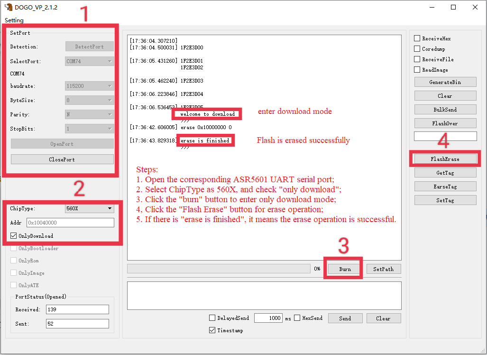

ASR560X Series FAQs
===================
`简体中文 <https://asriot-cn.readthedocs.io/zh/latest/ASR560X/常见问题/常见问题.html>`_

Introduction
------------

**About This Document**

This document introduces frequently asked questions and answers during the development of the ASR560X series Bluetooth SoC chips.

**Intended Readers**

This document is mainly for engineers who use this chip to develop their own platform and products, for instance:

-  PCB Hardware Development Engineer
-  Software Engineer
-  Technical Support Engineer

**Included Chip Models**

The product models corresponding to this document are as follows.

+---------+-------------------------------------------------------------------------------------------+----------+--------------+------------------------------------------------------------------------------------+
| Model   | Protocol                                                                                  | Core     | SiP Flash    | Function                                                                           |
+=========+===========================================================================================+==========+==============+====================================================================================+
| ASR560X | BLE 5.1 full feature (compatible with 5.2) SIG MESH V1.0.x IEEE 802.15.4 2.4G Proprietary | ARM CM0+ | 1 MB/ 512 KB | AOA/AOD/Voice/IRTxRx/ Quadrature Decoder/Keypad/ 5V UART/5V GPIO/ Wi-Fi concurrent |
+---------+-------------------------------------------------------------------------------------------+----------+--------------+------------------------------------------------------------------------------------+

**Copyright Notice**

© 2023 ASR Microelectronics Co., Ltd. All rights reserved. No part of this document can be reproduced, transmitted, transcribed, stored, or translated into any languages in any form or by any means without the written permission of ASR Microelectronics Co., Ltd.

**Trademark Statement**

ASR and ASR Microelectronics Co., Ltd. are trademarks of ASR Microelectronics Co., Ltd. 

Other trade names, trademarks and registered trademarks mentioned in this document are property of their respective owners.

**Electrostatic Discharge (ESD) Warning**

This product can be damaged by Electrostatic Discharge (ESD). When handling with this device, the people should be very careful to conduct the ESD protection to avoid any device damage caused by ESD event.

**Disclaimer**

ASR do not give any warranty of any kind and may make improvements and/or changes in this document or in the product described in this document at any time.

This document is only used as a guide, and no contents in the document constitute any form of warranty. Information in this document is subject to change without notice.

All liability, including liability for infringement of any proprietary rights caused by using the information in this document is disclaimed.

**ASR Microelectronics Co., Ltd.**

Address: 9F, Building 10, No. 399 Keyuan Road, Zhangjiang High-tech Park, Pudong New Area, Shanghai, 201203, China

Homepage: http://www.asrmicro.com/

**Revision History**

======= ======= =======================================
Date    Version Release Notes
======= ======= =======================================
2023.03 V1.4.0  Adjusted descriptions in some sections.
======= ======= =======================================

1. Tool
-------

1.1 How to download the firmware to the development board?
~~~~~~~~~~~~~~~~~~~~~~~~~~~~~~~~~~~~~~~~~~~~~~~~~~~~~~~~~~

Please refer to `*ASR560X Series_Development Board User’s Guide* <https://drive.google.com/file/d/1ie_yM-ItQ5_PIh5NClD7macu2FYobJXd/view>`_.

1.2 Why is there “1F2E3D81” when downloading?
~~~~~~~~~~~~~~~~~~~~~~~~~~~~~~~~~~~~~~~~~~~~~

It indicates a communication exception. The serial port hardware connection and the host computer tool should be checked.

1.3 Is it necessary to download ATE firmware?
~~~~~~~~~~~~~~~~~~~~~~~~~~~~~~~~~~~~~~~~~~~~~

Normally only the BOOTLOAD/ROM/APP firmware should be downloaded, not the ATE firmware.

1.4 Can the APP firmware be downloaded separately if only it is updated?
~~~~~~~~~~~~~~~~~~~~~~~~~~~~~~~~~~~~~~~~~~~~~~~~~~~~~~~~~~~~~~~~~~~~~~~~

Yes, it can be done by checking the \*\ **only image\*** radio box in the DOGO tool.

1.5 How to erase the internal flash of the chip?
~~~~~~~~~~~~~~~~~~~~~~~~~~~~~~~~~~~~~~~~~~~~~~~~

The flash can be erased using the DOGO tool, referring to the steps in the following figure:

.. raw:: html

   

|image1|

.. raw:: html

   

2. Development Environment Setup
--------------------------------

2.1 Does it support development, compilation and debugging in the KEIL environment?
~~~~~~~~~~~~~~~~~~~~~~~~~~~~~~~~~~~~~~~~~~~~~~~~~~~~~~~~~~~~~~~~~~~~~~~~~~~~~~~~~~~

Yes, it does. Please refer to `*ASR560X Series_Development Environment Setup Guide* <https://drive.google.com/file/d/1fxLgH2Qb8LqPhN-SnOTdsTBjrlVmEsLJ/view>`_ for details.

2.2 Does it support compilation in the Linux environment?
~~~~~~~~~~~~~~~~~~~~~~~~~~~~~~~~~~~~~~~~~~~~~~~~~~~~~~~~~

Yes, it does. Please refer to `*ASR560X Series_Development Environment Setup Guide* <https://drive.google.com/file/d/1fxLgH2Qb8LqPhN-SnOTdsTBjrlVmEsLJ/view>`_ for the specific environment configuration.

2.3 Does it support versions other than GCC 5.4?
~~~~~~~~~~~~~~~~~~~~~~~~~~~~~~~~~~~~~~~~~~~~~~~~

No, it doesn’t. In the Windows environment, the *gcc-arm-none-eabi-5_4-2016q3-20160926* version in the SDK tools/toolchain directory must be used. The cross-compilation tool for the Linux environment can be downloaded via https://launchpad.net/gcc-arm-embedded/5.0/5-2016-q3-update/+download/gcc-arm-none-eabi-5_4-2016q3-20160926-linux.tar.bz2.

3. Platform
-----------

3.1 How is the chip’s built-in flash Layout divided?
~~~~~~~~~~~~~~~~~~~~~~~~~~~~~~~~~~~~~~~~~~~~~~~~~~~~

\1. Please refer to section 3.1 Flash of `*ASR560X Series_Developer Guide* <https://drive.google.com/file/d/1fxLgH2Qb8LqPhN-SnOTdsTBjrlVmEsLJ/view>`_. 

\2. Please refer to the definition in the sonata_board.c file in the SDK.

3.2 Is the chip’s built-in flash available to users?
~~~~~~~~~~~~~~~~~~~~~~~~~~~~~~~~~~~~~~~~~~~~~~~~~~~~

The 4 KB space of the COREDUMP_START_ADDR starting address can be used when the SYSTEM_COREDUMP macro is undefined.

3.3 How to use the watchdog?
~~~~~~~~~~~~~~~~~~~~~~~~~~~~

\1. The watchdog will be powered down when SoC enters low-power state;

\2. The watchdog counter will be reloaded in the watchdog interrupt by default. To disable this function, the NVIC_DisableIRQ() API should be used to disable the watchdog interrupt after the watchdog is initialized;

\3. It is recommended to kick the dog in the while loop of main.c.

3.4 What API can be called to make the system reboot?
~~~~~~~~~~~~~~~~~~~~~~~~~~~~~~~~~~~~~~~~~~~~~~~~~~~~~

The NVIC_SystemReset() API.

3.5 What is the difference between a software timer (app_timer) and a hardware timer?
~~~~~~~~~~~~~~~~~~~~~~~~~~~~~~~~~~~~~~~~~~~~~~~~~~~~~~~~~~~~~~~~~~~~~~~~~~~~~~~~~~~~~

\1. The clock source of the hardware timer is a high-frequency clock. It has a separate hardware controller supporting interrupt triggering and supports µs-level timing;

\2. The clock source of the software timer is a low-frequency 32K clock provided by the BLE stack. It does not support interrupt triggering and can only be triggered by the BLE stack scheduling, and it supports ms-level timing;

\3. The hardware timer does not support waking up the SoC from sleep mode;

\4. The software timer supports waking up the SoC from sleep mode, which is applicable to open the timed task scheduling in low-power scenario.

3.6 What are the rules for using the MAC address and the corresponding read and write APIs?
~~~~~~~~~~~~~~~~~~~~~~~~~~~~~~~~~~~~~~~~~~~~~~~~~~~~~~~~~~~~~~~~~~~~~~~~~~~~~~~~~~~~~~~~~~~

The default rules for using the MAC address are as follows:

\1. If the MAC address is written in eFuse, use the MAC address in eFuse;

\2. If the MAC address is not written in eFuse and is written in NVDS, use the MAC address in NVDS;

\3. If no MAC address is written in either eFuse or NVDS, the BLE stack will generate a static random address and write it to NVDS, which will also be used by BLE stacks subsequently;

\4. The read and write APIs are sonata_get_bt_address() and sonata_set_bt_address(), respectively;

\5. sonata_set_bt_address() is used to write the MAC address to NVDS.

.. note:: The priority of reading to eFuse and NVDS can be adjusted. Please refer to app_config() and ble_user_addr_callbacks() of the sonata_hl_beacon_rel demo app.c file for details.

3.7 How to configure the clock for the peripheral project?
~~~~~~~~~~~~~~~~~~~~~~~~~~~~~~~~~~~~~~~~~~~~~~~~~~~~~~~~~~

Boost the CPU clock speed to 64 MHz using the sys_clk_cfg(DIG_SEL_DPLL_64M) API.

3.8 What are the considerations for PWM input/output mode?
~~~~~~~~~~~~~~~~~~~~~~~~~~~~~~~~~~~~~~~~~~~~~~~~~~~~~~~~~~

The capture input channel and PWM output channel of CAPn, PWM2n, and PWM2n+1 are based on the same waveform generator, so users must select either the CAP input or PWM output function when the controller was initiated, the PWM controller can only output one frequency waveform of PWM2n or PWM2n+1 in the group.

3.9 What is the maximum output frequency of SPI and PWM?
~~~~~~~~~~~~~~~~~~~~~~~~~~~~~~~~~~~~~~~~~~~~~~~~~~~~~~~~

\1. The maximum output frequency of SPI MASTER is CLK/2, which is recommended not to exceed 16 MHz.

\2. The maximum output frequency of PWM is CLK/3, which is recommended not to exceed 5 MHz.

3.10 What is the number of channels, range, and resolution of ADC?
~~~~~~~~~~~~~~~~~~~~~~~~~~~~~~~~~~~~~~~~~~~~~~~~~~~~~~~~~~~~~~~~~~

\1. For QFN32 package, there are 5 ADC channels, with channels 0 to 4 corresponding to P06 to P10 respectively;

\2. For QFN48 package, there are 8 ADC channels, with channels 0 to 7 corresponding to P06 to P13 respectively;

\3. The ADC range is 1.2 V, so the voltage to be sampled must be less than 1.2 V;

\4. The ADC resolution is 12 bits.

4. BLE Stack
------------

4.1 API Use
~~~~~~~~~~~

4.1.1 What are the considerations for using the sonata_api_app_timer_set()/sonata_api_app_timer_clear() API?
^^^^^^^^^^^^^^^^^^^^^^^^^^^^^^^^^^^^^^^^^^^^^^^^^^^^^^^^^^^^^^^^^^^^^^^^^^^^^^^^^^^^^^^^^^^^^^^^^^^^^^^^^^^^

\1. This API can only be used after SONATA_GAP_CMP_BLE_ON;

\2. The user-defined timer_id cannot be repeated and should be greater than 40;

.. note:: For versions after SDK 1.5.0, the user-defined timer_id doesn’t have such restriction;*

\3. The unit of the delay parameter is *ms*;

\4. The timeout callback function should be registered using the sonata_api_register_app_timer_callback() API before using this API;

\5. No time-consuming tasks can be executed in the timeout callback function, which should enter and exit quickly;

\6. In low-power state, this API can be used to wake up SoC and execute the task (the wake-up source should be configured as BLE_TIMER);

\7. If users need to use this API after waking up from sleep state, this API must be called in the app_after_ble_wkup_cb() function;

\8. The sonata_api_app_timer_set() API and sonata_api_app_timer_clear() API cannot be called in the interrupt service routine;

\9. To loop execute the callback function corresponding to the timer id, users need to simply reconfigure it once in the callback function using the sonata_api_app_timer_set() API.

4.1.2 How many Bytes can the sonata_fs_write() API write at most at a time? Is the written data placed in NVDS?
^^^^^^^^^^^^^^^^^^^^^^^^^^^^^^^^^^^^^^^^^^^^^^^^^^^^^^^^^^^^^^^^^^^^^^^^^^^^^^^^^^^^^^^^^^^^^^^^^^^^^^^^^^^^^^^

\1. As the type of the sonata_fs_write() API length parameter is uint8_t, its maximum length is 255 Bytes;

\2. The written data is placed in NVDS;

\3. When using this API, the tag should be user-defined and must be greater than or equal to APP_DATA_SAVE_TAG_FIRST and less than APP_DATA_SAVE_TAG_LAST.

4.1.3 What is the maximum number of MSGs that can be registered by the sonata_api_app_msg_register() API, and how to use the API?
^^^^^^^^^^^^^^^^^^^^^^^^^^^^^^^^^^^^^^^^^^^^^^^^^^^^^^^^^^^^^^^^^^^^^^^^^^^^^^^^^^^^^^^^^^^^^^^^^^^^^^^^^^^^^^^^^^^^^^^^^^^^^^^^^

\1. The maximum number of MSGs is 31. The MSG parameter is an ID and a function pointer;

\2. Use the sonata_api_send_app_msg() API to trigger and access the function corresponding to the ID;

\3. No time-consuming tasks can be executed in the callback function, which should enter and exit quickly.

4.1.4 What is the usage of sonata_ble_prevent_sleep_set()/ sonata_ble_prevent_sleep_clear()?
^^^^^^^^^^^^^^^^^^^^^^^^^^^^^^^^^^^^^^^^^^^^^^^^^^^^^^^^^^^^^^^^^^^^^^^^^^^^^^^^^^^^^^^^^^^^

\1. sonata_ble_prevent_sleep_set() is used to set a flag bit to prevent the system from entering sleep state;

\2. sonata_ble_prevent_sleep_clear() is used to clear a flag bit;

\3. The system is allowed to enter sleep mode when all flag bits have been cleared;

\4. The user should define the corresponding prv_slp_bit for determining whether different application logic/modules are allowed to enter sleep mode or not.

4.1.5 What is the usage of the sonata_get_sys_time() API?
^^^^^^^^^^^^^^^^^^^^^^^^^^^^^^^^^^^^^^^^^^^^^^^^^^^^^^^^^

\1. It is used to get the BLE tick from the system startup to the current moment;

\2. The time unit is 0.3125 ms;

\3. The access to DS4 will not affect the timing of this API;

\4. The maximum value returned is 0xFFF FFFF (28 bits).

4.1.6 Can sonata_ble_gap_set_white_list() API be called only once? When called multiple times, will the previous setting be replaced?
^^^^^^^^^^^^^^^^^^^^^^^^^^^^^^^^^^^^^^^^^^^^^^^^^^^^^^^^^^^^^^^^^^^^^^^^^^^^^^^^^^^^^^^^^^^^^^^^^^^^^^^^^^^^^^^^^^^^^^^^^^^^^^^^^^^^^

\1. Users only need to call this API once, and all of white list addresses will be set at this time;

\2. Yes, it will. When called multiple times, it will be available at the last time. All addresses should be set every time since only the last set value will be used in multiple calls.

4.1.7 What is the default transmit power? Can it be adjusted?
^^^^^^^^^^^^^^^^^^^^^^^^^^^^^^^^^^^^^^^^^^^^^^^^^^^^^^^^^^^^^

\1. The default transmit power is 0 dBm;

\2. The transmit power can be adjusted using the sonata_ll_set_txpwr() API;

\3. The sonata_ll_set_txpwr() API should be called after SONATA_GAP_CMP_BLE_ON.

4.1.8 What is the process of GATT indication?
^^^^^^^^^^^^^^^^^^^^^^^^^^^^^^^^^^^^^^^^^^^^^

\1. **Central** Enables indication: Use sonata_ble_gatt_write() to write 0x02 to the corresponding handle;

\2. **Peripheral** processing: Enter the ble_gatt_callback->gatt_write_req() callback function, in which sonata_ble_gatt_send_write_confirm() should be used to send a confirmation. If **Peripheral** does not send a confirmation, **Central** will receive the SONATA_GATT_CMP_WRITE event with status=0x45 (SONATA_GAP_ERR_TIMEOUT) after the timeout;

\3. **Peripheral** sending data via indication: Use the sonata_ble_gatt_send_indicate_event() API and receive SONATA_GATT_CMP_INDICATE event after successful sending or timeout;

\4. **Central** receiving indication data: Enter the ble_gatt_callback->gatt_event_req() callback function, where the received data will be processed. **Central** should send a confirmation via the sonata_ble_gatt_send_event_confirm() API. If **Central** does not reply to the confirmation after receiving indication, **Peripheral** will receive the SONATA_GATT_CMP_INDICATE event after some time with status=0x45(SONATA_GAP_ERR_TIMEOUT).

4.1.9 What is the process of GATT notification?
^^^^^^^^^^^^^^^^^^^^^^^^^^^^^^^^^^^^^^^^^^^^^^^

\1. **Central** enables notification: Use sonata_ble_gatt_write() to write 0x01 to the corresponding handle;

\2. **Peripheral** processing: Enter the ble_gatt_callback->gatt_write_req() callback function, in which sonata_ble_gatt_send_write_confirm() should be used to send a confirmation. If **Peripheral** does not send a confirmation, **Central** will receive the SONATA_GATT_CMP_WRITE event with status=0x45(SONATA_GAP_ERR_TIMEOUT) after timeout;

\3. **Peripheral** sending data via notification: Use the sonata_ble_gatt_send_notify_event() API and receive the SONATA_GATT_CMP_NOTIFY event after successful sending;

\4. **Central** receiving notification data: Enter the ble_gatt_callback->gatt_event() callback, where the received data will be processed. **Central** does not need to reply to the confirmation.

4.1.10 Which callback function will Peripheral enter when Central calls the sonata_ble_gatt_write()/sonata_ble_gatt_write_no_response() API?
^^^^^^^^^^^^^^^^^^^^^^^^^^^^^^^^^^^^^^^^^^^^^^^^^^^^^^^^^^^^^^^^^^^^^^^^^^^^^^^^^^^^^^^^^^^^^^^^^^^^^^^^^^^^^^^^^^^^^^^^^^^^^^^^^^^^^^^^^^^^

\1. If the attribute of handle supports write request (PWR_NA):

 a) When **Central** calls sonata_ble_gatt_write(), **Peripheral** will enter the ble_gatt_callback->gatt_write_req() callback.

 b) When **Central** calls sonata_ble_gatt_write_no_response(), **Peripheral** will not respond.

\2. If the attribute of handle supports write command (PWC_NA):

 a) When **Central** calls sonata_ble_gatt_write(), **Peripheral** will return an error.

 b) When **Central** calls sonata_ble_gatt_write_no_response(), **Peripheral** will enter the ble_gatt_callback->gatt_write_req() callback.

\3. If the attribute of handle supports both write request (PWR_NA) and write command (PWC_NA):

 a) When **Central** calls sonata_ble_gatt_write(), **Peripheral** will enter the ble_gatt_callback->gatt_write_req() callback.

 b) When **Central** calls sonata_ble_gatt_write_no_response, **Peripheral** will enter the ble_gatt_callback->gatt_write_req() callback.

\4. The application layer of peripheral should reply the application processing status to the BLE stack using the sonata_ble_gatt_send_write_confirm() API.

\5. The BLE stack will determine whether a response should be sent based on the processing status and attribute opcode.

4.1.11 How does Central use sonata_ble_gatt_write() to write data greater than ATT_MTU size?
^^^^^^^^^^^^^^^^^^^^^^^^^^^^^^^^^^^^^^^^^^^^^^^^^^^^^^^^^^^^^^^^^^^^^^^^^^^^^^^^^^^^^^^^^^^^

\1. First, **Central** writes data greater than ATT_MTU size by calling sonata_ble_gatt_write(), and **Peripheral** enters the ble_gatt_callback->gatt_att_info_req() callback;

\2. In the gatt_att_info_req callback, peripheral will send the length of the attribute corresponding to the handle by sonata_ble_gatt_send_att_info_confirm();

\3. When all data is transmitted, **Central** will generate a callback event SONATA_GATT_CMP_WRITE in app_ble_complete_event_handler(), then the user calls sonata_ble_gatt_execute_write(), and the data will be sent successfully.

4.2 Problems that May Be Encountered in Developing the Advertising Function
~~~~~~~~~~~~~~~~~~~~~~~~~~~~~~~~~~~~~~~~~~~~~~~~~~~~~~~~~~~~~~~~~~~~~~~~~~~

4.2.1 Why is there SONATA_GAP_ERR_INVALID_PARAM in the sonata_ble_set_advertising_data() API?
^^^^^^^^^^^^^^^^^^^^^^^^^^^^^^^^^^^^^^^^^^^^^^^^^^^^^^^^^^^^^^^^^^^^^^^^^^^^^^^^^^^^^^^^^^^^^

Check whether GAP_AD_TYPE_FLAGS is included in the advertising data. Since the Flags data is automatically added to the BLE stack, there is no need to add more.

4.2.2 Does the BLE stack support dynamic adjustment of advertising data?
^^^^^^^^^^^^^^^^^^^^^^^^^^^^^^^^^^^^^^^^^^^^^^^^^^^^^^^^^^^^^^^^^^^^^^^^

Yes, it does. After start adv, sonata_ble_set_advertising_data() can be used to adjust the advertising data, which takes effect immediately after setting.

4.2.3 Does the BLE stack support sending multiple advertisings at the same time/at different times?
^^^^^^^^^^^^^^^^^^^^^^^^^^^^^^^^^^^^^^^^^^^^^^^^^^^^^^^^^^^^^^^^^^^^^^^^^^^^^^^^^^^^^^^^^^^^^^^^^^^

It supports sending multiple advertisings at the same time, while attention should be paid to the RAM resources consumption. Please refer to *ASR560X Series_Memory Layout Configuration Application Manual*. The process is as follows:

\1. Configure advertising parameter: sonata_ble_config_legacy_advertising()；

\2. Get the corresponding advertising id: app_ble_complete_event_handler()->SONATA_GAP_CMP_ADVERTISING_CONFIG->param；

\3. According to the advertising id (param), set the advertising data: sonata_ble_set_advertising_data_byid();

\4. Start the advertising according to the advertising id (param): sonata_ble_start_advertising_byid();

\5. Execute step 1 after receiving app_ble_complete_event_handler()->SONATA_GAP_CMP_ADVERTISING_START to start a new advertising.

4.2.4 What is the info of the sonata_gap_ext_adv_report_ind_t structure in the scan result callback?
^^^^^^^^^^^^^^^^^^^^^^^^^^^^^^^^^^^^^^^^^^^^^^^^^^^^^^^^^^^^^^^^^^^^^^^^^^^^^^^^^^^^^^^^^^^^^^^^^^^^

\1. The value of bits 3 to 6 corresponds to sonata_gap_adv_report_info;

\2. The value of bits 0 to 2 corresponds to sonata_gap_adv_report_type.

4.3 What ROMs are available for the Mesh demo?
~~~~~~~~~~~~~~~~~~~~~~~~~~~~~~~~~~~~~~~~~~~~~~

\1. Please refer to *ASR560X Series_Memory Layout Configuration Application Manual* for the number of ACTs, supported connections, supported profiles, and available memory, etc. for each ROM.

\2. The Mesh demo requires at least 4 ACTs: 1 scan, 2 proxy adv, and 1 unconnectable adv.

4.4 Is there a limit to the max_len parameter BLE stack when defining the service?
~~~~~~~~~~~~~~~~~~~~~~~~~~~~~~~~~~~~~~~~~~~~~~~~~~~~~~~~~~~~~~~~~~~~~~~~~~~~~~~~~~

max_len is a number of type uint16_t. The BLE stack only reserves this number and does not allocate space, so there is no length limit.

4.5 What is the main function of the app_ble_complete_event_handler() callback?
~~~~~~~~~~~~~~~~~~~~~~~~~~~~~~~~~~~~~~~~~~~~~~~~~~~~~~~~~~~~~~~~~~~~~~~~~~~~~~~

\1. Application layer can get which API has been executed, and the status of these APIs from parameter “opt_id” of this callback function.

\2. The parameter status of “0” indicates that the API is executed successfully.

\3. The reason for the instruction exception status can be found in ble_api:raw-latex:`\inc` sonata_error_api.h.

4.6 What does SONATA_GATT_CMP_NOTIFY mean?
~~~~~~~~~~~~~~~~~~~~~~~~~~~~~~~~~~~~~~~~~~

SONATA_GATT_CMP_NOTIFY indicates that the data is in the send queue and RF confirms that it can be sent.

4.7 What will the ASR560X do when the host sends ATT_READ_BLOB_REQ?
~~~~~~~~~~~~~~~~~~~~~~~~~~~~~~~~~~~~~~~~~~~~~~~~~~~~~~~~~~~~~~~~~~~

\1. The ASR560X BLE stack will enter the gatt_read_req() callback;

\2. The application layer only needs to send the complete value according to handle;

\3. The BLE stack will handle the offset of ATT_READ_BLOB_REQ.

4.8 How to use both the advertising and scan functions?
~~~~~~~~~~~~~~~~~~~~~~~~~~~~~~~~~~~~~~~~~~~~~~~~~~~~~~~

One function must be successfully enabled before another function is enabled. For example, the process of enabling advertising and then scanning is as follows:

\1. Call the sonata_ble_config_legacy_advertising() API to configure the advertising in app_ble_complete_event_handler()->SONATA_GAP_CMP_BLE_ON;

\2. After the sonata_ble_config_legacy_advertising() API is executed successfully, it will enter app_ble_complete_event_handler() -> SONATA_GAP_CMP_ADVERTISING_CONFIG, indicating successful advertising configuration;

\3. Call the sonata_ble_set_advertising_data() API in the SONATA_GAP_CMP_ADVERTISING_CONFIG process to set the advertising data;

\4. After the sonata_ble_set_advertising_data() API is executed successfully, it will enter app_ble_complete_event_handler()->SONATA_GAP_CMP_SET_ADV_DATA, indicating successful advertising data setting;

\5. Call sonata_ble_start_advertising() in the SONATA_GAP_CMP_SET_ADV_DATA process to enable advertising;

\6. After the sonata_ble_start_advertising() API is executed successfully, it will enter app_ble_complete_event_handler()->SONATA_GAP_CMP_ADVERTISING_START, indicating successful advertising enabling;

\7. Call sonata_ble_config_scanning() in the SONATA_GAP_CMP_ADVERTISING_START process to configure the scan;

\8. After the sonata_ble_config_scanning() API is executed successfully, it will enter app_ble_complete_event_handler()->SONATA_GAP_CMP_SCANNING_CONFIG, indicating successful scanning configuration;

\9. Call sonata_ble_start_scanning() in the SONATA_GAP_CMP_SCANNING_CONFIG process to enable scanning;

\10. After the sonata_ble_start_scanning() API is executed successfully, it will enter app_ble_complete_event_handler()->SONATA_GAP_CMP_SCANNING_START, indicating successful scanning enabling.

5. Low-power consumption
------------------------

5.1 What is the process of entering and exiting DS4 mode?
~~~~~~~~~~~~~~~~~~~~~~~~~~~~~~~~~~~~~~~~~~~~~~~~~~~~~~~~~

\1. When the system enters sleep mode, it will first turn off the BLE clock;

\2. Then enter the app_before_ds_cb() callback function. **All peripherals used should be de-initialized** and peripheral interrupts should be disabled in the app_before_ds_cb() callback function, because peripheral controllers are powered off after entering DS mode;

\3. After the app_before_ds_cb() callback is executed, the system will enter sleep mode and power off the peripheral power as well as the external high-frequency crystal;

\4. When the system is woken up by the configured wake-up source, first it will execute the wake-up process and initialize the BLE stack, and then enter the app_after_wkup_cb() callback;

\5. The CPU clock speed will first be boosted to 64 MHz in app_after_wkup_cb();

\6. After the CPU clock speed is boosted, **the peripherals used in the system should be initialized again**;

\7. When the BLE stack has been initialized, it enters the app_after_ble_wkup_cb() callback.

5.2 How to use the slp_duration_backoff parameter?
~~~~~~~~~~~~~~~~~~~~~~~~~~~~~~~~~~~~~~~~~~~~~~~~~~

\1. This variable should be configured according to the actual application scenario when the low-power function is enabled.

\2. The BLE communication time is fixed. In the low-power state, SoC need to wake up before the next communication time, and RF RX/TX should be turned on for communication.

\3. To avoid missing the next communication time, users should consider the elapsed time from SoC wake up to SoC initialization.

\4. slp_duration_backoff is used to configure the early wake-up time, the unit is 0.3125 ms.

\5. When slp_duration_backoff=0, it will wake up 6*0.3125 ms earlier by default.

\6. The slp_duration_backoff parameter should be adjusted according to the time consumed by app_cfg_after_wkup().

\7. If slp_duration_backoff is set too large, the active time will be increased and thus affect the power consumption.

\8. If slp_duration_backoff is set too small, it may cause communication abnormalities and affect the stability of BLE communication.

5.3 How to configure low_volt?
~~~~~~~~~~~~~~~~~~~~~~~~~~~~~~

\1. For low-voltage chip applications with a supply range of 1.7-3.6 V, low_volt should be configured as VBAT_VOLT_LOW.

\2. For high-voltage chip applications with a supply range over 3.6 V, low_volt should be configured as VBAT_VOLT_HIGH.

\3. The value of low_volt is VBAT_VOLT_DFT by default. The SDK will decide whether to enable low voltage mode according to the chip model and internal register status.

\4. The value is assigned by acquiring the voltage with ADC VBATINCH channel.

5.4 Why is there a glitch at the GPIO level when waking up from Sleep mode?
~~~~~~~~~~~~~~~~~~~~~~~~~~~~~~~~~~~~~~~~~~~~~~~~~~~~~~~~~~~~~~~~~~~~~~~~~~~

In app_cfg_after_wkup, the peripheral should be initialized before calling sonata_sleep_pad_unlatch(), otherwise there will be a glitch at the GPIO level.

5.5 How to get the wake-up source?
~~~~~~~~~~~~~~~~~~~~~~~~~~~~~~~~~~

The WKUP_SRC_GET API can be used at the end of the app_cfg_after_wkup() callback to get the wake-up source.

5.6 How to avoid the high power consumption when the P06 of QFN32 IC pulls up or outputs high in low-power state?
~~~~~~~~~~~~~~~~~~~~~~~~~~~~~~~~~~~~~~~~~~~~~~~~~~~~~~~~~~~~~~~~~~~~~~~~~~~~~~~~~~~~~~~~~~~~~~~~~~~~~~~~~~~~~~~~~

P11 should be configured as an internal pull-up/floating.

5.7 How to avoid abnormal PWM output in low-power state?
~~~~~~~~~~~~~~~~~~~~~~~~~~~~~~~~~~~~~~~~~~~~~~~~~~~~~~~~

PTC should be enabled when using PWM peripherals. In addition to configuring PWM_PCLK_EN and PWM_SOFT_EN in peri_clk_en[0]/peri_soft_en[0], PTC_CLK_EN and PTC_SOFT_EN should also be configured in peri_clk_en[3]/peri_soft_en[3].

5.8 Is online simulation supported in low-power state?
~~~~~~~~~~~~~~~~~~~~~~~~~~~~~~~~~~~~~~~~~~~~~~~~~~~~~~

No, it is not supported. In low-power state, the clock and power supply of the MCU core and peripherals are turned off, so the online simulation function is unavailable.

5.9 Should the BLE stack be reinitialized after waking up from Sleep mode?
~~~~~~~~~~~~~~~~~~~~~~~~~~~~~~~~~~~~~~~~~~~~~~~~~~~~~~~~~~~~~~~~~~~~~~~~~~

\1. After waking up from DS4 mode, there is no need to reinitialize the BLE stack, and the peripherals used should be initialized.

\2. After waking up from DS1-DS3 mode, the chip will reboot to reinitialize the BLE stack and peripherals.

5.10 Will XO16M be completely powered down in low-power state?
~~~~~~~~~~~~~~~~~~~~~~~~~~~~~~~~~~~~~~~~~~~~~~~~~~~~~~~~~~~~~~

Yes, it will. The high-frequency crystal will be powered down in low-power state.

5.11 What are the considerations for low-power serial ports?
~~~~~~~~~~~~~~~~~~~~~~~~~~~~~~~~~~~~~~~~~~~~~~~~~~~~~~~~~~~~

\1. In sleep initial function, use the variable lpuart_pad, the member of sonata_sleep_cfg_t structure, to configure the LPUART RXD pin. Any pin from P02 to P26 can be used as the LPUART RXD pin.

\2. In sleep initial function, use the lpuart_init() function in the sonata_sleep_cfg_t structure to configure the initialization of LPUART device.

\3. The LPUART TXD PIN is configured as any pin with the multiplexing function according to the PIN MUX table (referring to section 2.4.15 of the *ASR560X_Datasheet*).

\4. LPUART baudrate supports up to 9600 bps.

5.12 Does the BLE stack use RCO32K or XO32K in low-power mode by default? How to switch the 32K clock source?
~~~~~~~~~~~~~~~~~~~~~~~~~~~~~~~~~~~~~~~~~~~~~~~~~~~~~~~~~~~~~~~~~~~~~~~~~~~~~~~~~~~~~~~~~~~~~~~~~~~~~~~~~~~~~

\1. The BLE stack uses RCO32K by default.

\2. In sleep initial function, users can switch the 32K clock source by configuring the variable clk_sel, the member of sonata_sleep_cfg_t struct.

6. Assert
---------

6.1 Why is there ASSERT ERROR: id=180?
~~~~~~~~~~~~~~~~~~~~~~~~~~~~~~~~~~~~~~

The BLE stack is blocked and cannot be scheduled in time.

6.2 Why is there ASSERT ERROR: id= 387?
~~~~~~~~~~~~~~~~~~~~~~~~~~~~~~~~~~~~~~~

The BLE stack is blocked and cannot process BLE event.

6.3 Why is there ASSERT ERROR: id= 3623?
~~~~~~~~~~~~~~~~~~~~~~~~~~~~~~~~~~~~~~~~

The message is sent to a null task.

6.4 Why is there ASSERT ERROR: id= 3625?
~~~~~~~~~~~~~~~~~~~~~~~~~~~~~~~~~~~~~~~~

The task message is in the wrong state, out of predefined value, so it cannot be processed by the BLE stack. It is possible that the message queue crashed.

7. OTA
------

7.1 How to implement a custom GATT OTA upgrade?
~~~~~~~~~~~~~~~~~~~~~~~~~~~~~~~~~~~~~~~~~~~~~~~

The following steps should be followed to implement an OTA upgrade using the custom GATT service:

\1. Generate the OTA firmware by tools in the tools:raw-latex:`\ota`\_bin_gen:raw-latex:`\image`\_gen_header;

\2. Call sonata_ota_init() after entering the OTA upgrading process;

\3. Transfer the upgraded firmware to the device side using a custom protocol;

\4. Write the upgraded firmware sequentially to Flash using sonata_ota_write(). The data written includes 128 Bytes of OTA information header and the actual application firmware;

\5. The parameter “off” of sonata_ota_write() is a global variable that records the offset position of the written firmware (excluding the 128-Byte OTA information header). Users can get the writing progress at the upper layer. The initial value of the parameter “off” should be set to 0, which will be self-incrementing according to the written data size in sonata_ota_write(), without user processing;

\6. The data written to the Flash OTA area using sonata_ota_write() does not include the 128-Byte OTA header. The Byte of the off parameter is self-incrementing based on the Bytes of firmware transmitted (excluding the 128-Byte OTA header). The initial off value should be set to 0, which will be self-incrementing without further processing;

\7. After the firmware has been written, the sonata_ota_set_boot() function is called to verify data integrity and set the flag bit;

\8. After sonata_ota_set_boot() has been called, reboot the system, the bootloader will deal with next progress, and application layer won’t have to do anything.

​ **Notice:** *1.* *The interrupt is already disabled internally when calling the sonata_ota_write() API, so there is no need to disable the interrupt additionally.* *2.* *It is recommended that at most 256 Bytes of data be written into the Flash at a time to avoid exceptions caused by the long interruption off.*

7.2 What are requirements for the version and break_point parameters in sonata_ota_init()?
~~~~~~~~~~~~~~~~~~~~~~~~~~~~~~~~~~~~~~~~~~~~~~~~~~~~~~~~~~~~~~~~~~~~~~~~~~~~~~~~~~~~~~~~~~

The version and break_point parameters in sonata_ota_init() are mainly for the version roll back and breakpoint, which are not supported currently.

8. Hardware
-----------

8.1 What is the difference in power consumption between the high-voltage and low-voltage IC?
~~~~~~~~~~~~~~~~~~~~~~~~~~~~~~~~~~~~~~~~~~~~~~~~~~~~~~~~~~~~~~~~~~~~~~~~~~~~~~~~~~~~~~~~~~~~

The power consumption of the high-voltage IC is about 10 μA greater than that of the low-voltage one.

8.2 What are the restrictions on the use of P27/P28/P29?
~~~~~~~~~~~~~~~~~~~~~~~~~~~~~~~~~~~~~~~~~~~~~~~~~~~~~~~~

\1. P27, with a test mode alternate judgment function, should not be used as a normal GPIO and should be connected to GND via **an external 10 K pull-down**.

\2. P27/P28/P29 must be configured with the strong internal pull-up.

\3. P27/P28/P29 is connected to GND via an internal 10 K pull-down when configured in the high resistance state.

\4. There will be current leakage from P27/P28/P29 when they are configured as **internal input strong pull-ups** in low-power state.

\5. There will be current leakage from P27/P28/P29 when they are configured to **output high level** in low-power state.

8.3 Can the DC-DC inductor and capacitor be omitted if the system is powered by the LDO?
~~~~~~~~~~~~~~~~~~~~~~~~~~~~~~~~~~~~~~~~~~~~~~~~~~~~~~~~~~~~~~~~~~~~~~~~~~~~~~~~~~~~~~~~

The inductor can be omitted, but not the capacitor.

8.4 How to switch the power supply mode?
~~~~~~~~~~~~~~~~~~~~~~~~~~~~~~~~~~~~~~~~

The power supply (DC-DC or LDO) can be switched by adjusting the variable pwr_supply_mode, the member of sonata_sleep_cfg_t struct in the sleep initial function.

8.5 What is the GPIO port level when IC starts?
~~~~~~~~~~~~~~~~~~~~~~~~~~~~~~~~~~~~~~~~~~~~~~~

\1. When SoC starts up, all IO ports are configured to the internal pull downs by default;

\2. The typical resistance value of the internal pull-up and pull-down resistors is 50 K.

8.6 What is the accuracy of the internal low-frequency 32K RC?
~~~~~~~~~~~~~~~~~~~~~~~~~~~~~~~~~~~~~~~~~~~~~~~~~~~~~~~~~~~~~~~

Its accuracy can be within ±200 ppm after being calibrated by software.

8.7 Does it support the external PA? If so, how to configure it?
~~~~~~~~~~~~~~~~~~~~~~~~~~~~~~~~~~~~~~~~~~~~~~~~~~~~~~~~~~~~~~~~

Yes, the ASR560X supports it. For specific hardware design considerations and software configuration, please refer to the *ASR560X Series_External PA Application Guide*.

8.8 How to deal with large deviations of the center frequency?
~~~~~~~~~~~~~~~~~~~~~~~~~~~~~~~~~~~~~~~~~~~~~~~~~~~~~~~~~~~~~~

A large deviation of the center frequency may lead to Bluetooth connection interruption or failure. If this happens, use the spectrum analyzer to observe whether the frequency deviation is large to confirm whether it is a hardware problem.

If the deviation is large, it should be calibrated using the calibration tool provided by ASR. For details, please consult ASR. It is recommended to use a crystal with higher accuracy of 10 ppm.

