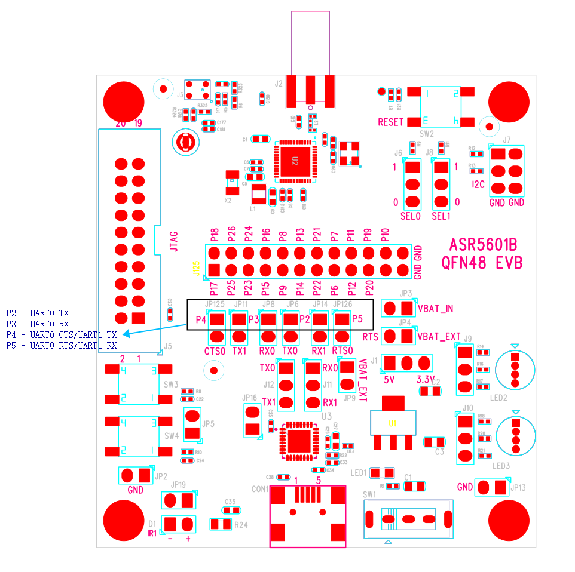
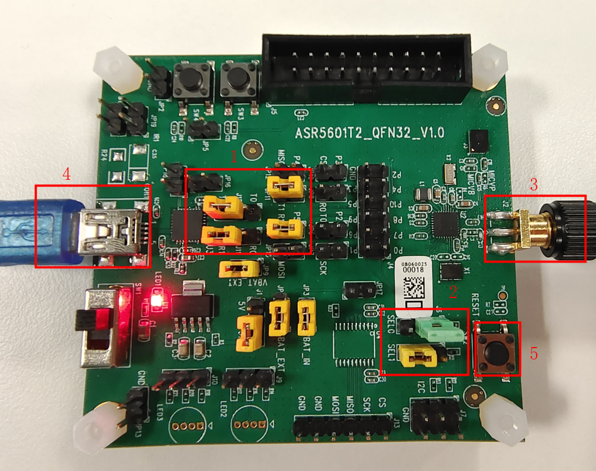
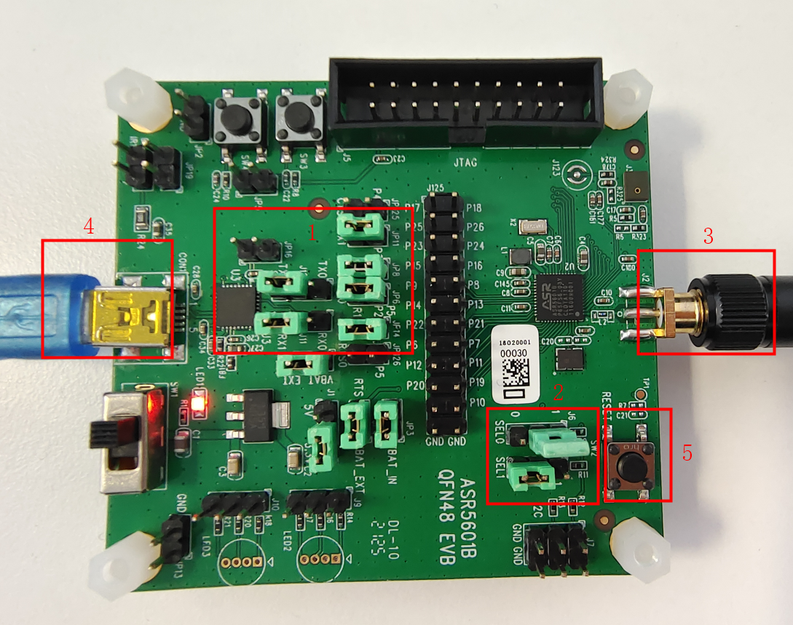
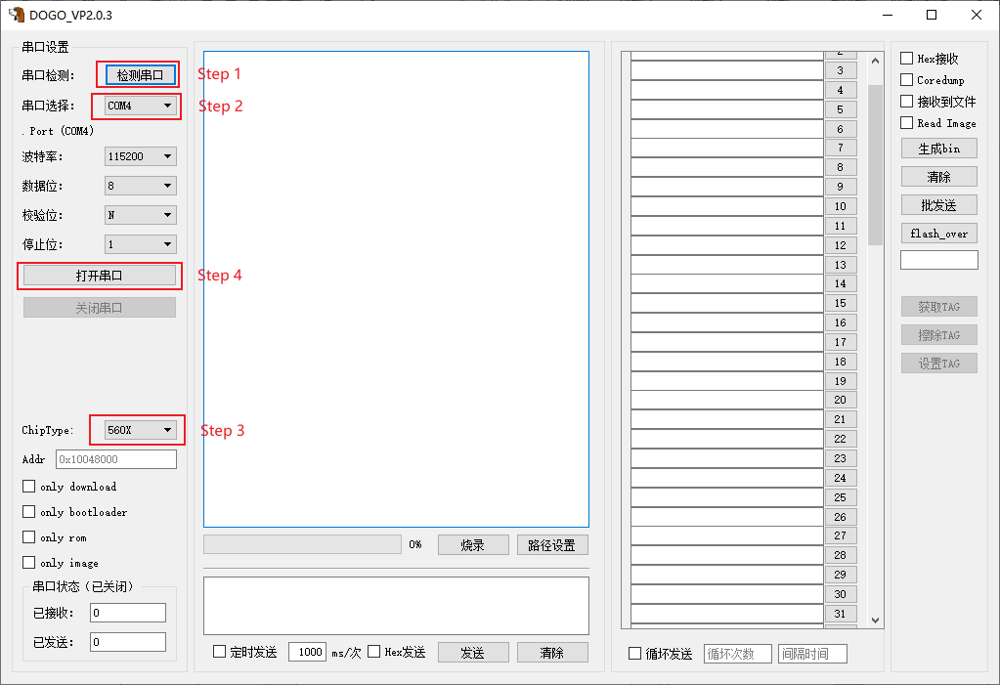
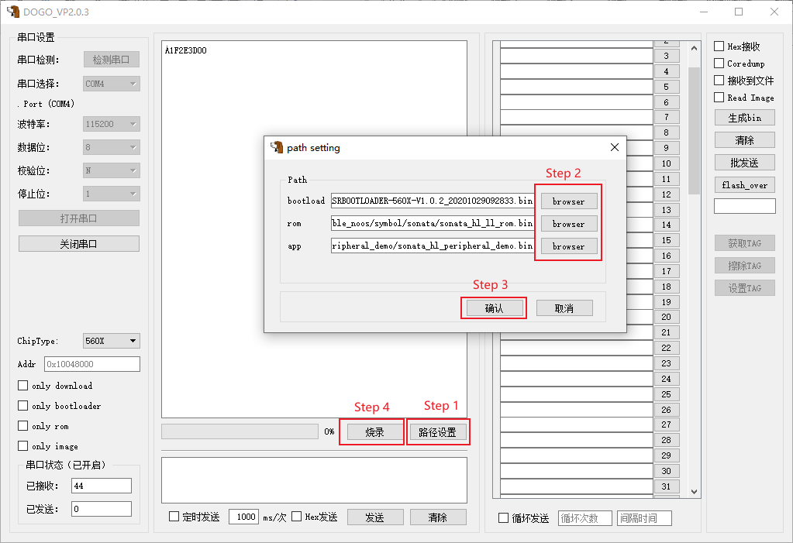
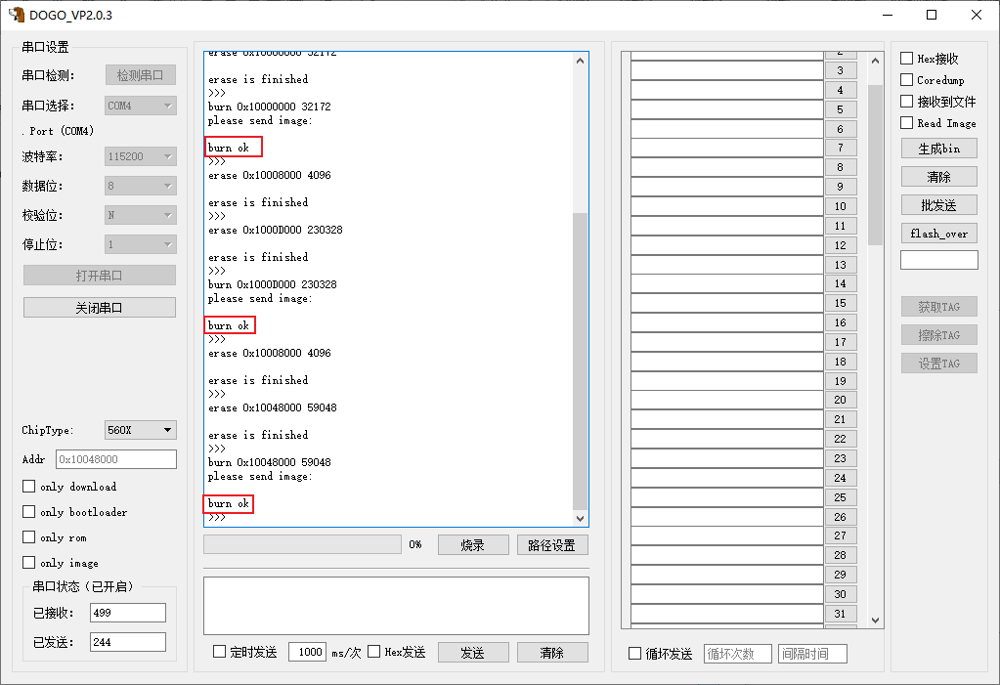
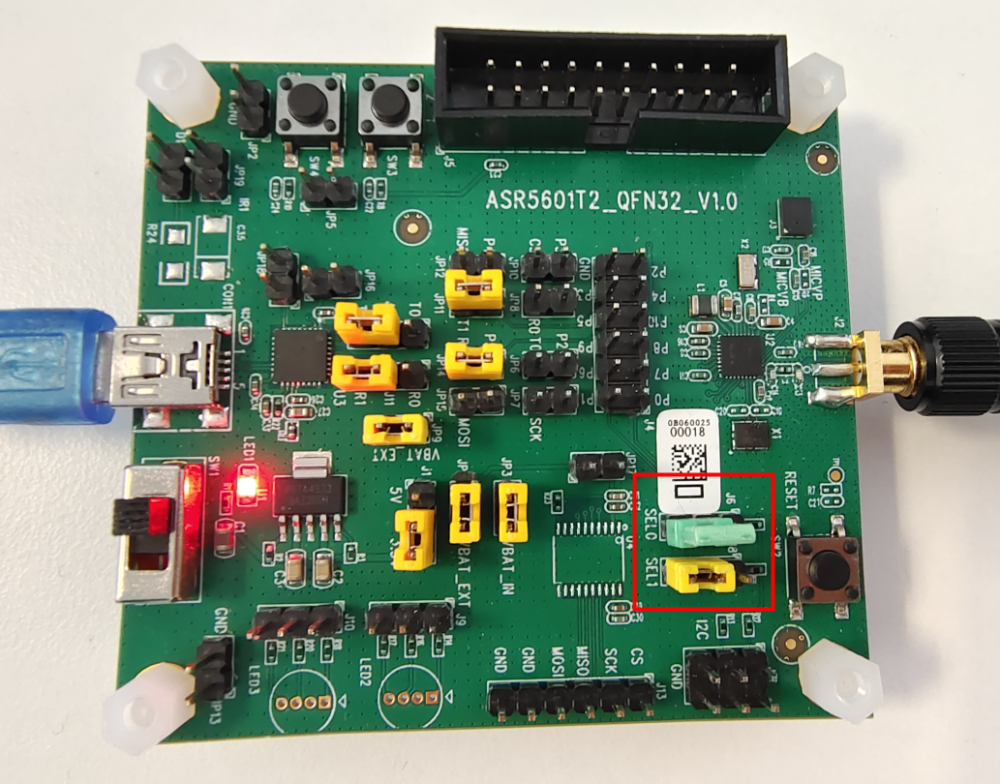
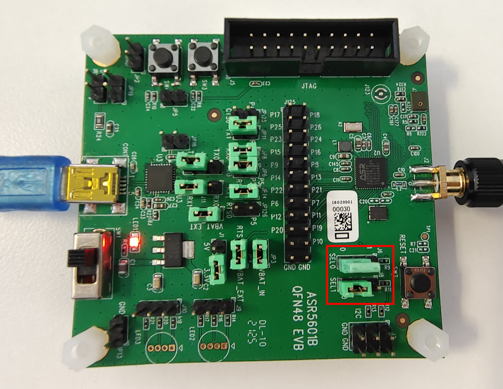
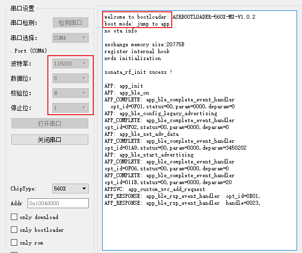

ASR560X Series Development Board User Guide
===========================================
`简体中文 <https://asriot-cn.readthedocs.io/zh/latest/ASR560X/硬件介绍/开发板用户指南.html>`_

Introduction
------------

**About This Document**

This document introduces the hardware function of ASR560X QFN32 and QFN48 development boards and describes how to download and run firmware based on the development boards.

**Intended Readers**

This document is mainly for engineers who use this chip to develop their own platform and products, for instance:

-  PCB Hardware Development Engineer
-  Software Engineer
-  Technical Support Engineer

**Included Chip Models**

The product models corresponding to this document are as follows.

+---------+-------------------------------------------------------------------------------------------+----------+--------------+------------------------------------------------------------------------------------+
| Model   | Protocol                                                                                  | Core     | SiP Flash    | Function                                                                           |
+=========+===========================================================================================+==========+==============+====================================================================================+
| ASR560X | BLE 5.1 full feature (compatible with 5.2) SIG MESH V1.0.x IEEE 802.15.4 2.4G Proprietary | ARM CM0+ | 1 MB/ 512 KB | AOA/AOD/Voice/IRTxRx/ Quadrature Decoder/Keypad/ 5V UART/5V GPIO/ Wi-Fi concurrent |
+---------+-------------------------------------------------------------------------------------------+----------+--------------+------------------------------------------------------------------------------------+

**Copyright Notice**

© 2022 ASR Microelectronics Co., Ltd. All rights reserved. No part of this document can be reproduced, transmitted, transcribed, stored, or translated into any languages in any form or by any means without the written permission of ASR Microelectronics Co., Ltd.

**Trademark Statement**

ASR and ASR Microelectronics Co., Ltd. are trademarks of ASR Microelectronics Co., Ltd. 

Other trade names, trademarks and registered trademarks mentioned in this document are property of their respective owners.

**Electrostatic Discharge (ESD) Warning**

This product can be damaged by Electrostatic Discharge (ESD). When handling with this device, the people should be very careful to conduct the ESD protection to avoid any device damage caused by ESD event.

**Disclaimer**

ASR do not give any warranty of any kind and may make improvements and/or changes in this document or in the product described in this document at any time.

This document is only used as a guide, and no contents in the document constitute any form of warranty. Information in this document is subject to change without notice.

All liability, including liability for infringement of any proprietary rights caused by using the information in this document is disclaimed.

**ASR Microelectronics Co., Ltd.**

Address: 9F, Building 10, No. 399 Keyuan Road, Zhangjiang High-tech Park, Pudong New Area, Shanghai, 201203, China

Homepage: http://www.asrmicro.com/

**Revision History**

======= ======= ===================
Date    Version Release Notes
======= ======= ===================
2022.12 V1.1.0  Updated Figure 2-2.
======= ======= ===================

1. Hardware
-----------

-  **UART0**\ ：

   Function: DTM Interface

   Flow Control: Hardware flow control (RTS/CTS)

   PIN:

   -  P2 – UART0 TX
   -  P3 – UART0 RX
   -  P4 – UART0 CTS
   -  P5 – UART0 RTS

-  **UART1**\ ：

   Function: Firmware Download/AT Command/Log Output

   PIN:

   -  P4 – UART1 TX
   -  P5 – UART1 RX

The UART1 port (corresponding to P4 and P5) of ASR560X is used for firmware download by default. ASR560X series SoC are available in two packages, QFN32 and QFN48, and thus there are two kinds of development boards. The jumper selection varies according to which development board is used. The following will introduce the two development boards in detail.

In some parts of this document, the development boards are referred to as EVB.

1.1 ASR560X 32-Pin EVB Serial Port
~~~~~~~~~~~~~~~~~~~~~~~~~~~~~~~~~~

|image1|

1.2 ASR560X 48-Pin EVB Serial Port
~~~~~~~~~~~~~~~~~~~~~~~~~~~~~~~~~~

|image2|

2. Firmware Download
--------------------

2.1 32-Pin EVB Hardware Configuration
~~~~~~~~~~~~~~~~~~~~~~~~~~~~~~~~~~~~~

The descriptions for the 5 parts marked in the following Figure are as follows:

-  Marking 1: The four jumpers (J12, J11, JP11 and JP14) used to connect the miniUSB to chip’s UART1 for data communication
-  Marking 2: The jumpers used to configure the Download or Run mode
-  Marking 3: The cylindrical antenna
-  Marking 4: The power supply and serial ports for communication
-  Marking 5: The RESET button

Follow the below steps to make 32-Pin EVB enter the firmware download mode with wiring configured as the following Figure:

1. The miniUSB port (Part4) is connected to the PC through a USB cable. When the power supply is normal and the power switch is turned on, the red LED will light up.

2. Set the jumpers (Part1) as Figure 2-1 to connect the miniUSB to the chip’s UART1.

3. Set the jumpers (Part2) as Figure 2-1 (SEL1=0, SEL0=1) to configure ASR560X to boot up to the download mode.

4. Connect the antenna (Part3) to the development board, then press the *RESET* button (Part5), and the chip will enter the download mode.

|image3|

.. _pin-evb-hardware-configuration-1:

2.2 48-Pin EVB Hardware Configuration
~~~~~~~~~~~~~~~~~~~~~~~~~~~~~~~~~~~~~

The descriptions for the 5 parts marked in the following Figure are as follows:

-  Marking 1: The four jumpers (J12, J11, JP11 and JP14) used to connect the miniUSB to chip’s UART1 for data communication
-  Marking 2: The jumpers used to configure the Download or Run mode
-  Marking 3: The cylindrical antenna
-  Marking 4: The power supply and serial ports for communication
-  Marking 5: The RESET button

Follow the below steps to make 48-Pin EVB enters the firmware download mode with wiring configured as the following Figure:

1. The miniUSB port (Part4) is connected to the PC through a USB cable. When the power supply is normal and the power switch is turned on, the red LED will light up.

2. Set the jumpers (Part1) as Figure 2-2 to connect the miniUSB to the chip’s UART1.

3. Set the jumpers (Part2) as Figure 2-2 (SEL1=0, SEL0=1) to configure ASR560X to boot up to the download mode.

4. Connect the antenna (Part3) to the development board, then press the *RESET* button (Part5), and the chip will enter the download mode.

|image4|

2.3 Firmware Download Tool Configuration
~~~~~~~~~~~~~~~~~~~~~~~~~~~~~~~~~~~~~~~~

The development board uses the DOGO tool to download firmware. After it is connected to the PC, please proceed as follows.

**Step 1**: Click the button to detect the serial port.

**Step 2**: Select the serial port that is connected to the development board.

**Step 3**: Select the chip type 560X (the default value is 550X).

**Step 4**: Click the button to open the serial port.

The serial port baud rate and other parameters are shown in the following Figure.

|image5|

**Step 5**: After hardware connections and software configurations are completed, press the *RESET* button on the EVB, and the DOGO tool will print “1F2E3D00”, indicating that the chip is correctly configured for Download Mode and ready for firmware download.

|image6|

.. _firmware-download-1:

2.4 Firmware Download
~~~~~~~~~~~~~~~~~~~~~

The path to the firmware should be set before starting the download. For ASR560X series chips, **three** firmware need to be downloaded. The *bootload* and *rom* firmware are provided by the SDK, and the *app* firmware was generated by the user according to the specific application.

*Note: When the bootload and rom are already downloaded and only the app needs to be updated, check the “only image” option after configuring the app firmware path and then start the download procedure.*

Follow the below procedure to download the firmware:

**Step 1**: Click the **Path Setting** button to pop up a window for selecting the bin files to be burned.

**Step 2**: Select the mentioned **three** firmware from the file system on the PC.

a) The path to the **bootload** firmware is SDK tools/bootloader/*.bin. SDK only provides the general bootload firmware, and you can contact ASR to obtain those with special functions.

b) The path to the **rom** firmware is SDK symbol/sonata/*.bin. The user should select the **rom** firmware configured by the **app** firmware based on the actual usage of the RAM.

c) For the user application *(*\ **app**\ *)* firmware, please select the bin file generated by the user’s compilation from the *build/out* directory.

*Note: The new version DOGO tool supports the download of the ATE firmware, which need not be downloaded by default.*

**Step 3**: After selecting, click the *OK* button.

**Step 4**: The DOGO tool starts to download the three firmware to the chip’s Flash one by one.

|image7|

2.5 Download Completion
~~~~~~~~~~~~~~~~~~~~~~~

When all of the three firmware has been downloaded successfully, the main window of the tool displays “burn ok” three times.

|image8|

3.Firmware Running
------------------

Please follow the steps below to run the firmware:

**Step 1**: Set the jumpers as the following Figures (SEL1=0, SEL0=0) to configure the development board to boot from Flash.

|image9|

|image10|

**Step 2**: Press the **RESET** button on the development board, the downloaded firmware starts to run, and the serial port will print “boot mode: jump to app” log and the running log of the **app** firmware (as shown in the following Figure), indicating that the development board has run successfully.

If the serial port still prints “1F2E3D00”, you need to check whether the jumpers are set correctly.

|image11|

.. |image1| image:: ../../img/560X_Board/图1-1.png

.. |image6| image:: ../../img/560X_Board/图2-4.png

