ASR560X Series Hardware Design Guide
====================
`简体中文 <https://asriot-cn.readthedocs.io/zh/latest/ASR560X/硬件介绍/硬件设计.html>`_

Introduction
------------

**About This Document**

This document is a guide for ASR560X hardware design, including the schematic design, layout notes, and suggestions to critical materials selection.

**Included Chip Models**

The product models corresponding to this document are as follows.

+---------+----------------------------------------------------------------------------------------+----------+--------------+---------------------------------------------------------------------------------+
| Model   | Protocol                                                                               | Core     | SiP Flash    | Function                                                                        |
+=========+========================================================================================+==========+==============+=================================================================================+
| ASR560X | BLE 5.1 full feature (compatible with 5.2)/BLE SIG Mesh/IEEE 802.15.4/2.4G Proprietary | ARM CM0+ | 1 MB/ 512 KB | AOA/AOD/Voice/IRTxRx/Quadrature Decoder/Keypad/5V UART/5V GPIO/Wi-Fi concurrent |
+---------+----------------------------------------------------------------------------------------+----------+--------------+---------------------------------------------------------------------------------+

**Copyright Notice**

© 2022 ASR Microelectronics Co., Ltd. All rights reserved. No part of this document can be reproduced, transmitted, transcribed, stored, or translated into any language in any form or by any means without the written permission of ASR Microelectronics Co., Ltd.

**Trademark Statement**

ASR and ASR Microelectronics Co., Ltd. are trademarks of ASR Microelectronics Co., Ltd. 

Other trade names, trademarks, and registered trademarks mentioned in this document are the property of their respective owners and are hereby declared.

**Disclaimer**

ASR does not give any warranty of any kind and may make improvements and/or changes in this document or in the product described in this document at any time.

This document is only used as a guide, and no contents in the document constitute any form of warranty. Information in this document is subject to change without notice.

All liability, including liability for infringement of any proprietary rights caused by using the information in this document, is disclaimed.

**Document Version**

======== =========== =============================================
**Date** **Version** **Release Notes**
======== =========== =============================================
2023.04  V2.1.0      Updated Section 2.5: Crystal and Section 2.7: Reset Pin.
======== =========== =============================================

1. Overview
--------------------------------------------------------

ASR560X is a family of highly integrated single-chip Bluetooth Low Energy 5.1 full feature (compatible with 5.2)/IEEE 802.15.4/2.4G Proprietary multi-protocol SoC solutions. Some models also support BLE Mesh Network (SIG MESH V1.0.x). Detailed part number illustration is provided in the figure and table below.

.. raw:: html

   

|image1|

|image2|

.. raw:: html

   

For more details about ASR560X, please refer to *ASR560X Series_Datasheet.*

2. Schematic Design
--------------------------------------------------------

ASR560X SoC chip is designed with a single power supply, and the input voltage of the power supply can range from 1.7 V to 5 V (the wide-voltage version chip). Refer to *Chapter 1* for the specific input voltage range applied to different models of chips.

ASR560X is available in QFN32 (4 mm x 4 mm) and QFN48 (6 mm x 6 mm) packages. The two packages differ only in the number of digital IOs available. 

.. important:: The schematics in this document are given for **QFN32**. Pins with the same name have different pin numbers in QFN48 package.

2.1 External Power Input Pin (VBATA)
~~~~~~~~~~~~~~~~~~~~~~~~~~~~~~~~~~~~~~~~~~~~~~~~~~~~~~~~~~~~~~~~~~~~~~~

ASR560X has only one external power input pin, namely **VBATA**, while VBATB is the bypass pin for the internal power supply. The capacitors should be placed as close to the corresponding pins of the chip as possible.

For ASR560X-XL models (that is, the VBATA input voltage is **less than or equal to** **3.6 V**), the VBATA and VBATB pins **must be connected** as shown in the figure below:

.. raw:: html

   

|image3|

External Power Input Pin VBATA (Connected to VBATB)

.. raw:: html

   

For the other chip models (that is, the VBATA input voltage is **higher than 3.6 V**), the VBATA and VBATB pins **must not be connected** as shown in the figure below:

.. raw:: html

   

|image4|

External Power Input Pin VBATA (Not connected to VBATB)

.. raw:: html

   

2.2 Internal Power Bypass Pin
~~~~~~~~~~~~~~~~~~~~~~~~~~~~~~~~~~~~~~~~~~~~~~~~~~~~~~~~~~~~~~~~~~~~~~~

ASR560X has three bypass pins for the internal power supply. These pins only need to connect to external capacitors. The capacitance is shown in the figure below.

Place the capacitors as close to the corresponding pins of the chip as possible.

.. raw:: html

   

|image5|

Three Bypass Pins for the Internal Power Supply

.. raw:: html

   

2.3 Internal DCDC Power
~~~~~~~~~~~~~~~~~~~~~~~~~~~~~~~~~~~~~~~~~~~~~~~~~~~~~~~~~~~~~~~~~~~~~~~

ASR560X has a built-in DCDC controller. VDCOUT is the output pin of the internal DCDC power supply, which is used by other internal circuits of the chip. L1 is a 4.7 μH DCDC inductor (for example, the ASR560X demo board uses MURATA LQH2HPN4R7MJRL inductor). Select the power inductor whose rated current is greater than 600 mA. The DCR of the power inductor should be less than 200 mΩ whenever possible.

.. note:: For non-battery-powered application scenarios such as a USB Dongle, if power consumption is not critical, the L1 device can be omitted to save cost and the PCB area. At this time, the VDCOUT is switched to the internal LDO (requiring software configuration).

.. raw:: html

   

|image6|

External Power Inductor

.. raw:: html

   

Place the inductors and capacitors as close as possible to the corresponding pins. The surface layer under the DCDC inductor should be kept clean. Note that the VSSD pin is the ground pin of the internal DCDC and needs to be single grounded (do not connect this pin directly to the EPAD under the chip to prevent noise interference), as shown in the following figure.

.. raw:: html

   

|image7|

External Power Inductor Layout

.. raw:: html

   

2.4 Internal Power Input Pin
~~~~~~~~~~~~~~~~~~~~~~~~~~~~~~~~~~~~~~~~~~~~~~~~~~~~~~~~~~~~~~~~~~~~~~~

VCCRFA/VCCRFB/VCCBB are the power input pins of each functional module inside the chip, and connect these pins to the VDCOUT output pin.

Place a capacitor close to each input pin.

.. raw:: html

   

|image8|

Internal Power Pins Connected to VDCOUT

.. raw:: html

   

2.5 Crystal
~~~~~~~~~~~~~~~~~~~~~~~~~~~~~~~~~~~~~~~~~~~~~~~~~~~~~~~~~~~~~~~~~~~~~~~

It is recommended to use 16 MHz (or 32 MHz), 10 ppm and 9 pF crystals. For example, the ASR560X demo board uses HOSONIC E3FB16E007900E crystal.

The 32.768 kHz crystal is optional. ASR560X has a built-in 32.768 kHz RC oscillator (within ±200 ppm accuracy by software calibration). If the application scenario requires high accuracy (like ±20 ppm), an external RTC crystal is preferable, such as the HOSONIC ETST003277900E crystal used in the demo board.

.. raw:: html

   

|image9|

Crystal Schematic

.. raw:: html

   

.. raw:: html

   

|image10|

Crystal Specification

.. raw:: html

   

.. attention:: For application scenarios with high-precision requirement or harsh operating conditions, it is recommended to use an external RTC crystal. If the 32.768 kHz RC oscillator is used, the area for an external RTC crystal still needs to be reserved, and the XO32KI pin (RTC_CLK) cannot be floating and must be connected to GND through the 0R resistor.

The surface layer under the crystal should be kept clean. Make sure no traces are routed under the crystal, as shown in the figure below.

.. raw:: html

   

|image11|

Crystal Layout

.. raw:: html

   

2.6 CX Bypass Capacitor
~~~~~~~~~~~~~~~~~~~~~~~~~~~~~~~~~~~~~~~~~~~~~~~~~~~~~~~~~~~~~~~~~~~~~~~

CX1 and CX2 are the bypass pins of the internal charge pump of the chip. A 0.1 μF capacitor needs to be added close to these two pins.

.. raw:: html

   

|image12|

CX Bypass Capacitor

.. raw:: html

   

2.7 Reset Pin
~~~~~~~~~~~~~~~~~~~~~~~~~~~~~~~~~~~~~~~~~~~~~~~~~~~~~~~~~~~~~~~~~~~~~~~

The RESET pin has an internal 25K pull-up resistor, which will be pulled up automatically after the VBATB is powered up.The chip also has integrated a delay circuit. When the VBATB is powered up to 1.7 V, there is an 8 ms delay before the SoC sreally starts up.

In the scenario of rapid and repeated power up and down, users need to add a diode fast discharge circuit based on the general RC reset circuit to ensure that the RESET pin level can be powered down at the same time as VBATB.These circuit can keep the reset avilable when it is in the scenario. The recommended reset circuit is as follows:

.. raw:: html

   

|image13|

RESET Pin

.. raw:: html

   

The recommended circuit parameters are: 51 KΩ, 100 pF, IN4148.

Users can make some adjustments to this circuit depending on the application scenario, such as:

1. in application scenarios where the VBATB is not repeatedly and rapidly powered up and down, the diode can be left unsoldered;

2. in scenarios where the RESET pin is not controlled by other circuits, no components need to be soldered, but it is recommended to reserve the footprint of three component for debugging;

3. in the scenario where the RESET pin is controlled by other circuits, only the 51 K pull-up resistors can be soldered.

3. RF Front-end Design
--------------------------------------------------------

The front-end of the RF pin needs a π-type matching network for harmonic suppression. If there is an on-board antenna, another π-type matching network should be reserved for antenna matching.

It should be noted that **the values of the components in the first π-type network for the QFN32 and QFN48 packages is slightly different**. The LC value shown in the following figures is based on the demo board design. It varies in the different PCB design.

3.1 QFN32 RF Matching Schematic
~~~~~~~~~~~~~~~~~~~~~~~~~~~~~~~~~~~~~~~~~~~~~~~~~~~~~~~~~~~~~~~~~~~~~~~

.. raw:: html

   

|image14|

.. raw:: html

   

3.2 QFN48 RF Matching Schematic
~~~~~~~~~~~~~~~~~~~~~~~~~~~~~~~~~~~~~~~~~~~~~~~~~~~~~~~~~~~~~~~~~~~~~~~

.. raw:: html

   

|image15|

.. raw:: html

   

3.3 RF Matching Layout
~~~~~~~~~~~~~~~~~~~~~~~~~~~~~~~~~~~~~~~~~~~~~~~~~~~~~~~~~~~~~~~~~~~~~~~

The matching circuitry should be placed as close as possible to the RF pin of the chip, the RF trace should be as short as possible and 50 ohm impedance is required.

.. raw:: html

   

|image16|

.. raw:: html

   

4. MIC Circuit Design
--------------------------------------------------------

ASR560X supports two common MIC connection methods: differential and single-ended. Pay attention to the following notes when designing the circuit:

\1. The T-type RC filter circuit should be placed close to the power supply pin of the MIC.

\2. The MIC_IN/IP signal traces should be routed to the MIC pin following the differential pair routing rules and protected by GND isolation, whether a single-ended or differential MIC device. For a single-ended MIC, the MIC_IN should be connected to the ground near the capacitor at the MIC side, as shown in the figure below.

.. raw:: html

   

|image17|

MIC Circuit

.. raw:: html

   

If the MIC noise is critical, an external LDO can be added close to the MIC to reduce the power supply noise. The LDO can be controlled by GPIO, so that it can be turned off during sleep.

.. raw:: html

   

|image18|

MIC Circuit (Powered by External LDO)

.. raw:: html

   

When using the MIC function, a 470 nF filter capacitor needs to be placed as close to the VMICTM pin as possible.

.. raw:: html

   

|image19|

VMICTM Pin

.. raw:: html

   

.. attention::
    \1. VMICTM (Pin3): When using the MIC function, a 470 nF filter capacitor (C16) needs to be placed as close to the VMICTM pin as possible; when the MIC function is not used, C16 can be removed. In addition, the 10K resistor (R7) should be pulled down whether the MIC function is used or not.

    \2. Pay attention to the restrictions in Section *6.4* when P27/P28/P29 is used as GPIO.

5. Key Circuit Design
--------------------------------------------------------

ASR560X supports a normal key matrix consisting of rows and columns. For details, refer to the *Digital Pin Mux Table (KEY_COLx and KEY_ROWx)* in *Section 6.1: PIN MUX*. The row key IO is selected from *KEY_ROWx*, and the column key IO is selected from *KEY_COLx*.

In addition to the normal key matrix, the ADC function pin can be used as key input through detecting the voltage divided by resistors, which is suitable for application scenarios with few keys or insufficient IOs (QFN32).

.. raw:: html

   

|image20|

ADC Key Circuit Example

.. raw:: html

   

6. GPIO Introduction
--------------------------------------------------------

6.1 PIN MUX
~~~~~~~~~~~~~~~~~~~~~~~~~~~~~~~~~~~~~~~~~~~~~~~~~~~~~~~~~~~~~~~~~~~~~~~

All digital IOs can be reconfigured via software. The Pin Mux table is shown as follows. Note that 48-pin ASR560X has all 30 IOs, while 32-pin ASR560X has P00~P10 and P27~P29 IOs, of which P27, P28 and P29 can be used as GPIO or analog IOs for audio input.

.. raw:: html

   

QFN48 Digital Pin Mux Table -I

.. raw:: html

   

==== ======== ====== ========= ========= ======== ======
Num. Pin Name Func=0 Func=1    Func=2    Func=3   Func=4
==== ======== ====== ========= ========= ======== ======
1    P00      NA     UART2_TXD I2C0_SCL  I2C1_SCL PWM10
2    P01      NA     UART2_RXD I2C0_SDA  I2C1_SDA PWM11
3    P02      GPIO2  UART0_TXD SPI0_CS   I2C0_SCL PWM0
4    P03      GPIO3  UART0_RXD SPI0_CLK  I2C0_SDA PWM1
5    P04      GPIO4  UART1_TXD SPI0_TXD  I2C1_SCL PWM2
6    P05      GPIO5  UART1_RXD SPI0_RXD  I2C1_SDA PWM3
7    P06      SWC    UART3_TXD SPI1_CS   I2S_SCLK PWM4
8    P07      SWD    UART3_RXD SPI1_CLK  I2S_LRCK PWM5
9    P08      GPIO8  UART2_TXD SPI1_TXD  I2S_DI   PWM6
10   P09      GPIO9  UART2_RXD SPI1_RXD  I2S_MCLK PWM7
11   P10      GPIO10 UART3_TXD IR1       I2S_DO   PWM8
12   P11      GPIO11 UART1_TXD SPI0_CS   I2C1_SCL PWM9
13   P12      GPIO12 UART1_RXD SPI0_CLK  I2C1_SDA PWM10
14   P13      GPIO13 UART3_TXD SPI0_TXD  I2C0_SCL PWM11
15   P14      GPIO14 UART3_RXD SPI0_RXD  I2C0_SDA PWM0
16   P15      GPIO15 UART0_TXD SPI1_CS   I2S_SCLK PWM1
17   P16      GPIO16 UART0_RXD SPI1_CLK  I2S_LRCK PWM2
18   P17      GPIO17 UART0_CTS SPI1_TXD  I2S_DI   PWM3
19   P18      GPIO18 UART0_RTS SPI1_RXD  I2S_MCLK PWM4
20   P19      GPIO19 UART2_TXD SPI0_CS   I2C0_SCL PWM5
21   P20      GPIO20 UART2_RXD SPI0_CLK  I2C0_SDA PWM6
22   P21      GPIO21 UART0_TXD SPI0_TXD  I2C1_SCL PWM7
23   P22      GPIO22 UART0_RXD SPI0_RXD  I2C1_SDA PWM8
24   P23      GPIO23 UART1_TXD SPI1_CS   I2C0_SCL PWM9
25   P24      GPIO24 UART1_RXD SPI1_CLK  I2C0_SDA PWM10
26   P25      GPIO25 UART3_TXD SPI1_TXD  I2C1_SCL PWM11
27   P26      GPIO26 UART3_RXD SPI1_RXD  I2C1_SDA PWM0
28   P27      GPIO27 UART1_TXD UART2_RXD I2C0_SCL PWM1
29   P28      GPIO28 UART1_RXD KEY_ROW4  I2C0_SDA PWM2
30   P29      GPIO29 UART2_TXD KEY_ROW5  I2S_DO   PWM3
==== ======== ====== ========= ========= ======== ======

.. raw:: html

   

QFN48 Digital Pin Mux Table -II

.. raw:: html

   

==== ======== ========= ========= ========== ======== ==========
Num. Pin Name Func=5    Func=6    Func=7     Func=8   ADC_MUX
==== ======== ========= ========= ========== ======== ==========
1    P00      GPIO0     KEY_COL4  AXIS_2_P   NA       
2    P01      GPIO1     KEY_COL5  AXIS_2_N   NA       
3    P02      AXIS_0_P  KEY_ROW0  I2S_DI     SWC      
4    P03      AXIS_0_N  KEY_ROW1  I2S_MCLK   SWD      
5    P04      UART0_CTS KEY_ROW2  LPUART_TXD I2C0_SCL 
6    P05      UART0_RTS KEY_ROW3  LPUART_TXD I2C0_SDA 
7    P06      AXIS_1_P  KEY_COL0  LPUART_TXD GPIO6    AUXADC_CH0
8    P07      AXIS_1_N  KEY_COL1  LPUART_TXD GPIO7    AUXADC_CH1
9    P08      AXIS_2_P  KEY_COL2  USB_DP     NA       AUXADC_CH2
10   P09      AXIS_2_N  KEY_COL3  USB_DM     NA       AUXADC_CH3
11   P10      UART0_CTS KEY_ROW4  NA         NA       AUXADC_CH4
12   P11      AXIS_1_N  KEY_ROW4  SWC        NA       AUXADC_CH5
13   P12      I2S_DO    KEY_ROW5  SWD        NA       AUXADC_CH6
14   P13      AXIS_0_P  KEY_COL4  LPUART_TXD NA       AUXADC_CH7
15   P14      AXIS_0_N  KEY_COL5  LPUART_TXD NA       
16   P15      AXIS_1_P  KEY_ROW6  USB_DP     NA       
17   P16      IR0       KEY_ROW7  USB_DM     NA       
18   P17      AXIS_2_P  KEY_COL6  SWC        NA       
19   P18      AXIS_2_N  KEY_COL7  SWD        NA       
20   P19      AXIS_0_P  KEY_ROW8  LPUART_TXD NA       
21   P20      AXIS_0_N  KEY_ROW9  LPUART_TXD NA       
22   P21      AXIS_1_P  KEY_ROW10 NA         NA       
23   P22      AXIS_1_N  KEY_ROW11 NA         NA       
24   P23      AXIS_2_P  KEY_ROW12 LPUART_TXD NA       
25   P24      AXIS_2_N  KEY_ROW13 LPUART_TXD NA       
26   P25      NA        KEY_ROW2  NA         NA       
27   P26      I2S_DO    KEY_ROW3  NA         NA       
28   P27      KEY_COL0  KEY_ROW0  NA         NA       
29   P28      KEY_COL1  KEY_ROW1  NA         NA       
30   P29      KEY_COL2  KEY_ROW4  NA         NA       
==== ======== ========= ========= ========== ======== ==========

.. note:: If you need to use LPUART RXD, select one pad from P02~P26 through the configuration register, and configure the pad as GPIO (no input and no output mode). For more details, please refer to *Section* *2.4.3: UART* in *ASR560X Series_Datasheet*.

6.2 IO Pad Voltage
~~~~~~~~~~~~~~~~~~~~~~~~~~~~~~~~~~~~~~~~~~~~~~~~~~~~~~~~~~~~~~~~~~~~~~~

When the VBATA input voltage is greater than or equal to 3.3 V, the IO voltage of P02/P03/P04/ P05 follows VBATA, and the voltage of the other GPIOs follows VBATB (in this case, VBATB is fixed at 3.3 V); when the VBATA input voltage is less than 3.3 V, all IO voltage follows VBATA.

.. raw:: html

   

========================== =============== ==============
**IO Pad Voltage**         **VBATA>=3.3V** **VBATA<3.3V**
========================== =============== ==============
Voltage of P02/P03/P04/P05 =VBATA          =VBATA
Voltage of the other IOs   =3.3V           =VBATA
========================== =============== ==============

.. raw:: html

   

6.3 Mode Selection
~~~~~~~~~~~~~~~~~~~~~~~~~~~~~~~~~~~~~~~~~~~~~~~~~~~~~~~~~~~~~~~~~~~~~~~

There are two alternate function pins (SEL0/SEL1) used to configure different boot modes when the chip is powered on, as shown in the following table.

.. raw:: html

   

=============== ================= =================
**Mode Name**   **MODE_SEL1 P01** **MODE_SEL0 P00**
=============== ================= =================
Boot with Flash 0                 0
Boot with UART  0                 1
=============== ================= =================

.. raw:: html

   

The detailed description of the boot modes is as follows:

-  **Boot with Flash**: After the chip is powered on, it runs the code in the internal flash. This is the default boot mode.
-  **Boot with UART**: After the chip is powered on, it enters the UART download mode. In this mode, the default UART1 TX/RX (P04/P05) serial ports are used to download the BootLoader and Image to the internal Flash through the host software.

**Notes on SEL pin configuration:**

\1. All GPIOs have internal pull-down resistors. If you need to set SEL0/SEL1 to 0, just leave it floating.

\2. After the chip is powered on and reset, it will automatically detect the high or low level of SEL0 and SEL1 pins to enter and stay in the corresponding mode. The state change of SEL0 and SEL1 pins only takes effect when power up the chip again or an external reset occurs.

\3. If there are no special requirements, only the P00 (SEL0) test point needs to be reserved. Boot with UART mode is the most commonly used download mode in production.

\4. It is recommended not to use these two mode selection pins as GPIO. If they need to be used as GPIO, the user must ensure that there is no external pull-up circuit to prevent high levels from being detected on these two pins after the chip is powered on, thus entering the wrong mode and cannot run normally.

6.4 P27/P28/P29 GPIO Function
~~~~~~~~~~~~~~~~~~~~~~~~~~~~~~~~~~~~~~~~~~~~~~~~~~~~~~~~~~~~~~~~~~~~~~~

When P27/P28/P29 is used as GPIO, the following restrictions should be noted:

\1. Considering that P27 has a test mode function, **it is strongly recommended not to use this pin as GPIO**. If it is necessary to use P27 as GPIO, it **must not be used as input** and there **must be no external pull-up circuit** to prevent a high level from being detected on this pin when the chip is powered on, thus entering the test mode.

\2. When P28 or P29 is configured as input pull-up, due to the small internal pull-up resistance of P28 and P29, the power consumption will be relatively large after they are pulled low. For application scenarios requiring strict power consumption, it is recommended not to use these two pins as input.

\3. When P28 or P29 is configured as high-level output (push-pull), in low-power modes, the internal 10K resistor is connected to GND, and the power consumption will be relatively large. For application scenarios requiring strict power consumption, it is recommended not to use these two pins as output.

\4. P27/P28/P29 cannot be configured as high-impedance input.

6.5 DEBUG Port
~~~~~~~~~~~~~~~~~~~~~~~~~~~~~~~~~~~~~~~~~~~~~~~~~~~~~~~~~~~~~~~~~~~~~~~

UART1 TX/RX (P04/P05) are used as the default serial ports for DEBUG log input and output. In addition, they act as the default serial ports for program download in the UART boot mode with a dedicated test point.

If the Bluetooth Direct Test Mode is used to test the Low energy PHY layer, full-featured serial ports (TX/RX/CTS/RTS) are required. To facilitate the test, all the test points for UART0_TX/ UART0_RX/UART0_CTS/UART0_RTS (P02/P03/P04/P05) must be reserved.

.. attention:: If the UART1_RX pin is only used for program download, it is recommended to add a pull-up resistor to prevent this pin from floating during normal startup to cause RX to enter an abnormal state.

6.6 GPIO Wake-up
~~~~~~~~~~~~~~~~~~~~~~~~~~~~~~~~~~~~~~~~~~~~~~~~~~~~~~~~~~~~~~~~~~~~~~~

Except for two GPIO pins (P00 and P01), the other IOs can be used as wakeup interrupt pins triggered by high-level, low-level, rising edge or falling edge.

6.7 ADC Function
~~~~~~~~~~~~~~~~~~~~~~~~~~~~~~~~~~~~~~~~~~~~~~~~~~~~~~~~~~~~~~~~~~~~~~~

The ASR560X chip integrates one ADC controller, which has eight general-purpose channels, one dedicated channel for temperature sampling, and one dedicated channel for supply voltage sampling. For the 48-pin chip, P06 to P13 corresponds to ADC CH0 to CH7; for the 32-pin chip, P06 to P10 corresponds to ADC CH0 to CH4.

**The internal ADC reference voltage is 1.2 V**, so when the IO is configured as the ADC input function, the user must ensure that the external input voltage divided by the resistor is within the effective voltage range of 0 to 1.2 V.

6.8 USB Alternate Function Pin
~~~~~~~~~~~~~~~~~~~~~~~~~~~~~~~~~~~~~~~~~~~~~~~~~~~~~~~~~~~~~~~~~~~~~~~

When the IOs are configured as USB_DP/DM alternate function pins, the PCB trace routing should follow the differential pair routing rules.

7. Test Point Introduction
--------------------------------------------------------

\1. Use thick wires for the probes on the fixture to connect the power supply and the ground.

\2. The reset pin can be connected to the fixture and manually controlled by the reset button, or they can be connected to and controlled by the host IO.

\3. The test point of the mode selection pin (SEL0/SEL1) can be connected to the fixture and manually pull high or low (floating) with a switch, or it can be connected to and controlled by the host IO. The unused mode selection pin can be left floating.

\4. The UART1 TX/RX (P04/P05) used for image download and debugging log input/output should be connected to the external serial port.

.. attention:: The probes on the fixture are used to contact the test points in the production testing, and the time when each probe touches the corresponding test point may be different, which will affect the judgment of the level of the SEL pin after the chip is powered on. For instance, the probe has not touched the test point for the SEL pin, and the probes for the power supply and the ground are connected at this time, which will cause the chip to judge that the SEL input pin is at low level, so that the chip will not enter the download mode. It is recommended to select the SEL pin probe slightly longer (1-2 mm) than other probes to ensure that the test point of the SEL pin has been pressed by the probe before the module is powered on.

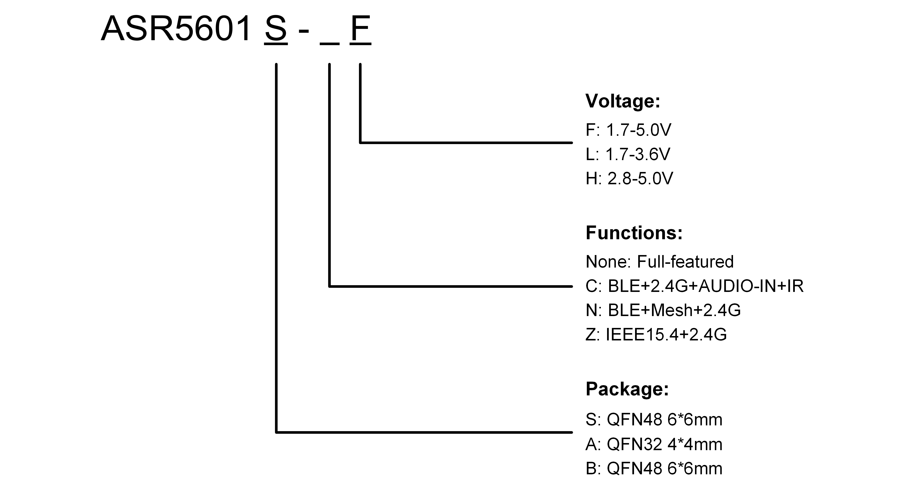
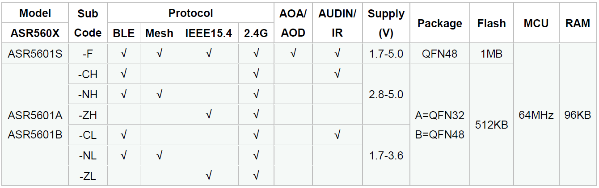

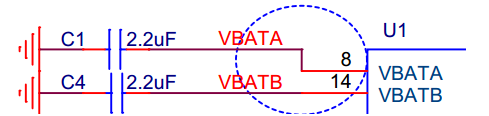

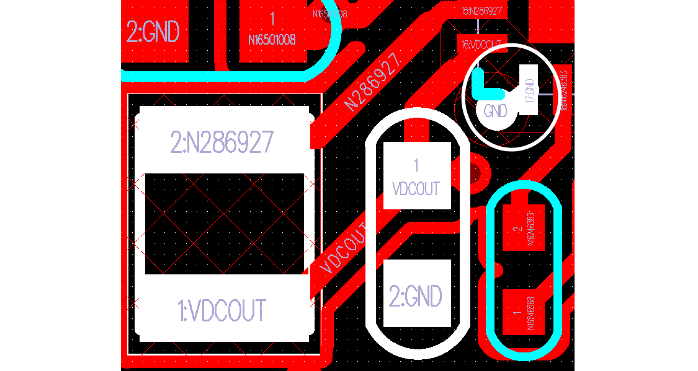
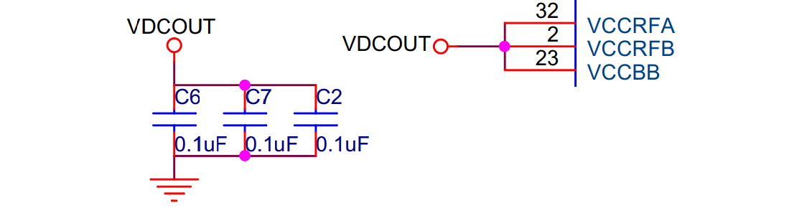
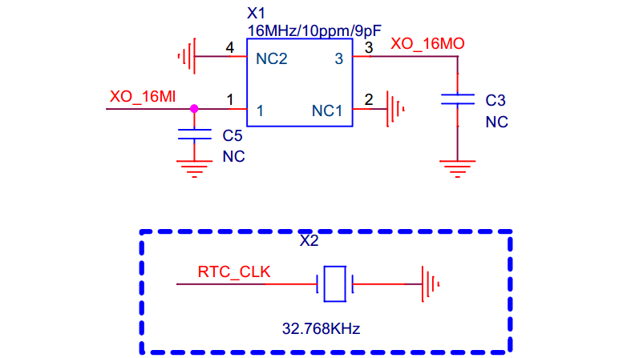
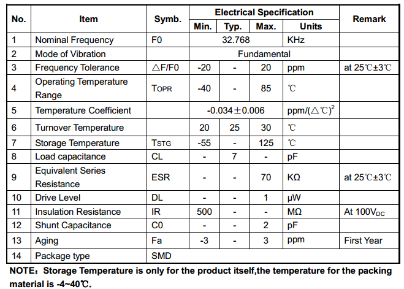

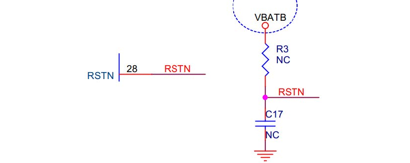
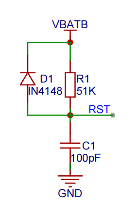
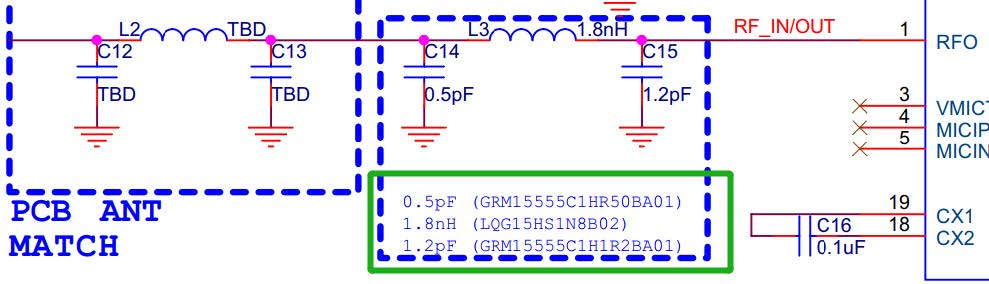
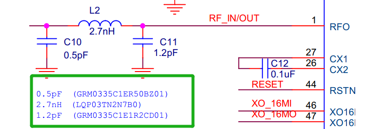
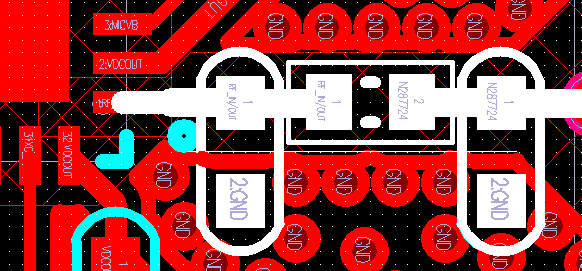
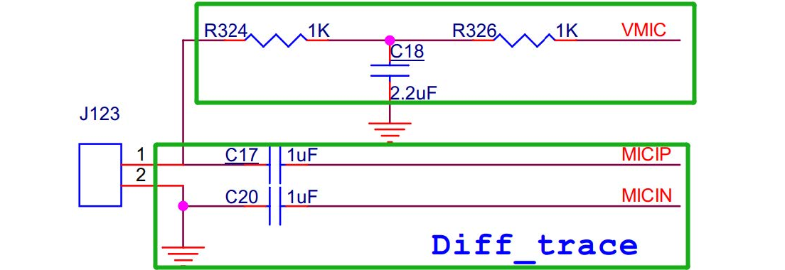
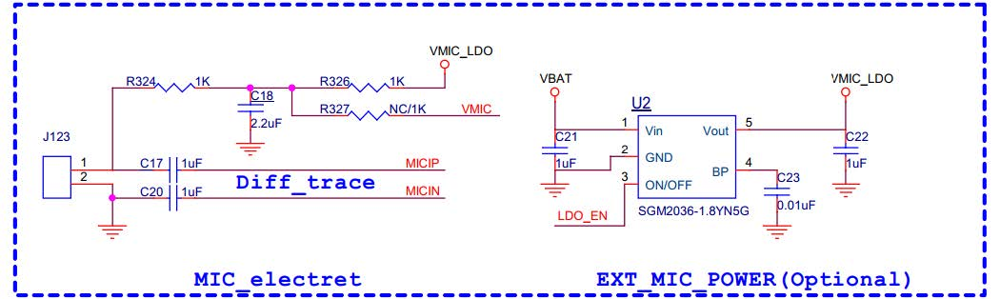
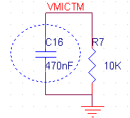
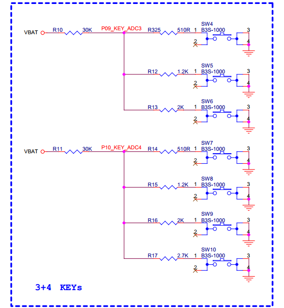

