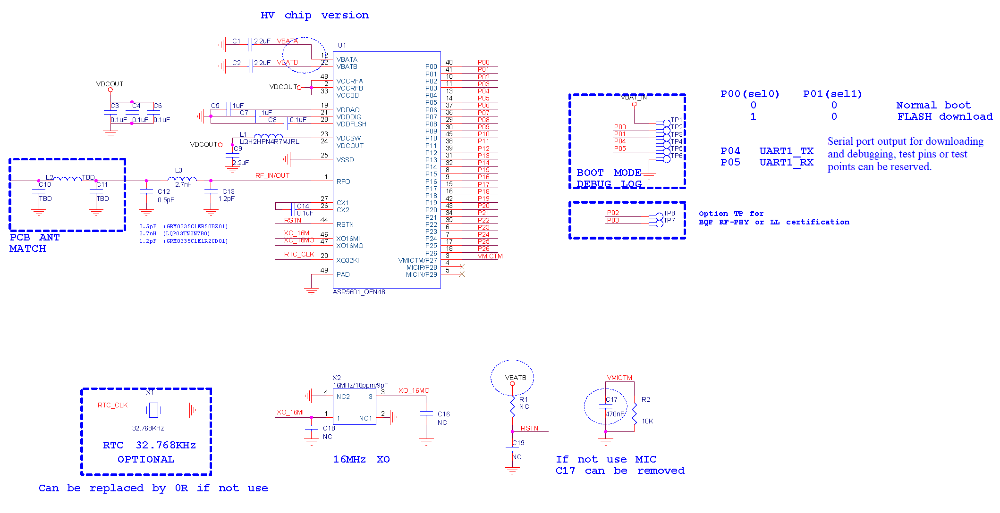
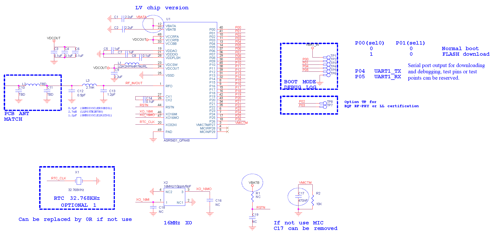
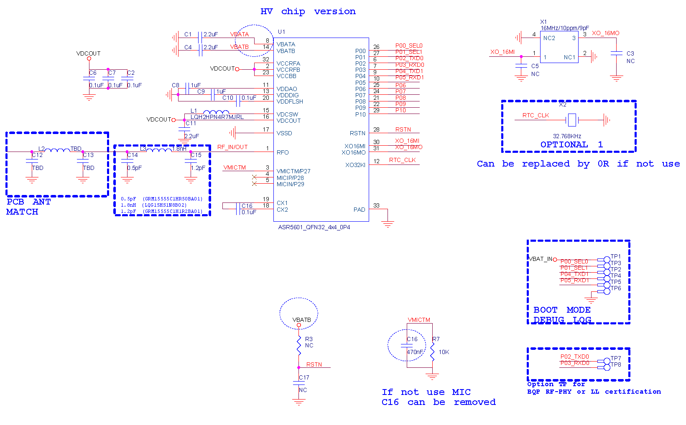
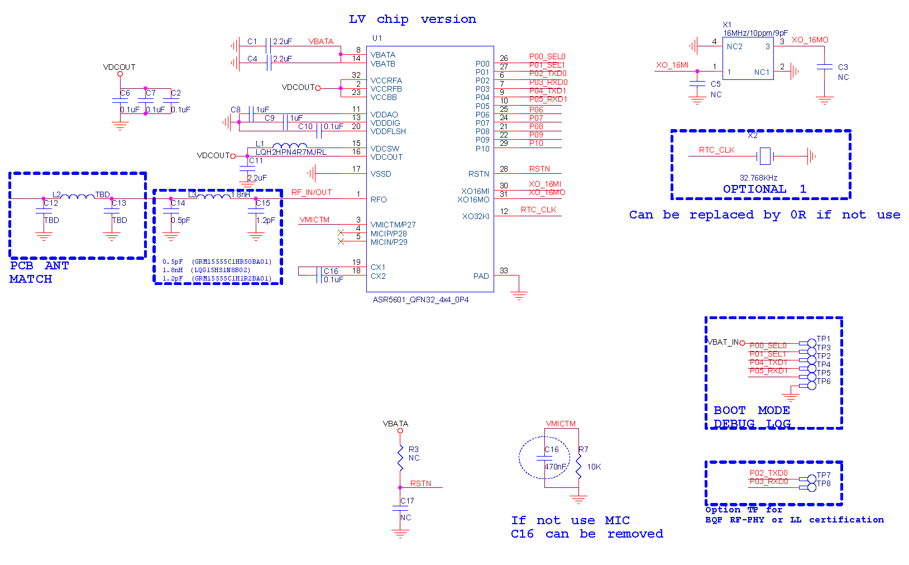

ASR560X Series Reference Design 
====================
`简体中文 <https://asriot-cn.readthedocs.io/zh/latest/ASR560X/硬件介绍/参考设计.html>`_

1. ASR560X QFN48 Reference Design
--------------------------------------------------------

    ASR560X QFN48 HV Reference Design (click to enlarge)

    ASR560X QFN48 LV Reference Design (click to enlarge)

2. ASR560X QFN48 Reference BOM
--------------------------------------------------------

.. raw:: html

   

ASR560X QFN48 HV Reference BOM

.. raw:: html

   

+--------+------+---------------------+---------------------------+--------------------------------+
| Number | Qty. | Ref Des             | Value/Model               | Description                    |
+========+======+=====================+===========================+================================+
| 1      | 3    | C1, C2, C9          | 2.2uF                     | Filter Capacitor               |
+--------+------+---------------------+---------------------------+--------------------------------+
| 2      | 5    | C3, C4, C6, C8, C14 | 0.1uF                     | Filter Capacitor               |
+--------+------+---------------------+---------------------------+--------------------------------+
| 3      | 2    | C5, C7              | 1uF                       | Filter Capacitor               |
+--------+------+---------------------+---------------------------+--------------------------------+
| 4      | 1    | C12                 | 0.5pF (GRM0335C1ER50BZ01) | Matching Capacitor             |
+--------+------+---------------------+---------------------------+--------------------------------+
| 5      | 1    | C13                 | 1.2pF (GRM0335C1E1R2CD01) | Matching Capacitor             |
+--------+------+---------------------+---------------------------+--------------------------------+
| 6      | 1    | C17                 | 470nF                     | Filter Capacitor               |
+--------+------+---------------------+---------------------------+--------------------------------+
| 7      | 1    | L1                  | LQH2HPN4R7MJRL            | DCDC Inductor (current＞100mA) |
+--------+------+---------------------+---------------------------+--------------------------------+
| 8      | 1    | L3                  | 2.7nH (LQP03TN2N7B0)      | Matching Inductor              |
+--------+------+---------------------+---------------------------+--------------------------------+
| 9      | 1    | R2                  | 10K                       | Resistor                       |
+--------+------+---------------------+---------------------------+--------------------------------+
| 10     | 1    | U1                  | ASR5601_QFN48             | BLE SoC                        |
+--------+------+---------------------+---------------------------+--------------------------------+
| 11     | 1    | X1                  | 32.768KHz                 | Crystal                        |
+--------+------+---------------------+---------------------------+--------------------------------+
| 12     | 1    | X2                  | 16MHz/10ppm/9pF           | Crystal                        |
+--------+------+---------------------+---------------------------+--------------------------------+

.. raw:: html

   

ASR560X QFN48 LV Reference BOM

.. raw:: html

   

+--------+------+---------------------+---------------------------+--------------------------------+
| Number | Qty. | Ref Des             | Value/Model               | Description                    |
+========+======+=====================+===========================+================================+
| 1      | 3    | C1, C2, C9          | 2.2uF                     | Filter Capacitor               |
+--------+------+---------------------+---------------------------+--------------------------------+
| 2      | 5    | C3, C4, C6, C8, C14 | 0.1uF                     | Filter Capacitor               |
+--------+------+---------------------+---------------------------+--------------------------------+
| 3      | 2    | C5, C7              | 1uF                       | Filter Capacitor               |
+--------+------+---------------------+---------------------------+--------------------------------+
| 4      | 1    | C12                 | 0.5pF (GRM0335C1ER50BZ01) | Matching Capacitor             |
+--------+------+---------------------+---------------------------+--------------------------------+
| 5      | 1    | C13                 | 1.2pF (GRM0335C1E1R2CD01) | Matching Capacitor             |
+--------+------+---------------------+---------------------------+--------------------------------+
| 6      | 1    | C17                 | 470nF                     | Filter Capacitor               |
+--------+------+---------------------+---------------------------+--------------------------------+
| 7      | 1    | L1                  | LQH2HPN4R7MJRL            | DCDC Inductor (current＞100mA) |
+--------+------+---------------------+---------------------------+--------------------------------+
| 8      | 1    | L3                  | 2.7nH (LQP03TN2N7B0)      | Matching Inductor              |
+--------+------+---------------------+---------------------------+--------------------------------+
| 9      | 1    | R2                  | 10K                       | Resistor                       |
+--------+------+---------------------+---------------------------+--------------------------------+
| 10     | 1    | U1                  | ASR5601_QFN48             | BLE SoC                        |
+--------+------+---------------------+---------------------------+--------------------------------+
| 11     | 1    | X1                  | 32.768KHz                 | Crystal                        |
+--------+------+---------------------+---------------------------+--------------------------------+
| 12     | 1    | X2                  | 16MHz/10ppm/9pF           | Crystal                        |
+--------+------+---------------------+---------------------------+--------------------------------+

3. ASR560X QFN32 Reference Design
--------------------------------------------------------

    ASR560X QFN32 HV Reference Design (click to enlarge)

    ASR560X QFN32 LV Reference Design (click to enlarge)

4. ASR560X QFN32 Reference BOM
--------------------------------------------------------

.. raw:: html

   

ASR560X QFN32 HV Reference BOM

.. raw:: html

   

+--------+------+----------------------+----------------------------+--------------------------------+
| Number | Qty. | Ref Des              | Value/Model                | Description                    |
+========+======+======================+============================+================================+
| 1      | 3    | C1, C4, C11          | 2.2uF                      | Filter Capacitor               |
+--------+------+----------------------+----------------------------+--------------------------------+
| 2      | 5    | C2, C6, C7, C10, C16 | 0.1uF                      | Filter Capacitor               |
+--------+------+----------------------+----------------------------+--------------------------------+
| 3      | 2    | C8, C9               | 1uF                        | Filter Capacitor               |
+--------+------+----------------------+----------------------------+--------------------------------+
| 4      | 1    | C14                  | 0.5pF (GRM15555C1HR50BA01) | Matching Capacitor             |
+--------+------+----------------------+----------------------------+--------------------------------+
| 5      | 1    | C15                  | 1.2pF (GRM15555C1H1R2BA01) | Matching Capacitor             |
+--------+------+----------------------+----------------------------+--------------------------------+
| 6      | 1    | C16                  | 470nF                      | Filter Capacitor               |
+--------+------+----------------------+----------------------------+--------------------------------+
| 7      | 1    | L1                   | LQH2HPN4R7MJRL             | DCDC Inductor (current＞100mA) |
+--------+------+----------------------+----------------------------+--------------------------------+
| 8      | 1    | L3                   | 1.8nH (LQG15HS1N8B02)      | Matching Inductor              |
+--------+------+----------------------+----------------------------+--------------------------------+
| 9      | 1    | R7                   | 10K                        | Resistor                       |
+--------+------+----------------------+----------------------------+--------------------------------+
| 10     | 1    | U1                   | ASR5601                    | BLE SoC                        |
+--------+------+----------------------+----------------------------+--------------------------------+
| 11     | 1    | X1                   | 16MHz/10ppm/9pF            | Crystal                        |
+--------+------+----------------------+----------------------------+--------------------------------+
| 12     | 1    | X2                   | 32.768KHz                  | Crystal                        |
+--------+------+----------------------+----------------------------+--------------------------------+

.. raw:: html

   

ASR560X QFN32 LV Reference BOM

.. raw:: html

   

+--------+------+----------------------+----------------------------+--------------------------------+
| Number | Qty. | Ref Des              | Value/Model                | Description                    |
+========+======+======================+============================+================================+
| 1      | 3    | C1, C4, C11          | 2.2uF                      | Filter Capacitor               |
+--------+------+----------------------+----------------------------+--------------------------------+
| 2      | 5    | C2, C6, C7, C10, C16 | 0.1uF                      | Filter Capacitor               |
+--------+------+----------------------+----------------------------+--------------------------------+
| 3      | 2    | C8, C9               | 1uF                        | Filter Capacitor               |
+--------+------+----------------------+----------------------------+--------------------------------+
| 4      | 1    | C14                  | 0.5pF (GRM15555C1HR50BA01) | Matching Capacitor             |
+--------+------+----------------------+----------------------------+--------------------------------+
| 5      | 1    | C15                  | 1.2pF (GRM15555C1H1R2BA01) | Matching Capacitor             |
+--------+------+----------------------+----------------------------+--------------------------------+
| 6      | 1    | C16                  | 470nF                      | Filter Capacitor               |
+--------+------+----------------------+----------------------------+--------------------------------+
| 7      | 1    | L1                   | LQH2HPN4R7MJRL             | DCDC Inductor (current＞100mA) |
+--------+------+----------------------+----------------------------+--------------------------------+
| 8      | 1    | L3                   | 1.8nH (LQG15HS1N8B02)      | Matching Inductor              |
+--------+------+----------------------+----------------------------+--------------------------------+
| 9      | 1    | R7                   | 10K                        | Resistor                       |
+--------+------+----------------------+----------------------------+--------------------------------+
| 10     | 1    | U1                   | ASR5601                    | BLE SoC                        |
+--------+------+----------------------+----------------------------+--------------------------------+
| 11     | 1    | X1                   | 16MHz/10ppm/9pF            | Crystal                        |
+--------+------+----------------------+----------------------------+--------------------------------+
| 12     | 1    | X2                   | 32.768KHz                  | Crystal                        |
+--------+------+----------------------+----------------------------+--------------------------------+

