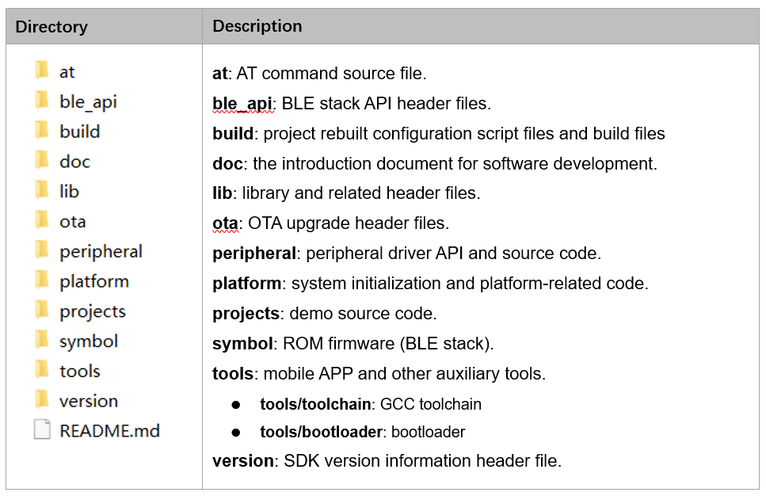
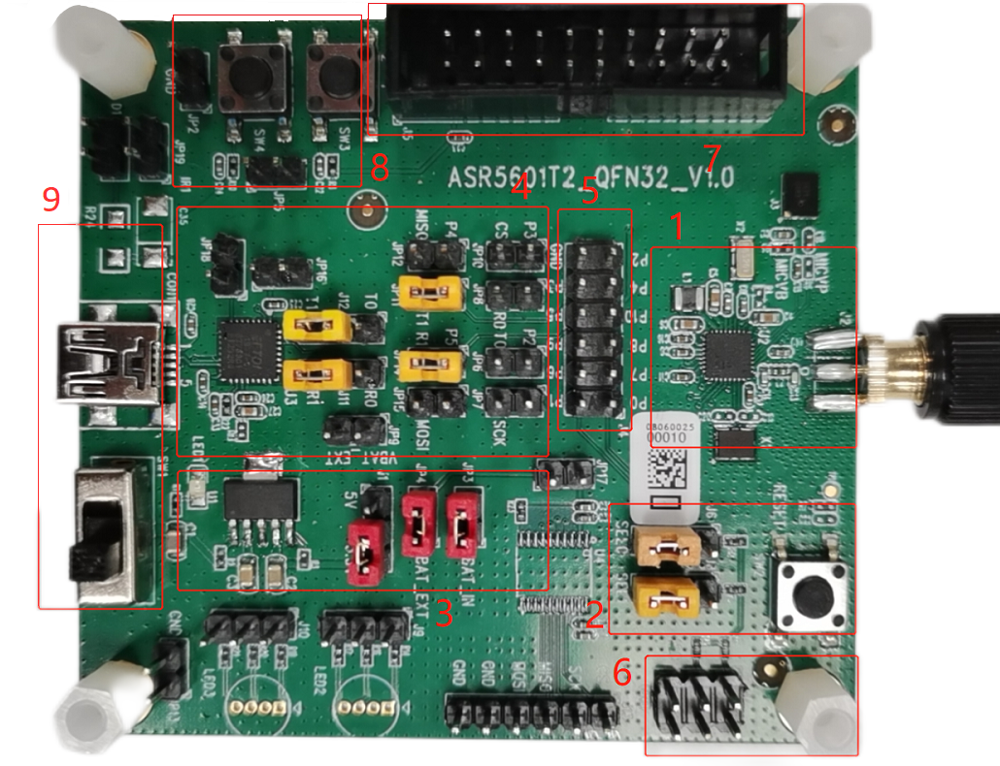
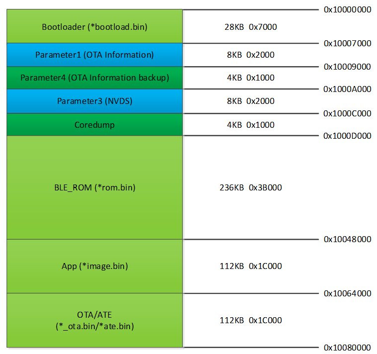
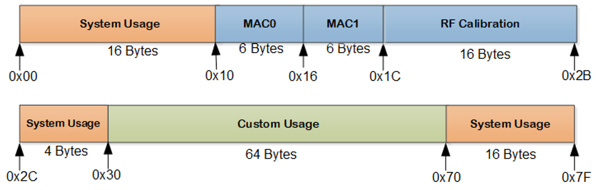
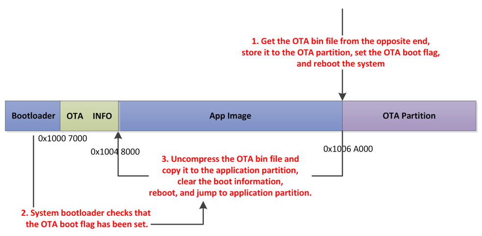
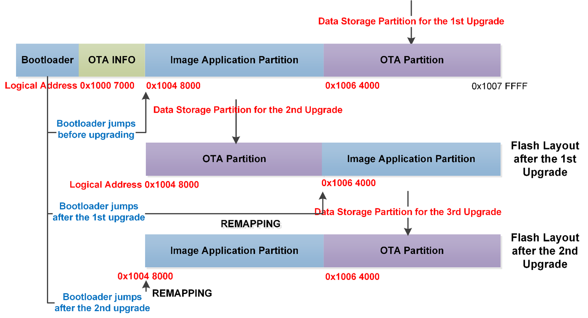
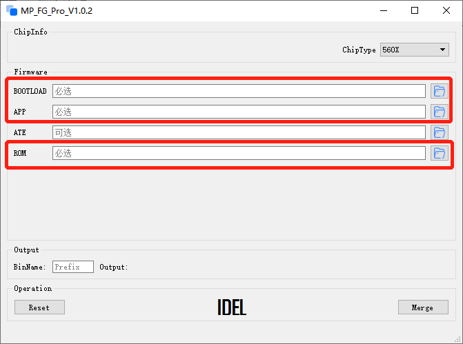

.. role:: raw-latex(raw)
   :format: latex
..

ASR560X Series Developer Guide
==============================
`简体中文 <https://asriot-cn.readthedocs.io/zh/latest/ASR560X/软件快速入门/开发入门指南.html>`_

Introduction
------------

**About This Document**

This document is a developer guide for the ASR560X Series BLE chip. Before reading this document, please refer to the *ASR560X Series_Datasheet*.

**Intended Readers**

This document is mainly for engineers who use this chip to develop their own platform and products, for instance:

-  PCB Hardware Development Engineer
-  Software Engineer
-  Technical Support Engineer

**Included Chip Models**

The product models corresponding to this document are as follows.

+---------+-------------------------------------------------------------------------------------------+----------+--------------+------------------------------------------------------------------------------------+
| Model   | Protocol                                                                                  | Core     | SiP Flash    | Function                                                                           |
+=========+===========================================================================================+==========+==============+====================================================================================+
| ASR560X | BLE 5.1 full feature (compatible with 5.2) SIG MESH V1.0.x IEEE 802.15.4 2.4G Proprietary | ARM CM0+ | 1 MB/ 512 KB | AOA/AOD/Voice/IRTxRx/ Quadrature Decoder/Keypad/ 5V UART/5V GPIO/ Wi-Fi concurrent |
+---------+-------------------------------------------------------------------------------------------+----------+--------------+------------------------------------------------------------------------------------+

**Copyright Notice**

© 2023 ASR Microelectronics Co., Ltd. All rights reserved. No part of this document can be reproduced, transmitted, transcribed, stored, or translated into any languages in any form or by any means without the written permission of ASR Microelectronics Co., Ltd.

**Trademark Statement**

ASR and ASR Microelectronics Co., Ltd. are trademarks of ASR Microelectronics Co., Ltd. 

Other trade names, trademarks and registered trademarks mentioned in this document are property of their respective owners.

**Electrostatic Discharge (ESD) Warning**

This product can be damaged by Electrostatic Discharge (ESD). When handling with this device, the people should be very careful to conduct the ESD protection to avoid any device damage caused by ESD event.

**Disclaimer**

ASR do not give any warranty of any kind and may make improvements and/or changes in this document or in the product described in this document at any time.

This document is only used as a guide, and no contents in the document constitute any form of warranty. Information in this document is subject to change without notice.

All liability, including liability for infringement of any proprietary rights caused by using the information in this document is disclaimed.

**ASR Microelectronics Co., Ltd.**

Address: 9F, Building 10, No. 399 Keyuan Road, Zhangjiang High-tech Park, Pudong New Area, Shanghai, 201203, China

Homepage: http://www.asrmicro.com/

**Revision History**

======= ======= ==============
Date    Version Release Notes
======= ======= ==============
2023.03 V1.3.0  First Release.
======= ======= ==============

1. Platform
-----------

.. _introduction-1:

1.1 Introduction
~~~~~~~~~~~~~~~~

ASRBLE_NONOS_SDK is a software development kit based on the ASR560X BLE chip hardware platform, providing developers with a rich set of modules and demo projects, including the bootloader, BLE function application, Mesh function application and peripheral driver.

The names of BLE and peripheral API interfaces provided by the SDK are prefixed with the keyword “sonata”. Currently, the SDK does not support any operating system.

1.2 Software Development Platform
~~~~~~~~~~~~~~~~~~~~~~~~~~~~~~~~~

The contents of the SDK are shown below:

|image1|

For details on development environment setup, please refer to the *ASR560X Series_Development Environment Setup Guide.*

1.3 Development Board
~~~~~~~~~~~~~~~~~~~~~

The QFN32 development board provided by ASR is shown in the following figure:

|image2|

The 9 parts marked in the Figure are:

① ASR560X and related circuits

② Operation mode selection and reset circuit

③ Power supply selection circuit

④ UART0/UART1 multiplexing selection circuit

⑤ ASR560X GPIO Interface

⑥ Pull-up resistor interface

⑦ SWD debugging interface

⑧ Key interface

⑨ Power input and control interface

The following are the steps for the user to perform the firmware downloading and program running:

1. Connect the UART1 of ASR560X to PC by Mini-USB with the FT232 USB to serial converter chip. The jumper configuration is shown in red boxes 3 and 4 above.

2. Open the DOGO tool on the PC (SDK/tools), select the serial port number corresponding to the EVB, set the baud rate to 115200 bps and the chip type to 560X, and connect J6-1 and J6-2 in red box 2 with the jumper.

3. Press the Reset button in red box 2. If the DOGO tool interface shows “1F2E3D00”, the user can download the application bin

4. When the downloading of the program is finished, connect J6-2 and J6-3 with the jumper, press Reset button, and the EVB will run with application code. Most demos of the SDK use UART1 as the log port by default.

Currently ASR provides two types of EVBs, QFN32 and QFN48, and the jumpers used for different EVBs are different. For detailed instructions on using the EVBs, please refer to the *ASR560X Series\_ Development Board User Guide*.

2.Firmware and Download
-----------------------

2.1 Firmware
~~~~~~~~~~~~

The ASR560X firmware and its functions are described as follows:

-  **ASRBOOTLOADER-560XXXXX.bin**: The bootloader firmware, provided by ASR, is placed in the SDK *tools/ bootloader* directory by default. UART1 (P04, P05) is used as the communication port of this firmware.

-  **app_image.bin:** The application firmware is generated by developer based on the SDK platform.

-  **sonata_hl_ll_rom_XXX.bin**: The BLE stack firmware, provided by ASR, is placed in the SDK *symbol/ sonata* directory by default. Users can choose different protocol stack firmware according to the consumption of application resources. Please refer to *ASR560X Series_Memory Layout Configuration Application Manual* for details.

-  **ASR_560X_ATE_XXXX.bin**: RF performance test calibration firmware is provided by ASR, which should be used with related devices, such as frequency spectrometer, with UART1 as its communication port. Users may evaluate their actual needs to decide whether it will be used.

-  **app_image_ota.bin**: The OTA upgrade firmware is generated by *image_gen_header* command configuration. Please refer to Section 3.7: OTA Upgrade for details.

.. note:: 
    If the firmware is not found in the corresponding directory, or if you need the latest firmware, please contact your agency.

2.2 Download
~~~~~~~~~~~~

1. The firmware can be downloaded to the Flash of the ASR560X series chips via UART1 serial port (P04, P05).

2. For peripheral application, users only need to download the bootload.bin and image.bin. For BLE application, users need to download the ROM.bin additionally from *symbol/sonata* directory. Please refer to *ASR560X Series_Firmware Type and Download Introduction* for details.

3. ASR provides the DOGO tool for PC for downloading and serial debugging. For details about how to use the DOGO tool, please refer to the *ASR560X\_ User’s Manual for BLE Programming Tool*.

3. Software Resource
--------------------

3.1 Flash
~~~~~~~~~

The ASR560X SoC has the internal 512 KB/1 MB Flash, and each block size of Flash is 4 KB. The ASR560X Flash layout is shown below (taking 512 KB Flash as an example). The actual layout may be slightly different. Please refer to the layout definition in SDK sonata_board.c.

|image3|

1. **Bootloader Boot Area (28 KB, start address 0x1000 0000)**: ASRBOOTLOADER-560XXXXX.bin is downloaded to this partition.

2. **Parameter1 (OTA information) Information Area (8 KB, start address 0x1000 7000):** Store OTA information and flags.

3. **Parameter4 (OTA information backup) Information Area (4 KB, start address 0x1000 9000)**: Reserve OTA information and flags.

4. **NVDS Information Area (8 KB, start address 0x1000 A000):** Store system and user data in NVDS format by default. MAC addresses is stored in this area by default.

5. **Coredump Information Area (4 KB, start address 0x1000 C000)**: Store Coredump information. If the SYSTEM_COREDUMP macro is undefined in the application code, users can use this 4 KB partition for storing custom information.

6. **BLE Stack Area (236 KB, start address 0x1000 D000)**: Store BLE stack firmware. The sonata_hl_ll_rom_XXX.bin should be downloaded to this partition.

7. **App Image Area (112 KB, start address 0x1004 8000)**: Store application firmware. The application is downloaded to this partition.

8. **OTA/ATE Area (112 KB, start address 0x1006 4000)**: Store OTA/ATE firmware. The OTA upgrade firmware and ATE firmware for RF calibration (if required) are downloaded to this partition.

.. attention::
    1. The ATE.bin for the production test will be overwritten in the first OTA upgrade.
    2. The logical address of the app_image partition and the OTA partition are constantly exchanged during the OTA upgrade via REMAPPING. Refer to section 3.7 OTA Upgrade.
    3. It is recommended not to change the partition layout definition easily, otherwise, the system may fail to start or data may be lost. If the developer needs to modify the partition size or add a new partition, users need to make sure that the start address of the bootloader/NVDS/App image/OTA partitions should not be changed.

3.2 RAM
~~~~~~~

The ASR560X series has the internal 96 KB RAM.

The RAM is divided into Data segment, Function segment, BSS segment, and Stack and Heap segments, the layout of which is shown in the following figure:

|image4|

The RAM available to the user is closely related to the BLE stack used: the more concurrent BLE stack connections and the more profiles there are, the less RAM is available to the user.

The BLE stack (ROM) has been configured in every BLE demo. Users can check the build:raw-latex:`\build`\_rules:raw-latex:`\project`:raw-latex:`\XXXXXXX`:raw-latex:`\config`.mk file to determine which ROM should be used for the corresponding project. Please refer to *ASR560X Series_Firmware Type and Download Introduction* for details.

If users need to adjust the RAM resource allocation and modify the size of user RAM, please refer to *ASR560X Series_Memory Layout Configuration Application Manual*.

3.3 eFuse
~~~~~~~~~

The ASR560X Series has a 1 Kbits built-in eFuse memory. The eFuse area can be written only once and can be read many times. The LDO must be turned on when writing data into eFuse. The layout of eFuse is shown in the figure below:

|image5|

.. attention::
    The eFuse area can only be written from '0' to '1' (which is why it can only be written once), The minimum unit of operation on the eFuse area is Byte. If the eFuse area is rewritten forcibly, the value will be different than expected. For example, if 0x15 is written for the first time, and 0x43 for the second time, the value stored in eFuse will be 0x57(0x15|0x43).

3.4 BLE API
~~~~~~~~~~~

Please refer to *ASR560X_BLE_API* in the SDK *doc* directory for the description of the BLE API.

3.5 Low-Power Mode
~~~~~~~~~~~~~~~~~~

Please refer to *ASR5601X_BLE Low-Power Application Guide* in the SDK *doc* directory for low power configuration usage.

3.6 MAC Address
~~~~~~~~~~~~~~~

The MAC address is written to the eFuse area by program tools. The MAC address can only be written to the eFuse area up to 2 times. The MAC address takes up 6 Bytes of the eFuse area for every time it is written. The MAC address is written 2 times in exchange for 2 downloading operations.

SDK provides the following APIs for reading/writing MAC address information:

-  **sonata_get_bt_address()**

Function:

If the MAC address is written in the eFuse area, it is returned;

If the MAC address is not written in eFuse but is written in NVDS, the MAC address in NVDS is returned;

If the MAC address is not written in eFuse or NVDS, the system will generate a static random address and store the address to the NVDS area.

-  **sonata_set_bt_address()**

Function: Store the MAC address to the NVDS area of Flash in the format of little-endian.

3.7 OTA Upgrade
~~~~~~~~~~~~~~~

3.7.1 Overview
^^^^^^^^^^^^^^

Currently, the OTA upgrade of app.bin supports both REMAPPING and COMPRESS methods. The OTA bin file of demo project is generated via REMAPPING by default. It can also be generated via COMPRESS using the image_gen_header.exe tools in *tools/ota_bin_gen* directory.

The ota.bin file adds 128 Bytes OTA control information in the header of the original application bin file, including version number, upgrade method, CRC checksum and other information. The version number can be used for version upgrade detection. Currently, this function is disabled by default (no version check function).

The OTA bin file for the ROM firmware can be generated using the image_gen_header tool in the *tools/ota_bin_gen* directory (For ROM upgrade, the REMAPPING method should be used).

**image_gen_header Tool Instructions:**

**Image_gen_header.exe Parameter1 -d Parameter2 -b Parameter3 -t Parameter4** (case-sensitive)

Parameter1: application bin file name

Parameter2: -d (SONATA must be used), used to set the chip type for generating the image_token for the OTA bin file.

Parameter3: -b (select COMPRESS or REMAPPING based on the application), used to set the implementation method of OTA upgrade.

Parameter2: -t (default, Parameter 4: APP, ROM), used to set whether image is used for APP upgrade or ROM upgrade. The APP upgrade firmware is generated by default.

The configuration script of OTA firmware is in *build/rules/project/*\ \**demo/gen_ota_bin.mk. When users rebuild the project, the application bin file and OTA bin file will be generated according to this script configuration.

If users have not set the script for project, they can use commands to generate the OTA bin file in the following steps.

Example: **./image_gen_header.exe** sonata_hl_data_trans_demo.bin -d SONATA -b REMAPPING -t APP

\\1. Copy the original application bin file to the *tools/ota_bin_gen* directory.

\\2. After running this command, sonata_hl_data_trans_demo_ota.bin will be generated in the *tools/ota_bin_gen* directory.

3.7.2 COMPRESS
^^^^^^^^^^^^^^

The following is an example of the 512 KB internal Flash:

|image6|

The main flow of upgrading via COMPRESS is shown in the figure above:

1. It will write the data to the OTA partition of Flash when the application gets the OTA bin data from the opposite end. Before writing data, the system will do some security checks, such as version check (this function is disabled by default), verification of OTA data, etc. When the security check is not passed, the system will return an error message indicating that the upgrade fails. Only when the security check is passed, the system will set the OTA upgrade flag bit, indicating that the OTA bin file is successfully received in the OTA partition, and the system will reboot.

2. When the system reboots, the bootloader will check the OTA flag bit.

3. When the OTA upgrade flag bit is checked to be valid, the bootloader will check the validity of the compressed data in the OTA partition. If the compressed data is checked successfully, it will uncompress and copy it to the app_image application partition. If the compressed data is not checked successfully, the OTA upgrade flag bit in the OTA INFO partition will be cleared and then the bootloader will jump to the app_image application partition and run with original application code.

4. The data integrity will be checked after the bootloader copies the data.

5. If the data is complete, the OTA upgrade flag bit will be cleared in the OTA INFO partition.

6. After the OTA upgrade flag bit is cleared, the bootloader will jump directly to the app_image application partition and run with new firmware.

3.7.3 REMAPPING
^^^^^^^^^^^^^^^

The following is an example of the 512 KB internal Flash:

|image7|

The upgrading via REMAPPING is shown above, which relies on the system’s remapping function of logical addresses and physical Flash addresses.

1. When upgrading for the first time, the OTA data will be written to the logical address 0x1006 4000. The system will do some security checks before writing data, such as version check (this function is disabled by default), verification of OTA data, etc. When the security check is not passed, the system will return an error message indicating that the upgrade fails. Only when the security check is passed, the system will set the OTA upgrade flag bit, indicating that the OTA bin file is successfully received in the OTA partition, and the system will reboot.

2. When the system reboots, the bootloader will check the OTA flag bit.

3. When the upgrade flag bit is checked to be valid, the bootloader will verify the validity of the upgraded data.

   a) If the validity check is not passed, the OTA flag bit in the OTA INFO partition will be cleared. The bootloader will jump to the original application address and run with original application code.

   b) If the validity check is passed, the address space (logical address) of the app_image application partition and the OTA partition will be exchanged and remapped: the starting logical address of the app_image application partition is remapped to 0x1006 4000, and the starting logical address of the OTA partition is remapped to 0x1004 8000, then the bootloader will jump to the logical address 0x1006 4000 and start running.

4. For the second upgrade, the application will store the data app_image_ota.bin file to the logical address 0x1004 8000, and the bootloader will jump to the logical address 0x1004 8000 to run according to the remapping relationship.

5. The upgrade process is same for the third upgrade. The OTA bin file will be constantly written to the logical addresses 0x1004 8000 and 0x1006 4000 alternately. When the program runs, the bootloader will jump to the logical address 0x1004 8000, and then keeps running between logical address 0x1004 8000 and 0x1006 4000 according to the remapping relationship.

.. note:: 
    From the perspective of security, upgrading via REMAPPING is recommended, and ASR will support the version rollback function later. If an incorrect firmware is upgraded due to misoperations, the user shall take the responsibility.

3.7.4 OTA Interface
^^^^^^^^^^^^^^^^^^^

The interface declaration for the OTA function is in the SDK \*ota:raw-latex:`\ota`\_download.h*. The main APIs are described below:

-  **int sonata_ota_init (const char \*version, uint32_t \*break_point)**

+-----------+------------------------------------------------------------------------------------------------------------------------------------+
| **Items** | **Description**                                                                                                                    |
+===========+====================================================================================================================================+
| Function  | Initialize the OTA function and erase the data in the OTA information partition in Flash and prepare for this upgrade.             |
+-----------+------------------------------------------------------------------------------------------------------------------------------------+
| Param     | **const char \*version:** Rollback parameter, not used yet. **uint32_t \*break_point:** Breakpoint resume parameter, not used yet. |
+-----------+------------------------------------------------------------------------------------------------------------------------------------+
| Return    | Result: Zero: Success, Non-Zero: Failure                                                                                           |
+-----------+------------------------------------------------------------------------------------------------------------------------------------+
| Note      |                                                                                                                                    |
+-----------+------------------------------------------------------------------------------------------------------------------------------------+

-  **int sonata_ota_write (unsigned int \*off, char \*in_buf, int in_buf_len)**

+-----------+------------------------------------------------------------------------------------------------------------------------------------------------------------------------------------------------------------------------------------------------------------------------------------------------------------------------------------------------------------------------------------+
| **Items** | **Description**                                                                                                                                                                                                                                                                                                                                                                    |
+===========+====================================================================================================================================================================================================================================================================================================================================================================================+
| Function  | Write upgraded data to the OTA partition.                                                                                                                                                                                                                                                                                                                                          |
+-----------+------------------------------------------------------------------------------------------------------------------------------------------------------------------------------------------------------------------------------------------------------------------------------------------------------------------------------------------------------------------------------------+
| Param     | **off:** The location where data is written to the OTA partition. For example, when data is written at the beginning, the value is 0. Note: After the data is written successfully, off indicates the length of the data that is actually written **in_buf:** The pointer to the OTA partition where the data is written to. **in_buf_len:** The length of the data to be written. |
+-----------+------------------------------------------------------------------------------------------------------------------------------------------------------------------------------------------------------------------------------------------------------------------------------------------------------------------------------------------------------------------------------------+
| Return    | Result: Zero: Success, Non-Zero: Failure                                                                                                                                                                                                                                                                                                                                           |
+-----------+------------------------------------------------------------------------------------------------------------------------------------------------------------------------------------------------------------------------------------------------------------------------------------------------------------------------------------------------------------------------------------+
| Note      |                                                                                                                                                                                                                                                                                                                                                                                    |
+-----------+------------------------------------------------------------------------------------------------------------------------------------------------------------------------------------------------------------------------------------------------------------------------------------------------------------------------------------------------------------------------------------+

-  **int sonata_ota_read (unsigned int \*off, char \*out_buf, int out_buf_len)**

+-----------+------------------------------------------------------------------------------------------------------------------------------------------------------------------------------------------------------------------------------------------------------------------------------------------------------+
| **Items** | **Description**                                                                                                                                                                                                                                                                                      |
+===========+======================================================================================================================================================================================================================================================================================================+
| Function  | Read data from the OTA partition.                                                                                                                                                                                                                                                                    |
+-----------+------------------------------------------------------------------------------------------------------------------------------------------------------------------------------------------------------------------------------------------------------------------------------------------------------+
| Param     | **off:** The location of the data read from the OTA partition. Note: After the data is successfully read, off indicates the length of the data that is actually read. **out_buf:** The pointer to the OTA partition where the data is read from. **out_buf_len:** The length of the data to be read. |
+-----------+------------------------------------------------------------------------------------------------------------------------------------------------------------------------------------------------------------------------------------------------------------------------------------------------------+
| Return    | Result: Zero: Success, Non-Zero: Failure                                                                                                                                                                                                                                                             |
+-----------+------------------------------------------------------------------------------------------------------------------------------------------------------------------------------------------------------------------------------------------------------------------------------------------------------+
| Note      |                                                                                                                                                                                                                                                                                                      |
+-----------+------------------------------------------------------------------------------------------------------------------------------------------------------------------------------------------------------------------------------------------------------------------------------------------------------+

-  **int sonata_ota_set_boot (void)**

+-----------+------------------------------------------------------------------------------------------------------------------------------------------------------------------------+
| **Items** | **Description**                                                                                                                                                        |
+===========+========================================================================================================================================================================+
| Function  | According to the header information of the bin file, verify the integrity of the received bin file, and set the OTA upgrade flag to the OTA information TAG partition. |
+-----------+------------------------------------------------------------------------------------------------------------------------------------------------------------------------+
| Param     | None                                                                                                                                                                   |
+-----------+------------------------------------------------------------------------------------------------------------------------------------------------------------------------+
| Return    | Result: Zero: Success, Non-Zero: Failure                                                                                                                               |
+-----------+------------------------------------------------------------------------------------------------------------------------------------------------------------------------+
| Note      |                                                                                                                                                                        |
+-----------+------------------------------------------------------------------------------------------------------------------------------------------------------------------------+

3.8 PIN MUX
~~~~~~~~~~~

**General IO Port Pin Mux-1**

==== ======== ====== ========= ========= ======== ======
Num. Pin Name Func=0 Func=1    Func=2    Func=3   Func=4
==== ======== ====== ========= ========= ======== ======
1    P00      NA     UART2_TXD I2C0_SCL  I2C1_SCL PWM10
2    P01      NA     UART2_RXD I2C0_SDA  I2C1_SDA PWM11
3    P02      GPIO2  UART0_TXD SPI0_CS   I2C0_SCL PWM0
4    P03      GPIO3  UART0_RXD SPI0_CLK  I2C0_SDA PWM1
5    P04      GPIO4  UART1_TXD SPI0_TXD  I2C1_SCL PWM2
6    P05      GPIO5  UART1_RXD SPI0_RXD  I2C1_SDA PWM3
7    P06      SWC    UART3_TXD SPI1_CS   I2S_SCLK PWM4
8    P07      SWD    UART3_RXD SPI1_CLK  I2S_LRCK PWM5
9    P08      GPIO8  UART2_TXD SPI1_TXD  I2S_DI   PWM6
10   P09      GPIO9  UART2_RXD SPI1_RXD  I2S_MCLK PWM7
11   P10      GPIO10 UART3_TXD IR1       I2S_DO   PWM8
12   P11      GPIO11 UART1_TXD SPI0_CS   I2C1_SCL PWM9
13   P12      GPIO12 UART1_RXD SPI0_CLK  I2C1_SDA PWM10
14   P13      GPIO13 UART3_TXD SPI0_TXD  I2C0_SCL PWM11
15   P14      GPIO14 UART3_RXD SPI0_RXD  I2C0_SDA PWM0
16   P15      GPIO15 UART0_TXD SPI1_CS   I2S_SCLK PWM1
17   P16      GPIO16 UART0_RXD SPI1_CLK  I2S_LRCK PWM2
18   P17      GPIO17 UART0_CTS SPI1_TXD  I2S_DI   PWM3
19   P18      GPIO18 UART0_RTS SPI1_RXD  I2S_MCLK PWM4
20   P19      GPIO19 UART2_TXD SPI0_CS   I2C0_SCL PWM5
21   P20      GPIO20 UART2_RXD SPI0_CLK  I2C0_SDA PWM6
22   P21      GPIO21 UART0_TXD SPI0_TXD  I2C1_SCL PWM7
23   P22      GPIO22 UART0_RXD SPI0_RXD  I2C1_SDA PWM8
24   P23      GPIO23 UART1_TXD SPI1_CS   I2C0_SCL PWM9
25   P24      GPIO24 UART1_RXD SPI1_CLK  I2C0_SDA PWM10
26   P25      GPIO25 UART3_TXD SPI1_TXD  I2C1_SCL PWM11
27   P26      GPIO26 UART3_RXD SPI1_RXD  I2C1_SDA PWM0
28   P27      GPIO27 UART1_TXD UART2_RXD I2C0_SCL PWM1
29   P28      GPIO28 UART1_RXD KEY_ROW4  I2C0_SDA PWM2
30   P29      GPIO29 UART2_TXD KEY_ROW5  I2S_DO   PWM3
==== ======== ====== ========= ========= ======== ======

**General IO Port Pin Mux-2**

==== ======== ========= ========= ======================= ========
Num. Pin Name Func=5    Func=6    Func=7                  Func=8
==== ======== ========= ========= ======================= ========
1    P00      GPIO0     KEY_COL4  AXIS_2_P                NA
2    P01      GPIO1     KEY_COL5  AXIS_2_N                NA
3    P02      AXIS_0_P  KEY_ROW0  I2S_DI                  SWC
4    P03      AXIS_0_N  KEY_ROW1  I2S_MCLK                SWD
5    P04      UART0_CTS KEY_ROW2  LPUART_TXD\ `a <#bb>`__ I2C0_SCL
6    P05      UART0_RTS KEY_ROW3  LPUART_TXD\ `a <#bb>`__ I2C0_SDA
7    P06      AXIS_1_P  KEY_COL0  LPUART_TXD\ `a <#bb>`__ GPIO6
8    P07      AXIS_1_N  KEY_COL1  LPUART_TXD\ `a <#bb>`__ GPIO7
9    P08      AXIS_2_P  KEY_COL2  USB_DP                  NA
10   P09      AXIS_2_N  KEY_COL3  USB_DM                  NA
11   P10      UART0_CTS KEY_ROW4  NA                      NA
12   P11      AXIS_1_N  KEY_ROW4  SWC                     NA
13   P12      I2S_DO    KEY_ROW5  SWD                     NA
14   P13      AXIS_0_P  KEY_COL4  LPUART_TXD              NA
15   P14      AXIS_0_N  KEY_COL5  LPUART_TXD              NA
16   P15      AXIS_1_P  KEY_ROW6  USB_DP                  NA
17   P16      IR0       KEY_ROW7  USB_DM                  NA
18   P17      AXIS_2_P  KEY_COL6  SWC                     NA
19   P18      AXIS_2_N  KEY_COL7  SWD                     NA
20   P19      AXIS_0_P  KEY_ROW8  LPUART_TXD              NA
21   P20      AXIS_0_N  KEY_ROW9  LPUART_TXD              NA
22   P21      AXIS_1_P  KEY_ROW10 NA                      NA
23   P22      AXIS_1_N  KEY_ROW11 NA                      NA
24   P23      AXIS_2_P  KEY_ROW12 LPUART_TXD              NA
25   P24      AXIS_2_N  KEY_ROW13 LPUART_TXD              NA
26   P25      NA        KEY_ROW2  NA                      NA
27   P26      I2S_DO    KEY_ROW3  NA                      NA
28   P27      KEY_COL0  KEY_ROW0  NA                      NA
29   P28      KEY_COL1  KEY_ROW1  NA                      NA
30   P29      KEY_COL2  KEY_ROW4  NA                      NA
==== ======== ========= ========= ======================= ========

-  The QFN32 package has 14 IO ports from P00 to P10 and P27 to P29. The QFN48 package has 30 IO ports from P00 to P29, and P27~P29 can be configured as GPIO or analog IO.
-  The pin is configured to Func=0 by default. If the pinmux is configured to other peripheral functions, the sonata_pinmux_config API should be used to configure accordingly.

3.9 Peripherals and Considerations
~~~~~~~~~~~~~~~~~~~~~~~~~~~~~~~~~~

For peripheral API interface, please refer to *ASR560X Series_User’s Guide to Peripherals* in the SDK *doc* directory.

3.9.1 GPIO
^^^^^^^^^^

-  **Default drive mode at boot**

   The pins are configured as input pull-downs at boot. Among them, P00&P01&P27 are not recommended for multiplexing because they are specially treated. For details, please refer to *ASR560X Series_Hardware Design Guide*.

-  **Supported Drive Mode**

1. Input pull-up: Internal pull-up resistor of about 50 KΩ

2. Input pull-down: Internal pull-down resistor of about 50 KΩ

3. High resistance input

4. Push-pull output

5. Interrupt

6. Supports four trigger methods of high level, low level, rising edge and falling edge. Triggering on both the rising and falling edges is not supported.

-  **Maximum drive current:** P02, P03, P04 and P05 have a maximum drive current of 10 mA, while the others have a maximum drive current of 20 mA.

-  P27, with a test mode multiplexing judgement function, cannot be used as an input. If it is used as an output, it cannot be pulled up by the outside circuit. Otherwise, the chip will jump to test mode.

-  When P28/P29 is configured as input pull-up, the resistance value of the pull-up resistor is small, which leads to high power consumption when the external circuit is connected to the ground, so for scenarios with low power consumption requirements, there may be limitations. When P28/P29 is configured as push-pull and output high level, there is a 10K pull-down resistor inside the chip connected to the ground, which leads to high power consumption, so for the scenario with low power consumption requirements, there may be limitations. Therefore, it is recommended to avoid using these two pins as GPIOs when the system runs with low power consumption.

-  VMICTM/MICP/MICN (P27/P28/P29) cannot be configured as a high resistance input.

3.9.2 ADC
^^^^^^^^^

-  The ASR560X series has one ADC controller, including eight general ADC channels, one ADC channel for temperature acquisition, and one ADC channel for supply voltage acquisition. The 48-Pin chip’s P06 to P13 correspond to ADC’s CH0 to CH7, and the 32-Pin chip’s P06 to P10 correspond to ADC’s CH0 to CH4. Please refer to the *ASR560X AUX ADC Application Notes* for ADC applications.
-  The general ADC detects a voltage range of 0 to 1.2 V with a reference voltage of 1.2 V.
-  Only P27, P28 and P29 can be used for the audio-channel ADC pins. Please refer to the *ASR560X Series_Hardware Design Guide* for the usage method.

.. _flash-1:

3.9.3 Flash
^^^^^^^^^^^

The system will disable all interrupts when erasing and writing to Flash.

.. attention::
    Do not write data to the Flash frequently and do not write too much data at a time, because the interrupt must be disabled for the BLE stack to receive and send data, while disabling the interrupt for a long time will hinder BLE data transmission.    

3.9.4 NVDS
^^^^^^^^^^

The NVDS is designed to store data in Flash using a key-value method for users to write and read data to Flash easily. The API interfaces in the NVDS area are:

uint8_t sonata_fs_write(sonata_fs_tag_t tag, sonata_fs_len_t length, uint8_t \*buf)；

uint8_t sonata_fs_read(sonata_fs_tag_t tag, sonata_fs_len_t \* lengthPtr, uint8_t \*buf).

NVDS will save and get data based on the tag value. For example:

Save user1’s name: sonata_fs_write (user1, “ASR”, sizeof(“ASR”), 1);

Get user1’s name: sonata_fs_read (user1, pName, pNameLen).

.. attention::
    Note: When the application layer operates on the NVDS area, the corresponding tag value must be greater than or equal to 90. Values less than 90 are already used by the protocol stack and are prohibited from being used by the application layer.

3.10 Test
~~~~~~~~~

The download of the firmware is required for the RF test. For details about the test firmware and how to use it, please contact ASR.

4. Mass Production
------------------

MP_FG and MP_IFP_Pro/MP_Pro can be used for mass production. This chapter describes how to use these tools.

4.1 MP_FG Tool
~~~~~~~~~~~~~~

MP_FG tool can integrate multiple bins into one bin file, such as ASRBOOTLOADER-560XXXX.bin/app_image.bin/ sonata_hl_ll_rom_XXX.bin, then users can use MP_IFP_Pro to download them into the chip. The following figure shows the interface of MP_FG tool. For example, the red part shows the location to import 3 bin files. Click the “Merge” button to generate the bin file, which will be in the output directory. Please refer to *MP_FG_Pro All-in-One Tool Operation Manual* for details.

|image8|

4.2 Mass Production Tool
~~~~~~~~~~~~~~~~~~~~~~~~

ASR provides MP_IFP_Pro, the tool for mass production, for users to download the firmware generated by MP_FG to the corresponding partition in Flash at a time.

**MP_IFP_Pro Features:**

-  Supports up to 20 devices for downloading
-  Serial port transfer rate up to 921,600 bps
-  Supports downloading MAC address
-  Supports frequency offset calibration function
-  Supports writing the same data in Flash area

5.Hardware Resources
--------------------

5.1 Development Board Schematic
~~~~~~~~~~~~~~~~~~~~~~~~~~~~~~~

Please refer to the *ASR560X Series_Development Board* *User Guide* for the use of the development board. ASR also provides the development board schematic and PCB source files.

5.2 User’s Manual for Hardware Design
~~~~~~~~~~~~~~~~~~~~~~~~~~~~~~~~~~~~~

Please refer to the *ASR560X Series_Hardware Design Guide*.

5.3 Hardware Reference Design
~~~~~~~~~~~~~~~~~~~~~~~~~~~~~

Please refer to *ASR560X Series_Reference Circuit*.

