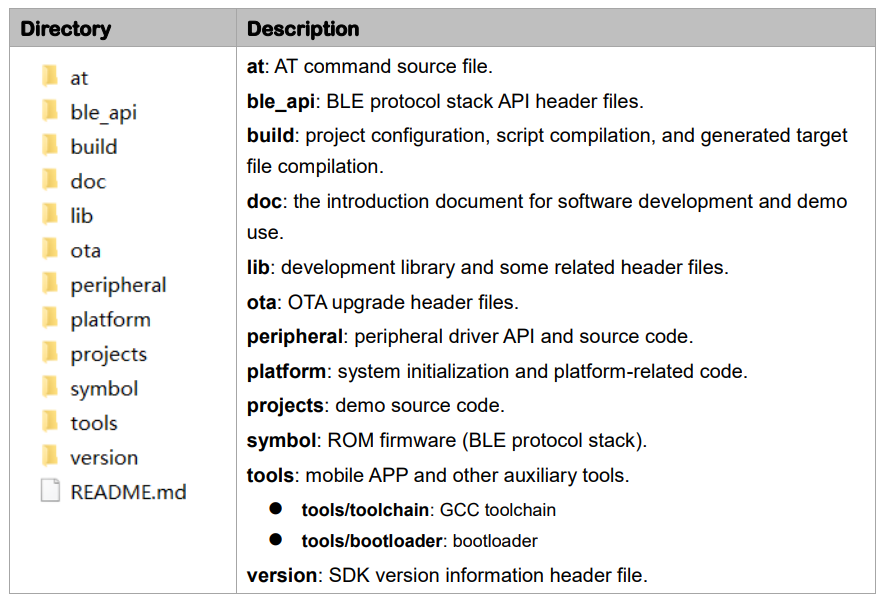
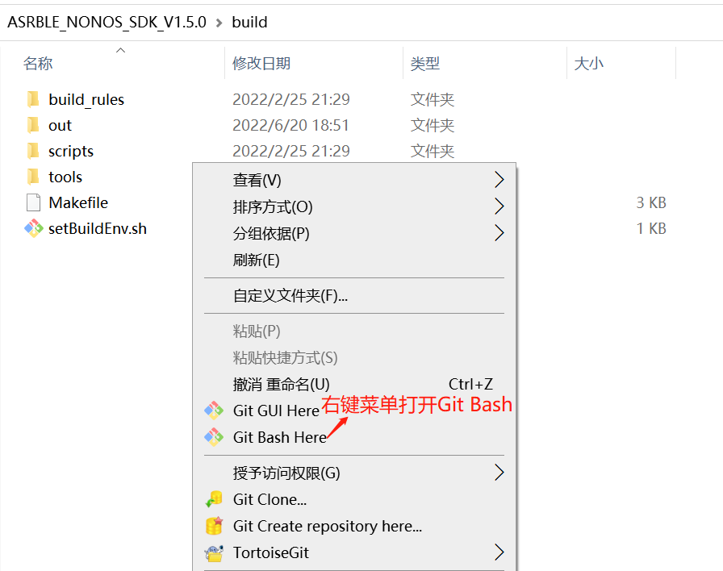
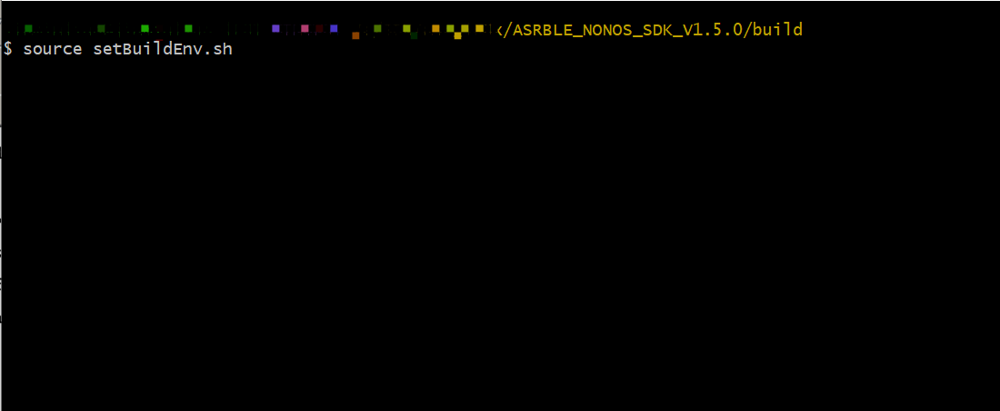
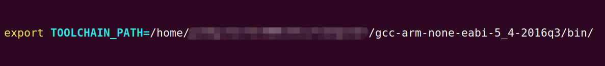
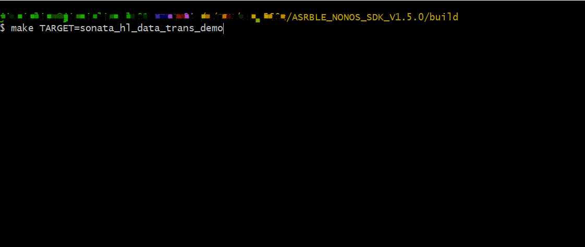
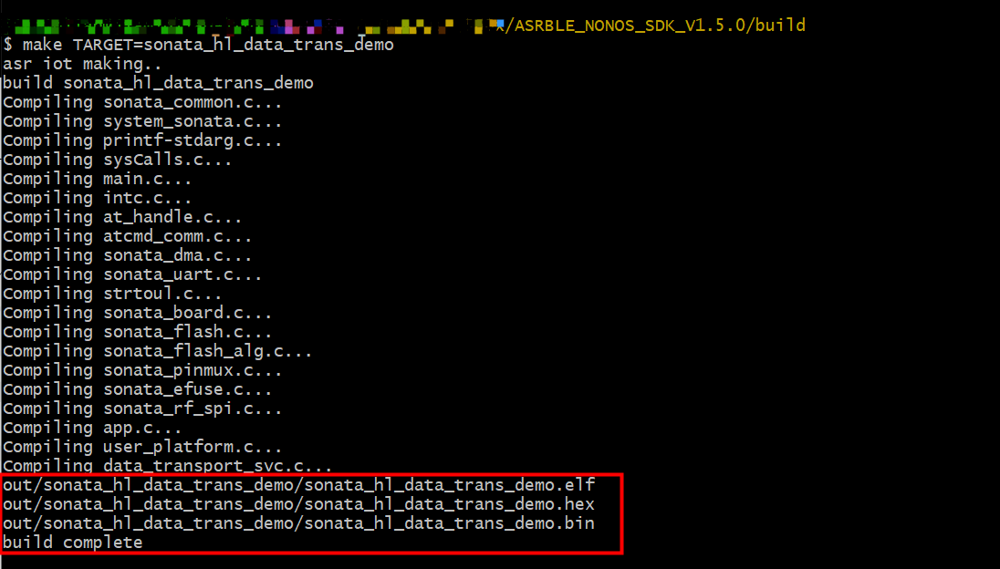
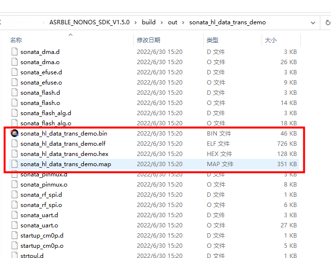
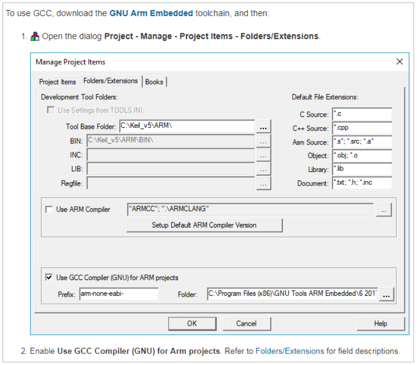
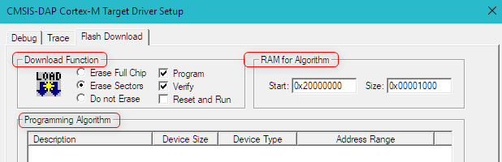
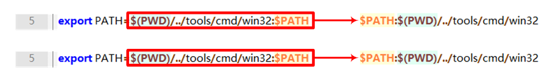

.. role:: raw-latex(raw)
   :format: latex
..

ASR560X Series Development Environment Setup Guide
======================================================
`简体中文 <https://asriot-cn.readthedocs.io/zh/latest/ASR560X/开发环境搭建与编译指南.html>`_

Introduction
------------

**About this Document**

This document introduces the process of setting up the 560X SDK development environment and building the demo projects.

**Intended Readers**

This document is mainly for engineers who use this chip to develop their own platform and products, for instance:

-  PCB Hardware Development Engineer

-  Software Engineer

-  Technical Support Engineer

**Included Chip Models**

The product models corresponding to this document are as follows.

+---------+----------------------------------------------------------------------------------------+----------+--------------+-----------------------------------------------------------------------------------+
| Model   | Protocol                                                                               | Core     | SiP Flash    | Function                                                                          |
+=========+========================================================================================+==========+==============+===================================================================================+
| ASR560X | BLE 5.1 full feature (compatible with 5.2) BLE SIG Mesh IEEE 802.15.4 2.4G Proprietary | ARM CM0+ | 1 MB/ 512 KB | AOA/AOD/Voice/IRTxRx/ Quadrature Decoder/Keypad/ 5V UART/5V GPIO/Wi-Fi concurrent |
+---------+----------------------------------------------------------------------------------------+----------+--------------+-----------------------------------------------------------------------------------+

**Copyright Notice**

© 2023 ASR Microelectronics Co., Ltd. All rights reserved. No part of this document can be reproduced, transmitted, transcribed, stored, or translated into any language in any form or by any means without the written permission of ASR Microelectronics Co., Ltd.

**Trademark Statement**

ASR and ASR Microelectronics Co., Ltd. are trademarks of ASR Microelectronics Co., Ltd. 

Other trade names, trademarks, and registered trademarks mentioned in this document are the property of their respective owners and are hereby declared.

**Disclaimer**

ASR does not give any warranty of any kind and may make improvements and/or changes in this document or in the product described in this document at any time.

This document is only used as a guide, and no contents in the document constitute any form of warranty. Information in this document is subject to change without notice.

All liability, including liability for infringement of any proprietary rights caused by using the information in this document, is disclaimed.

**ASR Microelectronics Co., Ltd.**

Address: 9F, Building 10, No. 399 Keyuan Road, Zhangjiang High-tech Park, Pudong New Area, Shanghai, 201203, China

Homepage: http://www.asrmicro.com/

**Revision History**

======= ======= ===========================================
Date    Version Release Notes
======= ======= ===========================================
2023.03 V1.2.0  Updated the Keil Project Generation Method.
======= ======= ===========================================

1. SDK Directory
----------------

The contents of the ASR560X SDK are shown below:

|image1|

The files in the **build** directory contains the tools and scripts for building the demo projects. The files in the **tools/toolchain** directory contains the GCC toolchain on the Windows platform.

For firmware download, please refer to *User Guide to ASR560X Series\_ Development Board* and *ASR560X\_ User Manual for BLE Programming Tool*.

2. Set up the Command-line Build Environment
--------------------------------------------

The ASR560X SDK demo project can be compiled with the GCC toolchain, which supports command-line building on Windows and Linux OS. On Windows OS, the demo project can be compiled with Git Bash or Cygwin environment. On Linux OS, it can be compiled by typing the compile command in the terminal console directly.

The following are the steps on how to set up a compilation environment on Windows and Linux OS.

2.1 Compilation Environment Installation
~~~~~~~~~~~~~~~~~~~~~~~~~~~~~~~~~~~~~~~~

2.1.1 Windows
^^^^^^^^^^^^^

1. Download the installation package from https://git-scm.com/download and then install the Git Bash environment as required.

2. The GCC toolchain installation package is already in the SDK **tools/toolchain** directory.

.. attention::
    On Windows OS, the GCC toolchain used can only be the version provided in the SDK tools/toolchain directory and cannot be replaced.

2.1.2 Linux
^^^^^^^^^^^

1. The GCC toolchain in the Linux environment can be downloaded by users. Users can download the GCC toolchain with Linux version from:

https://launchpad.net/gcc-arm-embedded/5.0/5-2016-q3-update/+download/gcc-arm-none-eabi-5_4-2016q3-20160926-linux.tar.bz2

.. attention::
    On Linux OS, the GCC toolchain used can only be the version provided in the link and cannot be replaced.

2. Copy the zip package to the SDK **tools/toolchain** directory.

2.2 Configure the Environment Variable
~~~~~~~~~~~~~~~~~~~~~~~~~~~~~~~~~~~~~~

2.2.1 Configure the Environment Variable on Windows OS
^^^^^^^^^^^^^^^^^^^^^^^^^^^^^^^^^^^^^^^^^^^^^^^^^^^^^^

1. Open the SDK **build** directory, right-click in the space of the directory to open the context menu and click “Git Bash Here” to create a command-line terminal:

|image2|

2. Type the command **source setBuildEnv.sh** in the Git Bash terminal, then type “**Enter**”, and the system starts to configure the environment variable:

|image3|

2.2.2 Configure the Environment Variable on Linux OS
^^^^^^^^^^^^^^^^^^^^^^^^^^^^^^^^^^^^^^^^^^^^^^^^^^^^

The SDK does not provide the environment variable configuration script on Linux OS by default. Users can manually add the TOOLCHAIN_PATH environment variable, as follows:

|image4|

2.3 Project Build
~~~~~~~~~~~~~~~~~

1. Find the scripts for demo project building (config.mk) in the SDK **build/build_rules/project** directory.

2. In the command-line console, change directory into **build**, then type the command **"make TARGET= *** "** to build the specified project, where ******* corresponds to the name of the project in the **build/build_rules/project** directory, for example: sonata_hl_data_trans_demo. If users need to build the peripheral project, please type **"make TARGET=peripheral/ *** "**.

3. Use the command **make clean** to delete the compiled project files.

.. attention::
    If the header file is adjusted, execute the command make clean to delete the project file and rebuild the project.

4. Taking sonata_hl_data_trans_demo as an example, enter the following command at the command line to compile:

**make TARGET=sonata_hl_data_trans_demo**

|image5|

5. If there is a “**build complete**” string, the project is built successfully, as follows:

|image6|

6. After the project is successfully built, the APP firmware is generated in the SDK **build/out/sonata_hl_data_trans_demo** directory:

|image7|

.. note::
    After the peripheral project is built, the final generated bin file directory will be different. For example, after the gpio project is built (TARGET=peripheral/gpio), the generated firmware is in the build/out/peripheral/gpio directory.

3. Set up the Keil Build Environment
------------------------------------

The ASR560X SDK does not provide the Keil project by default, which should be generated using the script.

3.1 Keil Project Generation
~~~~~~~~~~~~~~~~~~~~~~~~~~~

Execute the GenkeilPrj.bat script in the **project/sonata** directory to generate the corresponding Keil project in that directory.

.. attention::
    If the GenkeilPrj.bat script is unavailable in the corresponding project directory of SDK, don’t hesitate to contact ASR.

3.2 GCC Toolchain Configuration in the Keil Environment
~~~~~~~~~~~~~~~~~~~~~~~~~~~~~~~~~~~~~~~~~~~~~~~~~~~~~~~

1. Unzip the GCC zip package in the SDK **tools/toolchain** directory.

2. Refer to https://www.keil.com/support/man/docs/uv4/uv4_gnucomp.htm to configure the GCC toolchain as follows:

|image8|

3.3 Flash Programming Algorithm Configuration
~~~~~~~~~~~~~~~~~~~~~~~~~~~~~~~~~~~~~~~~~~~~~

1. Copy the SDK tools/ASR560X_2W2D.FLM to Keil’s Flash directory, e.g. C::raw-latex:`\Keil`\_v5:raw-latex:`\ARM`:raw-latex:`\Flash`.

2. Refer to https://www.keil.com/support/man/docs/uv4/uv4_fl_dlconfiguration.htm to configure the Flash programming algorithm. The main contents to be configured are as follows:

   (1) **Download Function**: Check Erase Sectors, Program and Verify.

   (2) **RAM for Algorithm**: Set Start to 0x20000000 and Size to 0x1000.

   (3) **Programming Algorithm**: Add the ASR560X Flash programming algorithm file.

|image9|

4. FAQs
-------

**Q1: How to Handle Compilation Failure Due to Undefined STACK_INIT_PATTERN?**

**A1:** The definition of “**STACK_INIT_PATTERN=0xF3F3F3,**” should be added in the CC tab Preprocessor Symbols->Define in the Keil project configuration interface.

**Q2: How to Handle Compilation Failure Due to 32-bit System or Git Bash mkdir Command Failure?**

**A2:** Modify the SDK tools/setBuildEnv.sh file as shown below, then restart the Git Bash terminal and reload the environment variable using the command **source setBuildEnv.sh**.

|image10|

