ASR560X Series BLE Low-Power Application Guide
==============================================
`简体中文 <https://asriot-cn.readthedocs.io/zh/latest/ASR560X/软件快速入门/低功耗应用指南.html>`_

Introduction
------------

**About this Document**

This document introduces the four low-power modes supported by the ASR560X Bluetooth SoC chip, which are DS1 (subdivided into DS1-A and DS1-B), DS2, DS3, and DS4 in terms of power consumption from low to high.

**Intended Readers**

This document is mainly for engineers who use this chip to develop their own platform and products, for instance:

-  PCB Hardware Development Engineer

-  Software Engineer

-  Technical Support Engineer

**Included Chip Models**

The product models corresponding to this document are as follows.

+---------+----------------------------------------------------------------------------------------+----------+--------------+-----------------------------------------------------------------------------------+
| Model   | Protocol                                                                               | Core     | SiP Flash    | Function                                                                          |
+=========+========================================================================================+==========+==============+===================================================================================+
| ASR560X | BLE 5.1 full feature (compatible with 5.2) BLE SIG Mesh IEEE 802.15.4 2.4G Proprietary | ARM CM0+ | 1 MB/ 512 KB | AOA/AOD/Voice/IRTxRx/ Quadrature Decoder/Keypad/ 5V UART/5V GPIO/Wi-Fi concurrent |
+---------+----------------------------------------------------------------------------------------+----------+--------------+-----------------------------------------------------------------------------------+

**Copyright Notice**

© 2023 ASR Microelectronics Co., Ltd. All rights reserved. No part of this document can be reproduced, transmitted, transcribed, stored, or translated into any language in any form or by any means without the written permission of ASR Microelectronics Co., Ltd.

**Trademark Statement**

ASR and ASR Microelectronics Co., Ltd. are trademarks of ASR Microelectronics Co., Ltd. 

Other trade names, trademarks, and registered trademarks mentioned in this document are the property of their respective owners and are hereby declared.

**Disclaimer**

ASR does not give any warranty of any kind and may make improvements and/or changes in this document or in the product described in this document at any time.

This document is only used as a guide, and no contents in the document constitute any form of warranty. Information in this document is subject to change without notice.

All liability, including liability for infringement of any proprietary rights caused by using the information in this document, is disclaimed.

**ASR Microelectronics Co., Ltd.**

Address: 9F, Building 10, No. 399 Keyuan Road, Zhangjiang High-tech Park, Pudong New Area, Shanghai, 201203, China

Homepage: http://www.asrmicro.com/

**Revision History**

+---------+---------+--------------------------------------------------------------------------------------------------------------+
| Date    | Version | Release Notes                                                                                                |
+=========+=========+==============================================================================================================+
| 2023.09 | V1.1.2  | Added descriptions of temperature settings in Sections `3.2 <#节32>`__, `3.3 <#节33>`__ and `3.4 <#节34>`__. |
+---------+---------+--------------------------------------------------------------------------------------------------------------+

1. Overview of Low Power
------------------------

ASR560X BLE SoC supports four low-power modes, which are DS1, DS2, DS3 and DS4 according to the power consumption from low to high.

1.1 DS1
~~~~~~~

DS1 is divided into two modes, A and B:

**DS1-A** mode has the lowest power consumption and only supports GPIO high-level and low-level wake-up. This mode cannot maintain BLE connection and is only used in single-button scenarios.

**DS1-B** mode supports 4 specific GPIOs’ wake-up, namely GPIO2, GPIO3, GPIO9 and GPIO10. It supports rising edge and falling edge wake-up. This mode cannot maintain BLE connection.

1.2 DS2
~~~~~~~

DS2 mode supports GPIO, sleep timer, and LPUART wake-up, can support 8 groups of GPIO wake-up at the same time, supports rising edge, falling edge, high-level and low-level wake-up, and each group of GPIO index can be configured arbitrarily. This mode cannot maintain BLE connection.

1.3 DS3
~~~~~~~

DS3 mode supports GPIO, sleep timer, LPUART and BLE timer wake-up, can support 8 groups of GPIO wake-up at the same time, supports rising edge, falling edge, high-level and low-level wake-up, and each group of GPIO index can be configured arbitrarily. This mode cannot maintain BLE connection but can support beacon applications.

1.4 DS4
~~~~~~~

DS4 mode supports GPIO, sleep timer, LPUART and BLE timer wake-up, can support 8 groups of GPIO wake-up at the same time, supports rising edge, falling edge, high-level and low-level wake-up, and each group of GPIO index can be configured arbitrarily. This mode can support BLE connection.

The following table shows wake-up sources in different sleep modes:

+----------------+---------------------------------------------------+---------------------------------+
| **Sleep Mode** | **Wakeup Source**                                 | **Illustration**                |
+================+===================================================+=================================+
| DS1-A          | GPIO (GPIO2-GPIO29)                               | BLE connection is not supported |
+----------------+---------------------------------------------------+---------------------------------+
| DS1-B          | Specified GPIO (GPIO2/GPIO3/GPIO9/GPIO10)         | BLE connection is not supported |
+----------------+---------------------------------------------------+---------------------------------+
| DS2            | GPIO (GPIO2-GPIO29) /sleep timer/LPUART           | BLE connection is not supported |
+----------------+---------------------------------------------------+---------------------------------+
| DS3            | GPIO (GPIO2-GPIO29) /sleep timer/LPUART/BLE timer | Support Beacon                  |
+----------------+---------------------------------------------------+---------------------------------+
| DS4            | GPIO (GPIO2-GPIO29) /sleep timer/LPUART/BLE timer | Support BLE connection          |
+----------------+---------------------------------------------------+---------------------------------+

2. Program Configuration Instructions
-------------------------------------

2.1 Sleep Mode Configure Data Structure
~~~~~~~~~~~~~~~~~~~~~~~~~~~~~~~~~~~~~~~

Sleep mode configure data structure **sonata_sleep_cfg_t** is shown below, and its members are described in detail below.

|image1|

(1) **slp_mode:** used to configure deep sleep mode (DS1-4), including MODE_DS1_A, MODE_DS1_B, MODE_DS2, MODE_DS3 and MODE_DS4.

|image2|

(2)  **pre_slp_mode**: used to record the previous sleep mode.

(3)  **low_volt**: used to specify whether the power supply is high voltage (>=3.6V) or low voltage (<3.6V).

(4)  **clk_sel**: used to select sleep clock, configurable as RCO32K or XO32K.

(5)  **pwr_supply_mode**: used to select the power supply mode, which can be configured as DC_DC or SYS_LDO mode.

(6)  **slp_duration_backoff**: used to configure sleep duration, the default value is 0. (Applied in scenarios with BLE task, wake up the SoC in advance to execute related codes for BLE TX/RX activities).

(7)  **ds1_wkup_sel**: used to configure wake-up source of DS1 (the MODE_DS1_A mode is a special mode of DS1, no configuration is required here). In MODE_DS1_B mode, the wake-up sources can only be configured as specific 4 groups of GPIO: GPIO_GROUP_0, GPIO_GROUP_1, GPIO_GROUP_2 and GPIO_GROUP_3. These 4 groups of GPIO indexes correspond to P02, P03, P09 and P10 respectively.

(8)  **ds2_wkup_sel**: used to configure wake-up sources of DS2, can be configured as SLP_TIMER, LP_UART, and 8 groups of GPIO: GPIO_GROUP_0, GPIO_GROUP_1, GPIO_GROUP_2, GPIO_GROUP_3, GPIO_GROUP_4, GPIO_GROUP_5, GPIO_GROUP_6 and GPIO_GROUP_7. Each group can independently select any GPIO (P02~P29).

(9)  **ds3_wkup_sel**: used to configure wake-up sources of DS3, can be configured as SLP_TIMER, LP_UART, BLE_TIMER and 8 groups of GPIO: GPIO_GROUP_0, GPIO_GROUP_1, GPIO_GROUP_2, GPIO_GROUP_3, GPIO_GROUP_4, GPIO_GROUP_5, GPIO_GROUP_6 and GPIO_GROUP_7. Each group can independently select any GPIO (P02~P29).

(10) **ds4_wkup_sel**: used to configure wake-up sources of DS4, can be configured as SLP_TIMER, LP_UART, BLE_TIMER and 8 groups of GPIO: GPIO_GROUP_0, GPIO_GROUP_1, GPIO_GROUP_2, GPIO_GROUP_3, GPIO_GROUP_4, GPIO_GROUP_5, GPIO_GROUP_6 and GPIO_GROUP_7. Each group can independently select any GPIO (P02~P29).

|image3|

(11) **gpio**: includes two parameters (pad_mapping and wkup_method). pad_mapping is used to configure the specific index of each group of GPIO (P02~P29); wkup_method is used to configure the wake-up mode: rising edge (RISING_WKUP), falling edge (FALLING_WKUP), high level (HIGH_LEVEL_WKUP) and low level (LOW_LEVEL_WKUP).

For example: in MODE_DS4, ds4_wkup_sel uses two sets of GPIO wake-up sources (GPIO_GROUP_0 and GPIO_GROUP_1). The first group of GPIO_GROUP_0 is configured to wake up on the rising edge of P10, and the second group of GPIO_GROUP_1 is configured to wake up on the rising edge of P12. The sample code is as follows.

.. note::
    The configuration should be one-to-one correspondence and supports up to 8 groups of GPIO synchronous wake-up.

|image4|

.. note::
    The configuration code for the wake-up source in DS1_A mode is special and is not shared with the wake-up source in other modes. See the following sample code for details. 

|image5|

(12) **lpuart_pad:** used to configure the pad (P02~P29) used for lpuart wake-up.

(13) **sleep_timer_val:** used to configure sleep timer timeout count, the unit is 1s/32768.

(14) **pull_type_p00_p15:** used to configure the initial state of P00-P15 as PULLTYPE_PULLUP, PULLTYPE_PULLDOWN or PULLTYPE_FLOAT, the default state before configuration is PULLDOWN.

(15) **pull_type_p16_p30:** used to configure the initial state of P16-P30 as PULLTYPE_PULLUP, PULLTYPE_PULLDOWN or PULLTYPE_FLOAT, the default state before configuration is PULLDOWN.

(16) **peri_clk_en:** used to enable the peripheral clocks used, among which CACHE_HCLK_EN, RFCTRL_PCLK_EN and QSPI_TOP_HCLK_EN are enabled by default and do not need to be configured again. Other peripheral clocks default to clock gating state to save power consumption. If they need to be used, enable the corresponding peri_clk.

|image6|

(17) **peri_soft_en:** used to enable the peri_soft used, among them APB_PERI_SOFT_EN, APB_PERI0_SYNC_SOFT_EN, APB_PERI1_ASYNC_SOFT_EN, APB_PERI2_ASYNC_SOFT_EN, CACHE_SOFT_EN, RFCTRL_SOFT_EN and QSPI_TOP_SOFT\_ EN are enabled by default, with no need to be configured again. Other peripherals default to soft reset to save power consumption. If they need to be used, enable the corresponding peri_soft.

|image7|

(18) \**app \_before_ds_cb callback function:*\* used to call the user program before the SoC enters deep sleep mode.

(19) **app_before_ds_set_gpio_output_cb:** used to set some gpio output states before the SoC enters sleep mode.

(20) \**app \_after_wkup_cb callback function:*\* used to call the user program after the SoC wakes up from deep sleep mode.

(21) **app after ble\_ wkup_cb callback function:** used to call the user program after the BLE protocol stack wakes up (BLE timing correction).

(22) **lpuart_init callback function:** LPUART initialization is required to configure LPUART wake-up. The sample code is as follows:

|image8|

2.2 Sleep Mode Initialization Function
~~~~~~~~~~~~~~~~~~~~~~~~~~~~~~~~~~~~~~

app_sleep_init is used to configure the deep sleep mode of the SoC. The code examples and serial port debugging results in DS1-DS4 modes are described below.

2.2.1 DS1 Mode Initialization Code Example
^^^^^^^^^^^^^^^^^^^^^^^^^^^^^^^^^^^^^^^^^^

DS1 is divided into two modes, A and B. The software uses the B mode by default. The following macros are used to control the switching of the A and B modes. Among them, 0 corresponds to MODE_DS1_B, and 1 corresponds to MODE_DS1_A.

|image9|

Turn on this macro, enter MODE_DS1_A mode. If P10 (DS1_A_P10) is used as the wake-up source, set the wake-up at high level (DS1_A_P10_HIGH_LEVEL_WKUP). The wake-up configuration code is as follows:

|image10|

Turn off this macro and enter MODE_DS1_B mode.

.. note::
    MODE_DS1_B is special, as it cannot configure any of the eight groups of GPIO, and only four specific groups can be configured, namely:
    GPIO_GROUP_0 fixed equivalent to P02
    GPIO_GROUP_1 fixed equivalent to P03
    GPIO_GROUP_2 fixed equivalent to P09  
    GPIO_GROUP_3 fixed equivalent to P10 

If GPIO_GROUP_3 (ie P10) is used as the wake-up source, configure the wake-up on the rising edge (RISING_WKUP). The wake-up configuration code is as follows:

|image11|

2.2.2 DS3 Mode Initialization Code Example
^^^^^^^^^^^^^^^^^^^^^^^^^^^^^^^^^^^^^^^^^^

In DS3 mode, the configuration code for using SLP_TIMER as the wake-up source is as follows:

|image12|

2.2.3 DS4 Mode Initialization Code Example
^^^^^^^^^^^^^^^^^^^^^^^^^^^^^^^^^^^^^^^^^^

In DS4 mode, the configuration code for using multiple groups of GPIO as the wake-up source at the same time is as follows:

|image13|

2.2.4 DS2 Mode Initialization Code Example
^^^^^^^^^^^^^^^^^^^^^^^^^^^^^^^^^^^^^^^^^^

In DS2 mode, use LP_UART as the wake-up source.

.. note:: 
    If LP_UART is configured as the wake-up source, you only need to configure the specific pad port as the wake-up serial port, and you do not need to configure the wake-up trigger mode of the pad. And the pad used should be configured as PULLTYPE_PULLUP. For example, the configuration code for using P20 as the LPUART RX wake-up serial port is as follows:

|image14|

2.2.5 Sleep Mode Wake Up Log Print
^^^^^^^^^^^^^^^^^^^^^^^^^^^^^^^^^^

The wake up status in each sleep mode can be determined by checking the serial log, for example, as shown in the following figure:

|image15|

2.3 Sleep Mode Callback Function
~~~~~~~~~~~~~~~~~~~~~~~~~~~~~~~~

The registered callback functions are used to process user programs at different stages of low power consumption, and should be called according to actual needs, as briefly described below.

1. **app_before_ds_cb callback function:** used to call the user program before SoC enters the sleep mode, which can be used to disable related peripherals and interrupts. The sample code is as follows:

|image16|

2. **app_after_wkup_cb callback function:** used to call the user program after SoC wakeup. it can be used to re-initialize related peripherals and adjust the CPU frequency after wakeup. The sample code is as follows:

|image17|

3. Sleep Mode Power Measurement
-------------------------------

3.1 Circuit Connection Diagram
~~~~~~~~~~~~~~~~~~~~~~~~~~~~~~

The following figure shows the ASR5601X QFN48 development board. Connect a current meter in series at the red box in the figure to measure the current data:

|image18|

The following figure is the connection diagram of the ASR5601X QFN32 development board when measuring current:

|image19|

3.2 Sleep Mode Power Consumption
~~~~~~~~~~~~~~~~~~~~~~~~~~~~~~~~

The following table shows the power consumption data of ASR560X QFN48 SoC in DS1-DS4 at 3.3 V supply voltage at 25°C:

|image20|

3.3 DS3-mini-beacon Power Consumption
~~~~~~~~~~~~~~~~~~~~~~~~~~~~~~~~~~~~~

The following figure is the power consumption measurement waveform of DS 3_mini_beacon. It can be seen from the figure that the sleep current is about 3 uA, and the average power consumption is about 10 uA (the advertising is not connectable).

Test conditions: 3.3 V power, 25°C temp\ *,* adv_nonconn_ind, 2s interval, 24-Byte advdata, 3 dBm TX pwr.

|image21|

3.4 DS4 with BLE Activity Power Consumption
~~~~~~~~~~~~~~~~~~~~~~~~~~~~~~~~~~~~~~~~~~~

The following figure is the power consumption measurement waveform in DS4 mode: the average power consumption is about 29 uA (the advertising is connectable).

Test conditions: 3.3 V power, 25°C temp, adv_conn_ind, 2s interval, 31-Byte advdata, 0 dBm TX pwr.

|image22|

4. Notes
--------

1. When users develop low-power applications, **avoid** using log print to reduce active time and power consumption.

2. Confirm the expected high-level and low-level states of all pads, and configure pull-up, pull-down or floating correctly to avoid pad leakage.

3. When measuring the current, it is necessary to remove the peripheral electronic equipment such as J-Link, uart, etc., so as not to interfere with the current.

4. The average power consumption is affected by parameters such as interval, TX power, and the length of data to be sent and received. When measuring power consumption, each parameter value should be set in advance.

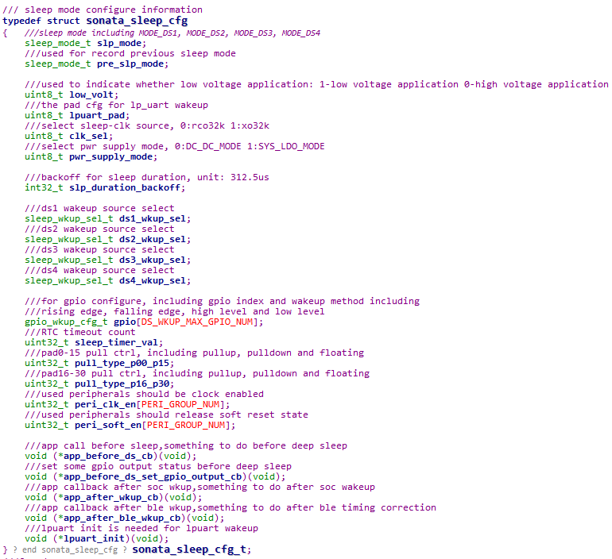
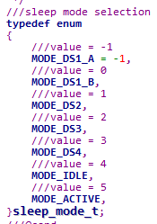
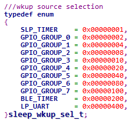
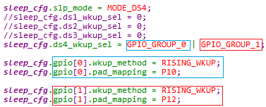
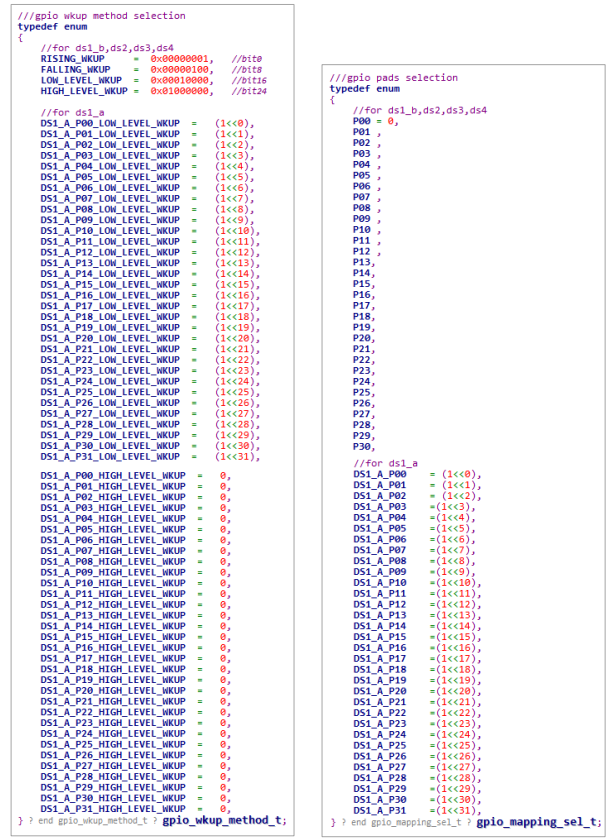
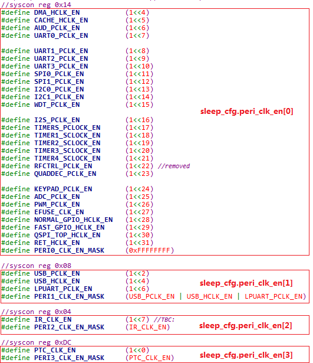
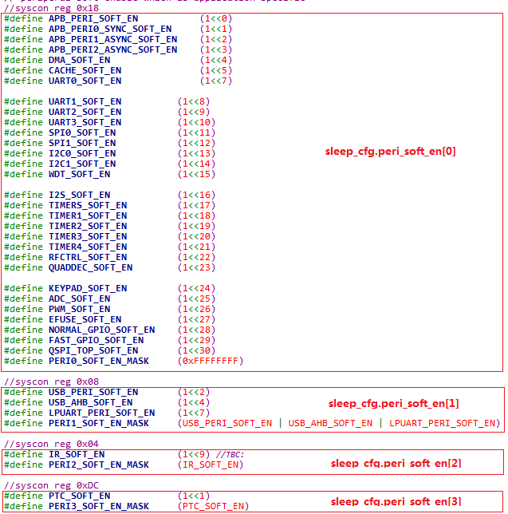
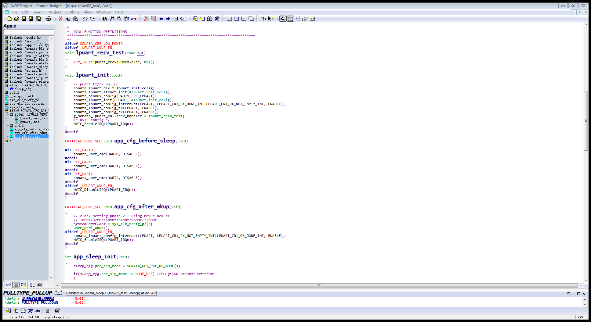
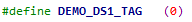
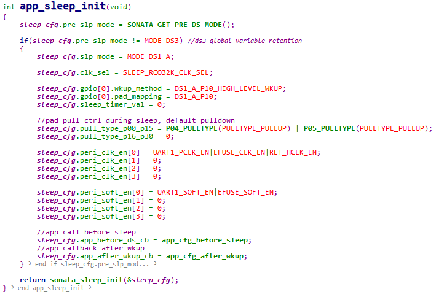
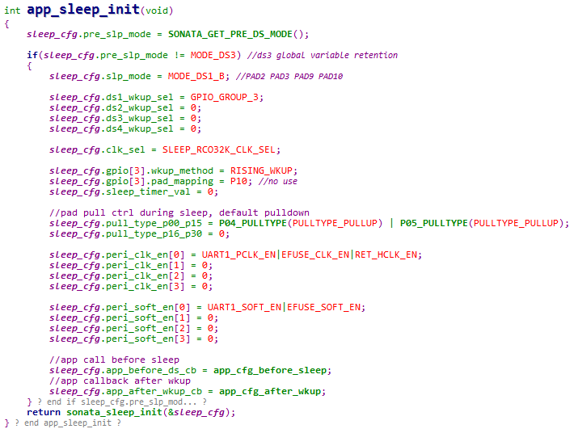
.. |image12| image:: ../../img/560X_Power/图2-12.png
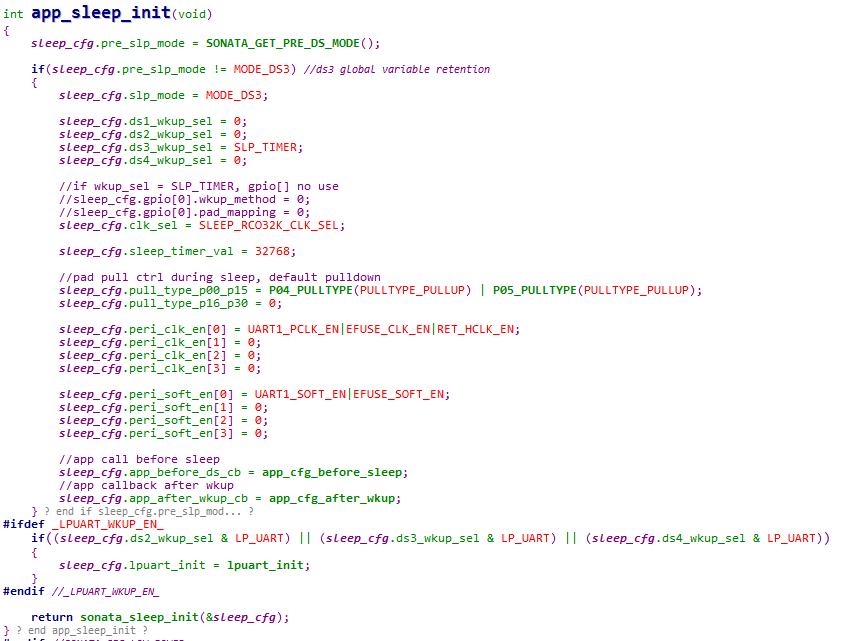
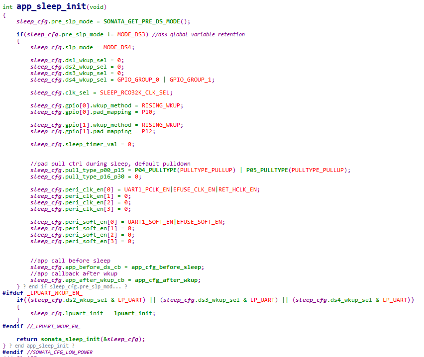
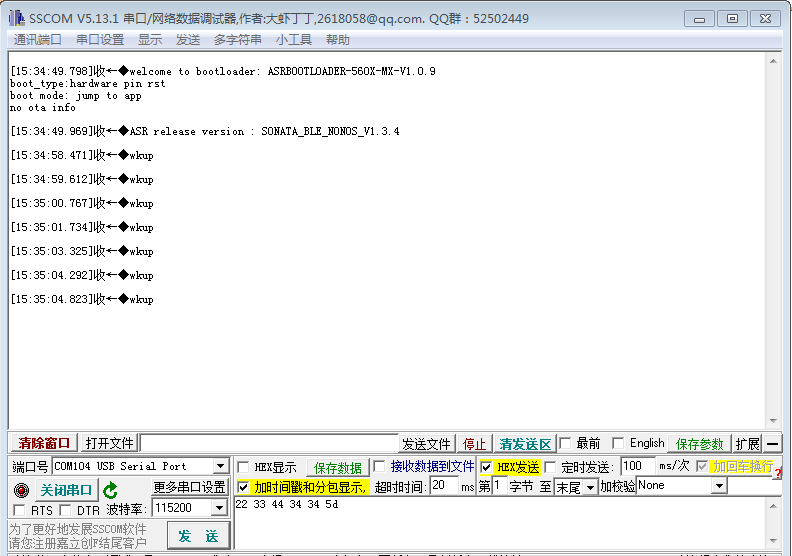
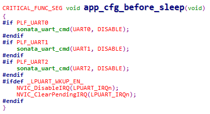
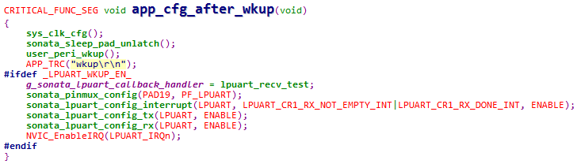
.. |image18| image:: ../../img/560X_Power/图3-1.png
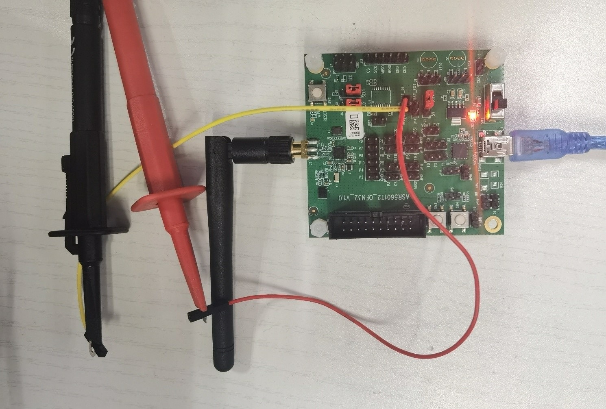
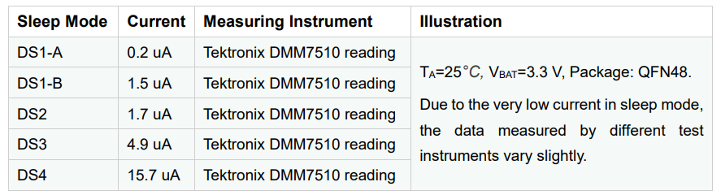
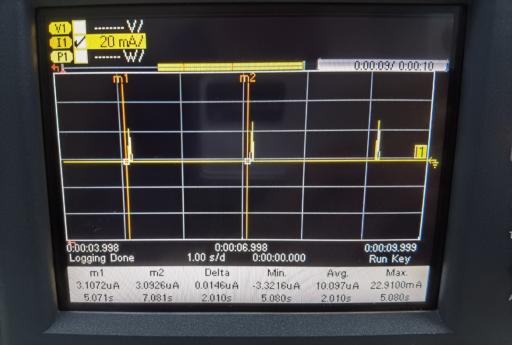
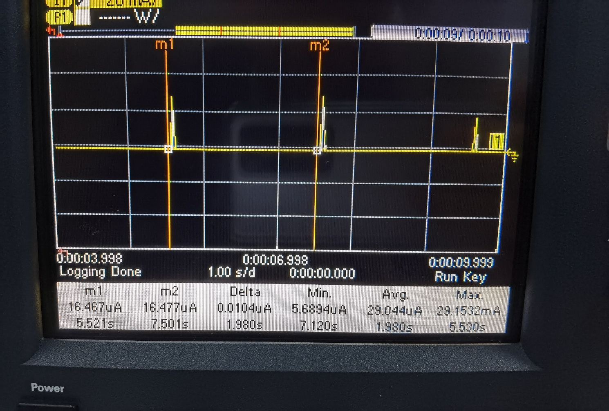
