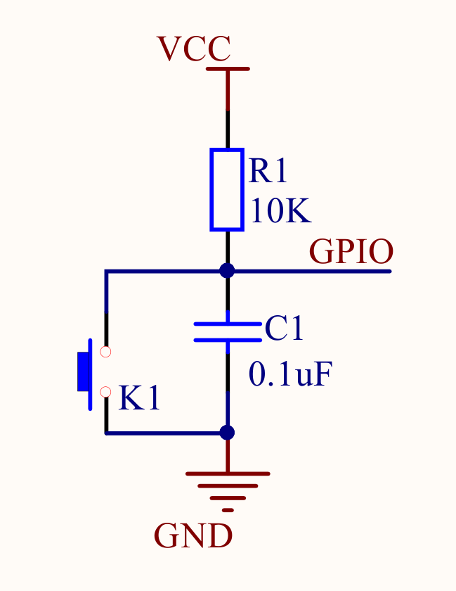
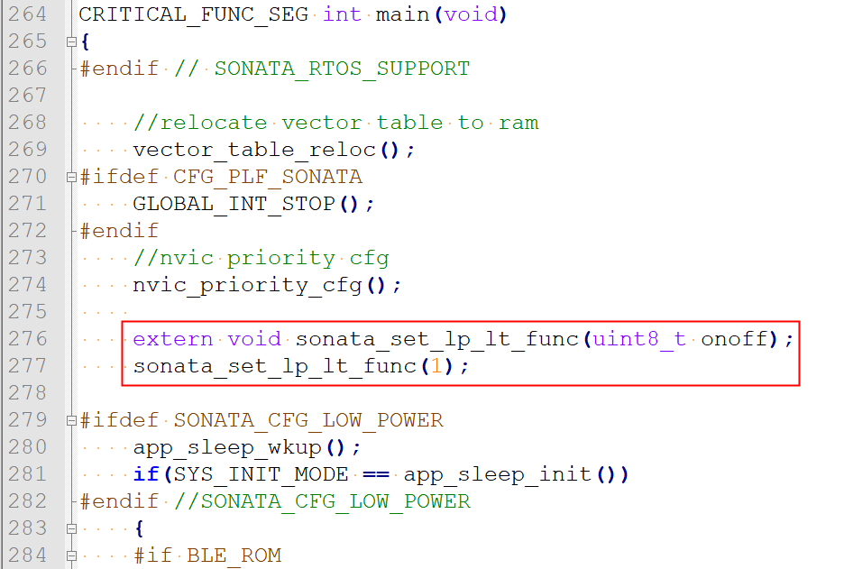

**ASR560X Series Low-temperature Application Note**
===================================================
`简体中文 <https://asriot-cn.readthedocs.io/zh/latest/ASR560X/软件快速入门/560X_低温应用指南.html>`_

Introduction
------------

**About This Document**

This document is a guide for ASR560X application in the low-temperature (below -15°C) scenario.

**Intended Readers**

This document is mainly for engineers who use this chip to develop their own platform and products, for instance:

-  PCB Hardware Development Engineer
-  Software Engineer
-  Technical Support Engineer

**Included Chip Models**

The product models corresponding to this document are as follows.

+---------+-------------------------------------------------------------------------------------------+----------+--------------+------------------------------------------------------------------------------------+
| Model   | Protocol                                                                                  | Core     | SiP Flash    | Function                                                                           |
+=========+===========================================================================================+==========+==============+====================================================================================+
| ASR560X | BLE 5.1 full feature (compatible with 5.2) SIG MESH V1.0.x IEEE 802.15.4 2.4G Proprietary | ARM CM0+ | 1 MB/ 512 KB | AOA/AOD/Voice/IRTxRx/ Quadrature Decoder/Keypad/ 5V UART/5V GPIO/ Wi-Fi concurrent |
+---------+-------------------------------------------------------------------------------------------+----------+--------------+------------------------------------------------------------------------------------+

**Copyright Notice**

© 2023 ASR Microelectronics Co., Ltd. All rights reserved. No part of this document can be reproduced, transmitted, transcribed, stored, or translated into any languages in any form or by any means without the written permission of ASR Microelectronics Co., Ltd.

**Trademark Statement**

ASR and ASR Microelectronics Co., Ltd. are trademarks of ASR Microelectronics Co., Ltd. 

Other trade names, trademarks and registered trademarks mentioned in this document are property of their respective owners.

**Electrostatic Discharge (ESD) Warning**

This product can be damaged by Electrostatic Discharge (ESD). When handling with this device, the people should be very careful to conduct the ESD protection to avoid any device damage caused by ESD event.

**Disclaimer**

ASR do not give any warranty of any kind and may make improvements and/or changes in this document or in the product described in this document at any time.

This document is only used as a guide, and no contents in the document constitute any form of warranty. Information in this document is subject to change without notice.

All liability, including liability for infringement of any proprietary rights caused by using the information in this document is disclaimed.

**ASR Microelectronics Co., Ltd.**

Address: 9F, Building 10, No. 399 Keyuan Road, Zhangjiang High-tech Park, Pudong New Area, Shanghai, 201203, China

Homepage: http://www.asrmicro.com/

**Revision History**

======= ======= ==============
Date    Version Release Notes
======= ======= ==============
2022.11 V1.0.0  First release.
======= ======= ==============

1. Hardware Considerations
--------------------------

-  Crystal:

   1. The chip’s external XO16M crystal should operate normally under -40℃~85℃. It should be a 16 MHz, 10 ppm, and 9 pF crystal. The HOSONIC E3SB26E007900E model is recommended.

   2. The chip should adopt external XO32K crystal, which works within the temperature range of -40℃~85℃. The HOSONIC ETST00327000KE model is recommended.

-  Power supply battery: The battery used for power should meet the temperature range of

   -40℃-85℃ for operation.

-  IO: If there is jitter in the IO, resulting in the unstable level input to the IC, additional jitter elimination circuit is required by adding the pull-up resistor and the filter capacitor connected to ground on IO pins. A 10 K pull-up resistor and a 0.1 uF filter capacitor are recommended. Refer to the following figure:

|image1| 

2. Software Considerations
--------------------------

When the hardware supports the normal operation of ASR560X in the low temperature scenario, additional software configuration is required. Please refer to the following instructions for details.

.. attention::
    If the end-product is not used in the low-temperature scenario or low-power is not required in the low-temperature scenario, the following software setting for low-temperature function is not needed.

2.1 API Description
~~~~~~~~~~~~~~~~~~~

The API to be used in the low-temperature scenario:

-  **void sonata_set_lp_lt_func(uint8_t onoff);**

+----------+-----------------------------------------------------------------------------------------------------------+
| Function | Turn on/off the low temperature function.                                                                 |
+==========+===========================================================================================================+
| Param    | 0: Turn off the low-temperature function; 1: Turn on the low-temperature function.                        |
+----------+-----------------------------------------------------------------------------------------------------------+
| Return   | None                                                                                                      |
+----------+-----------------------------------------------------------------------------------------------------------+
| Note     | This function is not declared in the header file and should be called externally using the extern method. |
+----------+-----------------------------------------------------------------------------------------------------------+

The void sonata_set_lp_lt_func(uint8_t onoff) API must be placed after the nvic_priority_cfg function in platform/sonata/main/main.c, as shown below:

|image2|

2.2 Low Temperature Mode Notice
~~~~~~~~~~~~~~~~~~~~~~~~~~~~~~~

If the end-product is used in the low-temperature scenario or needs to operate in the low-power mode in the low-temperature scenario, the DS4 low-power mode must be used and the low-temperature function should be turned on using the above configured API.

.. note:: 
    When the device is in low-temperature mode, the current consumption in DS4 mode is around 150 uA.

