.. role:: raw-latex(raw)
   :format: latex
..

ASR560X Series Memory Layout Configuration Application Manual
=============================================================
`简体中文 <https://asriot-cn.readthedocs.io/zh/latest/ASR560X/软件快速入门/内存布局配置.html>`_

Introduction
------------

**About this Document**

This document mainly introduces how to adjust the ASR560X’s RAM consumption of the BLE stack according to the actual application requirements, so as to maximize the utilization of the chip BLE and RAM resources.

**Intended Readers**

This document is mainly for engineers who use this chip to develop their own platform and products, for instance:

-  PCB Hardware Development Engineer

-  Software Engineer

-  Technical Support Engineer

**Included Chip Models**

The product models corresponding to this document are as follows.

+---------+----------------------------------------------------------------------------------------+----------+--------------+-----------------------------------------------------------------------------------+
| Model   | Protocol                                                                               | Core     | SiP Flash    | Function                                                                          |
+=========+========================================================================================+==========+==============+===================================================================================+
| ASR560X | BLE 5.1 full feature (compatible with 5.2) BLE SIG Mesh IEEE 802.15.4 2.4G Proprietary | ARM CM0+ | 1 MB/ 512 KB | AOA/AOD/Voice/IRTxRx/ Quadrature Decoder/Keypad/ 5V UART/5V GPIO/Wi-Fi concurrent |
+---------+----------------------------------------------------------------------------------------+----------+--------------+-----------------------------------------------------------------------------------+

**Copyright Notice**

© 2023 ASR Microelectronics Co., Ltd. All rights reserved. No part of this document can be reproduced, transmitted, transcribed, stored, or translated into any language in any form or by any means without the written permission of ASR Microelectronics Co., Ltd.

**Trademark Statement**

ASR and ASR Microelectronics Co., Ltd. are trademarks of ASR Microelectronics Co., Ltd. 

Other trade names, trademarks, and registered trademarks mentioned in this document are the property of their respective owners and are hereby declared.

**Disclaimer**

ASR does not give any warranty of any kind and may make improvements and/or changes in this document or in the product described in this document at any time.

This document is only used as a guide, and no contents in the document constitute any form of warranty. Information in this document is subject to change without notice.

All liability, including liability for infringement of any proprietary rights caused by using the information in this document, is disclaimed.

**ASR Microelectronics Co., Ltd.**

Address: 9F, Building 10, No. 399 Keyuan Road, Zhangjiang High-tech Park, Pudong New Area, Shanghai, 201203, China

Homepage: http://www.asrmicro.com/

**Revision History**

======= ======= ============================
Date    Version Release Notes
======= ======= ============================
2023.06 V1.3.0  Updated based on SDK V1.8.0.
======= ======= ============================

1. Overview
-----------

The ASR560X has 96 KB system RAM. The RAM of the BLE stack depends on the number of BLE Activities (ACTs) and profiles. The more RAM consumed by the BLE stack, the less RAM is available to the user APP accordingly.

This document introduces how to adjust the RAM consumption of BLE stack according to the actual application requirements to maximize the utilization of chip BLE and RAM resources.

2. Resource Allocation
----------------------

The SDK provides **a basic RAM configuration scheme, a multi-connection dynamic RAM configuration scheme,** and **a BLE peripheral device (large RAM space) configuration scheme**.

The user needs to choose the appropriate RAM configuration scheme based on the application requirements (the maximum concurrent connections and profiles supported, and application RAM consumption).

Regarding **the number of BLE ACTs, please note that:**

1. Connectable advertising will use 2 ACTs in the non-connected state and 1 ACT after successful connection;

2. Entering the scanning state, the system is configured to always accept SCAN, so 1 ACT is reserved until the system reboots.

The above configuration schemes are described below.

2.1 Basic Configuration Schemes
~~~~~~~~~~~~~~~~~~~~~~~~~~~~~~~

There are four basic configuration schemes: M, M_CUTDOWN, L2, and L.

Different demos adopt different RAM configuration schemes. For details, please refer to the *ASR560X_SDK Firmware Type and Download Introduction*. Different configuration schemes correspond to different resources. Please refer to the following table.

.. attention::
    The configuration varies according to the SDK version.

.. raw:: html

   

Table 2‑1 Resources before SDK 1.6.0

.. raw:: html

   

|image1|

.. raw:: html

   

Table 2‑2 Resources for SDK 1.6.0 to 1.7.1

.. raw:: html

   

|image2|

.. raw:: html

   

Table 2‑3 Resources after SDK 1.8.0

.. raw:: html

   

|image3|

.. raw:: html

   

Table 2‑4 ROM Configuration Information

.. raw:: html

   

+-----------------------+-----------------------------+-------------------------------------+--------------------------------+
| **RAM Configuration** | **Macro Definition**        | **Symbol Configuration**            | **BLE Stack Firmware**         |
+=======================+=============================+=====================================+================================+
| M                     | CFG_BLE_HL_LL_ROM_M         | sonata_hl_ll_rom_m_symbol.txt       | sonata_hl_ll_rom.bin           |
+-----------------------+-----------------------------+-------------------------------------+--------------------------------+
| M_CUTDOWN             | CFG_BLE_HL_LL_ROM_M_CUTDOWN | sonata_hl_ll_rom_cutdown_symbol.txt | sonata_hl_ll_rom_m_cutdown.bin |
+-----------------------+-----------------------------+-------------------------------------+--------------------------------+
| L2                    | CFG_BLE_HL_LL_ROM_L2        | sonata_hl_ll_rom_l2_symbol.txt      | sonata_hl_ll_rom_l2.bin        |
+-----------------------+-----------------------------+-------------------------------------+--------------------------------+
| L                     | CFG_BLE_HL_LL_ROM_L         | sonata_hl_ll_rom_l_symbol.txt       | sonata_hl_ll_rom_l.bin         |
+-----------------------+-----------------------------+-------------------------------------+--------------------------------+

.. raw:: html

   

Table 2‑5 Library Configuration Information

.. raw:: html

   

===================== ===============================
**RAM Configuration** **Core Lib**
===================== ===============================
M                     lib_sonata_ble_core.a
M_CUTDOWN             lib_sonata_ble_core_m_cutdown.a
L2                    lib_sonata_ble_core_l2.a
L                     lib_sonata_ble_core_l.a
===================== ===============================

.. raw:: html

   

Table 2‑6 Memory Configuration Information before SDK 1.6.0

.. raw:: html

   

+-----------------------+---------------+------------------------------+----------------+
| **RAM Configuration** | **_estack** | **RAM Layout Configuration** | **RAM Length** |
+=======================+===============+==============================+================+
| M                     | 0x20005000    | RAM_104K_EM_24K              | 18 KB          |
+-----------------------+---------------+------------------------------+----------------+
| M_CUTDOWN             | 0x20008000    | RAM_104K_EM_24K              | 30 KB          |
+-----------------------+---------------+------------------------------+----------------+
| L2                    | 0x20008C00    | RAM_112K_EM_16K              | 33 KB          |
+-----------------------+---------------+------------------------------+----------------+
| L                     | 0x2000A000    | RAM_112K_EM_16K              | 38 KB          |
+-----------------------+---------------+------------------------------+----------------+

.. raw:: html

   

Table 2‑7 Memory Configuration Information for SDK 1.6.0 to 1.7.1

.. raw:: html

   

+-----------------------+---------------+------------------------------+----------------+
| **RAM Configuration** | **_estack** | **RAM Layout Configuration** | **RAM Length** |
+=======================+===============+==============================+================+
| M                     | 0x20006000    | RAM_104K_EM_24K              | 22 KB          |
+-----------------------+---------------+------------------------------+----------------+
| M_CUTDOWN             | 0x20008400    | RAM_104K_EM_24K              | 31 KB          |
+-----------------------+---------------+------------------------------+----------------+
| L2                    | 0x20009000    | RAM_112K_EM_16K              | 34 KB          |
+-----------------------+---------------+------------------------------+----------------+
| L                     | 0x2000A400    | RAM_112K_EM_16K              | 39 KB          |
+-----------------------+---------------+------------------------------+----------------+

.. raw:: html

   

Table 2‑8 Memory Configuration Information after SDK 1.8.0

.. raw:: html

   

+-----------------------+---------------+------------------------------+----------------+
| **RAM Configuration** | **_estack** | **RAM Layout Configuration** | **RAM Length** |
+=======================+===============+==============================+================+
| M                     | 0x20006000    | RAM_104K_EM_24K              | 22 KB          |
+-----------------------+---------------+------------------------------+----------------+
| M_CUTDOWN             | 0x20008400    | RAM_104K_EM_24K              | 31 KB          |
+-----------------------+---------------+------------------------------+----------------+
| L2                    | 0x20009000    | RAM_112K_EM_16K              | 34 KB          |
+-----------------------+---------------+------------------------------+----------------+
| L                     | 0x2000A000    | RAM_112K_EM_16K              | 38 KB          |
+-----------------------+---------------+------------------------------+----------------+

2.2 Multi-Connection Dynamic RAM Configuration
~~~~~~~~~~~~~~~~~~~~~~~~~~~~~~~~~~~~~~~~~~~~~~

The SDK provides a multi-connection dynamic RAM configuration scheme: sonata_dyna_hl_ll_rom, which is used by the sonata_dyna_hl_ll_app_rel demo only by default. This demo will be used as an example for illustration as below:

.. attention::
    sonata_dyna_hl_ll_app_rel demo already has the basic multi-connection function, which takes up some RAM space.

Users can adjust the concurrent connections supported by the BLE stack in the sonata_stack_user_config.h file, mainly by adjusting the SONATA_CFG_ACT and SONATA_CFG_CON macro, ensuring that SONATA\_ CFG_ACT>=(SONATA_CFG_CON+1).

The default value of SONATA_GAP_MAX_LE_MTU is 2048, if the Pin/OOB pairing function is not used in the project, the value of SONATA_GAP_MAX_LE_MTU macro can be adjusted smaller (not recommended to be lower than 512) to release more available RAM to the application layer. The configuration location can be found in the following figure:

|image4|

.. raw:: html

   

Table 2‑9 Multi-connection Dynamic RAM Configuration Resource

.. raw:: html

   

|image5|

.. raw:: html

   

Table 2‑10 Multi-connection Dynamic RAM ROM and Library Configuration Information

.. raw:: html

   

+----------------------+----------------------------------+---------------------------+------------------------------+
| **Macro Definition** | **Symbol Configuration**         | **BLE Stack Firmware**    | **Core Lib**                 |
+======================+==================================+===========================+==============================+
| **APP_COMPILE**      | sonata_dyna_hl_ll_rom_symbol.txt | sonata_dyna_hl_ll_rom.bin | lib_sonata_dyna_hl_ll_core.a |
+----------------------+----------------------------------+---------------------------+------------------------------+

.. raw:: html

   

Table 2‑11 Multi-connection Dynamic RAM Memory Configuration Information

.. raw:: html

   

+--------------------+--------------------+---------------+------------------------------+----------------+
| **SONATA_CFG_ACT** | **SONATA_CFG_CON** | **_estack** | **RAM Layout Configuration** | **RAM Length** |
+====================+====================+===============+==============================+================+
| 2                  | 1                  | 0x2001C000    | RAM_112K_EM_16K              | 67 KB          |
+--------------------+--------------------+---------------+------------------------------+----------------+
| 3                  | 2                  | 0x2001C000    | RAM_112K_EM_16K              | 67 KB          |
+--------------------+--------------------+---------------+------------------------------+----------------+
| 4                  | 3                  | 0x2001C000    | RAM_112K_EM_16K              | 67 KB          |
+--------------------+--------------------+---------------+------------------------------+----------------+
| 5                  | 4                  | 0x2001C000    | RAM_112K_EM_16K              | 67 KB          |
+--------------------+--------------------+---------------+------------------------------+----------------+
| 6                  | 5                  | 0x2001A000    | RAM_104K_EM_24K              | 59 KB          |
+--------------------+--------------------+---------------+------------------------------+----------------+
| 7                  | 6                  | 0x2001A000    | RAM_104K_EM_24K              | 59 KB          |
+--------------------+--------------------+---------------+------------------------------+----------------+
| 8                  | 7                  | 0x2001A000    | RAM_104K_EM_24K              | 59 KB          |
+--------------------+--------------------+---------------+------------------------------+----------------+
| 9                  | 8                  | 0x2001A000    | RAM_104K_EM_24K              | 59 KB          |
+--------------------+--------------------+---------------+------------------------------+----------------+
| 10                 | 9                  | 0x2001A000    | RAM_104K_EM_24K              | 59 KB          |
+--------------------+--------------------+---------------+------------------------------+----------------+

2.3 BLE Peripherals (Large RAM Space) Configuration
~~~~~~~~~~~~~~~~~~~~~~~~~~~~~~~~~~~~~~~~~~~~~~~~~~~

The SDK provides a configuration scheme for BLE peripheral devices (large RAM space): sonata_dyna_hl_ll_peripheral_only_rom. **It can provide large RAM space for the APP to use with the following limitations: The device can only be used as a BLE peripheral device, which supports advertising and being scanned and connected. It does not support Central-related functions, i.e., active scanning or connection.**

This configuration scheme is only used for the sonata_dyna_hl_ll_peripheral_only_app_rel demo by default in the SDK. This demo is used as an example below.

.. attention::
    sonata_dyna_hl_ll_peripheral_only_app_rel demo already has the basic multi-connection function, which takes up some RAM space.

The default value of SONATA_GAP_MAX_LE_MTU is 2048. If the Pin/OOB pairing function is not used in the project, the value of SONATA_GAP_MAX_LE_MTU macro can be adjusted smaller (not recommended to be lower than 512) to release updated available RAM to the application layer.

.. raw:: html

   

Table 2‑12 BLE Peripheral Device (Large RAM Space) Configuration Source

.. raw:: html

   

|image6|

.. raw:: html

   

Table 2‑13 BLE Peripheral Device (Large RAM Space) Configuration Information

.. raw:: html

   

+----------------------------------------------------+--------------------------------------------------+-------------------------------------------+----------------------------------------------+
| **Macro Definition**                               | **Symbol Configuration**                         | **BLE Stack Firmware**                    | **Core Lib**                                 |
+====================================================+==================================================+===========================================+==============================================+
| APP_COMPILE 、 CFG_DYNA_HL_LL_PERIPHERAL_ONLY | sonata_dyna_hl_ll_peripheral_only_rom_symbol.txt | sonata_dyna_hl_ll_peripheral_only_rom.bin | lib_sonata_dyna_hl_ll_peripheral_only_core.a |
+----------------------------------------------------+--------------------------------------------------+-------------------------------------------+----------------------------------------------+

.. raw:: html

   

Table 2‑14 BLE Peripheral (Large RAM Space) Memory Configuration Information

.. raw:: html

   

+--------------------+--------------------+---------------+------------------------------+----------------+
| **SONATA_CFG_ACT** | **SONATA_CFG_CON** | **_estack** | **RAM Layout Configuration** | **RAM Length** |
+====================+====================+===============+==============================+================+
| 2                  | 1                  | 0x2001E000    | RAM_120K_EM_8K               | 93 KB          |
+--------------------+--------------------+---------------+------------------------------+----------------+

3. Switch RAM Configuration Scheme
----------------------------------

The RAM configuration scheme switching involves the following files in the project:

-  gcc.ld: Located in the project cfg directory. For example: projects:raw-latex:`\sonata`:raw-latex:`\sonata`\_hl_peripheral_rel:raw-latex:`\cfg`:raw-latex:`\gcc`.ld
-  config.mk: Located in the project compilation scripts directory. For example: build:raw-latex:`\build`\_rules:raw-latex:`\project`:raw-latex:`\sonata`\_hl_peripheral_demo:raw-latex:`\config`.mk
-  startup_cm0p.S: Located in the project src directory. For example: projects:raw-latex:`\sonata`:raw-latex:`\sonata`\_hl_peripheral_rel:raw-latex:`\src`:raw-latex:`\startup`\_cm0p.S

The sonata_hl_peripheral_demo is used as an example to show how to switch the RAM configuration scheme from M to L as follows.

3.1 Modify Core Lib
~~~~~~~~~~~~~~~~~~~

Referring to Table 2-5, replace lib_sonata_ble_core.a in the config.mk $(NAME)_PRE_LIB entry with lib_sonata_ble_core_l.a, as shown below:

|image7|

3.2 Modify Micro Definition
~~~~~~~~~~~~~~~~~~~~~~~~~~~

Referring to Table 2-4 change -DCFG_BLE_HL_LL_ROM_M to -DCFG_BLE_HL_LL_ROM_L in config.mk $(NAME)_CFLAGS entry, as shown below:

.. attention::
    If -DCFG_BLE_HL_LL_ROM_M does not exist, -DCFG_BLE_HL_LL_ROM_L should be added.

|image8|

3.3 Modify Symbol Table
~~~~~~~~~~~~~~~~~~~~~~~

Referring to Table 2-4, change sonata_hl_ll_rom_symbol.txt to sonata_hl_ll_rom_l_symbol.txt in config.mk LINKER_MISC_ROM_ELF_PATH entry, as shown below:

|image9|

3.4 Modify Startup Code
~~~~~~~~~~~~~~~~~~~~~~~

Refer to Table 2-6/2-7/2-8, modify movs r1, #RAM_104K_EM_24K to movs r1, #RAM_112K_EM_16K in startup_cm0p.S:

|image10|

3.5 Modify \_estack and RAM Size
~~~~~~~~~~~~~~~~~~~~~~~~~~~~~~~~

Refer to Table 2-6/2-7/2-8 (Note that different SDK may vary), modify \_estack and RAM length, as shown below:

|image11|

3.6 Download the Corresponding BLE Stack Firmware
~~~~~~~~~~~~~~~~~~~~~~~~~~~~~~~~~~~~~~~~~~~~~~~~~

Refer to Table 2-4, select the corresponding BLE stack firmware for downloading.

4. Switch RAM Configuration by Tools
------------------------------------

Starting with SDK V1.6.3, the SDK tools directory provides the ChangeRom tool for switching RAM configuration schemes, as shown below:

|image12|

Users can select the RAM configuration project file to be adjusted and the ROM to be switched in the tool, and then click and modify it.

.. attention::
    The general ROM tab in tools is used for switching the basic RAM configuration scheme. The dynamic ROM tab in tools is used for switching the multi-connection dynamic RAM configuration scheme. When the modification has been completed, users need to check whether the values of gcc.ld, config.mk, and startup_cm0p.S have been modified. correctly.

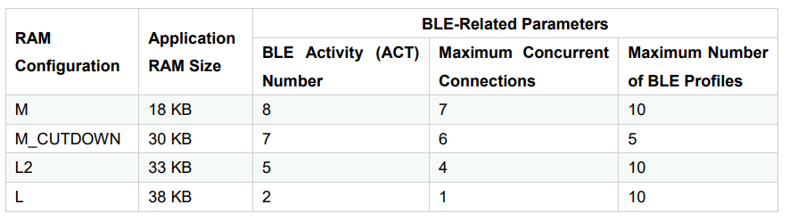
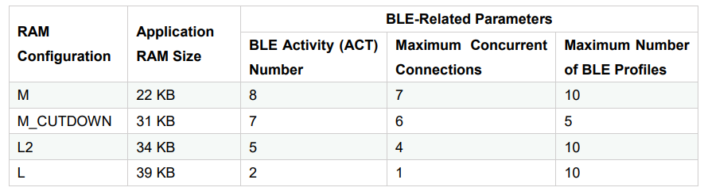
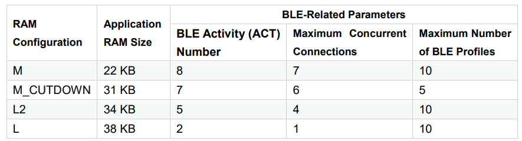
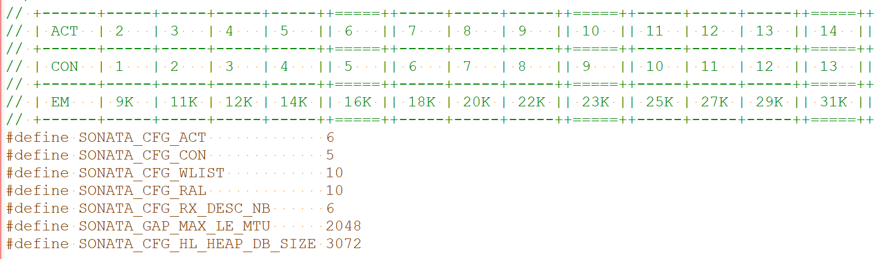
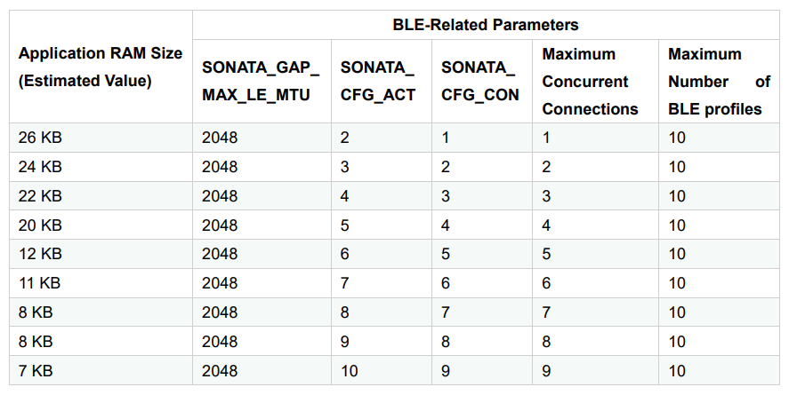
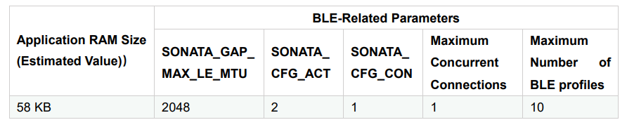
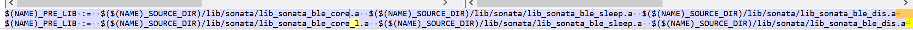
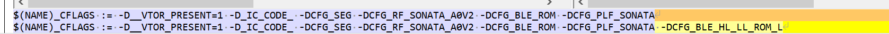
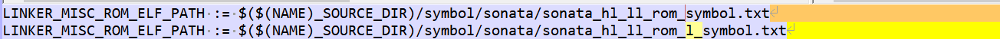
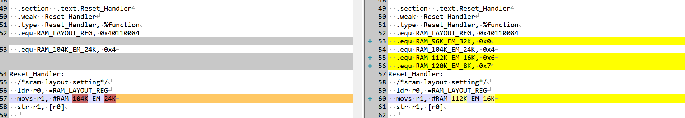
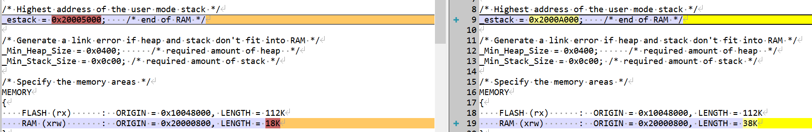
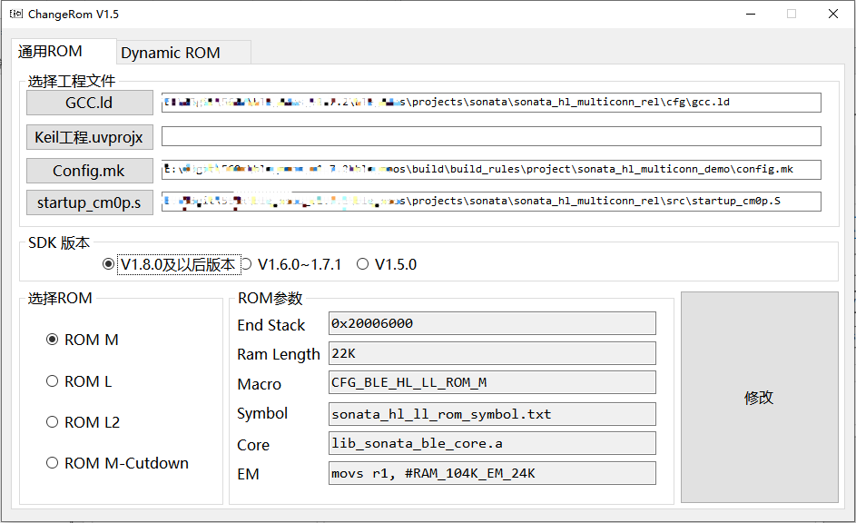
