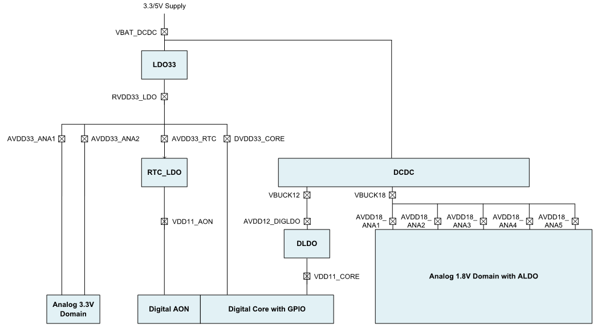
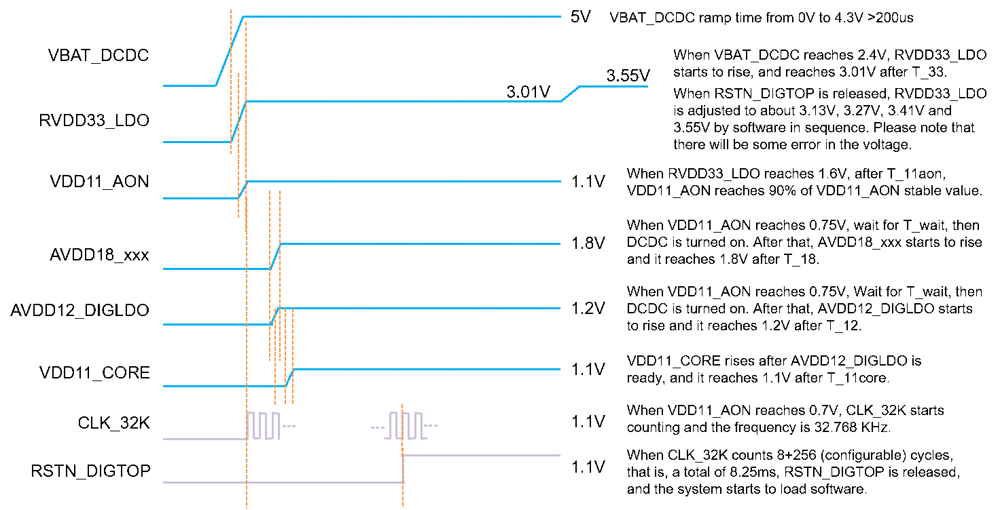
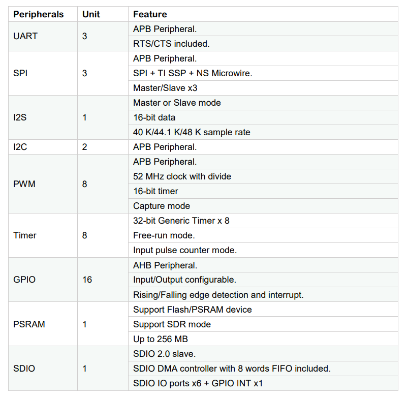
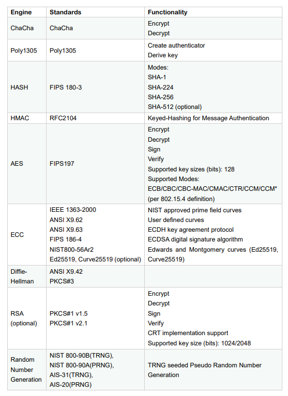
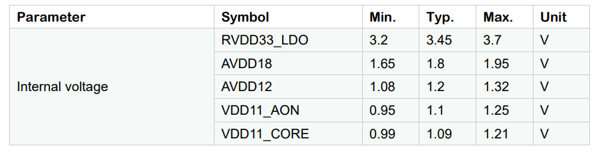
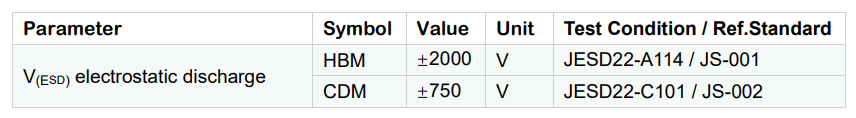
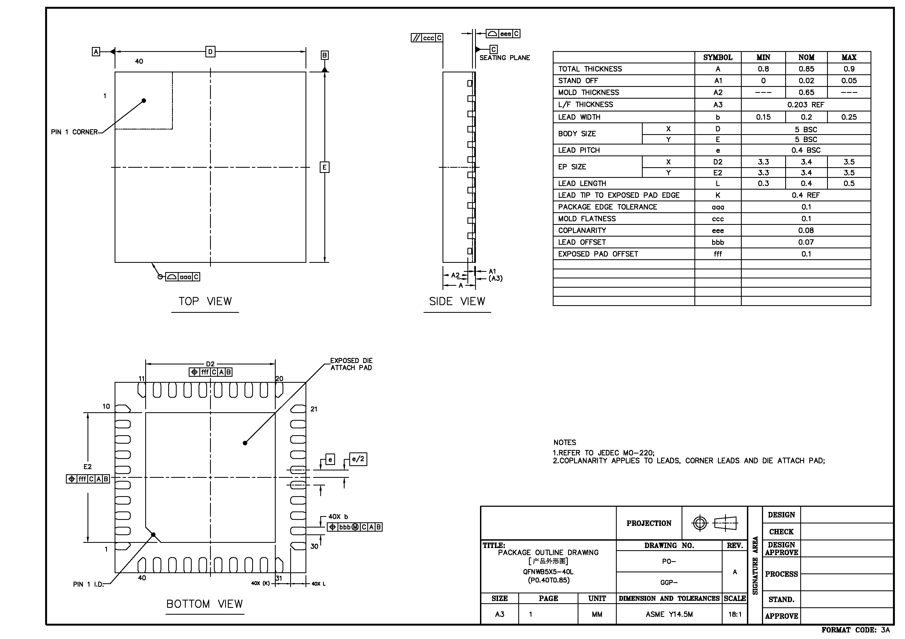
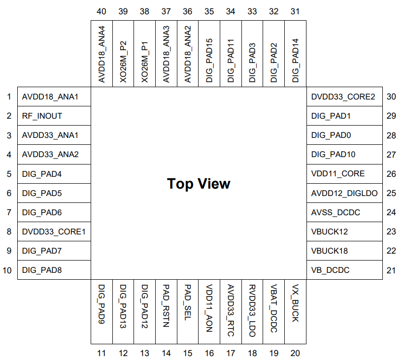

**ASR5822S Datasheet**
======================
`简体中文 <https://asriot-cn.readthedocs.io/zh/latest/ASR582X/芯片规格/5822S_规格书.html>`_

Introduction
------------

**About This Document**

This document introduces the specifications of ASR5822S chip (Wi-Fi 4+BLE 5.1 Combo SoC).

**Intended Readers**

This document is mainly for engineers who use this chip to develop their own platform and products, for instance:

-  PCB Hardware Development Engineer
-  Software Engineer
-  Technical Support Engineer

**Included Chip Models**

The product models corresponding to this document are as follows.

+----------+---------------------------------+------------------------------+-----------+-------------------------------------------------------------------------------------------------------------------------------------------------------------------------------+
| Model    | Protocol                        | Core                         | SiP Flash | Operating Modes                                                                                                                                                               |
+==========+=================================+==============================+===========+===============================================================================================================================================================================+
| ASR5822S | Wi-Fi 4 BLE 5.1 SIG Mesh v1.0.x | Arm China STAR-MC1 Processor | 2 MB      | 11 b/g/n: *Support Station/SoftAP/Sniffer* *Support IoT mode/SDIO mode* BLE 5.1: *Support multiple-speed modes* *Support Mesh* *Support AOA/AOD* *Pass BQB 5.2 certification* |
+----------+---------------------------------+------------------------------+-----------+-------------------------------------------------------------------------------------------------------------------------------------------------------------------------------+

**Copyright Notice**

© 2023 ASR Microelectronics Co., Ltd. All rights reserved. No part of this document can be reproduced, transmitted, transcribed, stored, or translated into any languages in any form or by any means without the written permission of ASR Microelectronics Co., Ltd.

**Trademark Statement**

ASR and ASR Microelectronics Co., Ltd. are trademarks of ASR Microelectronics Co., Ltd. 

Other trade names, trademarks and registered trademarks mentioned in this document are property of their respective owners.

**Electrostatic Discharge (ESD) Warning**

This product can be damaged by Electrostatic Discharge (ESD). When handling with this device, the people should be very careful to conduct the ESD protection to avoid any device damage caused by ESD event.

**Disclaimer**

ASR do not give any warranty of any kind and may make improvements and/or changes in this document or in the product described in this document at any time.

This document is only used as a guide, and no contents in the document constitute any form of warranty. Information in this document is subject to change without notice.

All liability, including liability for infringement of any proprietary rights caused by using the information in this document is disclaimed.

**ASR Microelectronics Co., Ltd.**

Address: 9F, Building 10, No. 399 Keyuan Road, Zhangjiang High-tech Park, Pudong New Area, Shanghai, 201203, China

Homepage: http://www.asrmicro.com/

**Revision History**

======= ======= ==================
Date    Version Release Notes
======= ======= ==================
2023.09 V1.7.1  Updated Table 2-5.
======= ======= ==================

1. Overview
-----------

1.1 General
~~~~~~~~~~~~

ASR5822S is a highly integrated, high performance, and low cost System-on-Chip (SoC) which supports both 1x1 IEEE 802.11 b/g/n and Bluetooth 5.1 Low Energy (BLE) for the Internet of Things (IoT). The ASR5822S integrates RF transceiver, 802.11 PHY+MAC, BLE PHY+MAC, Arm China STAR-MC1 Processor, advanced peripheral interfaces, Real Time Counter (RTC) and power management circuits. The integrated RF and analog circuit incorporate T/R switch, RF balun, power amplifier, low-noise amplifier, and entire power management modules. Therefore, the ASR5822S provides a small form-factor solution with minimal external components for the IoT applications, such as smart lighting, security, remote control, appliances and more.

The chip can perform either as a standalone IoT application with Supplicant/HostAP/Sniffer mode or as a slave with SDIO interface.

**Solution Highlights:**

-  **Fully Integrated Power Management Circuits**

The chip includes an on-chip DCDC associated with LDOs to provide noise isolated power supplies for digital and analog modules. The DCDC has a single, wide-range (3.3~5 V) supply input and dual outputs (1.2 V, 1.8 V) to extremely minimize Bill of Material (BoM). Moreover, the chip provides two UART interfaces that can follow the DCDC supply to adjust interface voltage range from 3.3 V to 5 V. And a UART interface can support ESD HBM larger than 6 KV, which can save the ESD diode device to reduce the module cost further.

-  **WLAN and BLE Co-existence**

ASR5822S has an excellent co-existence performance. The chip supports network configuration via BLE and BLE Mesh, which can provide multiple development capacities for the customers.

-  **Entire Security System**

A completed security infrastructure, including AES/RSA/ECC crypto engine, hash engine and True Random Generator (TRNG), is also integrated. ASR5822S can provide a comprehensive security solution as Security Boot flow, Flash Image Protection and dynamic encryption/decryption for customer data.

-  **Entire Software Solution**

ASR5822S provides an entire software solution, such as RTOS/TCPIP/SSL/MQTT/ Wi-Fi/AT and more. The customers just need to simply develop applications and then put them into the market.

In pass through application scenario, the customers can control ASR5822S with AT command through UART interface without any code developing in ASR5822S. In master-control application scenario, the customers just need to focus on their own application developing, with the OS/communication layer/Security already supported in ASR5822S SDK.

1.2 Features
~~~~~~~~~~~~

-  **Power Management Unit (PMU)**

   -  Integrated DCDC and LDO, no need of off-chip PMU device
   -  Support single supply input, range from 3 V ~ 5.5 V

-  **IEEE 802.11 Features**

   -  Integrated Power Amplifier (PA) with internal power detector and closed loop power calibration

   -  Integrated T/R switch and RF balun, no need of off-chip matching network

   -  Support 802.11 b/g/n compatible WLAN

   -  Support 802.11e QoS enhancement (WMM)

   -  Support 802.11i (WPA/WPA2 PSK/WPA3 personal), Open/WEP/TKIP/CCMP

   -  Support power saving mechanism

-  **BLE Features**

   -  AOA/AOD direct finding

   -  2 x speed with 2 M bps support

   -  4 x distance with 125 K bps data rate in long range mode

   -  8 x advertising capacity

   -  Better frequency hopping

   -  BLE SIG Mesh: Relay/Proxy/Low power/Friend features

-  **SoC Features**

   -  Arm China STAR-MC1 Processor associated with 24 KB cache

   -  352 KB RAM for Instruction and Data

   -  64 KB ROM is integrated

   -  4K-bit OTP is integrated

   -  MCU Core Clock: 160 MHz

   -  XTAL Clock: 26/40 MHz

   -  Support eXecute-in-Place (XiP) on flash and external SPI flash

   -  External SPI NOR Flash is supported up to 256 MB

   -  Support Category: GigaDevice, WB and XTX

   -  Support OTA

-  **Security**

   -  Hardware Security Engine

   -  AES/RSA/ECC/MAC/HMAC/SHA1/SHA-224/SHA256/SHA512/D-H library

   -  True Random Number Generator (TRNG)/PRNG

   -  Flash Image Integrated Encryption/Decryption

   -  Dynamic Encryption/Decryption for Customer Data

   -  Integrated eFuse OTP

-  **Peripherals**

   -  UART/SPI/I2C/PWM/I2S/Timer

   -  PSRAM controller

   -  Generic ADC x8 Channels

   -  Watchdog

   -  RTC

1.3 Block Diagram
~~~~~~~~~~~~~~~~~

|image1|

1.4 Applications
~~~~~~~~~~~~~~~~

-  Smart Plugs and Lights

-  Wearable Electronics

-  Home Appliances

-  Home Automation

-  Mesh Network

-  Industrial Wireless Control

-  Sensor Networks

1.5 Part Number Information
~~~~~~~~~~~~~~~~~~~~~~~~~~~

The following table shows ASR5822S part number information.

+-------------+------------+-----------------+--------+-----------+-----------+----------+
| Part Number | Pin Number | Package Type    | Pitch  | SiP Flash | Thickness | Comments |
+=============+============+=================+========+===========+===========+==========+
| ASR5822S    | 40         | QFN 5 mm x 5 mm | 0.4 mm | Yes       | 0.85 mm   |          |
+-------------+------------+-----------------+--------+-----------+-----------+----------+

2. System Function Descriptions
-------------------------------

2.1 PMU
~~~~~~~

ASR5822S can support 3.3 V ~ 5 V single power supply, which can come from a battery or a DC-DC convertor or an AC-DC convertor directly. There is no need of any other off-chip DCDC or LDO device. The PMU consists of Always-ON (AON) control logic, RTC circuits, DCDC, and LDOs. All these circuits have characters of low noise and low quiescent current performances.

DCDC is powered by single power supply and it generates two BUCK voltages of 1.2 V and 1.8 V. 1.2 V BUCK is supply for Digital LDO (DLDO). 1.8 V BUCK is supply for all Analog LDOs (ALDO). The LDO33 has 3.3 V output that provides supply for DVDD IO, RTC LDO (RLDO) and 3.3 V analog circuits.

ASR5822S’s PMU provides several low power modes: modem sleep, light sleep and deep sleep. These modes meet different application requirements.

The chip’s power grid and power-on sequence are described as follows:

|image2|

|image3|

============= ========================= ======= ======= ====
Symbol        Parameter                 Typical Maximum Unit
============= ========================= ======= ======= ====
T_33          RVDD33_LDO rising time    200     600     us
T_11aon       VDD11_AON rising time     100     500     us
T_wait        AVDD18/AVDD12 wait time   350     800     us
T_18          AVDD18_xxxrising time     150     1000    us
T_12          AVDD12_DIGLDO rising time 150     1000    us
T_wait_11core VDD11_CORE wait time      60      150     us
T_11core      VDD11_CORE rising time    150     1000    us
============= ========================= ======= ======= ====

2.2 Clock
~~~~~~~~~

ASR5822S supports 26 M or 40 M XO frequency to generate all high performance clock signals in on-chip RF/Analog PLL. In RTC, circuits support one low-power clock source, the RC Oscillator (RCO). The customer can use RCO as RTC reference clock to save the BoM. The RCO frequency can be auto-calibrated on chip.

2.3 CPU Functions
~~~~~~~~~~~~~~~~~

.. _introduction-1:

2.3.1 Introduction
^^^^^^^^^^^^^^^^^^

ASR5822S includes an integrated Arm China STAR-MC1 Processor with internal RAM and ROM. The high-performance Arm China STAR-MC1 Processor provides a low-cost platform that meets the needs of minimal memory implementation, reduced pin count, and low power consumption, while delivering outstanding computational performance and exceptional system response to interrupts. The Arm China STAR-MC1 Processor includes instruction and data cache, and floating point arithmetic functionality.

.. _features-1:

2.3.2 Features
^^^^^^^^^^^^^^

The inside Arm China STAR-MC1 core has Floating Point Unit (FPU), Cache Controller and Memory Protection Unit (MPU) and with the following features:

-  Arm V8-M architecture based instruction set optimized for embedded applications

-  Tightly Coupled Memory (TCM) interface to achieve higher MIPS

-  A Nested Vectored Interrupt Controller (NVIC) closely integrated with the processor core to achieve low latency interrupt processing

-  A low-cost debug solution featuring with serial wire debug port (SW-DP)

-  Multiple high-performance bus interfaces

2.4 Memory
~~~~~~~~~~

2.4.1 ROM
^^^^^^^^^

The internal 64 KB ROM of ASR5822S device is at address 0x0000_0000 of the device memory. It stored the boot rom image, mainly used to program the flash image/take secure boot function/take non-secure boot function according to the Mode Selection.

2.4.2 SRAM
^^^^^^^^^^

ASR5822S family provides up to 352 KB of on-chip SRAM. The internal RAM is not only used for code and data memory, but also used for shared memory for Wi-Fi/BLE packet buffer. It can be configured by software remap register. Internal RAM is capable of selective retention in power-saving mode.

2.4.3 FLASH
^^^^^^^^^^^

ASR5822S provides 2 MB of System-in-Package (SiP) QSPI Flash with hardware encryption and flash remapping functions to protect developers’ programs and data. ASR5822S supports up to external 256 MB QSPI flash or SRAM devices for user applications.

The Arm China STAR-MC1 Processor can access the QSPI flash or SRAM through high-speed caches.

2.4.4 One-time Programmable Memory
^^^^^^^^^^^^^^^^^^^^^^^^^^^^^^^^^^

ASR5822S provides 4K-bit One-Time Programmable (OTP) memory.

Hardware configuration parameters including Flash-Encryption may be stored in first internal 2K-bit OTP memory, which is read by system software after device reset. In addition, customer-specific parameters can be stored, depending on the specific board design in reserved 2K-bit OTP memory.

2.4.5 Memory Mapping
^^^^^^^^^^^^^^^^^^^^

The following table describes the various MCU peripherals and how they are mapped to the processor memory.

=================== ============= ===========
Description         Start Address End Address
=================== ============= ===========
ROM                 0x0000_0000   0x0000_FFFF
ITCM                0x0008_0000   0x0008_7FFF
FLASH               0x1000_0000   0x17FF_FFFF
DTCM                0x20FD_0000   0x20FF_FFFF
System SRAM         0x2100_0000   0x2101_FFFF
External Flash/SRAM 0x3000_0000   0x3FFF_FFFF
SYS_CON             0x4000_0000   0x4000_0FFF
GPIO0               0x4000_1000   0x4000_1FFF
GPIO1               0x4000_2000   0x4000_2FFF
QSPI                0x4000_3000   0x4000_3FFF
System DMA          0x4000_4000   0x4000_4FFF
OTP                 0x4000_5000   0x4000_5FFF
SDIO                0x4000_7000   0x4000_7FFF
RETENTION Memory    0x4000_8000   0x4000_8FFF
PSRAM Controller    0x4000_A000   0x4000_AFFF
CYPT310             0x4000_D000   0x4000_DFFF
WDT                 0x4008_0000   0x4008_0FFF
UART0               0x4008_1000   0x4008_1FFF
UART1               0x4008_2000   0x4008_2FFF
UART2               0x4008_3000   0x4008_3FFF
SPI0                0x4008_4000   0x4008_4FFF
SPI1                0x4008_5000   0x4008_5FFF
SPI2                0x4008_6000   0x4008_6FFF
TIMER               0x4008_7000   0x4008_7FFF
PWM                 0x4008_8000   0x4008_8FFF
ADC                 0x4008_9000   0x4008_9FFF
I2C0                0x4008_A000   0x4008_AFFF
I2C1                0x4008_B000   0x4008_BFFF
I2S                 0x4008_F000   0x4008_FFFF
=================== ============= ===========

2.5 Peripherals
~~~~~~~~~~~~~~~

The following table gives a summary of all peripherals of ASR5822S.

|image4|

2.5.1 PIN MUX
^^^^^^^^^^^^^

All GPIO can be reconfigured via software control. The PIN MUX table is shown as follows.

==== ========= =========== =========== =========== ===========
Num. Pin Name  GPIO Func=0 GPIO Func=1 GPIO Func=2 GPIO Func=3
==== ========= =========== =========== =========== ===========
1    DIG_PAD0  GPIO0       UART0_TXD   SWC         SPI1_CSN
2    DIG_PAD1  GPIO1       UART0_RXD   SWD         SPI1_SCK
3    DIG_PAD2  GPIO2       UART1_TXD   UART1_TXD   SPI1_DI
4    DIG_PAD3  GPIO3       UART1_RXD   UART1_RXD   SPI1_DO
5    DIG_PAD4  SWC         GPIO4       SDIO_CMD    UART0_TXD
6    DIG_PAD5  SWD         GPIO5       SDIO_CLK    UART0_RXD
7    DIG_PAD6  GPIO6       SPI0_CSN    SDIO_DATA0  UART0_CTS
8    DIG_PAD7  GPIO7       SPI0_SCK    SDIO_DATA1  UART0_RTS
9    DIG_PAD8  GPIO8       SPI0_TX     SDIO_DATA2  I2C1_SCL
10   DIG_PAD9  GPIO9       SPI0_RX     SDIO_DATA3  I2C1_SDA
11   DIG_PAD10 MODE_SEL3   PWM1        GPIO10      UART2_CTS
12   DIG_PAD11 GPIO11      PWM3        SDIO_INT    UART2_RTS
13   DIG_PAD12 GPIO12      GPIO12      SPI2_CSN    UART2_TXD
14   DIG_PAD13 GPIO13      GPIO13      SPI2_DO     UART2_RXD
15   DIG_PAD14 STRAP/SEL1  PWM0        SPI2_SCK    UART1_CTS
16   DIG_PAD15 STRAP/SEL2  PWM2        SPI2_DI     UART1_RTS
==== ========= =========== =========== =========== ===========

==== ========= =========== =========== =========== =========== =======
Num. Pin Name  GPIO Func=4 GPIO Func=5 GPIO Func=6 GPIO Func=7 ADC Mux
==== ========= =========== =========== =========== =========== =======
1    DIG_PAD0  PWM5        N/A                                 
2    DIG_PAD1  PWM7        N/A                                 
3    DIG_PAD2  I2C0_SCL    N/A                                 
4    DIG_PAD3  I2C0_SDA    N/A                                 
5    DIG_PAD4  PWM0        N/A                     PSRAM_SIO3  ADC0
6    DIG_PAD5  PWM2        N/A                     PSRAM_SIO2  ADC1
7    DIG_PAD6  PWM4        N/A                     PSRAM_SCK   ADC2
8    DIG_PAD7  PWM6        N/A         I2S_MCLK    PSRAM_SIO1  ADC3
9    DIG_PAD8  UART1_TXD   N/A         I2S_SCLK    PSRAM_SIO0  ADC4
10   DIG_PAD9  UART1_RXD   N/A         I2S_LRCLK   PSRAM_CSN   ADC5
11   DIG_PAD10 SPI2_SCK    N/A         I2S_DO                  ADC6
12   DIG_PAD11 SPI2_DI     N/A         I2S_DI                  ADC7
13   DIG_PAD12 GPIO12      N/A         I2S_DO                  
14   DIG_PAD13 GPIO13      N/A                                 
15   DIG_PAD14 GPIO14      N/A                                 
16   DIG_PAD15 GPIO15      N/A                                 
==== ========= =========== =========== =========== =========== =======

2.5.2 PWM
^^^^^^^^^

Pulse Width Modulation (PWM) is to generate pulse sequences with programmable frequency and duty cycle for LCD, Vibrators, and other devices. The PWM provides eight PWM channels and four of them can be configured as input capture function.

Features:

-  8 PWM generators with 16-bit counter

-  Prescaler divider by 1/2/4/8/16/32/64/128

-  Up or up/down mode for PWM output

-  Dead-band generator, and it can be bypassed

-  16-bit input capture (edge/time) mode

-  16-bit timer mode

2.5.3 SPI
^^^^^^^^^

ASR5822S supports four-wire and full-duplex Motorola Serial Peripheral Interface (SPI) protocol. There are three SPI, and all of them can be configured as master or slave.

Features:

-  Master or slave option

-  Programmable clock bit rate and prescaler

-  Support normal Motorola SPI mode at the clock range of 0~10 MHz in master mode

-  The maximum input clock is 6.6 MHz when both transmitting and receiving in slave mode

-  Programmable choice of interface operation, SPI, Microwire, or TI synchronous serial

-  Configurable frame size by 4~16 bits

-  TX/RX FIFO depth is 8 Bytes

-  Support DMA mode

2.5.4 UART
^^^^^^^^^^

ASR5822S provides three Universal Asynchronous Receiver Transmitter (UART) controllers. Two of them with auto-flow control are used for communication with external devices and the other one is for debug.

Features:

-  TX/RX FIFO depth is 16 Bytes

-  Support auto flow control mode

-  Programmable frame properties, such as number of data bits per frame (5~8), optional parity bit (odd/even), number of stop bits (1,2)

-  Include additional FIFO status registers, that can be accessed by software

-  Loopback mode for test

-  Support DMA mode

2.5.5 I2C
^^^^^^^^^

The Inter-Integrated Circuits (I2C) bus is two wires, serial data (SDA) and serial clock (SCL). It carries information between the devices connected to the bus. Each device is recognized by a unique address and can operate as either a transmitter or receiver, depending on the function of the device.

Features:

-  Support SS mode (100 KHz), FS mode (400 KHz)

-  Support master or slave I2C operation

-  Support 7-bit/10-bit addressing

-  TX/RX FIFO depth is 8 Bytes

-  Support clock stretch when TX FIFO is empty or RX FIFO is full

-  Support DMA mode

2.5.6 DMAC
^^^^^^^^^^

Direct Memory Access (DMA) is used to provide high-speed data transfer between peripherals and memory, and between memory and memory, without CPU’s operations. Each DMA channel has dedicated handshake signals.

Features:

-  32 DMA channels

-  Sixteen handshakes with peripherals

-  Each priority level arbitrates using a fixed priority that is determined by the DMA channel number

-  Support memory-to-memory, memory-to-peripheral and peripheral-to-memory

-  Support multiple DMA cycle types and transfer data widths

-  Up to 1024 transfers in a single DMA cycle

2.5.7 SDIO
^^^^^^^^^^

Secure Digital Input and Output (SDIO) block is designed to be a SDIO slave device to work with SDIO host for bi-directional data transfer. All command should be issued by host device. It has an AHB master interface connected to memory controller, while has an AHB slave interface connected to Advanced eXtensible Interface (AXI) fabric for CPU access.

Features:

-  Support SDIO 2.0 specification

-  Support 1-bit, 4-bit SDIO transfer mode at the clock range of 0~40 MHz

-  Configurable clock edge for sampling and driving

-  Configurable block size from 1 to 512 Bytes (in multiples of 4)

-  Supply card to host interrupt by GPIO

-  Support multi-ports DMA mode

-  Support aggregation DMA mode

2.5.8 GPIO
^^^^^^^^^^

General purpose Input / Output (GPIO) pins are fully configurable. They are multiplexed with other interfaces, such as I2C, SPI, UART and etc. The GPIO pins support the below features:

-  Input mode: the input value can be read through register

-  Output mode: the output value can be set through register

-  Interrupt: the input can be set to edge-trigger or level-trigger to generate CPU interrupt. Support 4 types of trigger: low level, high level, falling edge and rising edge

-  Internal pull-up or pull-down configurable

2.5.9 TIMER and Watchdog
^^^^^^^^^^^^^^^^^^^^^^^^

ASR5822S provides 2 independent HW timer (besides, PWM block provides 4 timers, RTC block provides 1 real-time timer and 1 low-power timer). Each Timer integrates 32-bit or 16-bit counter (software configured). Each Timer supports the below modes:

-  Free-running mode: it is the default mode, the counter counts from max value (0xFFFF of 16-bit mode or 0xFFFFFFFF of 32-bit mode) to 0, then continues from max value to 0, when it counts to 0, an interrupt is generated to CPU.

-  Periodic timer mode: the counter counts from software-configured value to 0, then continues from the setting value to 0, when it counts to 0, an interrupt is generated to CPU.

-  One-shot timer mode: the counter counts from the software configured value to 0, then stops counting and generates an interrupt to CPU.

The Watchdog Timer is used to resume the controller operation when it had been disturbed by malfunctions such as noise and system errors. It can generate a general reset or an interrupt request.

2.5.10 Crypto Engine
^^^^^^^^^^^^^^^^^^^^

Crypto Engine block is an integrated security core and provides a comprehensive security infrastructure that enables system wide protection that includes use cases inside and outside the device.

Function Features are shown as below table.

|image5|

2.5.11 I2S
^^^^^^^^^^

I2S is an electrical serial bus interface standard used for connecting digital audio devices together. It is used to communicate PCM audio data between integrated circuits in an electronic device. The I²S bus separates clock and serial data signals.

-  Operates as an i2s transmitter or receiver

-  Configurable support for up to 2 stereo channels for both transmitter and receiver

-  16-bit audio data resolution

-  Supports full duplex communication due to the independence of transmitter and receiver

-  Configurable master or slave mode

-  Supports 8/16/32/40/44.1/48/96 KHz sample rate

2.5.12 PSRAM
^^^^^^^^^^^^

The PSRAM interface acts as a synchronous interface to external serial flash or PSRAM device with up to four bidirectional data lines.

-  Flexible sequence engine to support various flash/PSRAM vendor devices

-  Single, dual, quad mode of operation.

-  Memory mapped read access to connected flash devices

-  Memory mapped read/write access to connected PSRAM devices

-  Up to 60 MHz clock in SDR mode

-  Maximum 256 MB device size

3. Wi-Fi Subsystem Descriptions
-------------------------------

ASR5822S supports features specified in the IEEE 802.11 base standard, and amended by IEEE 802.11n.

3.1 Wi-Fi MAC
~~~~~~~~~~~~~

ASR5822S WLAN Media Access Control (MAC) is designed to support high throughput operation with low power consumption.

-  Transmission and reception of aggregated MPDUs (A-MPDU)

-  Support for power management schemes, including WMM power-save

-  Support for immediate ACK and Block-ACK policies

-  Interframe space timing support, including RIFS

-  Support for RTS/CTS and CTS-to-self frame sequences for protecting frame exchanges

-  Back-off counters in hardware for supporting multiple priorities as specified in the WMM specification

-  Timing synchronization function (TSF), network allocation vector (NAV) maintenance, and target beacon transmission time (TBTT) generation in hardware

-  Hardware off-load for AES-CCMP, legacy WPA TKIP, legacy WEP ciphers, WAPI, and support for key management

-  Statistics counters for MIB support

-  802.11 e: QoS for wireless multimedia technology

-  Monitor mode: sniff all frames from the medium

3.2 Wi-Fi PHY
~~~~~~~~~~~~~

ASR5822S WLAN Digital Port Physical Layer (PHY) is designed to comply with IEEE 802.11 b/g/n single stream to provide wireless LAN connectivity or low-power applications.

-  Supports IEEE 802.11b, 11g, 11n single-stream standards

-  Supports 802.11n MCS0-7 in both 20 MHz and 40 MHz bandwidth

-  Supports Optional Greenfield mode in Tx and Rx

-  Algorithms achieving low power, enhanced sensitivity, range, and reliability

-  Automatic gain control scheme for blocking and non-blocking application scenario

3.3 Wi-Fi RF
~~~~~~~~~~~~

ASR5822S integrates fully 802.11 b/g/n RF transceiver, including T/R switch, matching network, PA, Low Noise Amplifier (LNA) and RF synthesizer. There is no need of off-chip matching network, which saves the BoM and module Print Circuit Board (PCB) size.

The transceiver has auto-calibration and sensor circuits to guarantee the RF performance in mass production. These calibrations include transmit power, IQ imbalance, LO leakage, DC offset, filter bandwidth and etc. The temperature sensor and process sensor are also integrated on-chip.

The following table shows Wi-Fi RF TX and RX specification respectively.

====================== ==== ==== ==== ====
TX Characteristics     Min. Typ. Max. Unit
====================== ==== ==== ==== ====
**1. Frequency Range** 2412 -    2484 MHz
**2. Output Power**                   
1 Mbps CCK                  20        dBm
11 Mbps CCK                 20        dBm
6 Mbps OFDM                 20        dBm
54 Mbps OFDM                18        dBm
HT20, MCS0                  18        dBm
HT20, MCS7                  17.5      dBm
HT40, MCS0                  18        dBm
HT40, MCS7                  17.5      dBm
**3. TX EVM**                         
6 Mbps OFDM                      -7   dB
54 Mbps OFDM                     -25  dB
HT20, MCS0                       -7   dB
HT20, MCS7                       -27  dB
HT40, MCS0                       -7   dB
HT40, MCS7                       -27  dB
====================== ==== ==== ==== ====

====================================== ==== ===== ==== ====
RX Characteristics                     Min. Typ.  Max. Unit
====================================== ==== ===== ==== ====
**1. Frequency Range**                 2412 -     2484 MHz
**2. Minimum Input Level Sensitivity**                 
1) 1 Mbps (FER≤8%) CCK                      -98        dBm
2) 2 Mbps (FER≤8%) CCK                      -94        dBm
3) 11 Mbps (FER≤8%) CCK                     -89        dBm
4) BPSK rate 1/2, 6 Mbps OFDM               -92.5      dBm
5) 64QAM rate 3/4, 54 Mbps OFDM             -76.5      dBm
6) MCS0, BPSK rate 1/2                      -92.5      dBm
7) MCS7, 64QAM rate 5/6                     -73        dBm
**3. Maximum Input Level (FER≤8%)**                    
6 Mbps OFDM                                 10         dBm
54 Mbps OFDM                                -8         dBm
MCS0                                        10         dBm
MCS7                                        -8         dBm
====================================== ==== ===== ==== ====

4. Bluetooth Subsystem Descriptions
-----------------------------------

SoC considers performance improvements for Bluetooth low energy with the Bluetooth 5.1 specifications. Most importantly, it supports:

-  Supports all packets types (Advertising/Extended Advertising/Data/Control/Long Range)

-  Supports Constant Tone Extension and IQ sampling. Supports both AOA and AOD CTE type with 1us/2us sampling slots. Supports up to 8 antennae

-  Supports WLAN Coexistence mechanism

-  Supports all device classes (Broadcaster, Central, Observer, Peripheral)

-  Supports Encryption/Decryption (AES-CCM)

-  Supports bit stream processing (CRC, Whitening)

-  Supports frequency Hopping calculation (scheme #1 and scheme #2)

-  Supports FDMA/TDMA/events formatting and synchronization

-  Supports AHB slave interface for register file access and exchange memory of CPU access via BLE core

-  Supports power down BLE core during protocol’s idle periods, low power modes support 32.768 KHz low-power clock frequencies.

-  Supports BLE SIG Mesh: Relay/Proxy/Low power/Friend features

========================================= ==== ==== ==== ========
TX Characteristic                         Min. Typ. Max. Unit
========================================= ==== ==== ==== ========
**1. Frequency Range**                    2402 -    2480 MHz
**2. Output Power**                       0    6    15   dBm
**3. Carrier Frequency Offset and Drift**                
1) Frequency Offset                       -150 35   150  KHz
2) Frequency Drift                        -50  1    50   KHz
3) Max Drift Rate                         -20  1    20   KHz/50us
**4. Modulation Characteristic**                         
△f1avg                                    225  249  275  KHz
△f2max                                    185  230       KHz
△f1avg/△f2avg                             0.8  0.92      Hz/Hz
**5. In-band Spurious Emission**                         
±2 MHz Offset                                  -39  -20  dBm
＞±3 MHz Offset                                -43  -30  dBm
========================================= ==== ==== ==== ========

============================ ==== ===== ==== ====
RX Characteristic            Min. Typ.  Max. Unit
============================ ==== ===== ==== ====
**1. Frequency Range**       2402 -     2480 MHz
**2. Receiver Sensitivity**       -95        dBm
**3. C/I Co-channel**             4.5   21   dB
**4. C/I 1 MHz**                  -10   15   dB
**5. C/I 2 MHz**                  -37.5 -17  dB
**6. C/I ≥ 3 MHz**                -41   -27  dB
**7. C/I Image Channel**          -35   -9   dB
**8. C/I Image 1 MHz**            -41   -15  dB
**9. Inter-modulation**      -50  -35        dBm
**10. Out-of-band Blocking**                 
30 MHz to 2000 MHz           -30  -30        dBm
2001 MHz to 2339 MHz         -35  -30        dBm
2501 MHz to 3000 MHz         -35  -35        dBm
3001 MHz to 12.75 GHz        -30  -30        dBm
============================ ==== ===== ==== ====

5. Electrical Characteristics
-----------------------------

5.1 Absolute Maximum Rating
~~~~~~~~~~~~~~~~~~~~~~~~~~~

+------------------------------------------------+-----------+------+------+------+------+
| Parameter                                      | Symbol    | Min. | Typ. | Max. | Unit |
+================================================+===========+======+======+======+======+
| Power supply                                   | VBAT_DCDC | -0.3 |      | 5.8  | V    |
+------------------------------------------------+-----------+------+------+------+------+
| Storage temperature range                      | TSTR      | -55  |      | 150  | °C   |
+------------------------------------------------+-----------+------+------+------+------+
| Operating temperature range (Industrial Grade) | TOPR      | -40  |      | 85   | °C   |
+------------------------------------------------+-----------+------+------+------+------+

5.2 Recommended Operating Conditions
~~~~~~~~~~~~~~~~~~~~~~~~~~~~~~~~~~~~

+------------------------------------------------+-----------+------+-------+------+------+
| Parameter                                      | Symbol    | Min. | Typ.  | Max. | Unit |
+================================================+===========+======+=======+======+======+
| Power supply                                   | VBAT_DCDC | 3    | 3.3/5 | 5.5  | V    |
+------------------------------------------------+-----------+------+-------+------+------+
| Operating temperature range (Industrial Grade) | TOPR      | -40  | *-*   | 85   | °C   |
+------------------------------------------------+-----------+------+-------+------+------+

5.3 Supply Voltage Operating Range
~~~~~~~~~~~~~~~~~~~~~~~~~~~~~~~~~~

|image6|

5.4 ESD Ratings
~~~~~~~~~~~~~~~

|image7|

5.5 Crystal Specifications
~~~~~~~~~~~~~~~~~~~~~~~~~~

===================== ==== ==== ==== ====
Parameter             Min. Typ. Max. Unit
===================== ==== ==== ==== ====
Fundamental frequency      26        MHz
Frequency tolerance   -10       10   ppm
Operating temperature -30       85   °C
Load capacitor             7.5       pF
Maximum ESR                50        Ω
Aging per year        -3        3    ppm
===================== ==== ==== ==== ====

5.6 DC Specification
~~~~~~~~~~~~~~~~~~~~

+--------------------------------------+--------+-------------------------------------------------------------+------+-------+------+
| Parameter                            | Symbol | Test Conditions                                             | Min. | Max.  | Unit |
+======================================+========+=============================================================+======+=======+======+
| Input high level, input and I/O pins | VIH    | Guaranteed logic HIGH level                                 | 2.0  | DVDD  | V    |
+--------------------------------------+--------+-------------------------------------------------------------+------+-------+------+
| Input low level, input and I/O pins  | VIL    | Guaranteed logic LOW level                                  | VSS  | 0.8   | V    |
+--------------------------------------+--------+-------------------------------------------------------------+------+-------+------+
| Output high voltage                  | VOH    | VDD=minimum, DVDD=minimum, IOHa=-2mA, -4mA, -8mA, and -12mA | 2.4  | DVDD  | V    |
+--------------------------------------+--------+-------------------------------------------------------------+------+-------+------+
| Output low voltage                   | VOL    | VDD=minimum, DVDD=minimum, IOLa=2mA, 4mA, 8mA, and 12mA     | VSS  | 0.4   | V    |
+--------------------------------------+--------+-------------------------------------------------------------+------+-------+------+
| High level output current for GPIO   | IOH    | DVDD=3.3 V                                                  |      | 12    | mA   |
+--------------------------------------+--------+-------------------------------------------------------------+------+-------+------+
| Low level output current for GPIO    | IOL    |                                                             |      | 12    | mA   |
+--------------------------------------+--------+-------------------------------------------------------------+------+-------+------+
| Input pull-up resistor current       | IRPU   | VPAD=VIH, DVDD=minimum                                      | 50b  | 180c  | µA   |
+--------------------------------------+--------+-------------------------------------------------------------+------+-------+------+
| Input pull-up resistance             | RPU    | VPAD=VIH, DVDD=minimum                                      | 9d   | 19.4e | KΩ   |
+--------------------------------------+--------+-------------------------------------------------------------+------+-------+------+
| Input pull-down resistor current     | IRPD   | VPAD=VIL, DVDD=minimum                                      | 50f  | 120c  | µA   |
+--------------------------------------+--------+-------------------------------------------------------------+------+-------+------+
| Input pull-down resistance           | RPD    | VPAD=VIL, DVDD=minimum                                      | 6.7d | 16e   | KΩ   |
+--------------------------------------+--------+-------------------------------------------------------------+------+-------+------+
| Input hysteresisg                    | VH     |                                                             | 0.2g | -     | V    |
+--------------------------------------+--------+-------------------------------------------------------------+------+-------+------+
| Input leakage current, non-tolerant  | IPAD   | DVDD=maximum, VPAD=0V or DVDD                               | -1h  | 1h    | µA   |
+--------------------------------------+--------+-------------------------------------------------------------+------+-------+------+
| Fail-safe leakage current            | IPAD   | DVDD=0, VPAD=DVDD maximum                                   | -    | 1i    | µA   |
+--------------------------------------+--------+-------------------------------------------------------------+------+-------+------+
| Off-State leakage current            | IOZ    | DVDD=maximum, VPAD=0V or DVDD                               | -    | 1j    | µA   |
+--------------------------------------+--------+-------------------------------------------------------------+------+-------+------+

a. Valid only when DVDD=2.97V, process=SS, temperature=125°C. This current is de-rated at other PVT conditions, including typical DVDD=1.8V and 2.5V.

b. Weak pull-up current is the minimum current flowing from DVDD to PAD when DVDD=2.97V, process=SS, and temperature=125°C. This value is de-rated for all the other DVDD values.

c. Maximum weak pull up and weak pull down currents are the maximum current values from the simulation results with test conditions: DVDD=3.63V, process=FF and temperature=-40°C. It is not a specification.

d. Minimum value of weak pull up and pull down resistances is the value of minimum resistance from simulation results with test conditions: DVDD=3.63V, process=FF and temperature=-40°C. It is not a specification.

e. The weak pull-up and pull-down resistance is the maximum resistance with the test conditions specified when DVDD=2.97V, process=SS and temperature=125°C.

f. Weak pull-down current is the minimum current flowing from PAD to ground, when DVDD=2.97V, process=SS, and temperature=125°C. This value is de-rated for all the other DVDD values.

g. Valid only when hysteresis is enabled. Simulation conditions for FF: temperature=-40°C and DVDD=3.63V. Simulation condition for SS: temperature=125°C and DVDD=2.97V.

h. Input leakage current is the current that flows to or out of the PAD node. This leakage is measured when DVDD=3.63V, process=FF and temperature=125°C.

i. Fail-safe leakage is the current flowing from PAD to DVDD and ground when DVDD is powered down. This leakage is measured with PAD=3.63V, Process=FF, Temperature=125⁰C and DVDD=0.

j. Input leakage current is the current that flows to or out of the PAD node. This leakage is measured when DVDD=3.63V, process=FF and temperature=125°C.

6. Package Specifications
-------------------------

6.1 QFN40 Mechanical Parameters
~~~~~~~~~~~~~~~~~~~~~~~~~~~~~~~

ASR5822S uses 5 mm x 5 mm QFN package of 40 pins with 0.4 mm pitch.

|image8|

6.2 QFN40 Pin Assignment and Description
~~~~~~~~~~~~~~~~~~~~~~~~~~~~~~~~~~~~~~~~

The chip top view and pin descriptions of ASR5822S are shown as follows.

|image9|

+-------------------------+---------------+---------------------------------+---------+
| Num.                    | Name          | Pin Description                 | I/O     |
+=========================+===============+=================================+=========+
| **Power, Clock**        |               |                                 |         |
+-------------------------+---------------+---------------------------------+---------+
| 16                      | VDD11_AON     | 1.1V digital always-on supply   | Power   |
+-------------------------+---------------+---------------------------------+---------+
| 26                      | VDD11_CORE    | 1.1V digital core domain supply | Power   |
+-------------------------+---------------+---------------------------------+---------+
| 25                      | AVDD12_DIGLDO | 1.2V digital core LDO supply    | Power   |
+-------------------------+---------------+---------------------------------+---------+
| 1                       | AVDD18_ANA1   | 1.8V analog supply              | Power   |
+-------------------------+---------------+---------------------------------+---------+
| 36                      | AVDD18_ANA2   | 1.8 V analog supply             | Power   |
+-------------------------+---------------+---------------------------------+---------+
| 37                      | AVDD18_ANA3   | 1.8 V analog supply             | Power   |
+-------------------------+---------------+---------------------------------+---------+
| 40                      | AVDD18_ANA4   | 1.8 V analog supply             | Power   |
+-------------------------+---------------+---------------------------------+---------+
| 3                       | AVDD33_ANA1   | 3.3 V analog supply             | Power   |
+-------------------------+---------------+---------------------------------+---------+
| 4                       | AVDD33_ANA2   | 3.3 V analog supply             | Power   |
+-------------------------+---------------+---------------------------------+---------+
| 17                      | AVDD33_RTC    | 3.3 V RTC domain supply         | Power   |
+-------------------------+---------------+---------------------------------+---------+
| 8                       | DVDD33_CORE1  | 3.3 V digital IO supply         | Power   |
+-------------------------+---------------+---------------------------------+---------+
| 30                      | DVDD33_CORE2  | 3.3 V digital IO supply         | Power   |
+-------------------------+---------------+---------------------------------+---------+
| 38                      | XO26M_P1      | 26 MHz clock output             | Analog  |
+-------------------------+---------------+---------------------------------+---------+
| 39                      | XO26M_P2      | 26 MHz clock input              | Analog  |
+-------------------------+---------------+---------------------------------+---------+
| **DCDC, LDO**           |               |                                 |         |
+-------------------------+---------------+---------------------------------+---------+
| 18                      | RVDD33_LDO    | 3.3 V LDO output                | Analog  |
+-------------------------+---------------+---------------------------------+---------+
| 19                      | VBAT_DCDC     | 3.3~5 V DCDC/LDO supply         | Power   |
+-------------------------+---------------+---------------------------------+---------+
| 20                      | VX_BUCK       | DCDC signal                     | Analog  |
+-------------------------+---------------+---------------------------------+---------+
| 21                      | VB_DCDC       | DCDC signal                     | Analog  |
+-------------------------+---------------+---------------------------------+---------+
| 22                      | VBUCK18       | 1.8 V DCDC buck output          | Analog  |
+-------------------------+---------------+---------------------------------+---------+
| 23                      | VBUCK12       | 1.2 V DCDC buck output          | Analog  |
+-------------------------+---------------+---------------------------------+---------+
| 24                      | AVSS_DCDC     | DCDC ground                     | Power   |
+-------------------------+---------------+---------------------------------+---------+
| **GPIO, Reset, Select** |               |                                 |         |
+-------------------------+---------------+---------------------------------+---------+
| 28                      | DIG_PAD0      | GPIO                            | Digital |
+-------------------------+---------------+---------------------------------+---------+
| 29                      | DIG_PAD1      | GPIO                            | Digital |
+-------------------------+---------------+---------------------------------+---------+
| 32                      | DIG_PAD2      | GPIO                            | Digital |
+-------------------------+---------------+---------------------------------+---------+
| 33                      | DIG_PAD3      | GPIO                            | Digital |
+-------------------------+---------------+---------------------------------+---------+
| 5                       | DIG_PAD4      | GPIO                            | Digital |
+-------------------------+---------------+---------------------------------+---------+
| 6                       | DIG_PAD5      | GPIO                            | Digital |
+-------------------------+---------------+---------------------------------+---------+
| 7                       | DIG_PAD6      | GPIO                            | Digital |
+-------------------------+---------------+---------------------------------+---------+
| 9                       | DIG_PAD7      | GPIO                            | Digital |
+-------------------------+---------------+---------------------------------+---------+
| 10                      | DIG_PAD8      | GPIO                            | Digital |
+-------------------------+---------------+---------------------------------+---------+
| 11                      | DIG_PAD9      | GPIO                            | Digital |
+-------------------------+---------------+---------------------------------+---------+
| 27                      | DIG_PAD10     | GPIO                            | Digital |
+-------------------------+---------------+---------------------------------+---------+
| 34                      | DIG_PAD11     | GPIO                            | Digital |
+-------------------------+---------------+---------------------------------+---------+
| 13                      | DIG_PAD12     | GPIO                            | Digital |
+-------------------------+---------------+---------------------------------+---------+
| 12                      | DIG_PAD13     | GPIO                            | Digital |
+-------------------------+---------------+---------------------------------+---------+
| 31                      | DIG_PAD14     | GPIO                            | Digital |
+-------------------------+---------------+---------------------------------+---------+
| 35                      | DIG_PAD15     | GPIO                            | Digital |
+-------------------------+---------------+---------------------------------+---------+
| 15                      | PAD_SEL       | Mode select                     | Digital |
+-------------------------+---------------+---------------------------------+---------+
| 14                      | PAD_RSTN      | Reset                           | Digital |
+-------------------------+---------------+---------------------------------+---------+
| **RF Interface**        |               |                                 |         |
+-------------------------+---------------+---------------------------------+---------+
| 2                       | RF_INOUT      | Wi-Fi RF input/output           | Analog  |
+-------------------------+---------------+---------------------------------+---------+

.. |image1| image:: ../../img/5822S_Datasheet/图1-1.png

