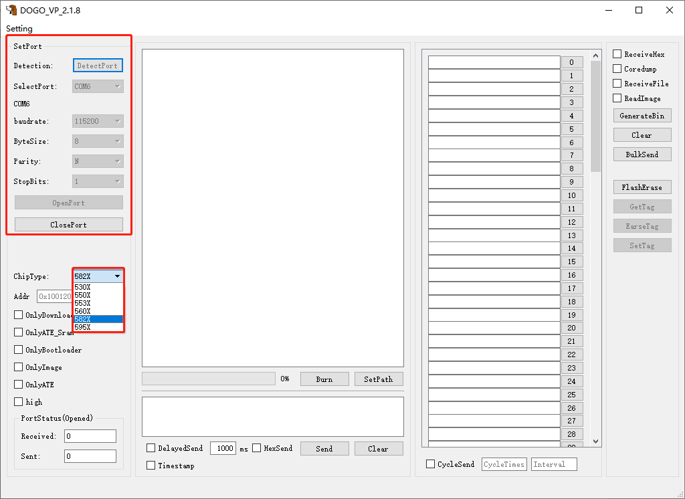
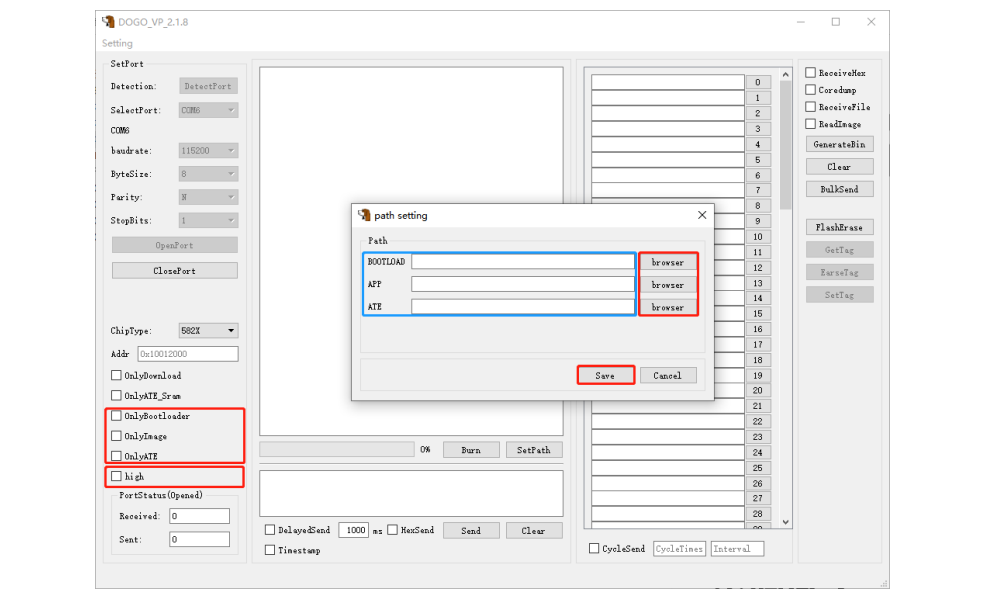
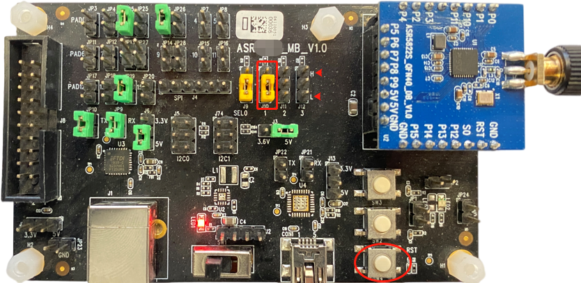
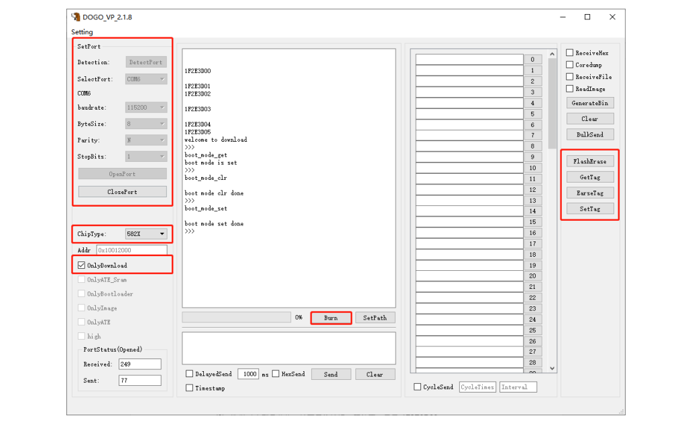
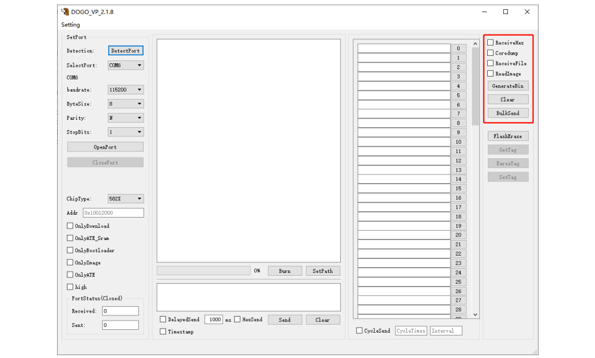

ASR IoT DOGO Tool User Guide
============================
`简体中文 <https://asriot-cn.readthedocs.io/zh/latest/ASR582X/烧录工具介绍/DOGO烧录调试工具.html>`_

Introduction
------------

**About This Document**

This document provides guidance on the configuration and operation of the DOGO tool used for program downloading and serial debugging.

**Included Chip Models**

This document applies to ASR IoT chips (Wi-Fi SoC, BLE SoC and Wi-Fi+BLE Combo SoC).

**Copyright Notice**

© 2023 ASR Microelectronics Co., Ltd. All rights reserved. No part of this document can be reproduced, transmitted, transcribed, stored, or translated into any languages in any form or by any means without the written permission of ASR Microelectronics Co., Ltd.

**Trademark Statement**

ASR and ASR Microelectronics Co., Ltd. are trademarks of ASR Microelectronics Co., Ltd. 

Other trade names, trademarks and registered trademarks mentioned in this document are property of their respective owners.

**Disclaimer**

ASR do not give any warranty of any kind and may make improvements and/or changes in this document or in the product described in this document at any time.

This document is only used as a guide, and no contents in the document constitute any form of warranty. Information in this document is subject to change without notice.

All liability, including liability for infringement of any proprietary rights caused by using the information in this document is disclaimed.

**ASR Microelectronics Co., Ltd.**

Address: 9F, Building 10, No. 399 Keyuan Road, Zhangjiang High-tech Park, Pudong New Area, Shanghai, 201203, China

Homepage: https://www.asrmicro.com/en

**Revision History**

======= ======= =========================
Date    Version Release Notes
======= ======= =========================
2023.03 V1.8.0  Change some descriptions.
======= ======= =========================

1. Overview
-----------

1.1 Main Interface
~~~~~~~~~~~~~~~~~~

The DOGO tool is used for program downloading and serial debugging during the application development with ASR IoT chips, and the main interface of the tool is shown below:

|image1|

1. **Port Setting**: Select the serial port connected to the demo board, and configure the parameters.
2. **Chip Model Selection**: Select the chip model
3. **Download Options**: The download options are configured (apart from the **High** option, only one option in this area can be selected) in conjunction with the **Bin File Path Setting**.
4. **Bin File Path Setting**: Set the path of the file to be downloaded, start downloading, and display the downloading progress.
5. **Command Sending**: Support one-time and periodic transmissions at the set interval for single command.

   -  Periodic transmissions are enabled by the **DelayedSend** option.
   -  Hexadecimal format is set by the **HexSend** option
   -  Information in the sending area is cleared by the **Clear** button.

6. **Bulk Command Sending**: The frequently used AT commands are saved in this area. A click on a numbered button sends the command beside it directly. In addition, you can check the **CycleSend** option to enable bulk commands to be sent periodically with *intervals* and *cycle times* set. The **BulkSend** option in Area **7** is used to hide or show this area.
7. **Auxiliary Function for Debugging**: Debug logs are saved as files when the **ReceiveFile** button is checked. The Flash memory can be read when the **ReadImage** option is checked, and can be saved as bin files once you click the **GenerateBin** button.
8. **Shortcut Command Setting:** Support the erase operations to Flash and the related operations to Tag.

1.2 Function
~~~~~~~~~~~~

The DOGO tool supports the following functions:

-  **Serial debugging**: Support AT command interaction and information displayed in Hex/ ASCII format. In addition, the received information can be saved as a file.

-  **Program downloading**\ ：

   -  **One-click to download all the selected firmware**: After clicking the **Burn** button, all the selected bin files will be downloaded to Flash one by one.
   -  **Download specified firmware**: check the related option in the **Download Options** area and bin files should be placed to the corresponding paths in advance.

-  **Bulk Command Sending**: This function area is hidden or shown by clicking the **BulkSend** button. Enter an AT command in each text box, and click the numbered button beside it to send the command. In addition, you can check the **CycleSend** option to enable bulk commands to be sent periodically with *intervals* and *cycle times* set.

-  **Only Download**: When this operation mode is enabled, the DOGO tool can be used to erase Flash memory, get TAG, set Tag, and erase Tag.

2. Tool Operation
-----------------

2.1 Program Download
~~~~~~~~~~~~~~~~~~~~

Take ASR582X Demo board as an example, and follow this procedure to download bin files into the demo board:

1. Configure the Demo board to download mode by the jumper cap outlined in red below. Connect the demo board to the serial port and the power supply of the PC, turn on the power switch, the red LED light is on.

|image2|

2. In the main interface of the tool, select the serial port connected to the demo board, configure the parameters, then click the **OpenPort** Button.

3. Select the chip model from the **ChipType** drop-down menu.

|image3|

4. Click **SetPath**, a small window pops up, then click the corresponding **browser** button to enter the directory, select the bin file to be downloaded, and click **Save** to close the pop-up window.

.. attention::
    1. When the paths of all the three bin files are selected, DOGO downloads the three bin files to the Flash with one click of the **Burn** button by default. If only one bin needs to be downloaded, select the path of the corresponding file.
    2. If the paths of all the three bin files are selected, but only one bin should be downloaded, then check the corresponding option in the **Download Options** area.

|image4|

5. If the serial port supports up to 1 Mbps of data rate, when the **High** option is checked, the demo board enters the high-speed download mode with 1 Mbps of data rate. Otherwise, the demo board enters the normal download mode.

6. | Press the **Reset** button (circled in red in the figure below Step 3) on the Demo board to enter download mode. After **“1F2E3D00”** is printed on the receive window of the tool, click the **Burn** button to start downloading.
7. When the progress bar reaches 100%, it means that the downloading is completed, and the power supply for the demo board should be turned off. At this time, move the jumper outlined in red in the figure below Step 3 to the position below to enter the Run mode. Turn on the power switch, then the red LED light is on, and the log information is printed on the receive window when the system is running normally.

|image5|

2.2 Tag Configuration
~~~~~~~~~~~~~~~~~~~~~

Follow the procedure to configure the Tag flag:

1. Configure the Demo board to download mode, connect it to the PC and turn on the power switch.

2. Select the serial port connected to the demo board, configure the parameters, and open the serial port.

3. Select the chip model from the **ChipType** drop-down menu, press the **Reset** button on the demo board, and “**1F2E3D00**” is printed on the main window of the tool.

4. Check the **OnlyDownload** option, then click the **Burn** button.

5. Configure the Tag options on the right of the main interface: **GetTag**, **EraseTag**, **SetTag**

.. attention::
    Flash erase operation can be performed in the Only Download mode, please be careful not to click the “FlashErase” option by mistake!

|image6|

2.3 Serial Debugging
~~~~~~~~~~~~~~~~~~~~

Follow this procedure to debug the serial ports:

1. Connect the PC and the ASR Demo board through the serial port, click the **DetectPort** button, and select the serial port connected to the demo board.
2. Configure the serial port parameters. After that, click the **OpenPort** button.
3. In the **Auxiliary Function for Debugging** area, check the **ReceiveHex** and **ReceiveFile** options to save the debug logs.

.. attention::
    1. When the Coredump function is not used, do not check the **Coredump** option.
    2. In the Command Sending area, **“\\r\\n”** is automatically sent following the transmitted command in ASCII format by default. In addition, periodic transmissions **(DelayedSend)** and hexadecimal format **(HexSend)** are supported

|image7|

.. |image1| image:: ../../img/550X_DOGO/DOGO图1-1.png
.. |image2| image:: ../../img/550X_DOGO/DOGO图2-1.png

