**ASR6601** Mass Production Download Scheme Introduction
========================================================
`简体中文 <https://asriot-cn.readthedocs.io/zh/latest/ASR6601/烧录工具介绍/量产烧录.html>`_

Introduction
------------

**About this Document**

This document mainly introduces the mass production download scheme for ASR6601CB/CBR and ASR6601SE/SER, including the design and use of mass production download fixtures and the use of ASR6601MultiProgrammer, for users to download files into the Flash of LPWAN SoC ASR6601.

**Intended Readers**

This document is mainly for engineers who use this chip to develop their own platform and products, for instance:

-  PCB Hardware Development Engineer

-  Software Engineer

-  Technical Support Engineer

**Included Chip Models**

The product models corresponding to this document are as follows.

+------------+--------+-------+--------------------------------------------+---------------+---------------+
| Model      | Flash  | SRAM  | Core                                       | Package       | Frequency     |
+============+========+=======+============================================+===============+===============+
| ASR6601SE  | 256 KB | 64 KB | 32-bit 48 MHz Arm China STAR-MC1 Processor | QFN68, 8*8 mm | 150 ~ 960 MHz |
+------------+--------+-------+--------------------------------------------+---------------+---------------+
| ASR6601CB  | 128 KB | 16 KB | 32-bit 48 MHz Arm China STAR-MC1 Processor | QFN48, 6*6 mm | 150 ~ 960 MHz |
+------------+--------+-------+--------------------------------------------+---------------+---------------+
| ASR6601SER | 256 KB | 64 KB | 32-bit 48 MHz Arm China STAR-MC1 Processor | QFN68, 8*8 mm | 150 ~ 960 MHz |
+------------+--------+-------+--------------------------------------------+---------------+---------------+
| ASR6601CBR | 128 KB | 16 KB | 32-bit 48 MHz Arm China STAR-MC1 Processor | QFN48, 6*6 mm | 150 ~ 960 MHz |
+------------+--------+-------+--------------------------------------------+---------------+---------------+

**Copyright Notice**

© 2023 ASR Microelectronics Co., Ltd. All rights reserved. No part of this document can be reproduced, transmitted, transcribed, stored, or translated into any language in any form or by any means without the written permission of ASR Microelectronics Co., Ltd.

**Trademark Statement**

ASR and ASR Microelectronics Co., Ltd. are trademarks of ASR Microelectronics Co., Ltd. 

Other trade names, trademarks, and registered trademarks mentioned in this document are the property of their respective owners and are hereby declared.

**Disclaimer**

ASR does not give any warranty of any kind and may make improvements and/or changes in this document or in the product described in this document at any time.

This document is only used as a guide, and no contents in the document constitute any form of warranty. Information in this document is subject to change without notice.

All liability, including liability for infringement of any proprietary rights caused by using the information in this document, is disclaimed.

**ASR Microelectronics Co., Ltd.**

Address: 9F, Building 10, No. 399 Keyuan Road, Zhangjiang High-tech Park, Pudong New Area, Shanghai, 201203, China

Homepage: http://www.asrmicro.com/

**Revision History**

======= ======= ==============
Date    Version Release Notes
======= ======= ==============
2023.12 V1.0.0  First Release.
======= ======= ==============

1. Overview
-----------

Mass production download and testing are the two main issues for mass production. There are a variety of mass production download solutions for LoRa products with different requirements. Commonly used ones are as follows:

+------------+--------------------------------------------------+--------------------------------------------------------------------------------------------------------------------------------------------+------------------------------------------------------------------------------------------------+---------------------------------------------------+
| **Number** | **Scheme**                                       | **Descriptions**                                                                                                                           | **Advantages/Disadvantages**                                                                   | **Remark**                                        |
+============+==================================================+============================================================================================================================================+================================================================================================+===================================================+
| 1          | FT testing machine                               | ASR helps customers in downloading bin or hex files when performing the FT test.                                                           | Time-saving but costly.                                                                        | Bulk online chip download.                        |
+------------+--------------------------------------------------+--------------------------------------------------------------------------------------------------------------------------------------------+------------------------------------------------------------------------------------------------+---------------------------------------------------+
| 2          | Automatic download machine                       | Develop a dedicated test motherboard, supporting download of multiple DUTs and the automatic picking and placing of chips by robotic arms. | Large investment due to the development of a dedicated test motherboard.                       | Bulk online chip download.                        |
+------------+--------------------------------------------------+--------------------------------------------------------------------------------------------------------------------------------------------+------------------------------------------------------------------------------------------------+---------------------------------------------------+
| 3          | Multi-channel mass production download fixtures  | Develop a dedicated test motherboard and daughterboard for test fixtures.                                                                  | Moderate technology capability requirements and investment, manual download in medium batches, | Online chip or module download in medium batches. |
+------------+--------------------------------------------------+--------------------------------------------------------------------------------------------------------------------------------------------+------------------------------------------------------------------------------------------------+---------------------------------------------------+
| 4          | Single-channel mass production download fixtures | Download a single module or chip, similar to an ASR socket board. A serial port board and a test module are connected with a wire.         | Low technology capability requirements and investment, manual download in small batches.       | Online chip or module download in small batches.  |
+------------+--------------------------------------------------+--------------------------------------------------------------------------------------------------------------------------------------------+------------------------------------------------------------------------------------------------+---------------------------------------------------+

.. note:: 
    1. Scheme 1 and 2 combine mass production download and testing. The ASR FT test includes downloading.
    2. The offline download versions of Scheme 3 and Scheme 4 are also available. ASR mass production download board has an offline download version.
    3. The chip needs to be programmed in a customized socket and socket board.
    4. The programming module also requires a specialized test board, where the test pins are connected to the test points on the back of the module.

2. ASR Mass Production Download
-------------------------------

ASR has developed a set of mass production download fixtures for the ASR6601CB/CBR and ASR6601SE/SER, as well as the supporting downloading software, ASR6601MultiProgrammer, which can be used to download up to 16 chips or modules at the same time. This document provides a feasible solution for mass production download of ASR6601 module and chip for customers’ reference, which includes:

(1) Mass Production Download Fixtures

(2) ASR6601MultiProgrammer

2.1 Mass Production Download Fixtures
~~~~~~~~~~~~~~~~~~~~~~~~~~~~~~~~~~~~~

2.1.1 Fixture Structure
^^^^^^^^^^^^^^^^^^^^^^^

The structure of the ASR mass production download fixtures is shown below:

|image1|

|image2|

|image3|

2.1.2 Fixture Composition
^^^^^^^^^^^^^^^^^^^^^^^^^

The ASR6601 mass production download fixtures consist of the following parts:

(1) ASR6601 download motherboard

(2) ASR6601CB/CBR and ASR6601SE/SER download daughter board

(3) ASR6601CB/CBR and ASR6601SE/SER module board

.. note:: 
    All hardware schematics and layout are available.

2.1.2.1 Download Mainboard
''''''''''''''''''''''''''

ASR6601 online download motherboard design:

(1) Connect a USB port to the PC without additional USB HUB;

(2) Multi-channel download can be performed and the download timing meets the requirements.

The schematic diagram of the ASR6601 online download motherboard is shown below:

|image4|

.. note:: 
    1. For details of ASR6601 online download motherboard schematic, please refer to: asr6601_prog_evb_v10_221213.pdf。
    2. The schematic for the ASR6601 offline download motherboard is the same as the one for online download motherboard, with the addition of a Raspberry Pi interface.

2.1.2.2 Download Daughter Board
'''''''''''''''''''''''''''''''

ASR6601 download daughter board design:

(1) The download daughter board and the module board are connected through a probe board.

(2) The design of the download daughter board should correspond with the design of the module board.

The ASR6601CB/CBR download daughter board layout is shown below:

|image5|

The ASR6601SE/SER download daughter board layout is shown below:

|image6|

.. note:: 
    1. For details of ASR6601CB/CBR download daughterboard schematic, please refer to: asr6601cb_prog_db_v10_230404.pdf.
    2. For the details of ASR6601SE/SER download daughterboard schematic, please refer to: asr6601se_prog_db_v10_230404.pdf.
    3. The thickness of the ASR6601 download daughterboard should be increased, and the thickness of the gold plating on the pads that contact the pins should be increased.
    4. Additional location holes and screw holes are required on the ASR6601 download daughterboard to secure the probe card above.

2.1.2.3 Module Board
''''''''''''''''''''

The ASR6601CB/CBR module layout is based on the ASR6601CB/CBR Demo Module, and the structure and dimensions of the module board are shown below:

|image7|

The ASR6601SE/SER module layout is based on the ASR6601SE/SER Demo Module, and the structure and dimensions of the module board are shown below:

|image8|

.. note:: 
    1. The ASR6601CB/CBR and ASR6601SE/SER modules designed by customers may differ from ASR's demo modules, so they can be paneled based on their own modules. Regardless of the size of the module and how to panel the board, the test points on the back of the module must be routed out: VDD, GND, RESET, GPIO02, GPIO16, GPIO17.
    2. The download daughterboard and the module board correspond one-to-one, and the test points on the back of the module board are connected to the daughterboard through the probe board. If there is an offset in the test pad, it will cause the signal to be unable to connect and the download will fail.
    3. Customers can use the demo module provided by ASR based on the above module for sampling.

2.1.2.4 Recommendations for Optimization
''''''''''''''''''''''''''''''''''''''''

The first version of the ASR6601 mass production fixtures had flaws in the design of the daughterboard and the module board, which had some impact on the mass production test results, as summarized below:

**1.** **The probability of DUT 06 downloading failing is almost 100%, and the probability of DUT 04 downloading failing is about 50%.**

|image9|

**Possible cause**: ASR’s first version of the white probe board and the green test daughterboard - the DUT in the middle didn’t adhere very well, with small gaps on the sides and a larger gap in the middle. The white probe board is only screwed in at both ends, causing it to curve upward in the middle, and DUT4 and DUT6 are located in the middle with a leftward bias, resulting in a high probability of downloading failure for both of them.

**Recommendations:** Optimize the download daughterboard by adding some location holes or screw holes in the middle. The layout of the download daughterboard has been optimized in this document.

**2.** **There is a probability of the failed download for several DUTs at each press-fit, and which one is uncertain.**

|image10|

**Possible causes:**

(1) The black foam board used to secure the module is far away during the press-fit, which causes the module and probe board to be misaligned when they come into contact, resulting in inconsistent pressing each time.

(2) The module location columns are not precise enough, resulting in the misalignment. This may cause the pins to land outside the pads, resulting in a failed connection and download.

(3) The pins on the probe board are not precise enough, causing the misalignment. This may result in the pins landing outside the pads, resulting in a failed connection and a failed download.

**Recommendations:**

(1) Shorten the distance of the black foam board during pressing to reduce the module wobble.

(2) Improve the accuracy of the location hole of the module board.

**3.** **When pressed multiple times, the plastic housing of the power inductor on the module board cracks.**

**Possible causes:** The cover plate was hollowed out to an inappropriate size, and any contact with it will damage the power inductor.

**Recommendations:**

(1) Adjust the size of the cover plate being hollowed out.

(2) Add a shield to the power inductor.

**4.** **The black foam board has sharp corners, which can easily scratch your hands.**

**Recommendations:** Round off all the sharp corners.

2.2 ASR6601 MultiProgrammer
~~~~~~~~~~~~~~~~~~~~~~~~~~~

This document mainly introduces the MultiProgrammer Tool (Version 0.3 and above) for users to download files into the Flash of LPWAN SoC ASR6601. Please note that the tool is only available on 64-bit operating systems.

2.2.1 Tool Introduction
^^^^^^^^^^^^^^^^^^^^^^^

|image11|

The Main Interface of the tool can be divided into six main parts:

1. **Serial Port Configuration**: Set the baud rate of the communication serial port.

2. **File Download Configuration**: Configure the file to be downloaded and the address to download the file to. The user must download at least one file to address 0x08000000 to ensure that the program can run properly.

3. **Download Keys Configuration (optional)**: Configure the unique identifying information about the module (i.e. Mac address or Triplet information).

4. **Flash Security Enable**: Enable or disable flash security.

5. **Download Operation**: The **Start** button is used for file download. The **Erase All** button is only used when you need to erase all the information in Flash.

6. **Status Display**: Display the download progress and result (success or failure).

2.2.2 Tool Operation
^^^^^^^^^^^^^^^^^^^^

2.2.2.1 Enter Download Mode
'''''''''''''''''''''''''''

Before download, connect GPIO02 to VCC3.3, then power the module to make it enter the download mode.

|image12|

2.2.2.2 Flash Download
''''''''''''''''''''''

Follow this procedure to download files to ASR6601 Flash with the ASR6601MultiProgrammer tool:

1. Choose the serial port:

|image13|

2. Select the file to be downloaded:

|image14|

|image15|

3. Click the **Start** button to begin downloading:

|image16|

|image17|

4. Finish downloading:

|image18|

2.2.3 The reason for Failed Download
^^^^^^^^^^^^^^^^^^^^^^^^^^^^^^^^^^^^

When the bin files cannot be downloaded to modules, please check the following:

1. Check if the serial port connection is normal.

2. Switch the position of the failed and passed ones, then re-start downloading, to determine whether the module is faulty.

3. Check if the module is in download mode: try to reconnect GPIO02 to VCC3.3, then press the **RESET** button to reboot the module.

|image19|

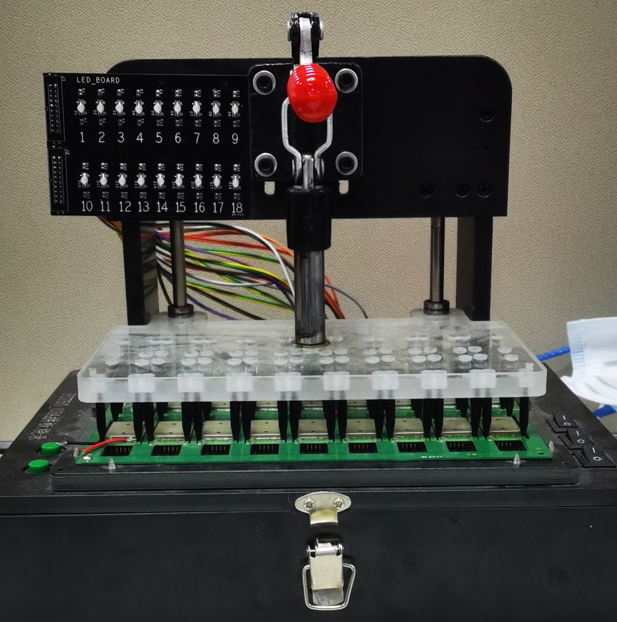
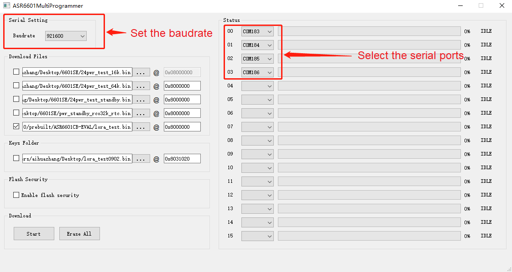
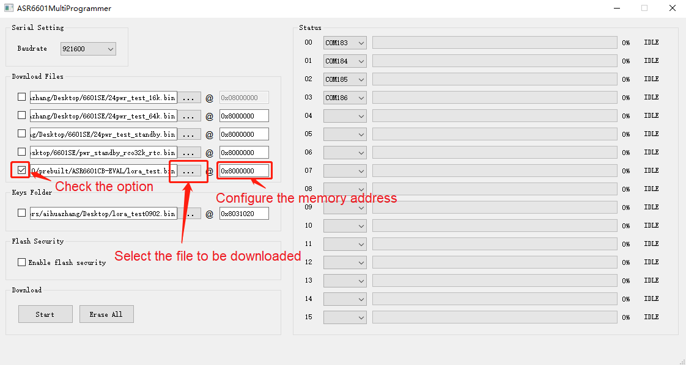
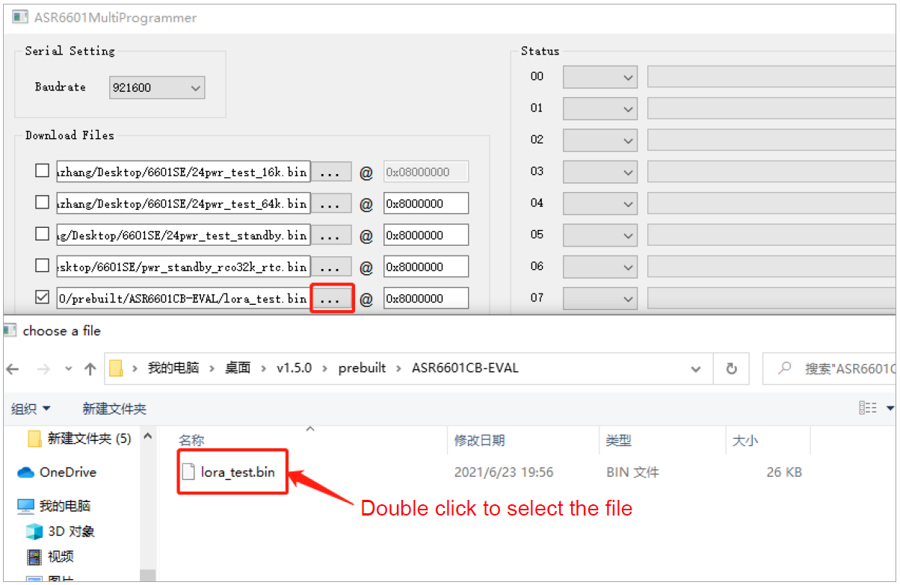
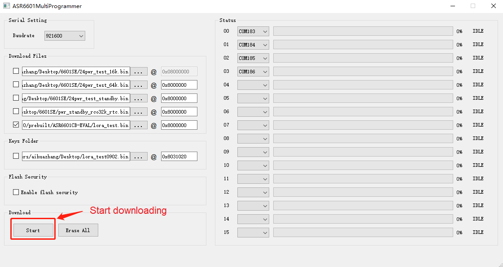
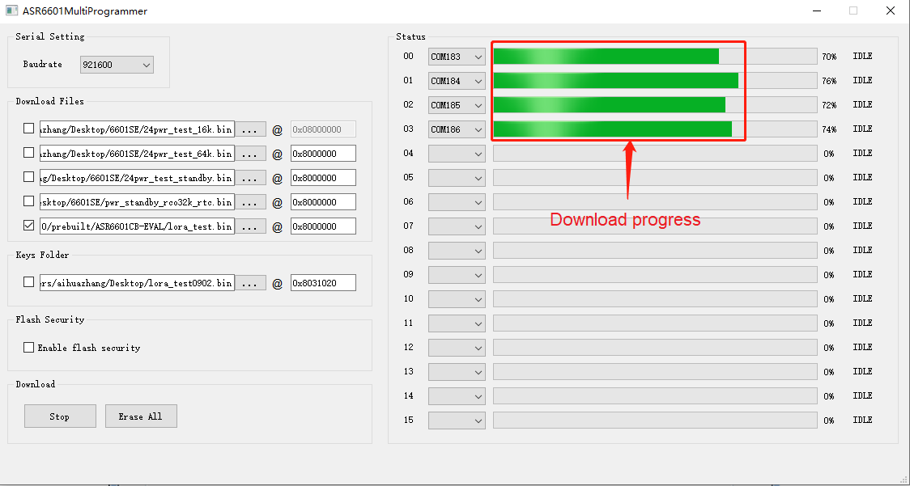
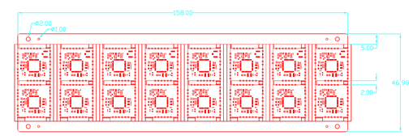
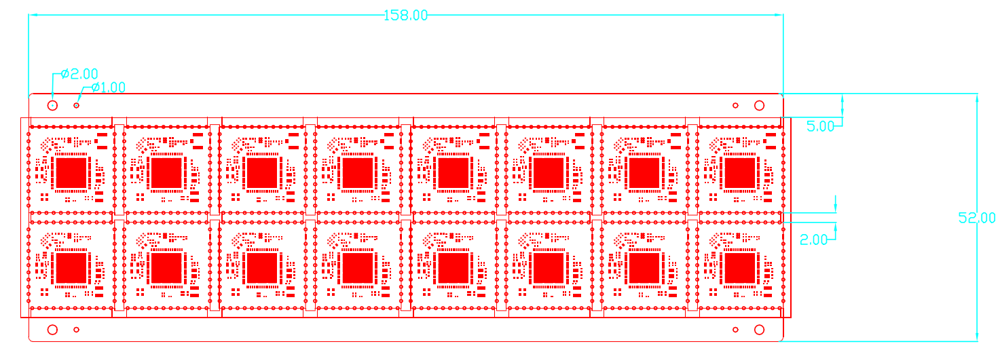
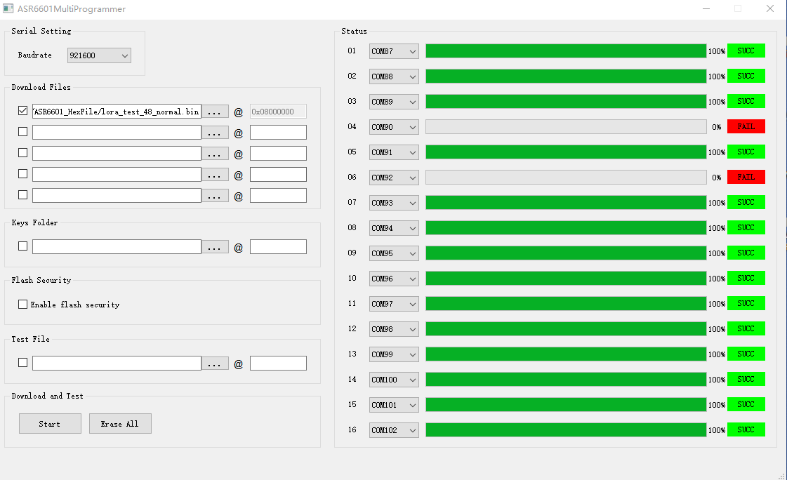
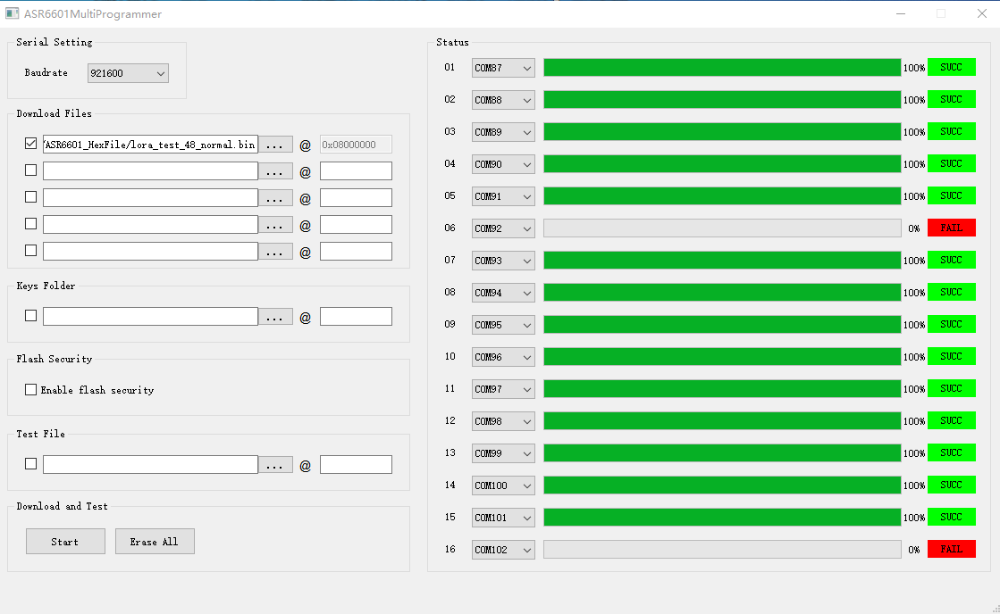
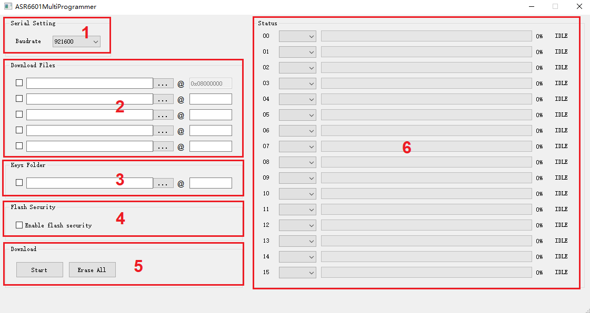
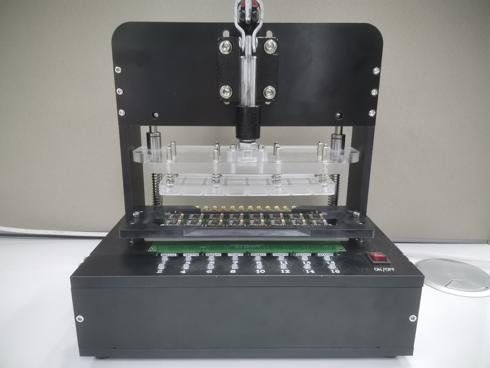

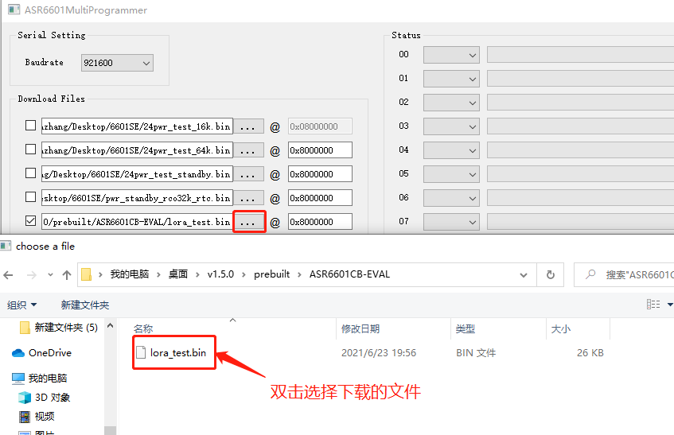

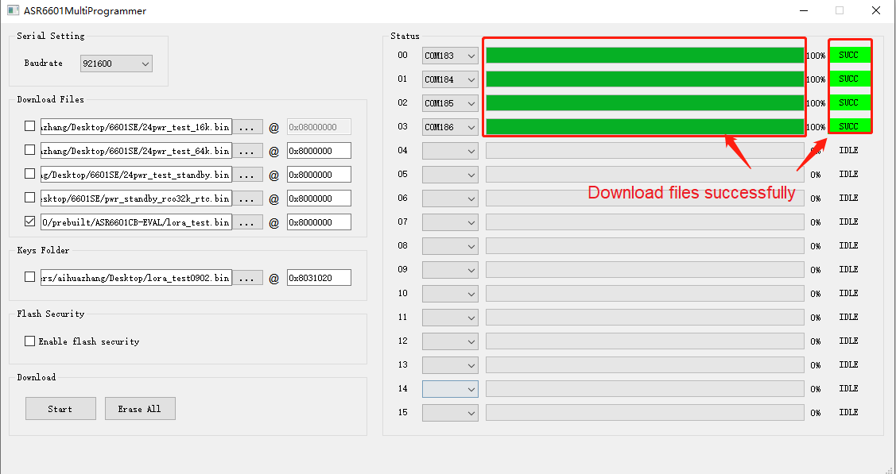
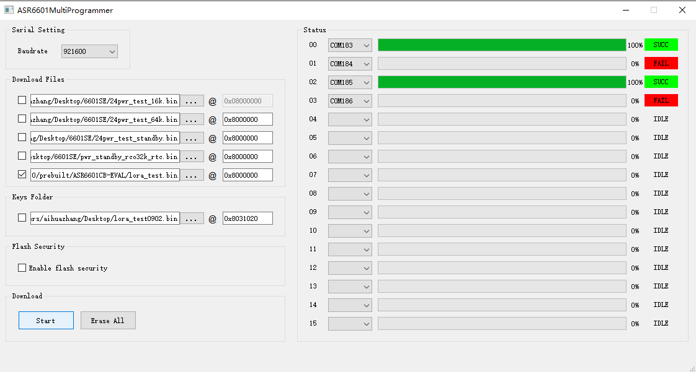