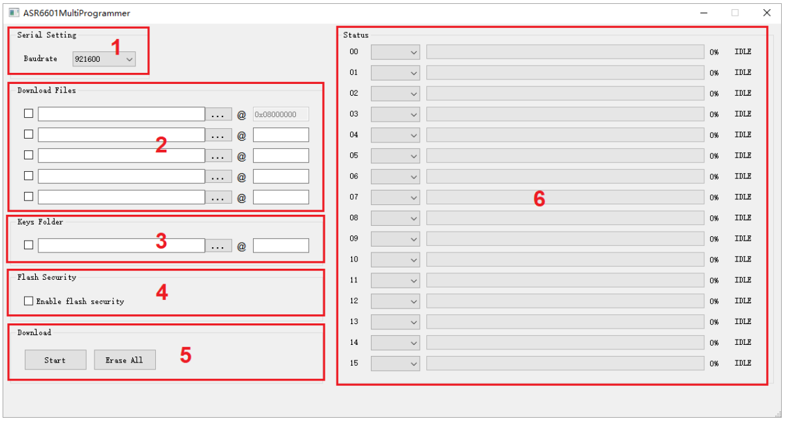
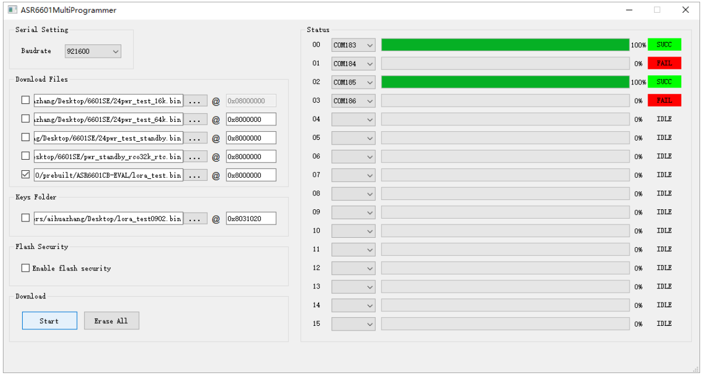

ASR6601 MultiProgrammer Tool User Guide
========================================

Introduction
------------

**About This Document**

This document mainly introduces the MultiProgrammer Tool (Version 0.3 and above) for users to download files into the Flash of LPWAN SoC ASR6601. Please note that the tool is only available on 64-bit operating systems.

**Included Chip Models**

The product models corresponding to this document are as follows.

+-----------+--------+-------+----------------------------------+---------------+---------------+
| Model     | Flash  | SRAM  | Core                             | Package       | Frequency     |
+===========+========+=======+==================================+===============+===============+
| ASR6601SE | 256 KB | 64 KB | 32-bit 48 MHz ARM China STAR MC1 | QFN68, 8*8 mm | 150 ~ 960 MHz |
+-----------+--------+-------+----------------------------------+---------------+---------------+
| ASR6601CB | 128 KB | 16 KB | 32-bit 48 MHz ARM China STAR MC1 | QFN48, 6*6 mm | 150 ~ 960 MHz |
+-----------+--------+-------+----------------------------------+---------------+---------------+

**Copyright Notice**

© 2022 ASR Microelectronics Co., Ltd. All rights reserved. No part of this document can be reproduced, transmitted, transcribed, stored, or translated into any language in any form or by any means without the written permission of ASR Microelectronics Co., Ltd.

**Trademark Statement**

ASR and ASR Microelectronics Co., Ltd. are trademarks of ASR Microelectronics Co., Ltd. 

Other trade names, trademarks, and registered trademarks mentioned in this document are the property of their respective owners and are hereby declared.

**Disclaimer**

ASR does not give any warranty of any kind and may make improvements and/or changes in this document or in the product described in this document at any time.

This document is only used as a guide, and no contents in the document constitute any form of warranty. Information in this document is subject to change without notice.

All liability, including liability for infringement of any proprietary rights caused by using the information in this document, is disclaimed.

**Document Version**

.. raw:: html

   

+---------------------+----------------------+---------------------------------+
| Date                | Version              | Release Notes                   |
+=====================+======================+=================================+
| 2021.12             | V1.0.0               | First Release.                  |
+---------------------+----------------------+---------------------------------+

.. raw:: html

   

2. Tool Introduction
--------------------

The main interface of the ASR6601MultiProgrammer tool is shown in the figure below:

|image1|

The Main Interface of the tool can be divided into six main parts:

**1. Serial Port Configuration**: Set the baud rate of the communication serial port.

**2. File Download Configuration**: Configure the file to be downloaded and the address to download the file to. The user must download at least one file to address 0x08000000 to ensure that the program can run properly.

**3. Download Keys Configuration (optional)**: Configure the unique identifying information about the module (i.e. Mac address or Triplet information).

**4. Flash Security Enable**: Enable or disable flash security.

**5. Download Operation**: The **Start** button is used for file download. The **Erase All** button is only used when you need to erase all the information in Flash.

**6. Status Display**: Display the download progress and result (success or failure).

2. Tool Operation
-----------------

2.1 Enter Download Mode
~~~~~~~~~~~~~~~~~~~~~~~

Before download, connect GPIO02 to VCC3.3, then power the module to make it enter the download mode.

|image2|

2.2 Flash Download
~~~~~~~~~~~~~~~~~~~~~~~~

Follow this procedure to download files to ASR6601 Flash with the ASR6601MultiProgrammer tool:

(1) Choose the serial port:

|image3|

(2) Select the file to be downloaded:

|image4|

|image5|

\3. Click the **Start** button to begin downloading:

|image6|

|image7|

\4. Finish downloading:

|image8|

3. Q&A
------

3.1 What is the reason for a failed download?
~~~~~~~~~~~~~~~~~~~~~~~~~~~~~~~~~~~~~~~~~~~~~~~~~~~~~~~~~

When the bin files cannot be downloaded to modules, please check the following:

\1. Check if the serial port connection is normal.

\2. Switch the position of the failed and passed ones, then re-start downloading, to determine whether the module is faulty.

\3. Check if the module is in download mode: try to reconnect GPIO02 to VCC3.3, then press the **RESET** button to reboot the module.

|image9|

.. |image2| image:: ../../img/6601_MPtool/图2-1.png
.. |image3| image:: ../../img/6601_MPtool/图2-2.png
.. |image4| image:: ../../img/6601_MPtool/图2-3.png
.. |image5| image:: ../../img/6601_MPtool/图2-4.png
.. |image6| image:: ../../img/6601_MPtool/图2-5.png
.. |image7| image:: ../../img/6601_MPtool/图2-6.png
.. |image8| image:: ../../img/6601_MPtool/图2-7.png

