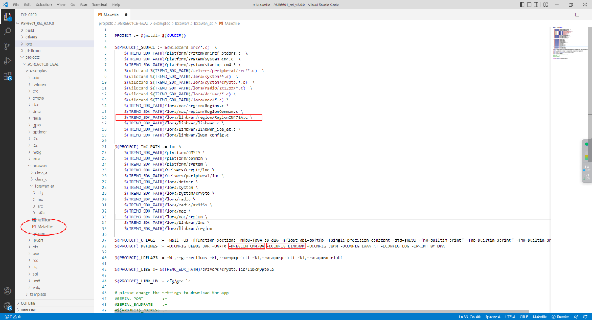
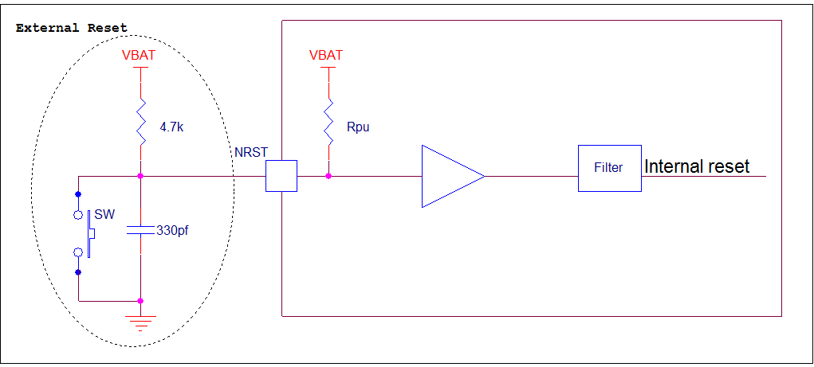
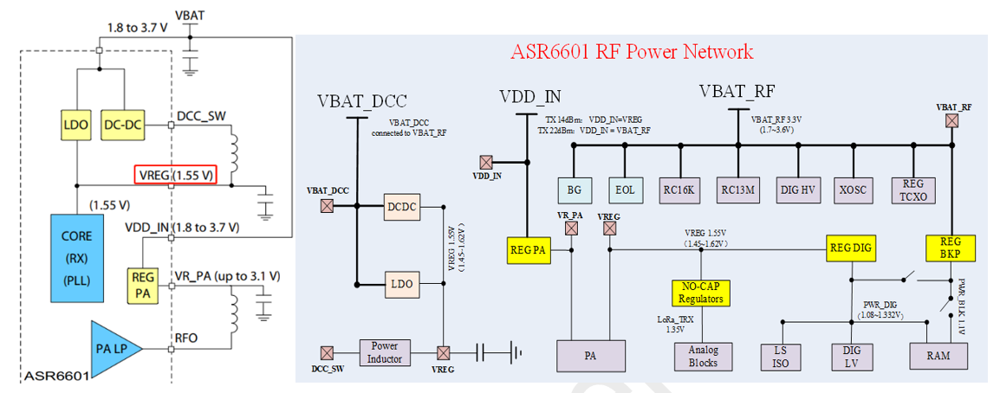
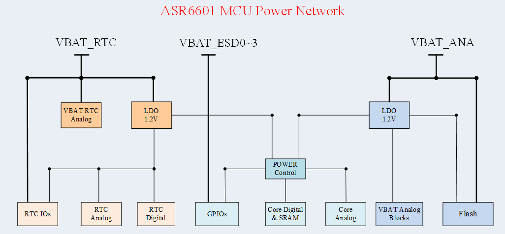
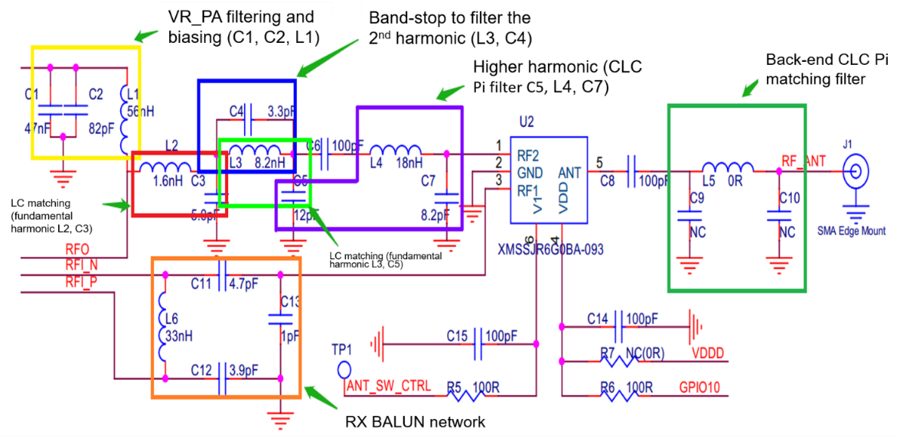

.. role:: raw-latex(raw)
   :format: latex
..

ASR6601 FAQs
============
`简体中文 <https://asriot-cn.readthedocs.io/zh/latest/ASR6601/常见问题/常见问题.html>`_

Introduction
------------

**About this Document**

This document introduces frequently asked questions about the ASR6601 and answers to them.

**Intended Readers**

This document is mainly for engineers who use this chip to develop their own platform and products, for instance:

-  Software Engineer

-  Technical Support Engineer

**Included Chip Models**

The product models corresponding to this document are as follows.

+------------+--------+-------+----------------------------------+---------------+---------------+
| Model      | Flash  | SRAM  | Processor                        | Package       | Frequency     |
+============+========+=======+==================================+===============+===============+
| ASR6601SE  | 256 KB | 64 KB | 32-bit 48 MHz Arm China STAR-MC1 | QFN68, 8*8 mm | 150 ~ 960 MHz |
+------------+--------+-------+----------------------------------+---------------+---------------+
| ASR6601CB  | 128 KB | 16 KB | 32-bit 48 MHz Arm China STAR-MC1 | QFN48, 6*6 mm | 150 ~ 960 MHz |
+------------+--------+-------+----------------------------------+---------------+---------------+
| ASR6601SER | 256 KB | 64 KB | 32-bit 48 MHz Arm China STAR-MC1 | QFN68, 8*8 mm | 150 ~ 960 MHz |
+------------+--------+-------+----------------------------------+---------------+---------------+
| ASR6601CBR | 128 KB | 16 KB | 32-bit 48 MHz Arm China STAR-MC1 | QFN48, 6*6 mm | 150 ~ 960 MHz |
+------------+--------+-------+----------------------------------+---------------+---------------+

**Copyright Notice**

© 2023 ASR Microelectronics Co., Ltd. All rights reserved. No part of this document can be reproduced, transmitted, transcribed, stored, or translated into any language in any form or by any means without the written permission of ASR Microelectronics Co., Ltd.

**Trademark Statement**

ASR and ASR Microelectronics Co., Ltd. are trademarks of ASR Microelectronics Co., Ltd. 

Other trade names, trademarks, and registered trademarks mentioned in this document are the property of their respective owners and are hereby declared.

**Disclaimer**

ASR does not give any warranty of any kind and may make improvements and/or changes in this document or in the product described in this document at any time.

This document is only used as a guide, and no contents in the document constitute any form of warranty. Information in this document is subject to change without notice.

All liability, including liability for infringement of any proprietary rights caused by using the information in this document, is disclaimed.

**ASR Microelectronics Co., Ltd.**

Address: 9F, Building 10, No. 399 Keyuan Road, Zhangjiang High-tech Park, Pudong New Area, Shanghai, 201203, China

Homepage: http://www.asrmicro.com/

**Revision History**

======= ======= ==============
Date    Version Release Notes
======= ======= ==============
2023.07 V1.0.0  First Release.
======= ======= ==============

1. Software
-----------

1.1 Does the MultiProgrammer Tool support address code stepping?
~~~~~~~~~~~~~~~~~~~~~~~~~~~~~~~~~~~~~~~~~~~~~~~~~~~~~~~~~~~~~~~~

Yes, it does. The **Keys Folder** option in the main interface of the MultiProgrammer Tool allows users to download the address codes into folders one file per module.

1.2 What are the definitions of Main, AON, and AONR?
~~~~~~~~~~~~~~~~~~~~~~~~~~~~~~~~~~~~~~~~~~~~~~~~~~~~

Main is the generic power domain, AON (always on) is the power domain for RTC, and AONR (always on retention) is the power domain for SRAM.

1.3 Why is there no TX signal?
~~~~~~~~~~~~~~~~~~~~~~~~~~~~~~

Please check the following:

(1) Check if the transmitting and measuring frequencies are the same.

(2) Check if the matching circuit is normal.

(3) Check if the XO32M crystal oscillates. After downloading XO32M.bin, connect the serial ports (the pins are GPIO16 and GPIO17 respectively). If it prints “XO32M OK”, it means XO32M oscillates.

1.4 How to check if XO32K oscillates?
~~~~~~~~~~~~~~~~~~~~~~~~~~~~~~~~~~~~~

After downloading XO32K.bin, connect the serial port (its pins are GPIO16 and GPIO17). If it prints “XO32K OK”, it means XO32K oscillates.

1.5 How to avoid the RTC not working when XO32K clock is used?
~~~~~~~~~~~~~~~~~~~~~~~~~~~~~~~~~~~~~~~~~~~~~~~~~~~~~~~~~~~~~~

Enable the XO32K clock by calling interface rcc_enable_oscillator (RCC_OSC_XO32K, true) before enabling the RTC clock.

1.6 What is the function of the RTC_TAMPER/RTC_WAKEUPx IO port?
~~~~~~~~~~~~~~~~~~~~~~~~~~~~~~~~~~~~~~~~~~~~~~~~~~~~~~~~~~~~~~~

They are used to wake up the CPU by GPIO level detection in the RTC module in Sleep mode. Refer to the rtc:raw-latex:`\wakeup `routine in the SDK.

1.7 Why does the GPIO fail to wake up the CPU after configuration in Stop3 mode?
~~~~~~~~~~~~~~~~~~~~~~~~~~~~~~~~~~~~~~~~~~~~~~~~~~~~~~~~~~~~~~~~~~~~~~~~~~~~~~~~

In Stop3 mode, every 4 GPIOs as a group can generate a wake-up signal, with the wake-up level and wake-up signal of each group being uniformly configured. For more details, please refer to the description of gpiox_stop3_wu_cr register in the GPIO chapter of *ASR6601_Reference Manual* and the gpio_config_stop3_wakeup interface information in the SDK.

1.8 What is the difference between the RX_DONE and RX_TIMEOUT interrupts of UART?
~~~~~~~~~~~~~~~~~~~~~~~~~~~~~~~~~~~~~~~~~~~~~~~~~~~~~~~~~~~~~~~~~~~~~~~~~~~~~~~~~

In UART FIFO mode, the RX_DONE interrupt is triggered when the data in the RX FIFO reaches the preset water level. When the RX FIFO is not empty and does not reach the preset water level, the RX_TIMEOUT interrupt is triggered if no data is received within 32-bit time after the previous character is received.

1.9 How to wake up the MCU via LoRa?
~~~~~~~~~~~~~~~~~~~~~~~~~~~~~~~~~~~~

In Stop3 mode, configure LoRa to wake up the MCU by code PWR->CR1 \|= (1<<7).
In Stop0~Stop2 mode, configure LoRa to wake up the MCU by code PWR->CR0 \|= (1<<6).

1.10 What is the state of each GPIO when the chip is reset?
~~~~~~~~~~~~~~~~~~~~~~~~~~~~~~~~~~~~~~~~~~~~~~~~~~~~~~~~~~~

GPIO06/07 is used as SWD function by default when the chip is reset. Keep pressing the **Reset** button on the development board, and GPIO02 and GPIO03 will always be in the input pull-down state. Release the **Reset** button, and GPIO02 and GPIO03 will switch to a high impedance state.

1.11 Why is there a large deviation of the sampling value when the ADC sampling rate is 6K?
~~~~~~~~~~~~~~~~~~~~~~~~~~~~~~~~~~~~~~~~~~~~~~~~~~~~~~~~~~~~~~~~~~~~~~~~~~~~~~~~~~~~~~~~~~~

The ADC sampling rate must be 10K or above.

1.12 Why is there a large deviation of the sampling value when the ADC sampling rate Is 1M?
~~~~~~~~~~~~~~~~~~~~~~~~~~~~~~~~~~~~~~~~~~~~~~~~~~~~~~~~~~~~~~~~~~~~~~~~~~~~~~~~~~~~~~~~~~~

DMA should be used when the ADC sampling rate is greater than or equal to 500K, because if polling is used, there will be an overflow of sampled data and inaccurate sampling values due to the slow program execution.

1.13 What should be done if the deviation of the ADC sampling value exceeds 10 mV?
~~~~~~~~~~~~~~~~~~~~~~~~~~~~~~~~~~~~~~~~~~~~~~~~~~~~~~~~~~~~~~~~~~~~~~~~~~~~~~~~~~

The ADC should preferably sample 20 to 30 times per channel, with the average sampling value as the final sampling value.

1.14 Why is the voltage read on the VBAT31 channel of the ADC inaccurate?
~~~~~~~~~~~~~~~~~~~~~~~~~~~~~~~~~~~~~~~~~~~~~~~~~~~~~~~~~~~~~~~~~~~~~~~~~

The ADC’s internal VBAT31 voltage divider is disabled by default and has to be enabled by calling the adc_enable_vbat31 interface before adc_init.

1.15 How to configure the ADC reference voltage as external reference voltage?
~~~~~~~~~~~~~~~~~~~~~~~~~~~~~~~~~~~~~~~~~~~~~~~~~~~~~~~~~~~~~~~~~~~~~~~~~~~~~~

The ADC reference voltage is configured by the D_ADC_SEL_VREF bit in the RST analog register as external reference voltage with the bit cleared and internal reference voltage with bit set. The bit is set by default.

TREMO_ANALOG_WR(0X12, ((TREMO_ANALOG_RD(0x12) & (~(1<<6)))));

1.16 Why does the LPTIMER fail to initialize when using an external clock?
~~~~~~~~~~~~~~~~~~~~~~~~~~~~~~~~~~~~~~~~~~~~~~~~~~~~~~~~~~~~~~~~~~~~~~~~~~

When an external clock is used, the clock signal should be input to the ETR pin before LPTIMER can be initialized successfully.

1.17 Why is the function of GPIO62 on the 48-pin demo board invalid?
~~~~~~~~~~~~~~~~~~~~~~~~~~~~~~~~~~~~~~~~~~~~~~~~~~~~~~~~~~~~~~~~~~~~

The 48-pin demo board used is ASR6601DB earlier, and its Pin24 corresponds to GPIO61, while the Pin24 of the ASR6601CB corresponds to GPIO62. ASR6601DB is for R&D only, while ASR6601CB is for mass production.

1.18 How to output crystal clock from MCO?
~~~~~~~~~~~~~~~~~~~~~~~~~~~~~~~~~~~~~~~~~~

gpio_set_iomux(GPIOA, GPIO_PIN_5, 5);
rcc_set_mco_clk_source(RCC_MCO_CLK_SOURCE_XO32K);
rcc_set_mco_clk_div(RCC_MCO_CLK_DIV_1);
rcc_enable_mco_clk_output(true);

1.19 How to configure LinkWAN protocol?
~~~~~~~~~~~~~~~~~~~~~~~~~~~~~~~~~~~~~~~

ASR6601 supports LinkWAN protocol, which is configured by modifying the **Makefile** of the lorawan_at project in the SDK.

|image1|

2. Hardware
-----------

2.1 How to avoid abnormal RST reset?
~~~~~~~~~~~~~~~~~~~~~~~~~~~~~~~~~~~~

The power-on reset circuit and power-on sequence are integrated into the ASR6601 SoC chip, so the voltage can be loaded on VBAT directly.

|image2|

The VBAT must rise to above 0.7 Vcc within 10 ms before the internal power-on RST circuit can be reset normally. There is a low-voltage detection module inside the chip. When VBAT is lower than 0.3 Vcc, the chip will always be in the reset state internally.

The chip has been optimized internally. The pull-up resistor of the external RST circuit is recommended to be 4.7K, and the reset capacitor is recommended to be 330 pf to minimize the delayed reset time. If a large capacitor is connected externally, VBAT will rise slowly, bringing risks for the system. (e.g. Flash may be erased).

2.2 What are the considerations for the power supply?
~~~~~~~~~~~~~~~~~~~~~~~~~~~~~~~~~~~~~~~~~~~~~~~~~~~~~

The ASR6601 RF circuit integrates DC-DC and LDO internally, with VBAT_DCC (VBAT) as input, and VREG as output at 1.55 V. VDCC_RF should be connected to VREG. NC or connection to VCC will cause the RF of the chip to work abnormally or even burn out.

|image3|

The VDD_IN voltage is input to the Regulator (REG PA) and outputs as VR_PA, which varies with the TX power. VR_PA supplies bias to RFO (PA output) through the external pull-up inductor.

VDD_IN should be connected to VCC, and when the TX power demand is less than 14 dBm, VREG can directly supply power to VDD_IN to improve performance.

There are four parts of ASR6601 power: *VBAT_ESDx (x=0-3)*, *VBAT_ANA*, *VBAT_RF* and *VBAT_RTC*. *VBAT_ESDx* supplies power to the digital parts of MCU. *VBAT_ANA* supplies power to the ADC parts of MCU. *VBAT_RF* supplies power to the RF parts of MCU. *VBAT_RTC* supplies power to RTC.

|image4|

When one of the supply pins of VBAT_ESD0~3 is not connected, the GPIO will be set to push-pull output, and the pin cannot output a stable high level. As a result, the pin logic of GPIOs with externally pull-up resistors is normal, and pins without external pull-up resistors cannot output high levels.

2.3 How to analyze the problem of poor RF performance?
~~~~~~~~~~~~~~~~~~~~~~~~~~~~~~~~~~~~~~~~~~~~~~~~~~~~~~

**1.** **No TX Power Output**

(1) Confirm whether the VDD, VDDA and VDD_RF voltage is normal.

(2) Confirm whether the 32M crystal oscillator oscillates and its output frequency is correct. Distinguish the difference between TCXO and XO, and modify the program settings.

(3) Confirm whether the 32.768K crystal oscillator oscillates and its output frequency is correct. Note that the external CL of the 32.768K crystal oscillator of ASR6601 is 6 pf, which can be NC.

**2.** **Low TX Power Peak**

(1) In the reference design, the 15 uH inductor in the Buck circuit must be a power inductor.

(2) The 56 nH bias inductor at VR_PA is strongly recommended to be a 0402 high Q factor inductor. The smaller the ESR, the better for boosting TX power.

(3) The matching topology is composed of L2 and C15. If the TX power is low, C15 can be increased to 15 pf to see if it meets the requirements. Note that C15 must not be too high, otherwise it will affect the higher harmonic. The TX power should be between 20 dB and 21 dB.

(4) If the TX power is still 20 dB after replacing C15, it is recommended to replace the RFSW for test and verification because some of the RFSWs are designed for 2G modules at the beginning with over 700 M verified frequency, so if they are used in the LoRa modules with the frequency below 510 M, the TX power will be relatively lower.

**3.** **High TX Higher Harmonic**

The higher harmonic filter is mainly composed of C5, L4 and C7. If the higher harmonic is tested high, it’s generally recommended to change C7 to 5.6 pf or 8.2 pf before verification. Increasing C5 will worsen the second harmonic, although it will increase the TX power. The L4 has no significant effect on higher harmonic suppression.

**4. Low RX Sensitivity**

If the RX sensitivity differs from the reference value of the chip by 2 to 3 dBm, it can be solved by optimizing the *Balun* network.

Suppose the RX sensitivity differs from the chip’s reference value by more than 20 dBm, and there is no problem with the *Balun* network components. In that case, there should be a problem with the control logic rather than the adaptation of the *Balun* network. Note the difference between single-pin and complementary-pin controlled switches and the differences between manufacturers:

-  PE4259 VDD can be powered by RF_3V3 or the normal GPIO port directly.
-  PE4259 CTRL is controlled by ANT_SW_CTRL to switch between TX and RX.

|image5|

2.4 Recommendations for VR_PA bias and filter selection?
~~~~~~~~~~~~~~~~~~~~~~~~~~~~~~~~~~~~~~~~~~~~~~~~~~~~~~~~

Recommendations for DC bias inductor L1 selection:

-  47 nH is recommended when the operating frequency is above 800 MHz;
-  56 to 68 nH is recommended when the operating frequency is between 300 and 500 MHz;
-  130 to 160 nH is recommended when the operating frequency is between 150 and 300 MHz.

2.5 Why did the mass production download fail?
~~~~~~~~~~~~~~~~~~~~~~~~~~~~~~~~~~~~~~~~~~~~~~

When the bin files cannot be downloaded to modules, please check the following:

1. Check if the serial port connection is normal.

2. Switch the position of the failed and passed ones, then re-start downloading to determine whether the module is faulty.

3. Check if the module is in download mode: try to reconnect GPIO02 to VCC3.3, then press the RESET button to reboot the module.

