ASR6601 RFSW User Guide
========================
`简体中文 <https://asriot-cn.readthedocs.io/zh/latest/ASR6601/硬件介绍/射频开关.html>`_

Introduction
----

**About This Document**

This document introduces the differences in hardware and software between single-pin and complementary-pin controlled RF switches (RFSW), helping customers design RF switches for the ASR6601 LPWAN SoC chip.

**Included Chip Models**

The product models corresponding to this document are as follows:

+------------+--------+-------+----------------------------------+---------------+---------------+
| Model      | Flash  | SRAM  | Core                             | Package       | Frequency     |
+============+========+=======+==================================+===============+===============+
| ASR6601SE  | 256 KB | 64 KB | 32-bit 48 MHz Arm China STAR-MC1 | QFN68, 8*8 mm | 150 ~ 960 MHz |
+------------+--------+-------+----------------------------------+---------------+---------------+
| ASR6601CB  | 128 KB | 16 KB | 32-bit 48 MHz Arm China STAR-MC1 | QFN48, 6*6 mm | 150 ~ 960 MHz |
+------------+--------+-------+----------------------------------+---------------+---------------+
| ASR6601SER | 256 KB | 64 KB | 32-bit 48 MHz Arm China STAR-MC1 | QFN68, 8*8 mm | 150 ~ 960 MHz |
+------------+--------+-------+----------------------------------+---------------+---------------+
| ASR6601CBR | 128 KB | 16 KB | 32-bit 48 MHz Arm China STAR-MC1 | QFN48, 6*6 mm | 150 ~ 960 MHz |
+------------+--------+-------+----------------------------------+---------------+---------------+

**Copyright Notice**

© 2023 ASR Microelectronics Co., Ltd. All rights reserved. No part of this document can be reproduced, transmitted, transcribed, stored, or translated into any language in any form or by any means without the written permission of ASR Microelectronics Co., Ltd.

**Trademark Statement**

ASR and ASR Microelectronics Co., Ltd. are trademarks of ASR Microelectronics Co., Ltd. 

Other trade names, trademarks, and registered trademarks mentioned in this document are the property of their respective owners and are hereby declared.

**Disclaimer**

ASR does not give any warranty of any kind and may make improvements and/or changes in this document or in the product described in this document at any time.

This document is only used as a guide, and no contents in the document constitute any form of warranty. Information in this document is subject to change without notice.

All liability, including liability for infringement of any proprietary rights caused by using the information in this document, is disclaimed.

**Revision History**

=================== ==================== ===============================================================
**Date**              **Version**              **Release Notes**
=================== ==================== ===============================================================
2023.07             V1.0.0               First Release.
=================== ==================== ===============================================================

1. Overview
------------------

Both ASR650X and ASR6601 chips are based on SX1262, switching between TX and RX via RFSW. RFSW is divided into three categories depending on the control signals: the single-pin controlled switch, the complementary-pin controlled switch, and the single- and complementary-pin controlled switch. The first two categories are common, while the single- and complementary-pin controlled RFSW is less common. Generally, the SX1262’s internal state machine automatically generates an interrupt signal DIO2 as the control signal for TX and RX switching, which makes the hardware circuit and software design the easiest if with a single-pin controlled RFSW. However, in practice, the complementary-pin controlled RFSW may be used, and the corresponding hardware circuit and software are significantly different from those of the single-pin controlled RFSW. Below are the differences in hardware and software between single-pin and complementary-pin controlled RFSWs.

1.1 Single-pin Controlled RFSWs
~~~~~~~~~~~~~~~~

The following are the single-pin controlled RFSWs commonly used in LPWAN:

|image1|

Take muRata's XMSSJR6G0BA-093 as an example:

|image2|

.. note::
    - 1.	The pin order of RF1 (Port1) and RF2 (Port2) is different for different single-pin controlled RFSWs.

    - 2.	The packages of different RFSWs are different, which should be noted when replacing different RFSWs.
\

1.2 Complementary-pin Controlled RFSWs
~~~~~~~~~~~~~~~~

The following are the complementary-pin controlled RFSWs commonly used in LPWAN:

|image3|

Take CKRF2179MM26 as an example:

|image4|
​

1.3 Single and Complementary-pin Controlled RFSWs
~~~~~~~~~~~~~~~~~~

The following are the single and complementary-pin controlled RFSWs commonly used in LPWAN:

|image5|

For example, PE4259 can be used as both a single-pin controlled RFSW and a complementary-pin controlled RFSW, as follows:

|image6|

2. Design of Single-pin Controlled RFSWs 
-----------------------

We recommend you to use single-pin controlled RFSWs, which are used for reference design of the official ASR module and on which the SDK of ASR650X and ASR6601 chips are all based.      

The following is an example of the hardware design of the ASR6601SE/SER single-pin controlled RFSW. Its model is murata's XMSSJR6G0BA-093. The ASR6601's ANT_SW_CTRL (i.e., SX1262's DIO2 signal) is connected to the RFSW's CTRL (pin6) to control the TX and RX switching. GPIO10 is connected to VDD (pin4) of RFSW, which can be turned off in deep sleep mode to prevent it from leakage (leakage for XMSSJR6G0BA is about 5 uA). The control logic of RFSW is as follows:

|image7|

|image8|
​

For **software design**\ , please refer to the default SDK.

3. Design of Complementary-pin Controlled RFSWs
-----------------------

3.1 Design Scheme I for Complementary-pin Controlled RFSWs
~~~~~~~~~~~~~~~~~~~~~~~~

**Hardware design:**\ ANT_SW_CTRL (i.e. DIO2 signal of SX1262) generates a complementary controlled signal through an inverter, controlling VC1 and VC2 of the complementary-pin controlled RFSW with its complementary signal for TX and RX switching.

|image9|

**Software design:**\ Use the default SDK. No software modifications are required.

3.2 Design Scheme II for Complementary-pin Controlled RFSWs
~~~~~~~~~~~~~~~~~~~~~~~~~~~~~~

**Hardware design:**\  ANT_SW_CTRL (i.e. DIO2 signal of SX1262) and a GPIO are used to control VC1 and VC2 of the complementary-pin controlled RFSW for TX and RX switching.

|image10|

**Software design:**\ Based on the default ASR6601 SDK, the software should be modified according to the following control logic:

|image11|

The *SX126xCheckDeviceReady* function in the sx126x.c file should be modified by modifying the code as follows, with newly added code marked in blue:

|image12|

.. note:: ANT_SW_CTRL (DIO2) is controllable by the SX1262's internal state machine and is uncontrollable by software. GPIO10 is controllable by software.

3.3 Design Scheme III for Complementary-pin Controlled RFSWs
~~~~~~~~~~~~~~~~~~~~~~~~~~~~~~

**Hardware design:**\ 2 GPIOs are used to control VC1 and VC2 of the complementary-pin controlled RFSW for TX and RX switching.

|image13|

**Software design：**\ Based on the default ASR6601 SDK, the software should be modified according to the following control logic:

|image14|

The *SX126xCheckDeviceReady* function in the sx126x.c file should be modified by modifying the code as follows, with newly added code marked in blue:

|image15|

In addition, the functions *SX126xAntSwOn* and *SX126xAntSwOff* in the sx1262-board.c file should be modified by deleting the code of the *SX126xAntSwOn* function, and modifying the code of the *SX126xAntSwOff* function to set GPIO10 and GPIO42 to output low level. The modified code is as follows:

.. raw:: html

   

|image16|

.. raw:: html

   

.. note:: Use GPIO10 and GPIO42 (or other GPIOs, with the software modified accordingly) to control VC1 and VC2 of RFSW, both of which are uncontrollable by software. ANT_SW_CTRL (DIO2) is discarded.
\

3.4 Comparison of Design Schemes for Complementary-pin Controlled RFSWs
~~~~~~~~~~~~~~~~~~~~~~~~~~

|image17|

.. |image1| image:: ../../img/6601_RFSW/图1-1.png
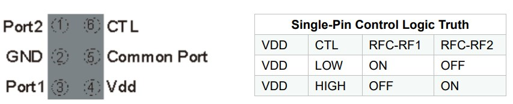
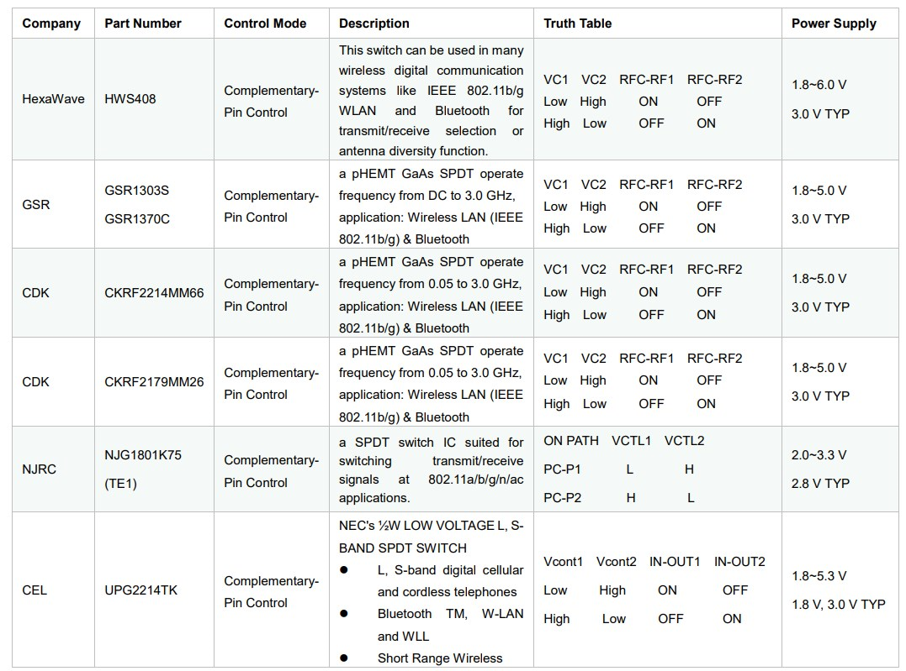
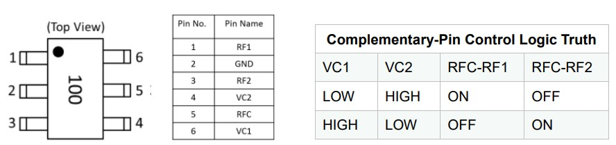
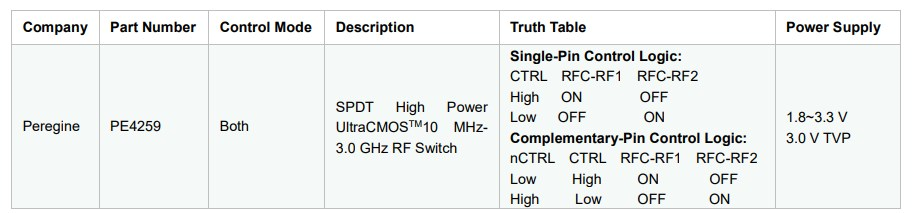
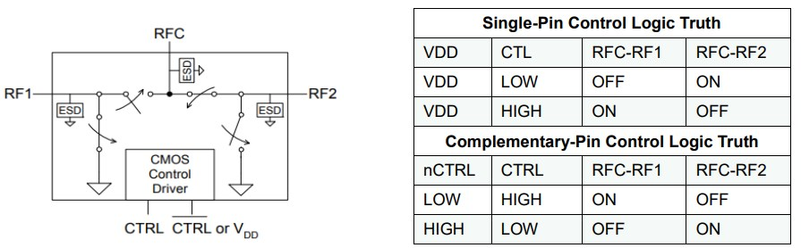
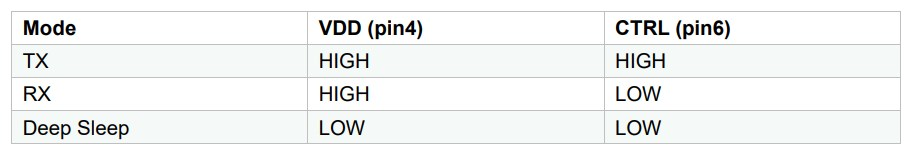
.. |image8| image:: ../../img/6601_RFSW/图1-8.png
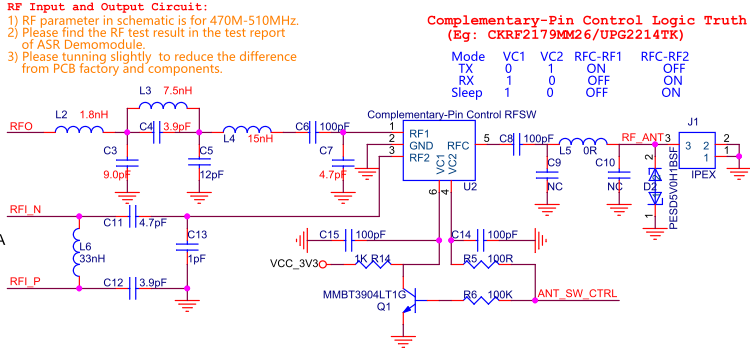
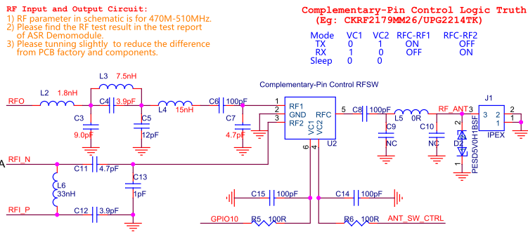
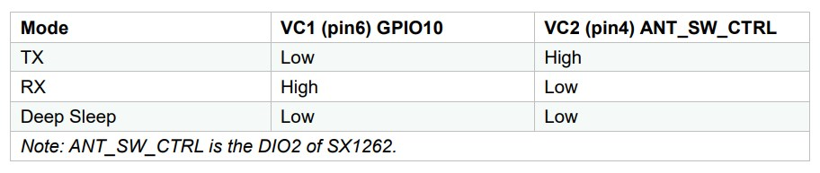
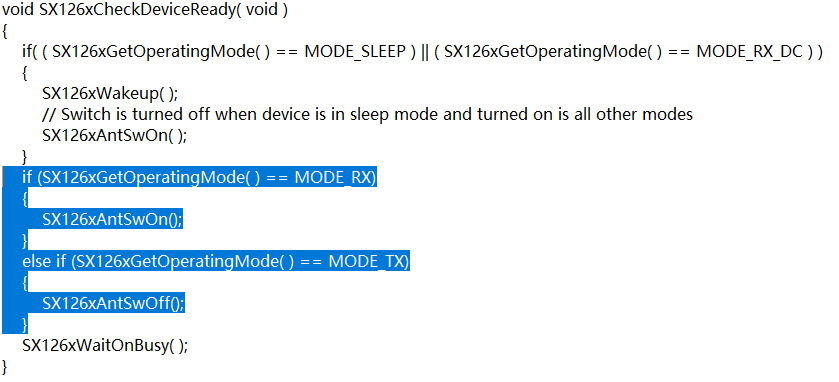
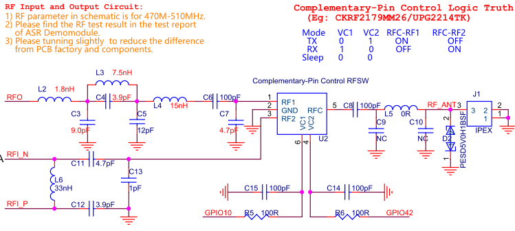
.. |image14| image:: ../../img/6601_RFSW/图1-14.png
.. |image15| image:: ../../img/6601_RFSW/图1-15.png
.. |image16| image:: ../../img/6601_RFSW/图1-16.png
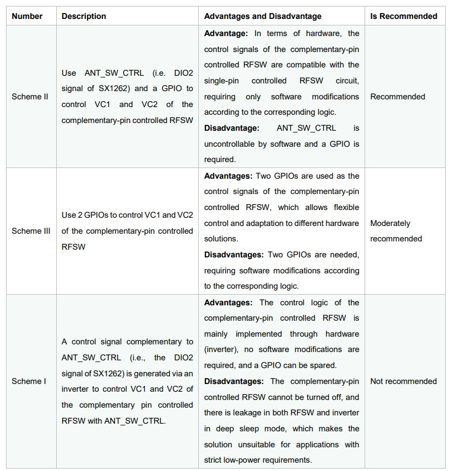