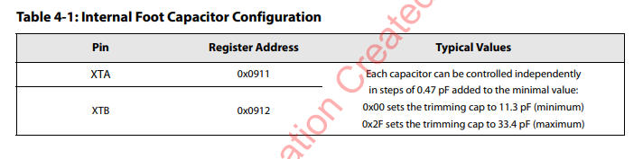
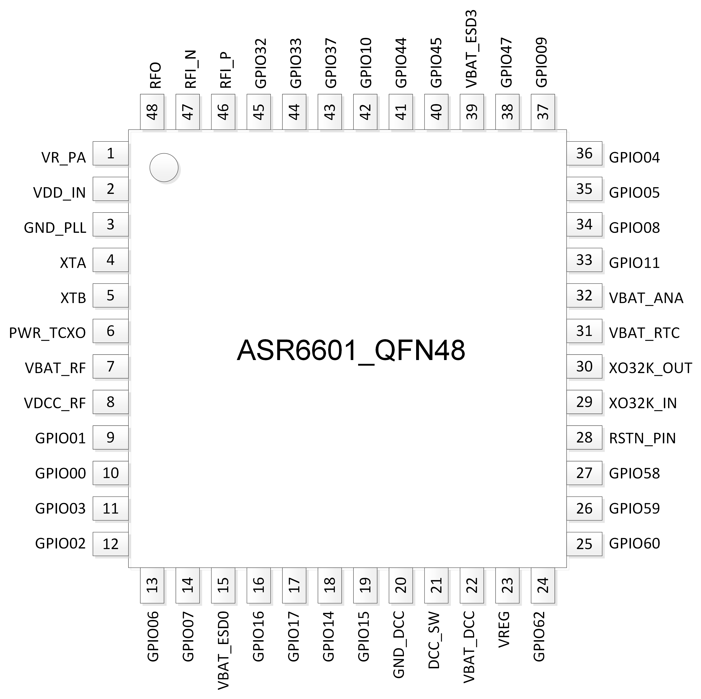
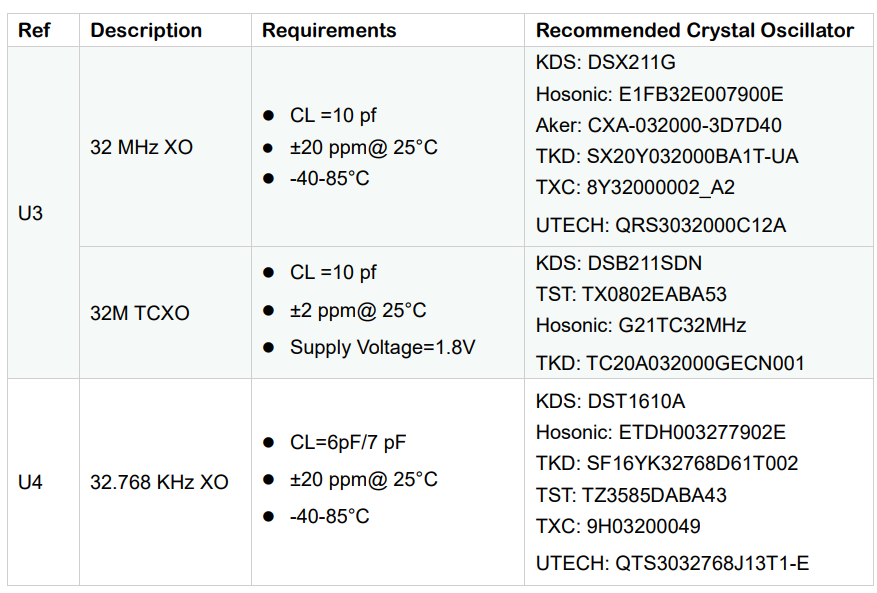
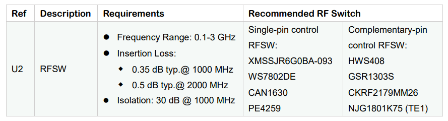
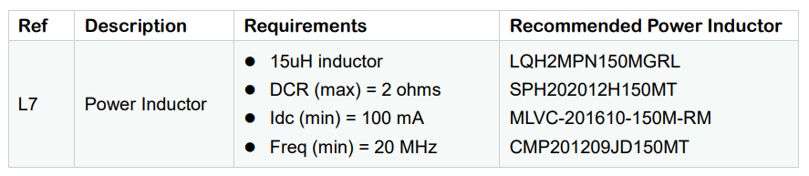
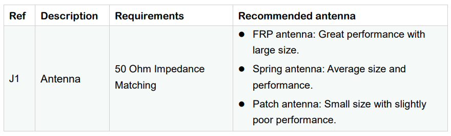
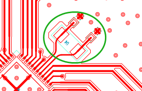

**ASR6601** Hardware Design Guide
=================================

Introduction
============

**About this Document**

This document is a guide for ASR6601 hardware design, including the schematic design, layout notes, and suggestions to critical materials selection.

**Intended Readers**

This document is mainly for engineers who use this chip to develop their own platform and products, for instance:

-  PCB Hardware Development Engineer

-  Software Engineer

-  Technical Support Engineer

**Included Chip Models**

The product models corresponding to this document are as follows.

+------------+--------+-------+--------------------------------------------+---------------+---------------+
| Model      | Flash  | SRAM  | Core                                       | Package       | Frequency     |
+============+========+=======+============================================+===============+===============+
| ASR6601SE  | 256 KB | 64 KB | 32-bit 48 MHz Arm China STAR-MC1 Processor | QFN68, 8*8 mm | 150 ~ 960 MHz |
+------------+--------+-------+--------------------------------------------+---------------+---------------+
| ASR6601CB  | 128 KB | 16 KB | 32-bit 48 MHz Arm China STAR-MC1 Processor | QFN48, 6*6 mm | 150 ~ 960 MHz |
+------------+--------+-------+--------------------------------------------+---------------+---------------+
| ASR6601SER | 256 KB | 64 KB | 32-bit 48 MHz Arm China STAR-MC1 Processor | QFN68, 8*8 mm | 150 ~ 960 MHz |
+------------+--------+-------+--------------------------------------------+---------------+---------------+
| ASR6601CBR | 128 KB | 16 KB | 32-bit 48 MHz Arm China STAR-MC1 Processor | QFN48, 6*6 mm | 150 ~ 960 MHz |
+------------+--------+-------+--------------------------------------------+---------------+---------------+

**Copyright Notice**

© 2023 ASR Microelectronics Co., Ltd. All rights reserved. No part of this document can be reproduced, transmitted, transcribed, stored, or translated into any language in any form or by any means without the written permission of ASR Microelectronics Co., Ltd.

**Trademark Statement**

ASR and ASR Microelectronics Co., Ltd. are trademarks of ASR Microelectronics Co., Ltd. 

Other trade names, trademarks, and registered trademarks mentioned in this document are the property of their respective owners and are hereby declared.

**Disclaimer**

ASR does not give any warranty of any kind and may make improvements and/or changes in this document or in the product described in this document at any time.

This document is only used as a guide, and no contents in the document constitute any form of warranty. Information in this document is subject to change without notice.

All liability, including liability for infringement of any proprietary rights caused by using the information in this document, is disclaimed.

**ASR Microelectronics Co., Ltd.**

Address: 9F, Building 10, No. 399 Keyuan Road, Zhangjiang High-tech Park, Pudong New Area, Shanghai, 201203, China

Homepage: http://www.asrmicro.com/

**Revision History**

+---------+---------+----------------------------------------------------------------------------------------------------+
| Date    | Version | Release Notes                                                                                      |
+=========+=========+====================================================================================================+
| 2023.11 | V1.4.0  | Added descriptions of ASR6601SER and ASR6601CBR; Added BOOT circuit and RSTN circuit descriptions. |
+---------+---------+----------------------------------------------------------------------------------------------------+

1. Overview
===========

ASR6601 is a general LPWAN Wireless Communication SoC, with integrated RF Transceiver, Modem and a 32-bit RISC MCU. The Modem supports LoRa modulation for LPWAN use cases and (G)FSK modulation for legacy use cases. The Modem also supports BPSK modulation in TX and (G)MSK modulation in TX and RX. The MCU uses Arm China STAR-MC1 Processor, with 48-MHz operation frequency, supports 3 x I2C, 1 x I2S, 4 x UART, 1 x LPUART, 1 x SWD, 3 x SPI, 1 x 12-bit SAR ADC, 1 x 12-bit DAC, etc.

Continuous frequency coverage from 150 MHz to 960 MHz allows the support of all major sub-GHz ISM bands around the world. The maximum transmit power of the chip is up to +22 dBm with the high-efficiency PA integrated. High sensitivity to -148 dBm is achieved with just 4.6 mA active receive current consumption. The ultra-low deep sleep current of less than 1.6 μA greatly extends the battery life. ASR6601 uses QFN48 (6x6mm) and QFN68 (8x8mm) packages. AS such, ASR6601 is suitable for ultra-distance communication, ultra-low power consumption and cost-effective LPWAN applications.

This document is a guide for ASR6601 hardware design, including the schematic design, layout notes, and suggestions to critical materials selection.

2. ASR6601 Schematic Design
===========================

2.1 ASR6601 Block Diagram
-------------------------

|image1|

2.2 ASR6601 Features
--------------------

-  Up to 42 configurable GPIOs: 3 x I2C, 1 x I2S, 4 x UART, 1 x LPUART, 1 x SWD, 3 x SPI, 1 x QSPI and 2 x WDG
-  4 x GPtimer, 2 x Basic Timer, 2 x LP timer and 1 x Sys Ticker
-  48 MHz Arm China STAR-MC1 Processor
-  4-channel DMA engine x 2
-  Embedded 12-bit 1 Msps SAR ADC
-  Embedded 12-bit DAC
-  Embedded 3 x OPA
-  Embedded 2 x Low Power Comparator
-  Embedded LCD driver
-  Embedded LD, TD, VD and FD
-  Supports AES, DES, RSA, ECC, SHA and SM2/3/4

2.3 ASR6601 Module Schemtic
---------------------------

2.3.1 ASR6601 QFN48 Module Schematic
~~~~~~~~~~~~~~~~~~~~~~~~~~~~~~~~~~~~

|image2|

2.3.2 ASR6601 QFN68 Module Schematic
~~~~~~~~~~~~~~~~~~~~~~~~~~~~~~~~~~~~

|image3|

Pay close attention to the following aspects regarding ASR6601 module reference design:

1. With respect to the ASR6601 matching network, please refer to the ASR6601 module reference design in the *1_ASR6601_Hardware /13_ASR6601_Demo_Module* folder on the FTP server, which illustrates the matching networks of 490 MHz (applicable to the frequency range of 470-510 MHz) and 915 MHz (applicable to the frequency range of 864-928 MHz).
2. The inductor L7 (15 uH) of DC-DC must be power inductor. Refer to `Chapter 3: Material Selection <#_Materials_Selection>`__ to get the details of the power inductor. We suggest you choose 0402 package for the inductor L1 (56 nH) of VR_PA, since its rated current is larger, which helps improve the transmit power of the TX.
3. The R1, R2, R3, R4 and R7 in the schematics are mainly for testing. You can change or remove them accordingly.
4. XO and TCXO are compatible in the ASR6601 module schematic. You can choose either one accordingly.
5. In order to enhance ESD protection, we suggest reserving D1 and D2. D2 has some influence on RF performance, D2 (TVS) with small capacitance is prefered in applications with higher ESD requirements.
6. If VDD_IN is connected to VREG, the maximum transmit power is 14 dBm. If VDD_IN is connected to VDD_RF, the maximum transmit power is up to 22 dBm.
7. Users can log in to the ASR FTP server to find the module reference design schematics and layout files. Please refer to Appendix.

2.4 Key Circuits Analysis
-------------------------

2.4.1 Power Supply
~~~~~~~~~~~~~~~~~~

There are four parts of ASR6601 power: *VBAT_ESDx (x=0-3), VBAT_ANA, VBAT_RTC and VBAT_RF*. *VBAT_ESDx* supplies power to the digital part of MCU. *VBAT_ANA* supplies power to the analog part (ADC) of MCU. *VBAT_RF* supplies power to the LoRa tranceiver. *VBAT_RTC* supplies power to the RTC clock of MCU.

DC-DC and LDOs are integrated in the ASR6601 RF circuit. The input is VBAT_DCC, which is connected to VBAT_RF; the output is VREG, and the voltage ranges from 1.45 V to 1.62 V. The regulator (REG PA) input is VDD_IN, and the voltage ranges from 1.7 V to 3.7 V (**3.3 V is recommended**); the output is VR_PA, its voltage varies with the output power, and it provides bias to the output stage RFO of PA through an external pull-up inductor.

Refer to the following figures for the power supply scheme of ASR6601 MCU and RF part:

|image4|

2.4.2 Reset Circuit
~~~~~~~~~~~~~~~~~~~

The reset signal on the RSTN pin of ASR6601CB/ASR6601SE resets the chip.

The RSTN reference circuit is shown below:

|image5|

【注意】

The reset signal on the RSTN pin of the ASR6601CBR/ASR6601SER can only reset the Main domain and cannot reset the AON or AONR domain. The RSTN reset circuit reference design is as follows:

|image6|

【注意】

2.4.3 BOOT Circuit
~~~~~~~~~~~~~~~~~~

The default function of GPIO02 of ASR6601 is BOOT. Don’t multiplex GPIO02 to other functions to avoid conflict with the BOOT function.

GPIO02, as a dedicated BOOT pin, must be routed out in the hardware design to cowork with RSTN to enter the download mode, or to be pulled high to exit deep sleep mode.

2.4.4 Crystal Oscillator
~~~~~~~~~~~~~~~~~~~~~~~~

ASR6601 Demo module uses two crystal oscillators:

1. **32 MHz TCXO/XO for RF**\ ：

(1) Requirements: 10 pf load capacitance for the 32M crystal, TCXO frequency deviation tolerance within 2 ppm, XO frequency deviation tolerance within 20 ppm.

(2) TCXO is highly recommended for narrowband applications with a bandwidth below 62.5 kHz, or for extreme temperature conditions (above 70 degrees Celsius or below -20 degrees Celsius); XO is used for broadband applications with a bandwidth of not less than 62.5 kHz.

(3) ASR6601 integrates load capacitance matrix, the default value of 0x0911 and 0x0912 is 0x05, please use the default value (13.6 pF). It is generally not recommended to change, because: 1) it will narrow the adjustable range of the load capacitance in one direction; 2) the adjusted value of the load capacitance matrix register will need to be changed in appliction software, which may reduce the versatility of application software，because the adjusted value will change according to crystal.

|image7|

(4) Increase external load capacitance when the frequency offset is positive, otherwise, we suggest to change 32M XO.

2. **32.768 KHz XO for MCU**\ ：

(1) The load capacitance of the 32.768K crystal is required to be 7 pF, and the frequency deviation tolerance is required to be within 20 ppm; it is strongly recommended not to use crystals with a load capacitance of 12.5 pF, which may cause large frequency deviation, or even the crystal not working.

(2) Since a 6 pF load capacitor has been added to the 32.768K crystal oscillation circuit in the ASR6601, the external load capacitor of the crystal is recommended to be NC. Please select the appropriate value so that the frequency deviation meets the application requirements. It is recommended that the external load capacitance does not exceed 5.6 pF.

(3) Increase external load capacitance when the frequency offset is positive, otherwise, we suggest to change 32.768 kHz.

(4) ASR6601 does not integrate load capacitance matrix, so it is not possible to change the load capacitance at both ends of the crystal by changing the value of the registers through software configuration. TCXO is recommended for the 32.768K crystal with high accuracy requirements.

(5) The ASR6601 has a very low power oscillator circuit (500 nA current reduction in DeepSleep) designed specifically for the XO32K. When the XO32K low-power mode is enabled, the load balance between the two ends of the 32.768K crystal is very demanding. If the 32.768K crystal trace lengths are not equal, the crystal may not oscillate, and the low-power mode will be disabled. In addition, the crystal may fail to oscillate due to the large load capacitance. It is recommended that the external load capacitance should not exceed 5.6 pF.

|image8|

【注意】

2.4.5 RF Matching
~~~~~~~~~~~~~~~~~

|image9|

Pay close attention to the following aspects regarding to ASR6601 chip RF circuit:

1. Please adjust the parameters of the RF based on the default parameters to optimize the RF performance, since clients’ PCB layout and wiring are various.
2. With respect to the ASR6601 matching network, please refer to the ASR6601 module reference designs in the *1_ASR6601_Hardware /13_ASR6601_Demo_Module* folder on the FTP server, which illustrate the matching networks of 490 MHz (applicable to the frequency range of 470-510 MHz) and 915 MHz (applicable to the frequency range of 864-928 MHz). For RF matching networks of other frequencies, please contact ASR technical support engineers.
3. It is recommended to use single-pin control RFSW (radio frequency switch), such as the XMSSJR6G0BA-093 in ASR6601 module reference designs. ASR6601’s ANT_SW_CTRL (GPIO59) used for TX/RX switch should be connected to RFSW’s CTRL (pin6). GPIO10 should be connected to RFSW’s VDD (pin4) to turn off the RFSW in Deepsleep mode to prevent the leakage (XMSSJR6G0BA-093 may have 5-μA electric leakage). The control logic of the single-pin control RFSW is as follows:

========= ============== ===============
**Mode**  **VDD (pin4)** **CTRL (pin6)**
========= ============== ===============
TX        HIGH           HIGH
RX        HIGH           LOW
Deepsleep LOW            LOW
========= ============== ===============

4. ASR suggests using XMSSJR6G0BA-093 for RFSW. Users can use replaceable materials and adjust the parameters in RF matching network. Refer to `Chapter 3: Material Selection <#_Materials_Selection>`__ for further details.

5. The complementary-pin control RFSW can be used with software modified accordingly, which is not as convenient as the single-pin control RFSW. ASR does not recommend it.

2.5 ASR6601 Pin Assignment
~~~~~~~~~~~~~~~~~~~~~~~~~~

Please refer to *ASR6601 Datasheet* in the *0_ASR6601_Datasheet/ 00_ASR6601_Datasheet* folder on the FTP server for pin definitions.

|image10|

|image11|

3. Critical Materials Selection
===============================

.. _crystal-oscillator-1:

3.1 Crystal Oscillator
----------------------

|image12|

3.2 RF Switch
-------------

|image13|

3.3 Power Inductor
------------------

If DC-DC is used to supply power to the regulator (REG PA), the power inductor L6 is a necessity. If LDO is used to supply the power, then the power inductor may not be used. The efficiency of the LDO is lower than that of the DCDC with higher current. Please refer to the requirements of the power inductor in the following table.

|image14|

3.4 External Antenna
--------------------

The impedance performance has a significant influence on the results in the distance test, so users should choose an antenna properly.

|image15|

4. PCB Layout Notes
===================

4.1 Power Supply Routing
------------------------

Pay attention to the following aspects regarding the PCB power supply routing:

1. It is recommended that users add a 2.2 uF and a 0.1 uF filter capacitor in parallel with the power supply to filter out the noise.
2. The width of the power supply traces should not be smaller than 0.15 mm. In order to reduce mutual interference, the distance between the middle of the power traces must not be less than 3 times the trace width (3W Principle).
3. To avoid interference to the power supply, the power trace must not cross over with other power traces or high-frequency traces.
4. VDD_IN’s maximum current is 120 mA. The width of the VDD_IN trace should be 0.2 mm.

4.2 RF Routing
--------------

Pay attention to the following aspects regarding the PCB RF routing shown in the following Figure:

1. If trace bends are required, the RF trace should be routed at a 135° angle or with circular arcs rather than a right angle and an acute angle.
2. The ground plane on the adjacent layer needs to be complete. Employ as many ground vias as possible around the RF traces.
3. No high-frequency signal traces can be routed close to the RF traces. The RF antenna should be placed away from all components transmitting high-frequency signals, such as crystals, UART, PWM, SDIO, etc, to avoid cross interference.
4. No power traces can be routed close to the RF traces. The RF antenna should be placed away from VDDA and VDD_RF especially, to avoid interference of the power supply by RF signals.
5. The components connected to VR_PA, RFO and RFI_N/P should be as close as possible to the pins to avoid long traces affecting RF performance.
6. Avoid abrupt changes in RF trace width, especially at the pad. Use the trace of the same width as the pad, or add the tapered trace to reduce abrupt changes in impedance (See SMA pad traces in the following Figure).
7. The RF traces must be routed on the top layer and cannot cross layers, and the ground plane on the adjacent layer needs to be complete. Match the impedance on RF traces as required.

(a) Match the single-end 50 ohms impedance on RFO RF traces (See purple traces in the following Figure).

(b) Match the differential 100 ohms impedance on RFI_N and RFI_P RF traces (See green traces in the following Figure).

​

|image16|

4.3 Crystal Routing
-------------------

Pay attention to the following aspects regarding the PCB crystal routing:

1. The crystal clock trace must be routed on the top layer and cannot cross layers or cross over with other traces. The crystals should be isolated well with ground vias surrounded.
2. Do not route high-frequency signal traces under the crystal oscillator. The second layer must be a complete GND plane.
3. Crystals should be placed as close as possible to the corresponding pins. The respective load capacitors should be placed at the end of the clock trace.
4. Do not put any magnetic components near the crystal, such as inductors and ferrite beads.
5. Ensure the clearance of the top copper layer of the crystal to prevent temperature drift due to heat conducted from surrounding components.
6. The 32.768K crystal should be symmetrically routed to balance the load, as shown in the following figure.

|image17|

A. Appendix - Reference
=======================

Summaries of the reference information mentioned in this document:

1. ASR6601 FTP information

*Serv\ *\ **：**\ *\ iot.asrmicro.com:8090*

*User\ *\ **：**\ *\ ASR6601_delivery*

*Pass\ *\ **：**\ *\ U6H3bfAs*

2. E-mail for ASR6601 technical support:

pengwu@asrmicro.com

.. |image1| image:: ../../img/6601_Hardware/图2-1.png
.. |image2| image:: ../../img/6601_Hardware/图2-2.png
.. |image3| image:: ../../img/6601_Hardware/图2-3.png
.. |image4| image:: ../../img/6601_Hardware/图2-4.png
.. |image5| image:: ../../img/6601_Hardware/图2-5.png
.. |image6| image:: ../../img/6601_Hardware/图2-6.png

.. |image8| image:: ../../img/6601_Hardware/图2-7.png
.. |image9| image:: ../../img/6601_Hardware/图2-8.png
.. |image10| image:: ../../img/6601_Hardware/图2-9.png

.. |image16| image:: ../../img/6601_Hardware/图4-1.png
