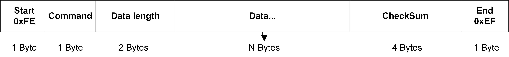

.. role:: raw-latex(raw)
   :format: latex
..

**ASR6601 BootLoader Communication Notes**
==========================================
`简体中文 <https://asriot-cn.readthedocs.io/zh/latest/ASR6601/软件快速入门/通信说明.html>`_

Introduction
------------

**About This Document**

This document introduces the communication protocol of the internal Bootloader in ASR6601.

**Intended Readers**

This document is mainly for engineers who use this chip to develop their own platform and products, for instance:

-  PCB Hardware Development Engineer
-  Software Engineer
-  Technical Support Engineer

**Included Chip Models**

The product models corresponding to this document are as follows.

+------------+--------+-------+----------------------------------+---------------+---------------+
| Model      | Flash  | SRAM  | Processor                        | Package       | Frequency     |
+============+========+=======+==================================+===============+===============+
| ASR6601SE  | 256 KB | 64 KB | 32-bit 48 MHz Arm China STAR-MC1 | QFN68, 8*8 mm | 150 ~ 960 MHz |
+------------+--------+-------+----------------------------------+---------------+---------------+
| ASR6601CB  | 128 KB | 16 KB | 32-bit 48 MHz Arm China STAR-MC1 | QFN48, 6*6 mm | 150 ~ 960 MHz |
+------------+--------+-------+----------------------------------+---------------+---------------+
| ASR6601SER | 256 KB | 64 KB | 32-bit 48 MHz Arm China STAR-MC1 | QFN68, 8*8 mm | 150 ~ 960 MHz |
+------------+--------+-------+----------------------------------+---------------+---------------+
| ASR6601CBR | 128 KB | 16 KB | 32-bit 48 MHz Arm China STAR-MC1 | QFN48, 6*6 mm | 150 ~ 960 MHz |
+------------+--------+-------+----------------------------------+---------------+---------------+

**Copyright Notice**

© 2023 ASR Microelectronics Co., Ltd. All rights reserved. No part of this document can be reproduced, transmitted, transcribed, stored, or translated into any languages in any form or by any means without the written permission of ASR Microelectronics Co., Ltd.

**Trademark Statement**

ASR and ASR Microelectronics Co., Ltd. are trademarks of ASR Microelectronics Co., Ltd. 

Other trade names, trademarks and registered trademarks mentioned in this document are property of their respective owners.

**Electrostatic Discharge (ESD) Warning**

This product can be damaged by Electrostatic Discharge (ESD). When handling with this device, the people should be very careful to conduct the ESD protection to avoid any device damage caused by ESD event.

**Disclaimer**

ASR do not give any warranty of any kind and may make improvements and/or changes in this document or in the product described in this document at any time.

This document is only used as a guide, and no contents in the document constitute any form of warranty. Information in this document is subject to change without notice.

All liability, including liability for infringement of any proprietary rights caused by using the information in this document is disclaimed.

**ASR Microelectronics Co., Ltd.**

Address: 9F, Building 10, No. 399 Keyuan Road, Zhangjiang High-tech Park, Pudong New Area, Shanghai, 201203, China

Homepage: http://www.asrmicro.com/

**Revision History**

======= ======= ==============
Date    Version Release Notes
======= ======= ==============
2023.01 V0.1.0  First Release.
======= ======= ==============

1. Bootloader Command
---------------------

1.1 Serial Port Setting
~~~~~~~~~~~~~~~~~~~~~~~

Baud rate: 921600

Data bits: 8

Stop bits: 1

Parity: None

Flow control: None

1.2 Command List
~~~~~~~~~~~~~~~~

======== == =====================================================
Command  ID Description
======== == =====================================================
SYNC     1  SYNC command, determining if the connection is normal
JUMP     2  Jump command
FLASH    3  Download command
ERASE    4  Erasure command
VERIFY   5  Verification command
WROTP    6  Write OTP command
RDOTP    7  Read OTP command
WROPT0   8  Write Option0 command
RDOPT0   9  Read Option0 command
WROPT1   10 Write Option1 command
RDOPT1   11 Read Option1 command
REBOOT   12 Reboot command
SN       13 Read serial number command
WRREG    14 Write register command
RDREG    15 Read register command
BAUDRATE 16 Set baud rate command
VERSION  17 Read version number command
======== == =====================================================

1.3 Basic Communication Command Format
~~~~~~~~~~~~~~~~~~~~~~~~~~~~~~~~~~~~~~

1.3.1 Request
^^^^^^^^^^^^^

|image1| 

“Command” means the command id and the checksum algorithm is CRC32.

1.3.2 Response
^^^^^^^^^^^^^^

|image2| 

“Status” means the status code, 0 means success, and non-0 value means failure. The checksum algorithm is CRC32.

1.4 Command Load Format
~~~~~~~~~~~~~~~~~~~~~~~

1.4.1 SYNC Command Load Format
^^^^^^^^^^^^^^^^^^^^^^^^^^^^^^

Request:

None

Response:

None

1.4.2 JUMP Command Load Format
^^^^^^^^^^^^^^^^^^^^^^^^^^^^^^

Request:

Addr: 4 Bytes, jump address

Response:

None

1.4.3 FLASH Command Load Format
^^^^^^^^^^^^^^^^^^^^^^^^^^^^^^^

Request:

Addr: 4 Bytes, download address

Size: 4 Bytes, download data length

Data: N Bytes, download data

Response:

None

1.4.4 ERASE Command Load Format
^^^^^^^^^^^^^^^^^^^^^^^^^^^^^^^

Request:

Addr: 4 Bytes, erasure address

Size: 4 Bytes, erasure area size

Response:

None

1.4.5 VERIFY Command Load Format
^^^^^^^^^^^^^^^^^^^^^^^^^^^^^^^^

Request:

Addr: 4 Bytes, verification starting address

Size: 4 Bytes, verification area size

Checksum: 4 Bytes, verification checksum

Response:

None

1.4.6 WROTP Command Load Format
^^^^^^^^^^^^^^^^^^^^^^^^^^^^^^^

Request:

Addr: 4 Bytes, download address of OTP to write

Size: 4 Bytes, download data length

Data: N Bytes, download data

Response:

None

1.4.7 RDOTP Command Load Format
^^^^^^^^^^^^^^^^^^^^^^^^^^^^^^^

Request:

Addr: 4 Bytes, address of OTP to read

Size: 4 Bytes, data length

Response:

Data: N Bytes, data

1.4.8 WROPT0 Command Load Format
^^^^^^^^^^^^^^^^^^^^^^^^^^^^^^^^

Request:

Opt0_l: 4 Bytes, lower 32 bits of Option0

Opt0_h: 4 Bytes, higher 32 bits of Option0

Response:

None

1.4.9 RDOPT0 Command Load Format
^^^^^^^^^^^^^^^^^^^^^^^^^^^^^^^^

Request:

None

Response:

Opt0_l: 4 Bytes, lower 32 bits of Option0

Opt0_h: 4 Bytes, higher 32 bits of Option0

1.4.10 WROPT1 Command Load Format
^^^^^^^^^^^^^^^^^^^^^^^^^^^^^^^^^

Request:

Opt1_l: 4 Bytes, lower 32 bits of Option1

Opt1_h: 4 Bytes, higher 32 bits of Option1

Response:

None

1.4.11 RDOPT1 Command Load Format
^^^^^^^^^^^^^^^^^^^^^^^^^^^^^^^^^

Request:

None

Response:

Opt1_l: 4 Bytes, lower 32 bits of Option1

Opt1_h: 4 Bytes, higher 32 bits of Option1

1.4.12 REBOOT Command Load Format
^^^^^^^^^^^^^^^^^^^^^^^^^^^^^^^^^

Request:

None

Response:

None

1.4.13 SN Command Load Format
^^^^^^^^^^^^^^^^^^^^^^^^^^^^^

Request:

None

Response:

SN: 8 Bytes, serial number

1.4.14 WRREG Command Load Format
^^^^^^^^^^^^^^^^^^^^^^^^^^^^^^^^

Request:

Addr: 4 Bytes, address of register to write

Value: 4 Bytes, value

Response:

None

1.4.15 RDREG Command Load Format
^^^^^^^^^^^^^^^^^^^^^^^^^^^^^^^^

Request:

Addr: 4 Bytes, address of register to read

Response:

Value: 4 Bytes, value

1.4.16 BAUDRATE Command Load Format
^^^^^^^^^^^^^^^^^^^^^^^^^^^^^^^^^^^

Request:

Baudrate: 4 Bytes, baud rate

Response:

None

1.4.17 VERSION Command Load Format
^^^^^^^^^^^^^^^^^^^^^^^^^^^^^^^^^^

Request:

None

Response:

Version: 4 Bytes, version number

2. Program for Reference
------------------------

For the Bootloader communication program, please refer to build:raw-latex:`\scripts`:raw-latex:`\tremo`\_loader.py.

.. |image2| image:: ../../img/6601_Communication/图1-2.png
