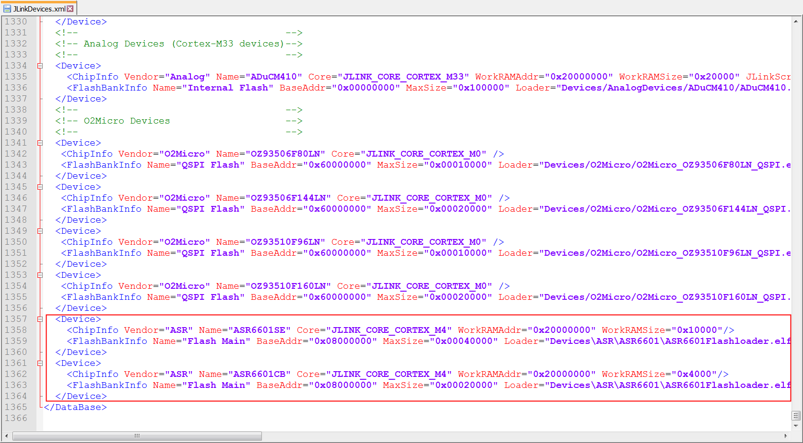
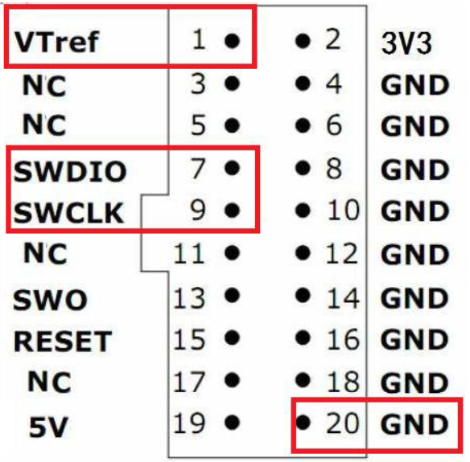

**ASR6601 J-Llink Download User Guide**
========================================
`简体中文 <https://asriot-cn.readthedocs.io/zh/latest/ASR6601/软件快速入门/下载用户指南.html>`_

Introduction
------------

**About This Document**

This document provides a user guide for downloading the IoT LPWAN SoC chip ASR6601 via J-Link.

**Intended Readers**

This document is mainly for engineers who use this chip to develop their own platform and products, for instance:

-  PCB Hardware Development Engineer
-  Software Engineer
-  Technical Support Engineer

**Included Chip Models**

The product models corresponding to this document are as follows.

+------------+--------+-------+----------------------------------+---------------+---------------+
| Model      | Flash  | SRAM  | Processor                        | Package       | Frequency     |
+============+========+=======+==================================+===============+===============+
| ASR6601SE  | 256 KB | 64 KB | 32-bit 48 MHz Arm China STAR-MC1 | QFN68, 8*8 mm | 150 ~ 960 MHz |
+------------+--------+-------+----------------------------------+---------------+---------------+
| ASR6601CB  | 128 KB | 16 KB | 32-bit 48 MHz Arm China STAR-MC1 | QFN48, 6*6 mm | 150 ~ 960 MHz |
+------------+--------+-------+----------------------------------+---------------+---------------+
| ASR6601SER | 256 KB | 64 KB | 32-bit 48 MHz Arm China STAR-MC1 | QFN68, 8*8 mm | 150 ~ 960 MHz |
+------------+--------+-------+----------------------------------+---------------+---------------+
| ASR6601CBR | 128 KB | 16 KB | 32-bit 48 MHz Arm China STAR-MC1 | QFN48, 6*6 mm | 150 ~ 960 MHz |
+------------+--------+-------+----------------------------------+---------------+---------------+

**Copyright Notice**

© 2023 ASR Microelectronics Co., Ltd. All rights reserved. No part of this document can be reproduced, transmitted, transcribed, stored, or translated into any languages in any form or by any means without the written permission of ASR Microelectronics Co., Ltd.

**Trademark Statement**

ASR and ASR Microelectronics Co., Ltd. are trademarks of ASR Microelectronics Co., Ltd. 

Other trade names, trademarks and registered trademarks mentioned in this document are property of their respective owners.

**Electrostatic Discharge (ESD) Warning**

This product can be damaged by Electrostatic Discharge (ESD). When handling with this device, the people should be very careful to conduct the ESD protection to avoid any device damage caused by ESD event.

**Disclaimer**

ASR do not give any warranty of any kind and may make improvements and/or changes in this document or in the product described in this document at any time.

This document is only used as a guide, and no contents in the document constitute any form of warranty. Information in this document is subject to change without notice.

All liability, including liability for infringement of any proprietary rights caused by using the information in this document is disclaimed.

**ASR Microelectronics Co., Ltd.**

Address: 9F, Building 10, No. 399 Keyuan Road, Zhangjiang High-tech Park, Pudong New Area, Shanghai, 201203, China

Homepage: http://www.asrmicro.com/

**Revision History**

======= ======= =============================
Date    Version Release Notes
======= ======= =============================
2024.03 V1.0.1  Updated Chapter `2 <#节2>`__.
======= ======= =============================

1. J-Link Support Package Installation
--------------------------------------

ASR6601 supports standard SWD interface and can be downloaded via J-Link. Before downloading, add ASR6601 to the device list of J-Link. Copy the ASR directory in the tools/JLink/Devices directory of the SDK to the Devices directory of the J-Link installation directory, and add the device description of the ASR6601 at the end of the tools/JLink/JLinkDevices.xml file to the JLinkDevices.xml file in the J-Link directory.

|image1|

2. J-Link Download
------------------

After installing the J-Link support package you can use J-Link to download. Connect the SWD and SWC pins of ASR6601 to the SWDIO and SWCLK pins of J-Link respectively, and connect the GND pins of ASR6601 to the GND pins of J-Link.

Please note that connecting the RESET pin of J-LINK to the RESET pin of ASR6601 is prohibited, as it may lead to flash erasure.

|image2| 

Open the ASR6601 JFlash project in the tool/JLink/JFlash directory of the SDK using JFlash and start downloading.

