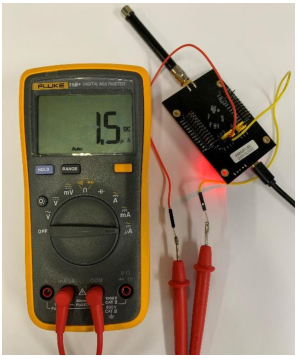
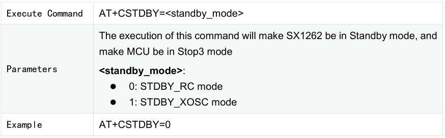
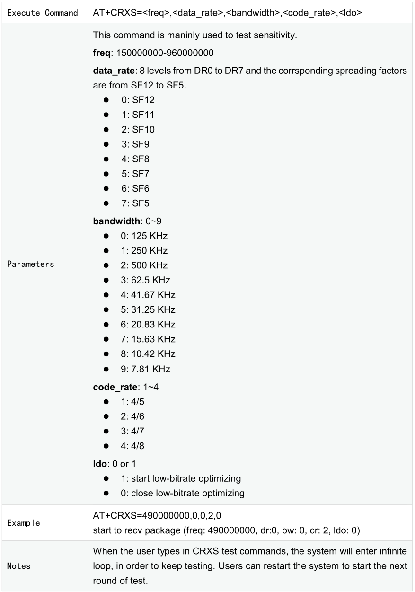
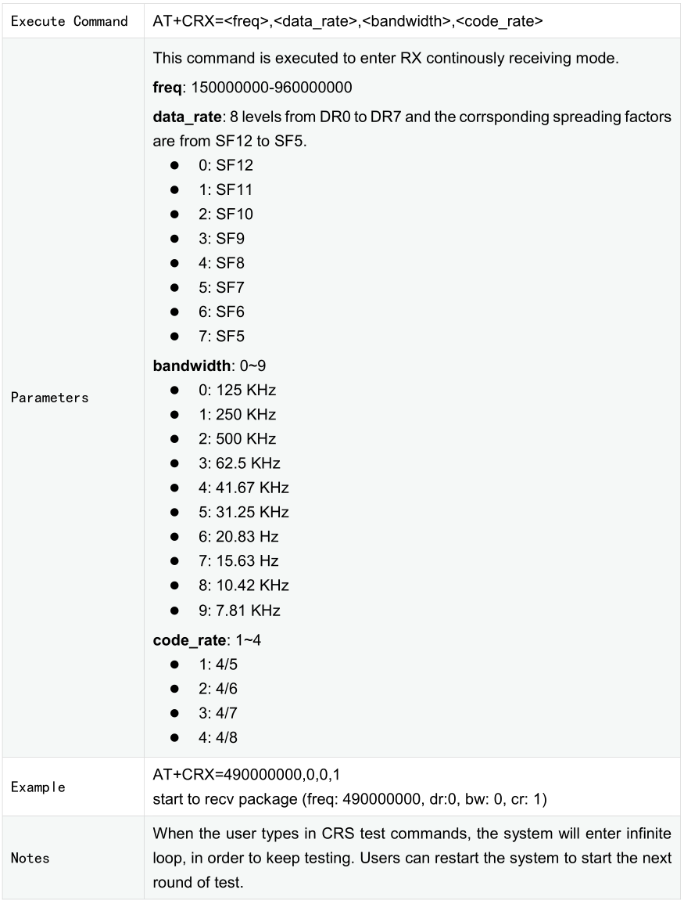
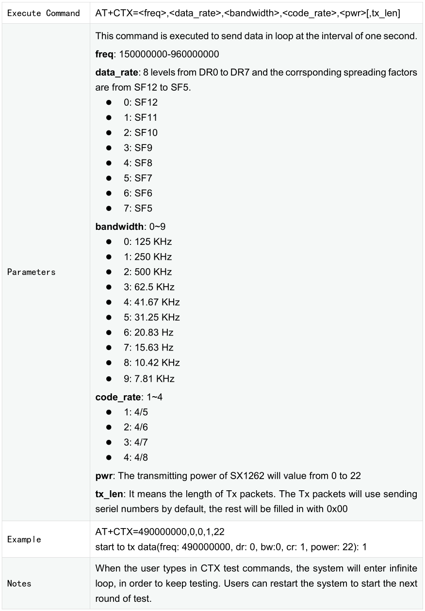

.. role:: raw-latex(raw)
   :format: latex
..

ASR6601 Development Board Test Guide
====================================

Introduction
------------

**About This Document**

This document introduces how to test ASR6601 development board to facilitate the developers to better understand the performance of LPWAN SoC ASR6601.

**Included Chip Models**

The product models corresponding to this document are as follows.

+-----------+--------+-------+-----------------------------+---------------+---------------+
| Model     | Flash  | SRAM  | Core                        | Package       | Frequency     |
+===========+========+=======+=============================+===============+===============+
| ASR6601SE | 256 KB | 64 KB | 32-bit 48 MHz ARM STAR      | QFN68, 8*8 mm | 150 ~ 960 MHz |
+-----------+--------+-------+-----------------------------+---------------+---------------+
| ASR6601CB | 128 KB | 16 KB | 32-bit 48 MHz ARM STAR      | QFN48, 6*6 mm | 150 ~ 960 MHz |
+-----------+--------+-------+-----------------------------+---------------+---------------+

**Copyright Notice**

© 2021 ASR Microelectronics Co., Ltd. All rights reserved. No part of this document can be reproduced, transmitted, transcribed, stored, or translated into any languages in any form or by any means without the written permission of ASR Microelectronics Co., Ltd.

**Trademark Statement**

ASR and ASR Microelectronics Co., Ltd. are trademarks of ASR Microelectronics Co., Ltd. 

Other trade names, trademarks and registered trademarks mentioned in this document are property of their respective owners.

**Disclaimer**

ASR do not give any warranty of any kind and may make improvements and/or changes in this document or in the product described in this document at any time.

This document is only used as a guide, and no contents in the document constitute any form of warranty. Information in this document is subject to change without notice.

All liability, including liability for infringement of any proprietary rights caused by using the information in this document is disclaimed.

**ASR Microelectronics Co., Ltd.**

Address: 9F, Building 10, No. 399 Keyuan Road, Zhangjiang High-tech Park, Pudong New Area, Shanghai, 201203, China

Homepage: http://www.asrmicro.com/asrweb/

**Revision History**

+----------+-------------+--------------------------------------------------------------------+
| **Date** | **Version** | **Release Notes**                                                  |
+==========+=============+====================================================================+
| 2020.08  | V0.1.0      | First release.                                                     |
+----------+-------------+--------------------------------------------------------------------+
| 2020.09  | V0.2.0      | Updated some pictures.                                             |
+----------+-------------+--------------------------------------------------------------------+
| 2020.10  | V0.3.0      | Updated the pictures of ASR6601SE development board v2.0.          |
+----------+-------------+--------------------------------------------------------------------+
| 2021.01  | V1.1.0      | Deleted Chapter 1, and move the contents to “About This Document”. |
+----------+-------------+--------------------------------------------------------------------+
| 2021.05  | V1.2.0      | Updated Section 1.3.                                               |
+----------+-------------+--------------------------------------------------------------------+

1. Preparation
--------------

1.1 Hardware
~~~~~~~~~~~~

LoRa nodes hardware requirements：

-  1 ASR6601 development board
-  1 antenna
-  1 USB cable
-  1 PC

1.1.1 ASR6601 Development Board
^^^^^^^^^^^^^^^^^^^^^^^^^^^^^^^

ASR6601SE development board v2.0 front and back photos are as follows:

|image1|

.. raw:: html

   

The Front View of ASR6601SE Development Board v2.0

.. raw:: html

   

|image2|

.. raw:: html

   

The Back View of ASR6601SE Development Board v2.0

.. raw:: html

   

+------------------------------------------------+------------------------------------------------------------------------+
| Interface                                      | Description                                                            |
+================================================+========================================================================+
| USB-UART                                       | USB                                                                    |
+------------------------------------------------+------------------------------------------------------------------------+
| Power Switch                                   | Power switch                                                           |
+------------------------------------------------+------------------------------------------------------------------------+
| Reset                                          | Reset button                                                           |
+------------------------------------------------+------------------------------------------------------------------------+
| SW3                                            | It’s the Download button pressed to pull up GPIO02                     |
+------------------------------------------------+------------------------------------------------------------------------+
| SW1                                            | It’s the User button pressed to pull down GPIO11                       |
+------------------------------------------------+------------------------------------------------------------------------+
| JP1                                            | Jumper1                                                                |
+------------------------------------------------+------------------------------------------------------------------------+
| JP2                                            | Jumper2                                                                |
+------------------------------------------------+------------------------------------------------------------------------+
| JP3                                            | Jumper3                                                                |
+------------------------------------------------+------------------------------------------------------------------------+
| JP4                                            | Jumper4, which can be used to test the board’s total power consumption |
+------------------------------------------------+------------------------------------------------------------------------+
| JP5                                            | Connect UART_TX jumper, then select UART0_TX. Reference: Schematics    |
+------------------------------------------------+------------------------------------------------------------------------+
| JP6 (only used in ASR6601CB development board) | Connect UART_TX jumper, then select LPUART_TX. Reference: Schematics   |
+------------------------------------------------+------------------------------------------------------------------------+
| JP7                                            | Connect UART_TX jumper, then select UART0_RX. Reference: Schematics    |
+------------------------------------------------+------------------------------------------------------------------------+
| JP8                                            | Connect UART_TX jumper, then select LPUART_RX. Reference: Schematics   |
+------------------------------------------------+------------------------------------------------------------------------+

1.1.2 Jumper Connection
^^^^^^^^^^^^^^^^^^^^^^^

When testing ASR6601 development board, please make sure the following jumpers’ state is set correctly.

.. raw:: html

   

============================================== ================
Jumper                                         Connection State
============================================== ================
JP1                                            connected
JP2                                            connected
JP3                                            connected
JP4                                            connected
JP5                                            connected
JP6 (only used in ASR6601CB development board) Not connected
JP7                                            connected
JP8                                            Not connected
============================================== ================

.. raw:: html

   

1.2 Software
~~~~~~~~~~~~

1.2.1 Development Environment
^^^^^^^^^^^^^^^^^^^^^^^^^^^^^

Customers can use Keil to develop ASR6601. Makefile also can be used for compilation and download. For further details, please refer to *ASR6601_Quick Start Guide.*

1.2.2 Test Codes
^^^^^^^^^^^^^^^^

Test codes can be found in the directory of *projects\\${DEMO_BOARD}\\examples\\lora\\lora\_test* in SDK. *${DEMO_BOARD}* is the corresponding board name. For example, ASR6601SE-EVAL stands for ASR6601SE development board, and ASR6601CB-EVAL stands for ASR6601CB development board.

1.3 Compilation and Download
~~~~~~~~~~~~~~~~~~~~~~~~~~~~

Please refer to *ASR6601_Quick Start Guide* for compilation and download introductions.

2. Tests
--------

There are some AT commands built in test codes, which can be used to test part of functions.

2.1 Power Test
~~~~~~~~~~~~~~

**Test Command:** With one serial port tool, and run AT command *AT+CTXCW=490000000,22* to test the power. Please refer to *Section* *3.2.6* for parameter descriptions.

**Reference Result:** 21 dbm

2.2 Sensitivity Test
~~~~~~~~~~~~~~~~~~~~

**Test Command:** With one serial port tool, and run AT command *AT+CRXS=490000000,0,0,2,0* to test the sensitivity. Please refer to *Section* *3.2.3* for parameter descriptions.

**Reference Result:** -138 dbm

2.3 Power Consumption Test
~~~~~~~~~~~~~~~~~~~~~~~~~~

Unplug the JP4 jumper. Connect the multimeter. Please see the figure below for reference.

.. raw:: html

   

|image3|

.. raw:: html

   

2.3.1 TX Power Consumption Test
^^^^^^^^^^^^^^^^^^^^^^^^^^^^^^^

**Test Commands:** AT+CTXCW=490000000,22

**Reference Result:** 110 mA

2.3.2 RX Power Consumption Test
^^^^^^^^^^^^^^^^^^^^^^^^^^^^^^^

**Test Commands:** AT+CRX=490000000,0,0,1

**Reference Result:** 8.9 mA

2.3.3 DeepSleep Power Consumption Test
^^^^^^^^^^^^^^^^^^^^^^^^^^^^^^^^^^^^^^

**Test Commands:** AT+CSLEEP=0

**Reference Result:** 1.5 uA

3. Basic AT Commands
--------------------

3.1 Overview
~~~~~~~~~~~~

========= =============================================
Commands  Description
========= =============================================
AT+CTXCW  Send one sustained wave
AT+CTX    Send one LoRa package in every other second
AT+CRXS   Receive commands. Sensitivity test applicable
AT+CRX    Receive commands. Distance test applicable
AT+CSLEEP Low-power test commands
AT+CSTDBY Sx1262 Standby mode test commands
========= =============================================

3.2 Commands
~~~~~~~~~~~~

3.2.1 Low-power Test Commands +CSLEEP
^^^^^^^^^^^^^^^^^^^^^^^^^^^^^^^^^^^^^

|image4|

3.2.2 Lower-power Test Commands +CSTDBY
^^^^^^^^^^^^^^^^^^^^^^^^^^^^^^^^^^^^^^^

|image5|

3.2.3 Test Commands +CRXS
^^^^^^^^^^^^^^^^^^^^^^^^^

|image6|

3.2.4 Test Commands +CRX
^^^^^^^^^^^^^^^^^^^^^^^^

|image7|

3.2.5 Test Commands +CTX
^^^^^^^^^^^^^^^^^^^^^^^^

|image8|

3.2.6 Test Commands +CTXCW
^^^^^^^^^^^^^^^^^^^^^^^^^^

|image9|

.. |image1| image:: img/6601_Board/图1-1.png
.. |image2| image:: img/6601_Board/图1-2.png

.. |image4| image:: img/6601_Board/图3-1.png

.. |image9| image:: img/6601_Board/图3-6.png
