.. role:: raw-latex(raw)
   :format: latex
..

ASR6601 OTA Upgrade Guide
=========================

Introduction
------------

**About This Document**

This document mainly introduces the OTA upgrade Demo project in LPWAN SoC ASR6601 SDK.

**Included Chip Models**

The product models corresponding to this document are as follows.

+-----------+--------+-------+-----------------------------+---------------+---------------+
| Model     | Flash  | SRAM  | Core                        | Package       | Frequency     |
+===========+========+=======+=============================+===============+===============+
| ASR6601SE | 256 KB | 64 KB | 32-bit 48 MHz ARM STAR      | QFN68, 8*8 mm | 150 ~ 960 MHz |
+-----------+--------+-------+-----------------------------+---------------+---------------+
| ASR6601CB | 128 KB | 16 KB | 32-bit 48 MHz ARM STAR      | QFN48, 6*6 mm | 150 ~ 960 MHz |
+-----------+--------+-------+-----------------------------+---------------+---------------+

**Copyright Notice**

© 2021 ASR Microelectronics Co., Ltd. All rights reserved. No part of this document can be reproduced, transmitted, transcribed, stored, or translated into any languages in any form or by any means without the written permission of ASR Microelectronics Co., Ltd.

**Trademark Statement**

ASR and ASR Microelectronics Co., Ltd. are trademarks of ASR Microelectronics Co., Ltd. 

Other trade names, trademarks and registered trademarks mentioned in this document are property of their respective owners.

**Disclaimer**

ASR do not give any warranty of any kind and may make improvements and/or changes in this document or in the product described in this document at any time.

This document is only used as a guide, and no contents in the document constitute any form of warranty. Information in this document is subject to change without notice.

All liability, including liability for infringement of any proprietary rights caused by using the information in this document is disclaimed.

**ASR Microelectronics Co., Ltd.**

Address: 9F, Building 10, No. 399 Keyuan Road, Zhangjiang High-tech Park, Pudong New Area, Shanghai, 201203, China

Homepage: http://www.asrmicro.com/asrweb/

**Revision History**

+----------+-------------+--------------------------------------------------------------------+
| **Date** | **Version** | **Release Notes**                                                  |
+==========+=============+====================================================================+
| 2020.06  | V0.1.0      | First Release.                                                     |
+----------+-------------+--------------------------------------------------------------------+
| 2020.10  | V0.2.0      | Updated the figures in Section 1.1.                                |
+----------+-------------+--------------------------------------------------------------------+
| 2021.05  | V1.1.0      | Deleted Chapter 1, and move the contents to “About This Document”. |
+----------+-------------+--------------------------------------------------------------------+
| 2021.06  | V1.2.0      | Added verified Android phone models in Section 1.1.                |
+----------+-------------+--------------------------------------------------------------------+

1. Preparation
--------------

1.1 Hardware
~~~~~~~~~~~~

Hardware requirements are as follows:\

-  2 ASR6601 development boards

-  2 antennas

-  2 USB cable

-  1 USB converter

-  1 Android cellphone, and the Android phone models verified by ASR are as follows: \
   
   -  HUAWEI Mate 20 Pro, Android 10, EMUI 11.0.0
   -  HUAWEI nova, Android 10, EMUI 11.0.0
   -  HUAWEI Maimang 6, Android 8, EMUI 8.0.0
   -  Xiaomi MIX 2S, Android 9, MIUI 11.0.3

-  1 PC

|image1|

.. raw:: html

   

Connect the Cellphone to the OTA Dongle Board

.. raw:: html

   

|image2|

.. raw:: html

   

Connect the Target Board to the PC

.. raw:: html

   

1.2 Software
~~~~~~~~~~~~

1.2.1 OTA Dongle Board Software
^^^^^^^^^^^^^^^^^^^^^^^^^^^^^^^

OTA dongle code is located in *projects\\${DEMO_BOARD}\\examples\\ota\\dongle* directory. *${DEMO_BOARD}* is the name of the OTA dongle board, for example, ASR6601SE-EVAL stands for ASR6601SE development board, and ASR6601CB-EVAL stands for ASR6601CB development board.

Compile and download the corresponding code to the OTA dongle board.

1.2.2 Target Board Software
^^^^^^^^^^^^^^^^^^^^^^^^^^^

There are two parts regarding the target board software: OTA bootloader and APP code.

(1) **OTA bootloader**

    OTA bootloader code is located in *projects\\${DEMO_BOARD}\\examples\\ota\\bootloader* directory. *${DEMO_BOARD}* is the name of the target board, for example, ASR6601SE-EVAL stands for ASR6601SE development board, and ASR6601CB-EVAL stands for ASR6601CB development board.

    Compile and download the corresponding code to *0x08000000* address.

(2) **APP**

    APP code is the code needs updates. In this document, we take **uart_printf** project as an example.

    Edit the *gcc.ld* file in the *uart_printf* project. Edit the start address of *FLASH* to *0x0800D000*. Then compile the modified project. After the compilation is complete, copy the generated project file (project.bin) to the cellphone.

.. raw:: html

   

|image3|

Linker Script

.. raw:: html

   

1.2.3 Cellphone
^^^^^^^^^^^^^^^

LoRa OTA APP code is located in *projects\\ASR6601SE-EVAL\\examples\\ota\\android\_app.*

Copy **apk** to the cellphone, then install.

2. Upgrade Process
------------------

2.1 Enter OTA Bootloader Mode
~~~~~~~~~~~~~~~~~~~~~~~~~~~~~

Press and hold the SW1 button of the target board, then RESET the board to make it enter OTA bootloader mode.

|image4|

2.2 Open APP
~~~~~~~~~~~~

Connect the cellphone and the OTA dongle board via a USB converter. Then open the APP. The main interface is shown as follows:

.. raw:: html

   

|image5|

.. raw:: html

   

**Note:** *Click “Confirm” if an access prompt appears during the connection.*

.. raw:: html

   

|image6|

.. raw:: html

   

Explanations about the red marks illustrated above:

-  Red **1**: this area provides relevant information during OTA upgrade.

-  Red **2**: this button is used to select the corresponding upgrade file.

-  Red **3**: this progress bar shows the progress of OTA.

-  Red **4**: this button is used to start OTA upgrade.

2.3 Select the Upgrade File
~~~~~~~~~~~~~~~~~~~~~~~~~~~

(1) Click the “SELECT FILE” button and you can see below interface:

.. raw:: html

   

|image7|

File Management Interface

.. raw:: html

   

(2) Enter the directory where the project.bin file is located, and select the bin file:

.. raw:: html

   

|image8|

.. raw:: html

   

(3) Go back to the main interface. The OTA information area will display the selected bin file:

.. raw:: html

   

|image9|

.. raw:: html

   

2.4 Start Upgrade
~~~~~~~~~~~~~~~~~

(1) Click ”START” to start upgrade and it will be shown in the OTA information area.

.. raw:: html

   

|image10|

.. raw:: html

   

(2) The information area will display “OTA: done” when the OTA upgrade is finished successfully.

    Meanwhile, the target board will print: ``hello world``

.. raw:: html

   

|image11|

.. raw:: html

   

3. OTA Dongle AT Commands
-------------------------

3.1 Overview
~~~~~~~~~~~~

The relevant AT Commands are as follows:

.. raw:: html

   

======= =========================
Command Description
======= =========================
AT+FREQ Set frequency rate
AT+CFG  Configure parameters
AT+TX   Send data
AT+RX   Enter receiving mode
AT+DATA Report data after receipt
======= =========================

.. raw:: html

   

3.2 AT Commands Descriptions
~~~~~~~~~~~~~~~~~~~~~~~~~~~~

3.2.1 AT+FREQ
^^^^^^^^^^^^^

|image12|

3.2.2 AT+CFG
^^^^^^^^^^^^

|image13|

3.2.3 AT+TX
^^^^^^^^^^^

|image14|

3.2.4 AT+RX
^^^^^^^^^^^

|image15|

3.2.5 AT+DATA
^^^^^^^^^^^^^

|image16|

4. OTA Bootloader Commands
--------------------------

.. _overview-1:

4.1 Overview
~~~~~~~~~~~~

======= ============== ==============================================
Command Command Number Description
======= ============== ==============================================
SYNC    1              SYNC command tells if the connection is normal
JUMP    2              Jump command
FLASH   3              Flash command
ERASE   4              Erase command
VERIFY  5              Verify command
REBOOT  12             Reboot command
SN      13             Read the serial number command
======= ============== ==============================================

4.2 Command Format
~~~~~~~~~~~~~~~~~~

4.2.1 Request
^^^^^^^^^^^^^

|image17|

Fill in the command number in the “Command” column. The algorithm of Checksum is CRC32.

4.2.2 Response
^^^^^^^^^^^^^^

|image18|

4.3 Command Payload Format
~~~~~~~~~~~~~~~~~~~~~~~~~~

|image19|

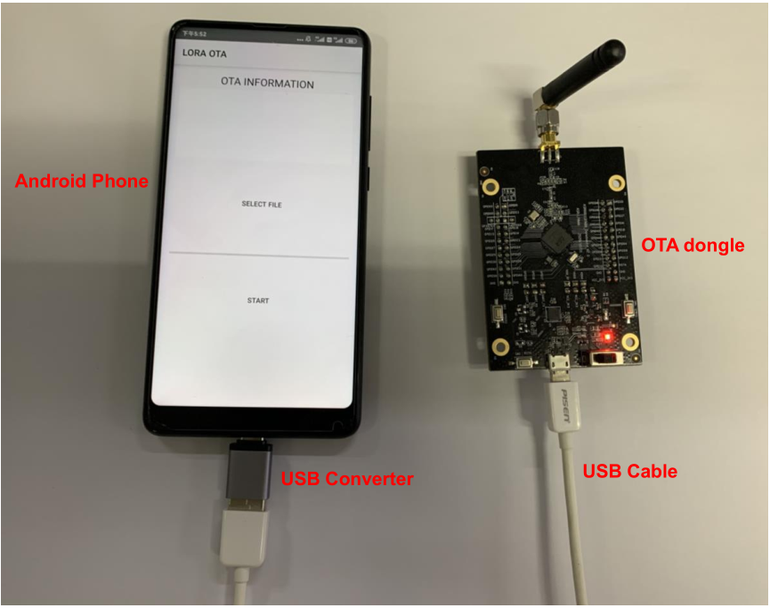
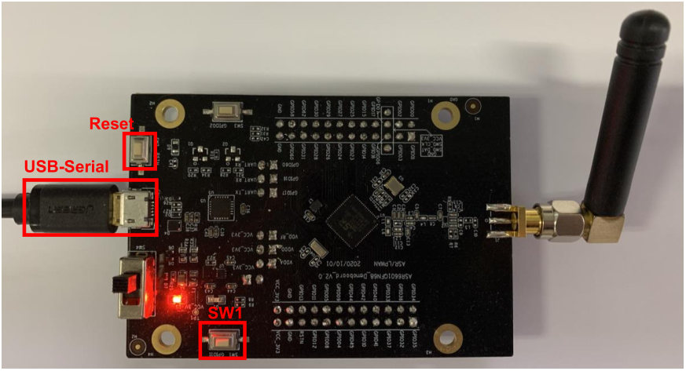
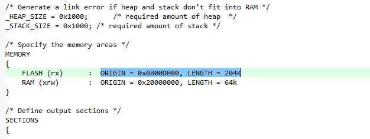
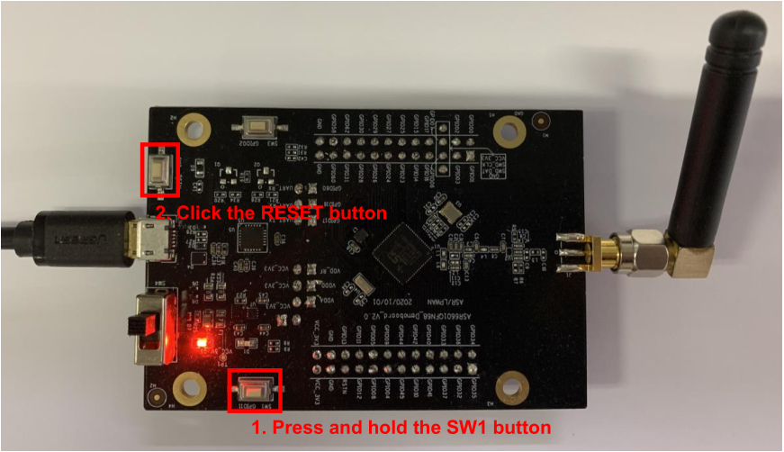
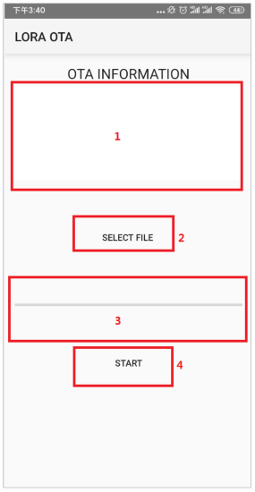
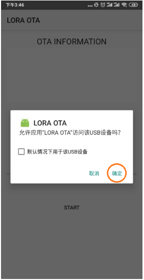
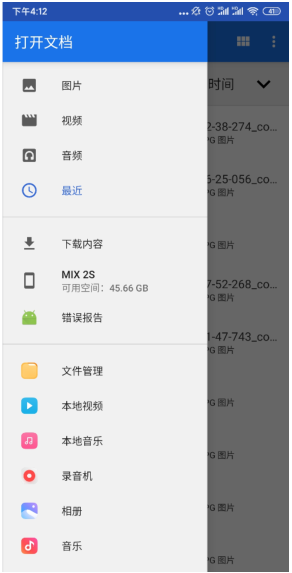
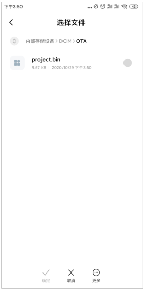
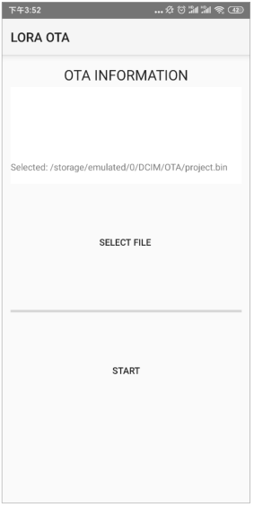
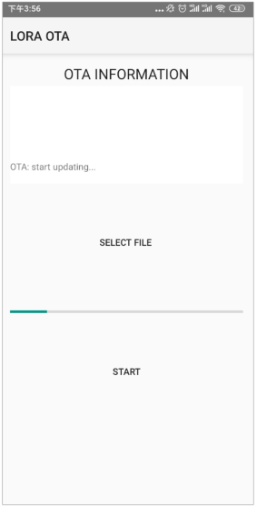
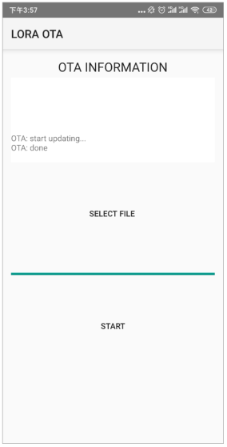
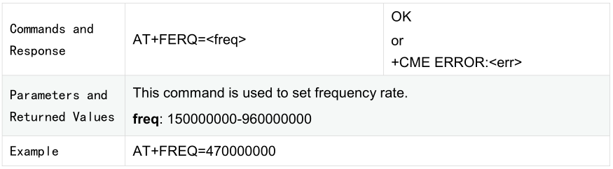
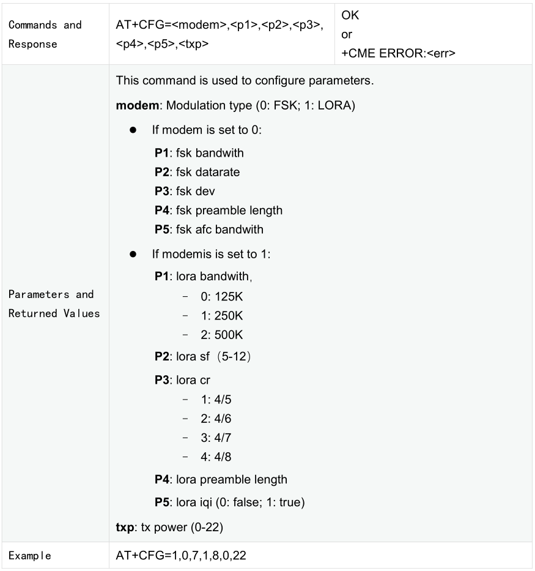
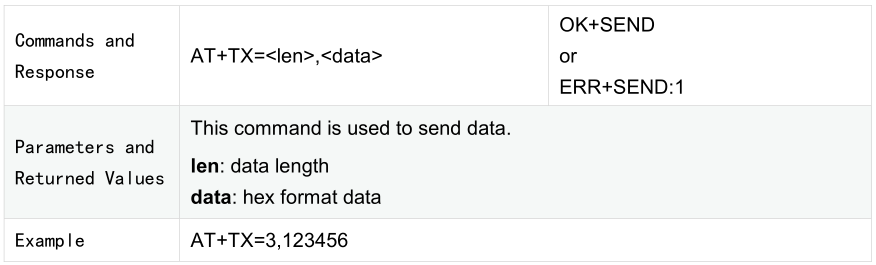
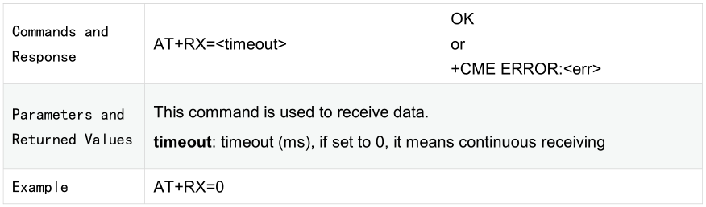
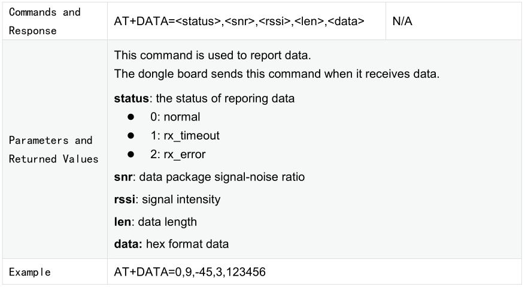
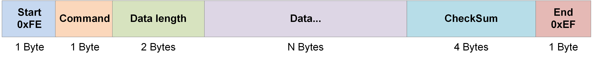
.. |image18| image:: img/6601_OTA/图4-2.png
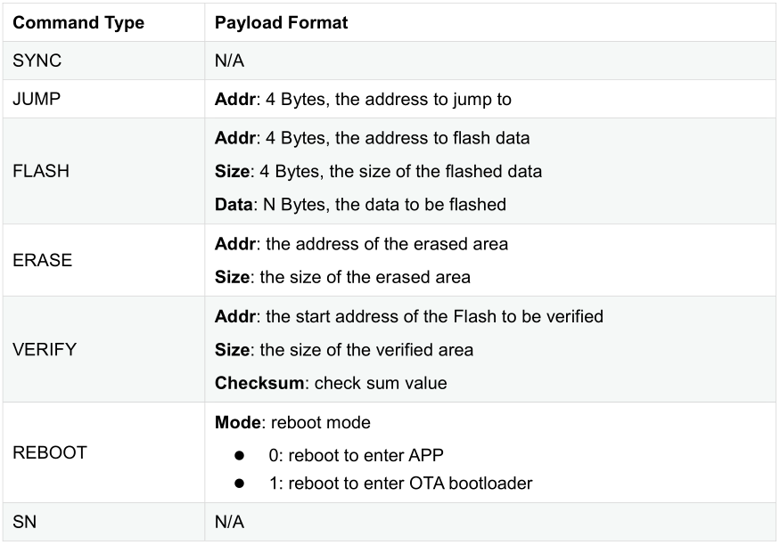