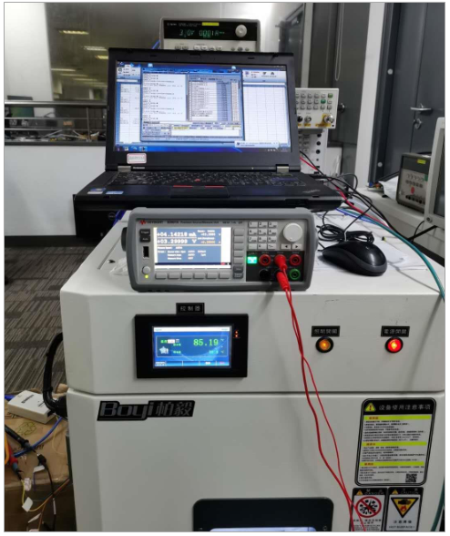
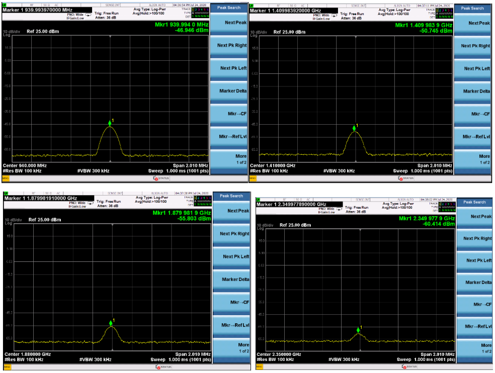
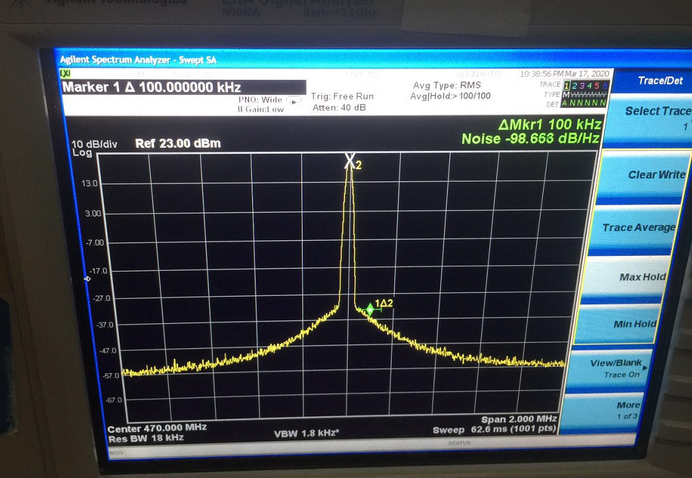
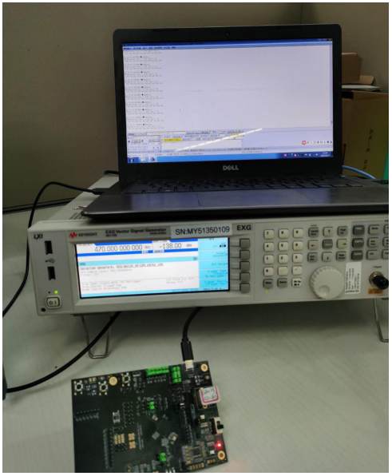
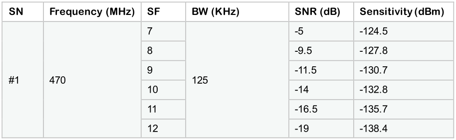
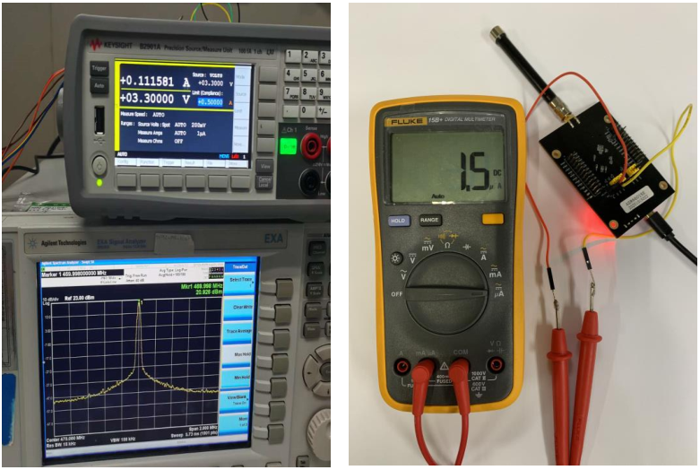
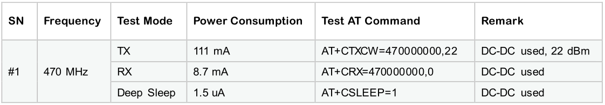

ASR6601 Test Report
===================

Introduction
------------

**About This Document**

This document provides the test report for IoT LPWAN SoC ASR6601.

**Included Chip Models**

The product models corresponding to this document are as follows.

+-----------+--------+-------+-----------------------------+---------------+---------------+
| Model     | Flash  | SRAM  | Core                        | Package       | Frequency     |
+===========+========+=======+=============================+===============+===============+
| ASR6601SE | 256 KB | 64 KB | 32-bit 48 MHz ARM STAR      | QFN68, 8*8 mm | 150 ~ 960 MHz |
+-----------+--------+-------+-----------------------------+---------------+---------------+
| ASR6601CB | 128 KB | 16 KB | 32-bit 48 MHz ARM STAR      | QFN48, 6*6 mm | 150 ~ 960 MHz |
+-----------+--------+-------+-----------------------------+---------------+---------------+

**Copyright Notice**

© 2021 ASR Microelectronics Co., Ltd. All rights reserved. No part of this document can be reproduced, transmitted, transcribed, stored, or translated into any languages in any form or by any means without the written permission of ASR Microelectronics Co., Ltd.

**Trademark Statement**

ASR and ASR Microelectronics Co., Ltd. are trademarks of ASR Microelectronics Co., Ltd. 

Other trade names, trademarks and registered trademarks mentioned in this document are property of their respective owners.

**Disclaimer**

ASR do not give any warranty of any kind and may make improvements and/or changes in this document or in the product described in this document at any time.

This document is only used as a guide, and no contents in the document constitute any form of warranty. Information in this document is subject to change without notice.

All liability, including liability for infringement of any proprietary rights caused by using the information in this document is disclaimed.

**ASR Microelectronics Co., Ltd.**

Address: 9F, Building 10, No. 399 Keyuan Road, Zhangjiang High-tech Park, Pudong New Area, Shanghai, 201203, China

Homepage: http://www.asrmicro.com/asrweb/

**Revision History**

.. raw:: html

   

======== =========== =================
**Date** **Version** **Release Notes**
======== =========== =================
2021.05  V1.0.0      First release.
======== =========== =================

.. raw:: html

   

1. Test Overview
----------------

1.1 Hardware
~~~~~~~~~~~~

68-Pin ASR6601-SE V1.0 Development Board

1.2 Software
~~~~~~~~~~~~

ASR6601 V1.0 SDK

1.3 Equipment
~~~~~~~~~~~~~

Agilent N5182B and Agilent N9020A

1.4 Test Items and Results Summary
~~~~~~~~~~~~~~~~~~~~~~~~~~~~~~~~~~

|image1|

2. Test Implementation
----------------------

2.1 TX Test
~~~~~~~~~~~

2.1.1 Setup TX Test Environment
^^^^^^^^^^^^^^^^^^^^^^^^^^^^^^^

.. raw:: html

   

|image2|

.. raw:: html

   

2.1.2 Frequency Offset Test
^^^^^^^^^^^^^^^^^^^^^^^^^^^

1. **Test Method**

a. Frequency setting:

-  Set to LoRa CW mode with 470.0 MHz frequency
-  Set the power to 22.0 dBm

b. Spectrum analyzer setting:

-  Center frequency is 470.0 MHz, Span is 2 MHz, Ref amp is 25.0 dBm
-  Measure the CW frequency with the marker of the spectrum analyzer

2. **Illustration**

|image3|

3. **Test Result**

== ========= ========== ====
SN Set (MHz) Test (MHz) PPM
== ========= ========== ====
1# 470.000   469.9980   4.25
== ========= ========== ====

2.1.3 Transmit Power Test
^^^^^^^^^^^^^^^^^^^^^^^^^

1. **Test Method**

a. Frequency setting:

-  Set to LoRa CW mode with 470.0 MHz frequency
-  Set the power to 22 dBm

b. Spectrum analyzer setting:

-  Set frequency point at 1st, 2nd, 3rd, 4th and 5th of the basic frequency
-  Span is 2 MHz (or 5 MHz), Ref amp is 25 dBm
-  Max Hold mode

2. **Illustration**

|image4|

3. **Test Result**

Maximum Transmit Power Test Result

== =============== ========= ===========
SN Frequency (MHz) Set (dBm) Basic (dBm)
== =============== ========= ===========
1# 470             22        21.06
2# 470             22        20.97
== =============== ========= ===========

2.1.4 Harmonic Test
^^^^^^^^^^^^^^^^^^^

1. **Test Method**

a. Frequency settings

-  Set to LoRa CW mode with 470.0 MHz frequency
-  Set the power to 22 dBm

b. Spectrum analyzer settings

-  Set frequency point at 1st, 2nd, 3rd, 4th and 5th of the basic frequency
-  Span is 2 MHz (or 5 MHz), Ref amp is 25 dBm
-  Max Hold mode

2. **Illustration**

|image5|

.. raw:: html

   

2nd/3rd/4th/5th Harmonic Test

.. raw:: html

   

3. **Test Result**

+----+-----------------+-----------+-------------+-----------+-----------+-----------+-----------+
| SN | Frequency (MHz) | Set (dBm) | Basic (dBm) | 2nd (dBm) | 3rd (dBm) | 4th (dBm) | 5th (dBm) |
+====+=================+===========+=============+===========+===========+===========+===========+
| 1# | 470             | 22        | 21.06       | -46.94    | -50.74    | -55.80    | -60.41    |
+----+-----------------+-----------+-------------+-----------+-----------+-----------+-----------+
| 2# | 470             | 22        | 20.97       | -45.42    | -49.57    | -56.22    | -59.28    |
+----+-----------------+-----------+-------------+-----------+-----------+-----------+-----------+

2.1.5 Phase Noise Test
^^^^^^^^^^^^^^^^^^^^^^

1. **Test Method**

a. Frequency setting:

-  Set to LoRa CW mode with 470.0 MHz frequency
-  Set the power to 22 dBm

b. Spectrum analyzer setting:

-  Maker -> Delta, Function -> maker noise
-  Span is 2 MHz (or 5 MHz), Ref amp is 25 dBm
-  Max Hold mode

2. **Illustration**

|image6|

3. **Test Result**

== =============== ========= ===================
SN Frequency (MHz) ACT (MHz) Phase Noise (dB/Hz)
== =============== ========= ===================
1# 470             469.999   -98.653
2# 470             469.999   -99.965
== =============== ========= ===================

2.2 RX Test
~~~~~~~~~~~~~~~~~~~

2.2.1 RX Test Environment Setup
^^^^^^^^^^^^^^^^^^^^^^^^^^^^^^^

.. raw:: html

   

|image7|

.. raw:: html

   

2.2.2 RX Sensitivity Test
^^^^^^^^^^^^^^^^^^^^^^^^^

1. **Test Method**

a. Frequency setting:

 Set to LoRa RX test mode with 470.0 MHz frequency

b. Signal generator setting:

-  Load related waveform for different SF
-  Measure the SNR threshold as below

.. raw:: html

   

RX Sensitivity Test Specification

.. raw:: html

   

==== ======== ================== ==============
SF   BW (KHz) Package RSSI (dBm) SNR Limit (dB)
==== ======== ================== ==============
SF7  125      <123               -7.5
SF8  125                         -10
SF9  125                         -12.5
SF10 125      <130               -15
SF11 125                         -17.5
SF12 125      <135               -20
==== ======== ================== ==============

2. **Test Result**

|image8|

2.3 Power Consumption Test
~~~~~~~~~~~~~~~~~~~~~~~~~~

1. **Test Method**

a. Frequency setting:

 Set to 470 MHz frequency under TX, RX, Standby and Sleep mode

b. Multimeter setting:

 Set the multimeter to current test mode

c. AT Command:

-  TX: AT+CTXCW=470000000,22
-  RX: AT+CRX=470000000,0
-  Deep sleep: AT+CSLEEP=1

2. **Illustration**

|image9|

3. **Test Result**

|image10|

4. **Note**

The power consumption test result is for ASR6601 SoC with front-end RF.

.. |image1| image:: img/6601_Report/图1-1.png

.. |image3| image:: img/6601_Report/图2-2.png
.. |image4| image:: img/6601_Report/图2-3.png

