ASR6601 Hardware Design Guide
==============================

Introduction
------------

**About This Document**

This document is a guide for ASR6601 hardware design, including the schematic design, layout notes, and suggestions to critical materials selection.

**Included Chip Models**

The product models corresponding to this document are as follows.

+-----------+--------+-------+-----------------------------+---------------+---------------+
| Model     | Flash  | SRAM  | Core                        | Package       | Frequency     |
+===========+========+=======+=============================+===============+===============+
| ASR6601SE | 256 KB | 64 KB | 32-bit 48 MHz ARM STAR      | QFN68, 8*8 mm | 150 ~ 960 MHz |
+-----------+--------+-------+-----------------------------+---------------+---------------+
| ASR6601CB | 128 KB | 16 KB | 32-bit 48 MHz ARM STAR      | QFN48, 6*6 mm | 150 ~ 960 MHz |
+-----------+--------+-------+-----------------------------+---------------+---------------+

**Copyright Notice**

© 2021 ASR Microelectronics Co., Ltd. All rights reserved. No part of this document can be reproduced, transmitted, transcribed, stored, or translated into any languages in any form or by any means without the written permission of ASR Microelectronics Co., Ltd.

**Trademark Statement**

ASR and ASR Microelectronics Co., Ltd. are trademarks of ASR Microelectronics Co., Ltd. 

Other trade names, trademarks and registered trademarks mentioned in this document are property of their respective owners.

**Disclaimer**

ASR do not give any warranty of any kind and may make improvements and/or changes in this document or in the product described in this document at any time.

This document is only used as a guide, and no contents in the document constitute any form of warranty. Information in this document is subject to change without notice.

All liability, including liability for infringement of any proprietary rights caused by using the information in this document is disclaimed.

**ASR Microelectronics Co., Ltd.**

Address: 9F, Building 10, No. 399 Keyuan Road, Zhangjiang High-tech Park, Pudong New Area, Shanghai, 201203, China

Homepage: http://www.asrmicro.com/asrweb/

**Revision History**

+----------+-------------+---------------------------------------------------------------------------------------------------------------------------------------------------------------------------------------------------------------------------------------+
| **Date** | **Version** | **Release Notes**                                                                                                                                                                                                                     |
+==========+=============+=======================================================================================================================================================================================================================================+
| 2020.09  | V1.0.0      | First release.                                                                                                                                                                                                                        |
+----------+-------------+---------------------------------------------------------------------------------------------------------------------------------------------------------------------------------------------------------------------------------------+
| 2020.11  | V1.0.1      | Updated some pictures.                                                                                                                                                                                                                |
+----------+-------------+---------------------------------------------------------------------------------------------------------------------------------------------------------------------------------------------------------------------------------------+
| 2020.12  | V1.0.2      | Updated the descriptions about ASR6601 module interfaces in the figures in Section 2.3.  Corrected the I2C_CLK and I2C_DAT marks in the figures in Section 2.3.  Updated Section 2.5 Pin Assignment.                                  |
+----------+-------------+---------------------------------------------------------------------------------------------------------------------------------------------------------------------------------------------------------------------------------------+
| 2021.05  | V1.1.0      | Updated Chapter 1: Overview.   Updated the recommended crystal oscillators in Table 3-1.                                                                                                                                              |
+----------+-------------+---------------------------------------------------------------------------------------------------------------------------------------------------------------------------------------------------------------------------------------+
| 2021.07  | V1.2.0      | Added Section 2.4.2 reset circuit and relevant notice.  Updated the descriptions about CPU.  Updated the figures in Section 2.3.1, 2.3.2 and 2.4.4.                                                                                   |
+----------+-------------+---------------------------------------------------------------------------------------------------------------------------------------------------------------------------------------------------------------------------------------+

1. Overview
----------------

ASR6601 is a general Sub-GHz SoC chip, with integrated Sub-1G RF transceiver and 32-bit RISC MCU. This transceiver is compatible with LoRaWAN® networks with the support for LoRa modulation for LPWAN use cases and (G)FSK modulation for legacy use cases. The MCU uses ARM STAR, with 48 MHz operation frequency, supports 3 x I2C, 1 x I2S, 4 x UART, 1 x LPUART, 1 x SWD, 3 x SPI, 1 x 12-bit SAR ADC, 1 x 12-bit DAC, etc.

Continuous frequency coverage from 150 MHz to 960 MHz allows the support of all major sub-GHz ISM bands around the world. The maximum transmit power of the chip is up to +22 dBm with the high-efficiency PA integrated. High sensitivity to -148 dBm is achieved with just 4.6 mA active receive current consumption. The ultra-low deep sleep current of less than 1.6 uA greatly extends the battery life. ASR6601 uses QFN48 (6x6mm) and QFN68 (8x8mm) packages. AS such, ASR6601 is suitable for ultra-distance communication, ultra-low power consumption and cost-effective LPWAN applications.

This document is a guide for ASR6601 hardware design, including the schematic design, layout notes, and suggestions to critical materials selection.

2. ASR6601 Schematic Design
---------------------------

2.1 ASR6601 Block Diagram
~~~~~~~~~~~~~~~~~~~~~~~~~

|image1|

 

2.2 ASR6601 Features
~~~~~~~~~~~~~~~~~~~~

-  Up to 42 configurable GPIOs: 3 x I2C, 1 x I2S, 4 x UART, 1 x LPUART, 1 x SWD, 3 x SPI, 1 x QSPI and 2 x WDG
-  4 x GPtimer, 2 x Basic Timer, 2 x LP timer and 1 x Sys Ticker
-  48 MHz ARM STAR CPU
-  4-channel DMA engine x 2
-  Embedded 12-bit 1 Msps SAR ADC
-  Embedded 12-bit DAC
-  Embedded 3 x OPA
-  Embedded 2 x Low Power Comparator
-  Embedded LCD driver
-  Embedded LD, TD, VD and FD
-  Supports AES, DES, RSA, ECC, SHA and SM2/3/4

2.3 ASR6601 Module Schemtic
~~~~~~~~~~~~~~~~~~~~~~~~~~~

2.3.1 ASR6601CB QFN48 Module Schematic
^^^^^^^^^^^^^^^^^^^^^^^^^^^^^^^^^^^^^^

|image2|

2.3.2 ASR6601SE QFN68 Module Schematic
^^^^^^^^^^^^^^^^^^^^^^^^^^^^^^^^^^^^^^

|image3|

Pay close attention to the following aspects, regarding ASR6601 module reference design:

\1. The default of the matching network is 470 MHz in the reference circuit. If you need any other matching network, please refer to *ASR6601_Matching_V1.0*.

\2. The pullup inductor L7 (15 uH) of DC-DC must be power inductor (Package size: 2016). Refer to *Chapter 3: Material Selection* to get the details of the power inductor. We suggest you choose 0402 package for the inductor L1 (56 nH) of VR_PA, since its rated current is larger, which helps improve the transmit power of the TX.

\3. The R1，R2，R3，R4 and R7 in the schematics are mainly for testing. You can change or remove them accordingly.

\4. XO and TCXO are compatible in the ASR6601 module schematic. You can choose either one accordingly.

\5. In order to enhance ESD protection, we suggest reserving D1 and D2. D2 has some influence on RF performance, D2(TVS) with small capacitance is prefered.

\6. If VDD_IN is connected to VREG, the maximum transmit power is 14 dBm. If VDD_IN is connected to VDD_RF, the maximum transmit power is up to 22 dBm.

\7. Users can contact ASR for the DSN file of ASR6601 module schematics.

2.4 Key Circuits Analysis
~~~~~~~~~~~~~~~~~~~~~~~~~

2.4.1 Power Supply
^^^^^^^^^^^^^^^^^^

There are three parts of ASR6601 power: VDDD, VDDA and VDD_RF. *VDDD* supplies power to the digital parts of MCU. *VDDA* supplies power to the ADC parts of MCU. *VDD_RF* supplies power to the RF parts of MCU.

The regulator (REG PA) in ASR6601 supplies bias to output stage RFO of PA through the pullup inductor L1. The *DC-DC* or *LDO* integrated in the ASR6601 supplies power to the regulator (REG PA). *VCC_IN* supplies power to DC-DC and LDO. VDD_IN works from 1.8 V to 3.7 V, but we suggest *3.3 V*.

.. raw:: html

   

|image4|

ASR6601 DC-DC Power Supply Scheme

.. raw:: html

   

2.4.2 Reset Circuit
^^^^^^^^^^^^^^^^^^^^^^^^

The power-on reset circuit and power-on sequence are integrated into ASR6601 SoC chip, and the voltage can be normally loaded on VBAT directly.

.. raw:: html

   

|image5|

ASR6601 Power-on Reset Circuit and Power-on Sequence

.. raw:: html

   

**Notice:**
 As shown in Figure 2-5, the VBAT power supply must rise to above 0.7 Vcc within 10ms before the internal Power RST circuit can be reset normally. There is a low-voltage detection module inside the chip, when VBAT is lower than 0.3 Vcc, the inside of the chip will always be in the reset state. The chip has been optimized internally. It is recommended to use 4.7K external pull-up resistors and 330 pf capacitors for the internal Power RST circuit. The reset time should be delayed as short as possible. If a large capacitor is connected externally, VBAT rises slowly, and the system may have unnecessary risks.

2.4.3 Crystal Oscillator
^^^^^^^^^^^^^^^^^^^^^^^^

ASR6601 Demo module uses two crystal oscillators:

\1. **32 MHz TCXO/XO for LoRa**\ ：

 a. The crystal oscillator load capacitance is 10 pf.

 b. If the bandwidth is lower than 62.5 KHz, TCXO is strongly recommended.

 c. ASR6601 integrates load capacitance matrix, please use the default value.

 d. Increase external load capacitance when the frequency offset is positive, otherwise, we suggest to change 32M XO.

\2. **32.768 KHz XO for MCU**\ ：

 a. The crystal oscillator load capacitance is 6 pf.

 b. ASR reference module 32.768K load capacitance is NC.

 c. Adjust external load capacitance, since clients’ PCB layout and XO used are various.

.. raw:: html

   

|image6|

.. raw:: html

   

2.4.4 RF Matching
^^^^^^^^^^^^^^^^^

|image7|

Pay close attention to the following aspects, regarding to ASR6601 chip RF circuit:

\1. Please adjust the parameters of the RF based on the default parameters to optimize the RF performance, since clients’ PCB layout and wiring are various.

\2. The default of the matching network is 470 MHz in the reference circuit. If you need any other matching network, please refer to the article of *ASR6601_Matching_V1.0*.

\3. XMSSJR6G0BA uses single-end controlled mode. Pin6 is the DIO2 received by CTRL signal of TRSW. DIO’s controlling logics are as following. Please note that different RFSWs have different controlling logics and pins, which are defined in the corresponding datasheets of RFSW.

 a. When DIO2 is high, RF2àTX

 b. When DIO2 is low, RF1àRX

\4. GPIO10 connects the VDD pin of TRSW. When ASR6601 works normally, GPIO is high. When ASR6601 is in sleep mode, GPIO is pulled down to turn off the TRSW to prevent TRSW electric leakage (XMSSJR6G0BA may have 5 uA electric leakage). If the power consumption is not sensitive, GIPO can be used in other ways by connecting VDD_RF to VDD of RFSW.

\5. ASR suggest using XMSSJR6G0BA for RFSW. Users can use replaceable materials and adjust the parameters in RF matching network. For further details, please refer to *Chapter 3: Material Selection*.

2.5 ASR6601 Pin Assignment
~~~~~~~~~~~~~~~~~~~~~~~~~~

Please refer to *ASR6601 Datasheet* for pin definitions.

.. raw:: html

   

|image8|

Pin Assignment of ASR6601SE QFN68 (8x8x0.9mm)

.. raw:: html

   

.. raw:: html

   

|image9|

Pin Assignment of ASR6601CB QFN48 (6x6x0.9mm)

.. raw:: html

   

3. Critical Materials Selection
-------------------------------

.. _crystal-oscillator-1:

3.1 Crystal Oscillator
~~~~~~~~~~~~~~~~~~~~~~

|image10|

3.2 RF Switch
~~~~~~~~~~~~~

|image11|

3.3 Power Inductor
~~~~~~~~~~~~~~~~~~

If using DC-DC supplies power to the regulator (REG PA), the power inductor is a necessity. Please refer to the requirements of the power inductor in the following table.

|image12|

Please refer to *Critical Material Recommendations* for details about recommended suppliers.

3.4 External Antenna
~~~~~~~~~~~~~~~~~~~~

The impedance performance has significant influence on the results in the distance test, thus users should choose an antenna properly.

4. PCB Layout Notes
-------------------

4.1 Power Supply Routing
~~~~~~~~~~~~~~~~~~~~~~~~

Pay attention to the following aspects, regarding to the PCB power supply routing:

\1. You had better use capacitor filters of 2.2 uF and 0.1 uF as power supply, which can filter out low-frequency and high-frequency noise.

\2. Use wide power supply routing as possible. It should not be lower than 18 mil. In order to reducing mutual interference, the spacing must be 3W.

\3. To avoid any interference, power wires must not go across other power wires or high-frequency wires.

\4. VDD_IN’s maximum electric current is 120 mA. The wiring of VDD_IN needs to withstand 300 mA current.

4.2 RF Routing
~~~~~~~~~~~~~~

Pay attention to the following aspects, regarding to the PCB RF routing as shown in the figure below:

.. raw:: html

   

|image13|

.. raw:: html

   

\1. RF matching components should be placed as close to the chip as possible.

\2. The RF wires should be put only on the top layer and should be without trans-layer routing. The characteristic impedance of the transmission lines must be 50 Ohm.

\3. The RF wires must not go 90° right angle or any acute angle. Do it as 135° angle wiring or arc wiring as possible.

\4. Shield the RF wirings as perfectly as possible. Especially the second layer GND. Punch the parts surrounding antenna and RF wrings as much as possible.

\5. High-frequency signal wirings must not show up around the RF wirings. The antennas of RF wirings must stay away from all devices transmitting high-frequency signals, such as crystals, UART, PWM, SDIO, etc.

\6. RF transmission lines’s characteristic impedance is 50 Ohm. We suggest using 18 mil width and 14 mil space. Please adjust according to the layers and construction of the PCB, but the width should not less than 12 mil. We recommend to use a smooth transition at the connection between the routings and the SMA antenna to reduce the impedance mutation.

4.3 Crystal Routing
~~~~~~~~~~~~~~~~~~~

Pay attention to the following aspects, regarding to the PCB crystal routing:

\1. The clock of crystal must be in the top layer. Do not do it trans-layer or crossly. Use GND shielding.

\2. The high-speed signal line cannot go below the crystal. There must be complete GND in the second layer.

\3. Put the load capacitor of crystal to the end of clock line as possible.

\4. Do not put any magnetic elements at the crystal, such as inductor, magnetic bead, etc.

\5. The copper skin of the crystal must be hollowed out in case that it generates temperature drift because of the heat conduction from surrounding elements.

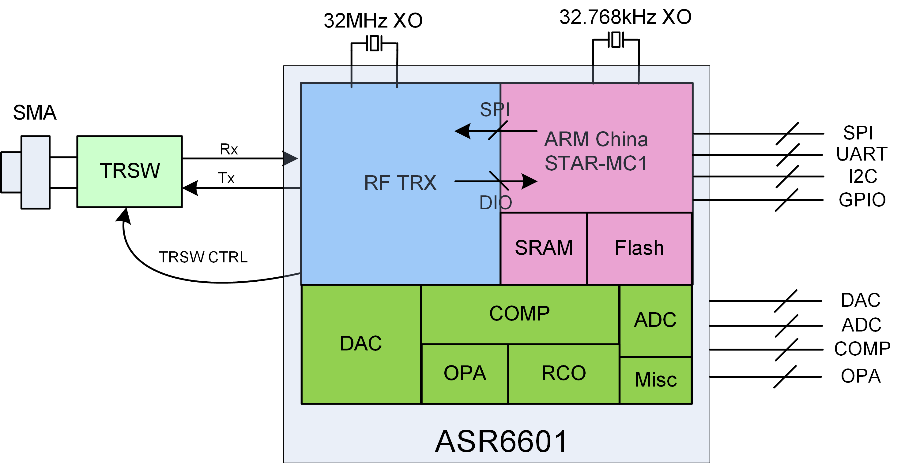
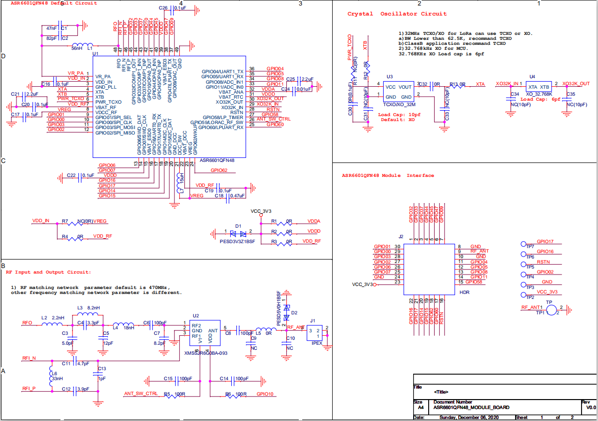
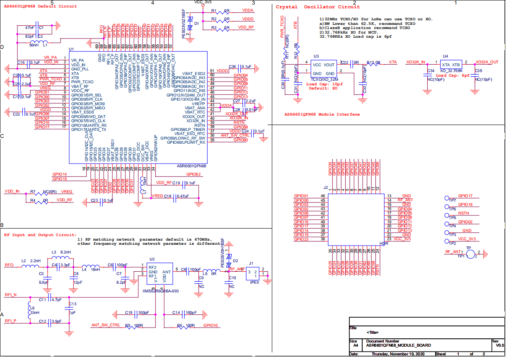
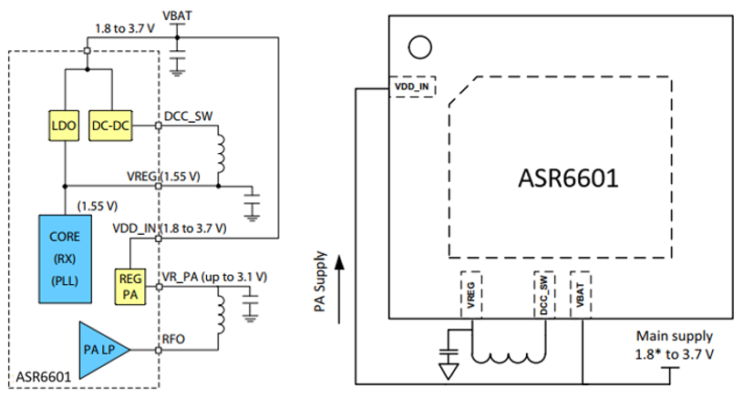
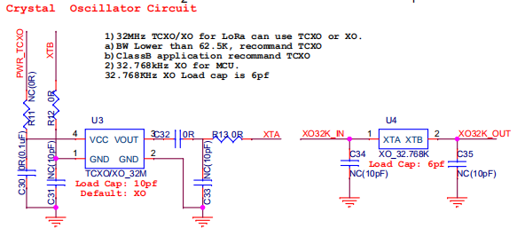
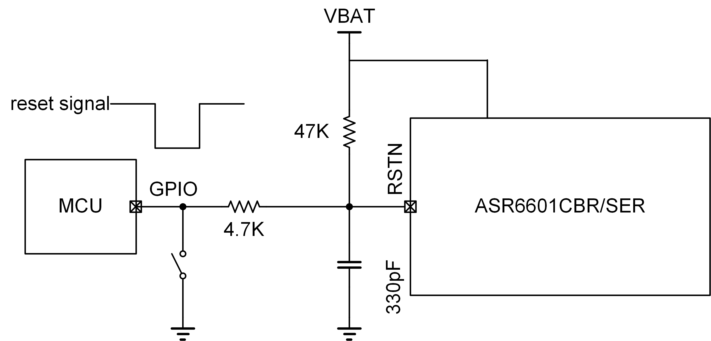
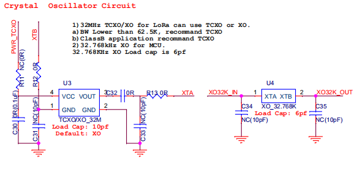
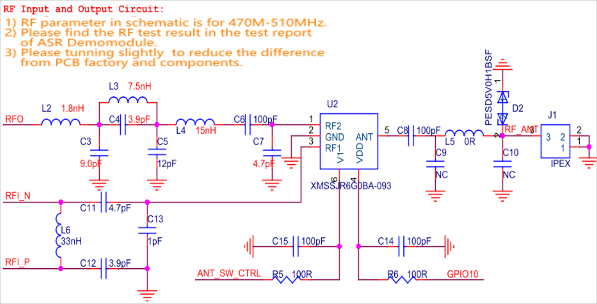
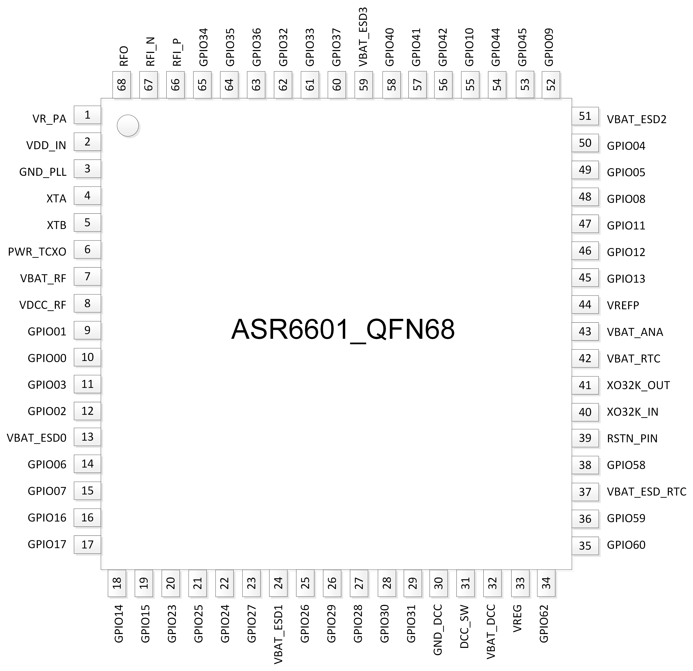
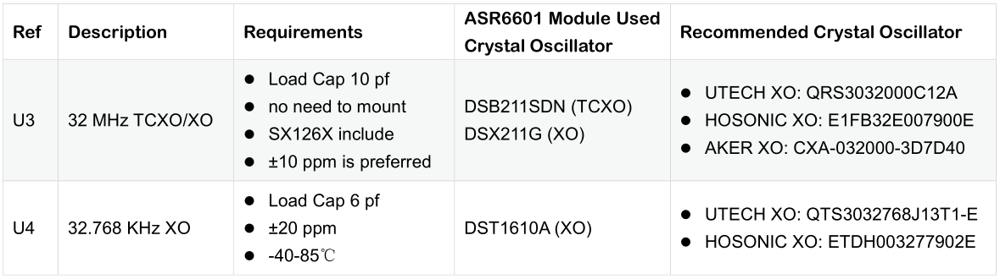
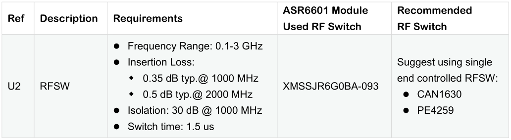
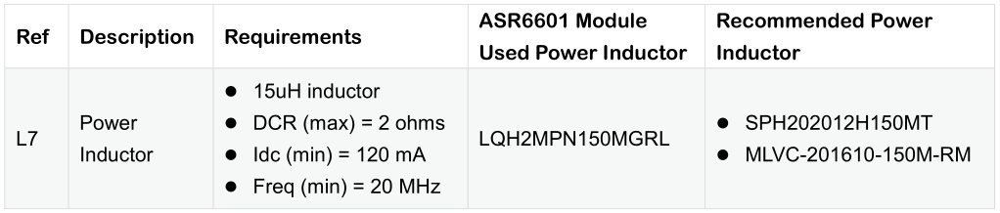
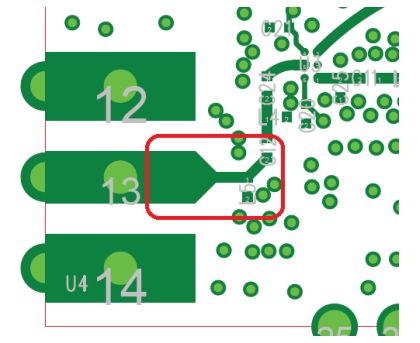

