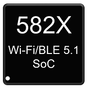

ASR Docs Page
=============================
`简体中文 <https://asriot-cn.readthedocs.io/zh/latest/>`_

The following is the product selector for `ASR <http://www.asrmicro.com/index>`_ IoT products.

.. toctree::
   :maxdepth: 2

    IoT/AIoT Wi-Fi MCU<iot>
    Wi-Fi Interface Transceiver<透传>
    LoRa Product<lora>
    Bluetooth Product<蓝牙>

Below is the public documentation for `ASR <http://www.asrmicro.com/index>`_ IoT products.

Wi-Fi Chips
--------------------------------

.. list-table::

    *   -   |ASR550X SoC|_
    *   -   `ASR550X SoC`_ 

.. |ASR550X SoC| image:: img/10.png
.. _ASR550X SoC: ASR550X/index.html
\

BT/BLE Chips
--------------------------------

.. list-table::

    *   -   |ASR560X SoC|_
    *   -   `ASR560X SoC`_ 

.. |ASR560X SoC| image:: img/01.png
.. _ASR560X SoC: ASR560X/index.html

Combo 芯片
--------------------------------

.. list-table::

    *   -   |ASR582X SoC|_
    *   -   `ASR582X SoC`_ 

.. _ASR582X SoC: ASR582X/index.html

LPWAN Chips
--------------------------------

.. list-table::

    *   -   |ASR6601 SoC|_
    *   -   `ASR6601 SoC`_ 

.. |ASR6601 SoC| image:: img/02.png
.. _ASR6601 SoC: ASR6601/index.html

.. toctree::
   :hidden:
   :caption: Language
   
   简体中文 <https://asriot-cn.readthedocs.io/zh/latest/>

.. toctree::
   :hidden:
   :caption: ASR550X
   
   ASR550X/Datasheet/index
   ASR550X/Hardware-Reference/index
   ASR550X/Download-Tool/index
   ASR550X/Demo-Project/index
   ASR550X/Quick-Start/index
   ASR550X/FAQ/index
   ASR550X/Certification/index
   ASR550X/Test-Report/index

.. toctree::
   :hidden:
   :caption: ASR560X
   
   ASR560X/Datasheet/index
   ASR560X/Hardware-Reference/index
   ASR560X/Download-Tool/index
   ASR560X/Demo-Project/index
   ASR560X/Quick-Start/index
   ASR560X/FAQ/index
   ASR560X/Certification/index
   ASR560X/Test-Report/index

.. toctree::
   :hidden:
   :caption: ASR582X
   
   ASR582X/Datasheet/index
   ASR582X/Hardware-Reference/index
   ASR582X/Download-Tool/index
   ASR582X/Demo-Project/index
   ASR582X/Quick-Start/index
   ASR582X/FAQ/index
   ASR582X/Certification/index
   ASR582X/Test-Report/index

.. toctree::
   :hidden:
   :caption: ASR6601

   ASR6601/Datasheet/index
   ASR6601/Hardware-Reference/index
   ASR6601/Download-Tool/index
   ASR6601/Demo-Project/index
   ASR6601/Quick-Start/index
   ASR6601/FAQ/index
   ASR6601/Certification/index
   ASR6601/Test-Report/index

**Contact us:**\
  
-  Tel: +86-021-60336588-8290
-  Mail: asr_iot@asrmicro.com
-  Address: 9F, Building 10, No. 399 Keyuan Road, Zhangjiang High-tech Park, Pudong New Area, Shanghai, 201203, China
-  Homepage: http://www.asrmicro.com/

For brief introduction on ASR company and IoT BU products, please refer to `ASR Brochure <https://drive.google.com/file/d/1SBLgUKPl_aCFZAS_ICAElZb6wIeGbVTH/view?usp=sharing>`_ .