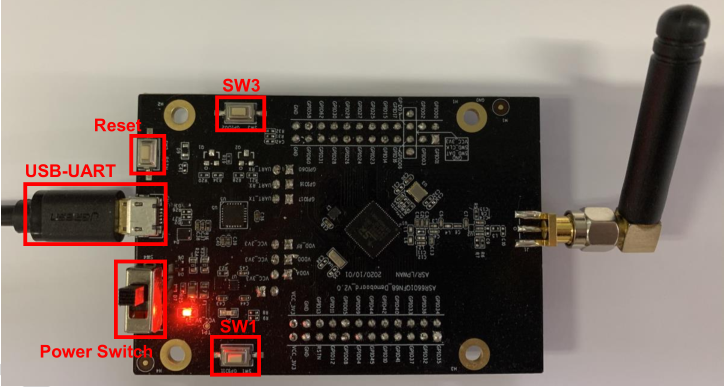
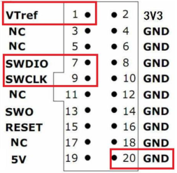
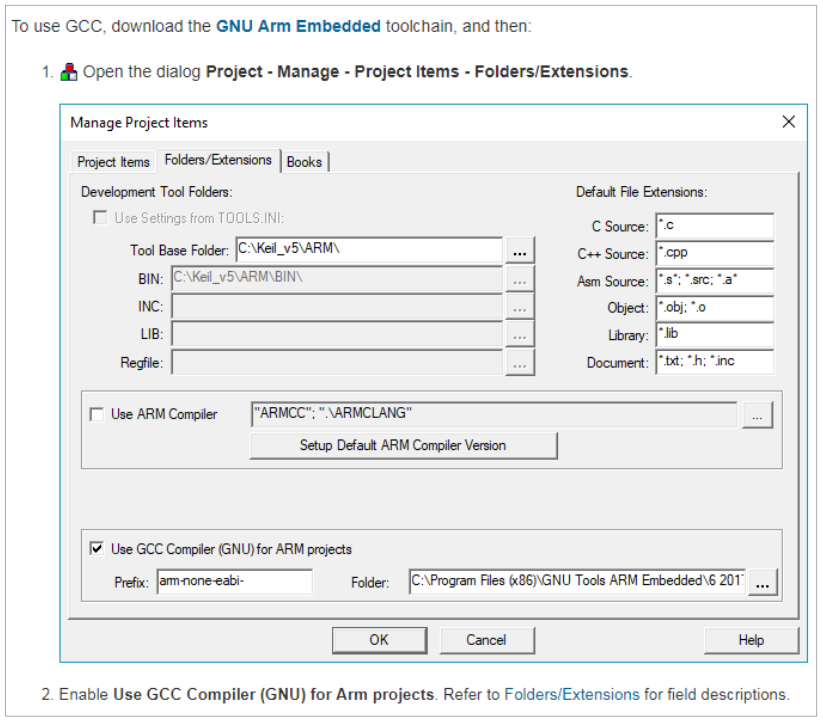
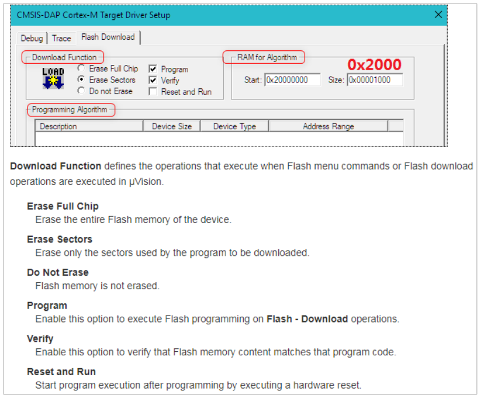

ASR6601 Quick Start Guide
=========================

Introduction
------------

**About This Document**

This document introduces the development environment setting, the compilation and download regarding IoT LPWAN SoC ASR6601 SDK. It is convenient for users to quickly develop programs based on ASR6601.

**Included Chip Models**

The product models corresponding to this document are as follows.

+-----------+--------+-------+-----------------------------+---------------+---------------+
| Model     | Flash  | SRAM  | Core                        | Package       | Frequency     |
+===========+========+=======+=============================+===============+===============+
| ASR6601SE | 256 KB | 64 KB | 32-bit 48 MHz ARM Cortex-M4 | QFN68, 8*8 mm | 150 ~ 960 MHz |
+-----------+--------+-------+-----------------------------+---------------+---------------+
| ASR6601CB | 128 KB | 16 KB | 32-bit 48 MHz ARM Cortex-M4 | QFN48, 6*6 mm | 150 ~ 960 MHz |
+-----------+--------+-------+-----------------------------+---------------+---------------+

**Copyright Notice**

© 2021 ASR Microelectronics Co., Ltd. All rights reserved. No part of this document can be reproduced, transmitted, transcribed, stored, or translated into any languages in any form or by any means without the written permission of ASR Microelectronics Co., Ltd.

**Trademark Statement**

ASR and ASR Microelectronics Co., Ltd. are trademarks of ASR Microelectronics Co., Ltd. 

Other trade names, trademarks and registered trademarks mentioned in this document are property of their respective owners.

**Disclaimer**

ASR do not give any warranty of any kind and may make improvements and/or changes in this document or in the product described in this document at any time.

This document is only used as a guide, and no contents in the document constitute any form of warranty. Information in this document is subject to change without notice.

All liability, including liability for infringement of any proprietary rights caused by using the information in this document is disclaimed.

**ASR Microelectronics Co., Ltd.**

Address: 9F, Building 10, No. 399 Keyuan Road, Zhangjiang High-tech Park, Pudong New Area, Shanghai, 201203, China

Homepage: http://www.asrmicro.com/asrweb/

**Revision History**

+----------+-------------+--------------------------------------------------------------------+
| **Date** | **Version** | **Release Notes**                                                  |
+==========+=============+====================================================================+
| 2020.05  | V0.1.0      | First release.                                                     |
+----------+-------------+--------------------------------------------------------------------+
| 2020.08  | V0.2.0      | Added descriptions about Keil environment. Added Q&A.              |
+----------+-------------+--------------------------------------------------------------------+
| 2020.09  | V0.3.0      | Updated some pictures.                                             |
+----------+-------------+--------------------------------------------------------------------+
| 2020.10  | V0.4.0      | Updated the pictures of ASR6601SE development board v2.0.          |
+----------+-------------+--------------------------------------------------------------------+
| 2021.01  | V1.1.0      | Deleted Chapter 1, and move the contents to “About This Document”. |
+----------+-------------+--------------------------------------------------------------------+
| 2021.05  | V1.2.0      | Modified Chapter 3 to simplify the compilation process.            |
+----------+-------------+--------------------------------------------------------------------+

1. Hardware Preparation
-----------------------

LoRa nodes hardware requirements：

-  1 ASR6601 development board
-  1 antenna
-  1 USB cable
-  1 PC

1.1 ASR6601 Development Board
~~~~~~~~~~~~~~~~~~~~~~~~~~~~~

ASR6601SE development board v2.0 front and back photos are as follows:

​|image1|

.. raw:: html

   

The Front View of ASR6601SE Development Board v2.0

|image2|

.. raw:: html

   

.. raw:: html

   

The Back View of ASR6601SE Development Board v2.0

.. raw:: html

   

+------------------------------------------------+------------------------------------------------------------------------+
| Interface                                      | Description                                                            |
+================================================+========================================================================+
| USB-UART                                       | USB                                                                    |
+------------------------------------------------+------------------------------------------------------------------------+
| Power Switch                                   | Power switch                                                           |
+------------------------------------------------+------------------------------------------------------------------------+
| Reset                                          | Reset button                                                           |
+------------------------------------------------+------------------------------------------------------------------------+
| SW3                                            | It’s the Download button pressed to pull up GPIO02                     |
+------------------------------------------------+------------------------------------------------------------------------+
| SW1                                            | It’s the User button pressed to pull down GPIO11                       |
+------------------------------------------------+------------------------------------------------------------------------+
| JP1                                            | Jumper1                                                                |
+------------------------------------------------+------------------------------------------------------------------------+
| JP2                                            | Jumper2                                                                |
+------------------------------------------------+------------------------------------------------------------------------+
| JP3                                            | Jumper3                                                                |
+------------------------------------------------+------------------------------------------------------------------------+
| JP4                                            | Jumper4, which can be used to test the board’s total power consumption |
+------------------------------------------------+------------------------------------------------------------------------+
| JP5                                            | Connect UART_TX jumper, then select UART0_TX. Reference: Schematics    |
+------------------------------------------------+------------------------------------------------------------------------+
| JP6 (only used in ASR6601CB development board) | Connect UART_TX jumper, then select LPUART_TX. Reference: Schematics   |
+------------------------------------------------+------------------------------------------------------------------------+
| JP7                                            | Connect UART_TX jumper, then select UART0_RX. Reference: Schematics    |
+------------------------------------------------+------------------------------------------------------------------------+
| JP8                                            | Connect UART_TX jumper, then select LPUART_RX. Reference: Schematics   |
+------------------------------------------------+------------------------------------------------------------------------+

1.2 Jumper Connection
~~~~~~~~~~~~~~~~~~~~~

When testing ASR6601 development board, please make sure the following jumpers’ state is set correctly.

.. raw:: html

   

============================================== ================
Jumper                                         Connection State
============================================== ================
JP1                                            connected
JP2                                            connected
JP3                                            connected
JP4                                            connected
JP5                                            connected
JP6 (only used in ASR6601CB development board) Not connected
JP7                                            connected
JP8                                            Not connected
============================================== ================

.. raw:: html

   

2. Development under Keil
-------------------------

2.1 Connection to JLINK
~~~~~~~~~~~~~~~~~~~~~~~
.. raw:: html

   

|image3|

.. raw:: html

   

.. raw:: html

   

SWD Interfaces

.. raw:: html

   

When using Jlink, ASR6601 needs 4 wires. Connect the interface 1, 7, 9 and 20 of Jlink to the corresponding pins on the board.

2.2 SDK Acquisition
~~~~~~~~~~~~~~~~~~~

Please contact ASR technical support engineers.

2.3 Keil Project File Generation
~~~~~~~~~~~~~~~~~~~~~~~~~~~~~~~~

There is no Keil project file in SDK. Developers can run *keil.bat* in example project folder to generate it.

2.4 GCC Tool Chains Config
~~~~~~~~~~~~~~~~~~~~~~~~~~

(1) Decompress the tool chains under *\\tools\\toolchain* directory in SDK.

(2) Set GCC tool chains according to the Keil user guide from the below link: https://www.keil.com/support/man/docs/uv4/uv4_gnucomp.htm

(3) Set “Tool Base Folder” to the directory of the decompressed tool chains, for example, D:\\ASR6601_rel\\tools\\toolchain

|image4|

2.5 Flash Programming Algorithm Config
~~~~~~~~~~~~~~~~~~~~~~~~~~~~~~~~~~~~~~

First, copy the *ASR6601.FLM* file under *\\tools\\FLM* directory to *Flash* directory within Keil, for example, C:\\Keil_v5\\ARM\\Flash.

If the flash failed, please edit the configurations on the Flash Download tab according to the Keil user guide from the below link: https://www.keil.com/support/man/docs/uv4/uv4_fl_dlconfiguration.htm

Mainly configure the following items:

(1) **Download Function**: Select “Erase Sectors”, check “Program” and “Verify”

(2) **RAM for Algorithm**: Set “Start” to 0x20000000, “Size” to 0x2000

(3) **Programming Algorithm**: Add the Flash Programming Algorithm file for ASR6601

|image5|

2.6 Compilation and Download
~~~~~~~~~~~~~~~~~~~~~~~~~~~~

(1) Click “Build” to compile

(2) Click “Download” to flash

3. Make Command Lines
---------------------

3.1 Preparation
~~~~~~~~~~~~~~~

3.1.1 Development Environment Installation
^^^^^^^^^^^^^^^^^^^^^^^^^^^^^^^^^^^^^^^^^^

3.1.1.1 Ubuntu (Version 18.04)
''''''''''''''''''''''''''''''

Run the following command to install Python and other necessary software:

::

   sudo apt-get install gcc-arm-none-eabi git vim python python-pip
   pip install pyserial configparser 

3.1.1.2 Windows
'''''''''''''''

(1) **Install MSYS2**

    Log in to https://www.msys2.org/ to download the installation package and install it as required.

(2) **Install Related Software**

    Open MSYS2, then install software: ``pacman -S git vim make unzip python python-pip``

    Use pip to install Pyserial: ``pip install pyserial configparser``

.. _sdk-acquisition-1:

3.1.2 SDK Acquisition
^^^^^^^^^^^^^^^^^^^^^

Please contact ASR technical support engineers.

.. _compilation-and-download-1:

3.2 Compilation and Download
~~~~~~~~~~~~~~~~~~~~~~~~~~~~

Take the example of **uart_printf** project to elaborate the the software compilation and download process.

3.2.1 Build the Project
^^^^^^^^^^^^^^^^^^^^^^^

Build the project as follows:

(1) Run the command to configure environment variables: ``source build/envsetup.sh``

(2) Enter *uart_printf* directory: ``cd projects/ASR6601CB-EVAL/examples/uart/uart_printf``

(3) Run the make command to compile the program: ``make``

It will show as the following after successful compilation:

::

   Build completed.
   arm-none-eabi-size out/uart_printf.elf
     text  data   bss   dec   hex filename
     9972  1080  4164  15216  3b70 out/uart_printf.elf
   Please run 'make flash' or the following command to download the app
   python /home/ruilinhao/work/ASR6601_rel/build/scripts/tremo_loader.py -p /dev/ttyUSB0 -b 921600 flash 0x08000000 out/uart_printf.bin

3.2.2 Download
^^^^^^^^^^^^^^

There are two methods to download:

-  Use Tremo programmer, see *ASR6601_Tremo Programmer Tool User Guide* for details.
-  Use command line.

The following introduces the steps of downloading with command line:

(1) **Config Serial Port**

    First, run the command: ls /dev/ to check the serial port of ASR6601 development board.

    Usually, there is a ttyS\* device under MSYS2. This device corresponds to one COM port number under Windows. For example, COM6 corresponds to */dev/ttyS5* in MSYS2, and the serial device is usually */dev/ttyUSB** under Ubuntu.

    Find the right serial device, edit the *Makefile* in *uart_printf* program, erase the "#" before *SERIAL_PORT,* and edit *SERIAL_PORT* to the responding serial number.

    If there are no special requirements, developers can use the default value of *SERIAL\_BUADRATE* and *$(PROJECT)_ADDRESS*.

    ::

       SERIAL_PORT    :=/dev/ttyS5
       #SERIAL_BAUDRATE  :=
       #$(PROJECT)_ADDRESS :=

\

(2) **Enter Download Mode**

    Press and hold the SW3 button on the board to pull up GPIO02, and then click the Reset button to reboot the board. After that it will be in download mode.

    |image6|

\

(3) **Execute Download**

    Run ``make flash`` command or use *tremo_loader.py* to download files.

    If the download is successful, developers will see the following information. If it keeps failing, please refer to *Chapter 4 Q&A*.

    ::

       Connecting...
       Connected
       ('send: ', 512)
       ('send: ', 1024)
       ('send: ', 1536)
       ('send: ', 2048)
       ('send: ', 2560)
       ('send: ', 3072)
       ('send: ', 3584)
       ('send: ', 4096)
       ('send: ', 4100)
       Download files successfully

3.2.3 Operation
^^^^^^^^^^^^^^^

After the download, restart the ASR6601 development board, and then the program will run properly. ``hello world`` will be printed on the serial tool interface.

4. Q&A
------

4.1 Why doesn't "SW Device" display when using Keil?
~~~~~~~~~~~~~~~~~~~~~~~~~~~~~~~~~~~~~~~~~~~~~~~~~~~~

There are two possibilities for that:

1. There are some problems with the hardware connection. Developers can check the wiring and power supply, etc.
2. Hard faults occurred or MCU entered the low power mode, etc., which caused this problem. Developers can pull up GPIO02 with Dupont line, and then restart the board. In this way, MCU will be in bootloader mode to pop up "SW device" and to download files.

4.2 What to do if the responding serial device cannot be found when using MSYS2?
~~~~~~~~~~~~~~~~~~~~~~~~~~~~~~~~~~~~~~~~~~~~~~~~~~~~~~~~~~~~~~~~~~~~~~~~~~~~~~~~

The responding serial device cannot be found if its device port number excess the maximum (64 or 128, based on the version) in MSYS2. Thus the serial device will be displayed if the port number gets smaller.

4.3 What to do if the download keeps failing in MSYS2, while the serial device is displayed?
~~~~~~~~~~~~~~~~~~~~~~~~~~~~~~~~~~~~~~~~~~~~~~~~~~~~~~~~~~~~~~~~~~~~~~~~~~~~~~~~~~~~~~~~~~~~

1. Check if other software opened that serial port, such as a serial tool.
2. For some Windows versions, using */dev/ttyS** directly will cause download to fail. Try to modify *SERIAL_PORT* to *COM** in the Makefile.

.. |image2| image:: img/6601_Quick/图1-2.png

.. |image6| image:: img/6601_Quick/图3-1.png
