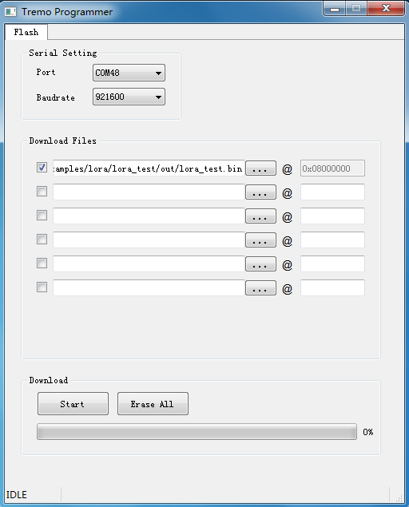
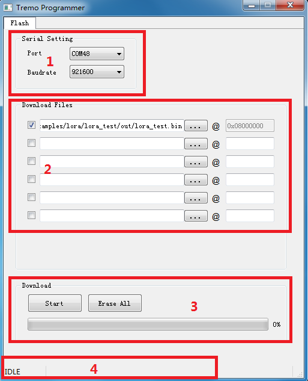
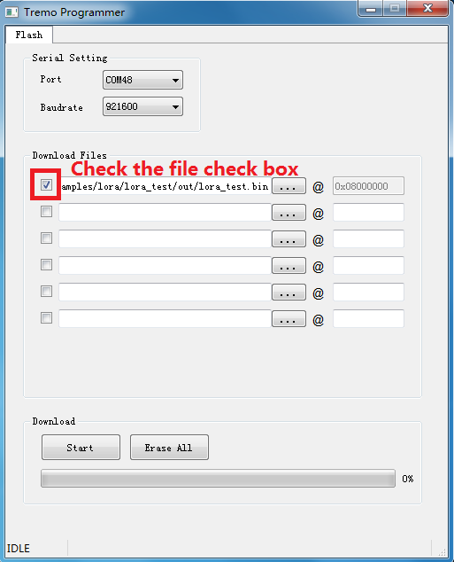
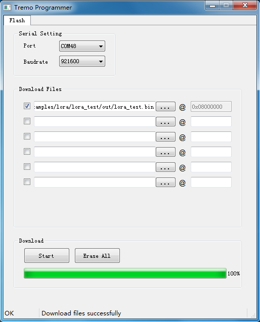
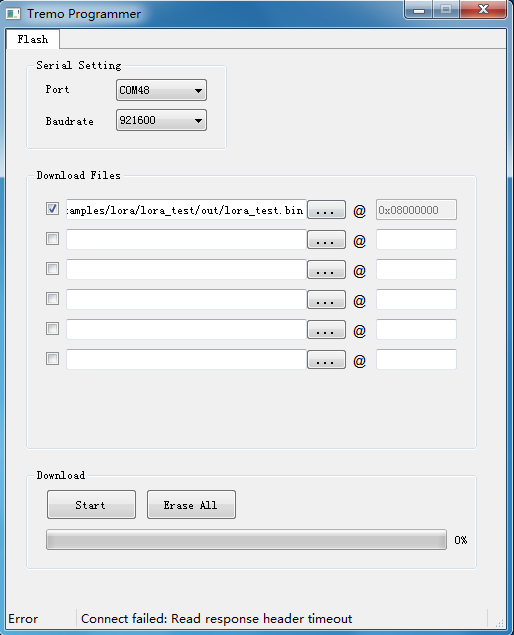

ASR6601 Tremo Programmer Tool User Guide
========================================

Introduction
------------

**About This Document**

This document mainly introduces the download tool *Tremo Programmer* for the developers to use the tool to download to the Flash of LPWAN SoC ASR6601.

**Included Chip Models**

The product models corresponding to this document are as follows.

+-----------+--------+-------+-----------------------------+---------------+---------------+
| Model     | Flash  | SRAM  | Core                        | Package       | Frequency     |
+===========+========+=======+=============================+===============+===============+
| ASR6601SE | 256 KB | 64 KB | 32-bit 48 MHz ARM Cortex-M4 | QFN68, 8*8 mm | 150 ~ 960 MHz |
+-----------+--------+-------+-----------------------------+---------------+---------------+
| ASR6601CB | 128 KB | 16 KB | 32-bit 48 MHz ARM Cortex-M4 | QFN48, 6*6 mm | 150 ~ 960 MHz |
+-----------+--------+-------+-----------------------------+---------------+---------------+

**Copyright Notice**

© 2021 ASR Microelectronics Co., Ltd. All rights reserved. No part of this document can be reproduced, transmitted, transcribed, stored, or translated into any languages in any form or by any means without the written permission of ASR Microelectronics Co., Ltd.

**Trademark Statement**

ASR and ASR Microelectronics Co., Ltd. are trademarks of ASR Microelectronics Co., Ltd. 

Other trade names, trademarks and registered trademarks mentioned in this document are property of their respective owners.

**Disclaimer**

ASR do not give any warranty of any kind and may make improvements and/or changes in this document or in the product described in this document at any time.

This document is only used as a guide, and no contents in the document constitute any form of warranty. Information in this document is subject to change without notice.

All liability, including liability for infringement of any proprietary rights caused by using the information in this document is disclaimed.

**ASR Microelectronics Co., Ltd.**

Address: 9F, Building 10, No. 399 Keyuan Road, Zhangjiang High-tech Park, Pudong New Area, Shanghai, 201203, China

Homepage: http://www.asrmicro.com/asrweb/

**Revision History**

+---------+---------+-------------------------------------------------------------------------------------------------------+
| Date    | Version | Release Notes                                                                                         |
+=========+=========+=======================================================================================================+
| 2020.05 | V0.1.0  | First release.                                                                                        |
+---------+---------+-------------------------------------------------------------------------------------------------------+
| 2020.09 | V0.2.0  | Updated some pictures.                                                                                |
+---------+---------+-------------------------------------------------------------------------------------------------------+
| 2020.09 | V0.3.0  | Updated the pictures of ASR6601SE development board v2.0.                                             |
+---------+---------+-------------------------------------------------------------------------------------------------------+
| 2021.05 | V1.1.0  | Deleted Chapter 1, and move the contents to “About This Document”. Deleted the contents about Option. |
+---------+---------+-------------------------------------------------------------------------------------------------------+

1. Preparation
--------------

1.1 Hardware
~~~~~~~~~~~~

Hardware requirements：

-  1 ASR6601 development board
-  1 antenna
-  1 USB cable
-  1 PC

1.1.1 ASR6601 Development Board
^^^^^^^^^^^^^^^^^^^^^^^^^^^^^^^

ASR6601SE development board v2.0 front and back photos are as follows:

|image1|

.. raw:: html

   

The Front View of ASR6601SE Development Board v2.0

|image2|

.. raw:: html

   

.. raw:: html

   

The Back View of ASR6601SE Development Board v2.0

.. raw:: html

   

+------------------------------------------------+------------------------------------------------------------------------+
| Interface                                      | Description                                                            |
+================================================+========================================================================+
| USB-UART                                       | USB                                                                    |
+------------------------------------------------+------------------------------------------------------------------------+
| Power Switch                                   | Power switch                                                           |
+------------------------------------------------+------------------------------------------------------------------------+
| Reset                                          | Reset button                                                           |
+------------------------------------------------+------------------------------------------------------------------------+
| SW3                                            | It’s the Download button pressed to pull up GPIO02                     |
+------------------------------------------------+------------------------------------------------------------------------+
| SW1                                            | It’s the User button pressed to pull down GPIO11                       |
+------------------------------------------------+------------------------------------------------------------------------+
| JP1                                            | Jumper1                                                                |
+------------------------------------------------+------------------------------------------------------------------------+
| JP2                                            | Jumper2                                                                |
+------------------------------------------------+------------------------------------------------------------------------+
| JP3                                            | Jumper3                                                                |
+------------------------------------------------+------------------------------------------------------------------------+
| JP4                                            | Jumper4, which can be used to test the board’s total power consumption |
+------------------------------------------------+------------------------------------------------------------------------+
| JP5                                            | Connect UART_TX jumper, then select UART0_TX. Reference: Schematics    |
+------------------------------------------------+------------------------------------------------------------------------+
| JP6 (only used in ASR6601CB development board) | Connect UART_TX jumper, then select LPUART_TX. Reference: Schematics   |
+------------------------------------------------+------------------------------------------------------------------------+
| JP7                                            | Connect UART_TX jumper, then select UART0_RX. Reference: Schematics    |
+------------------------------------------------+------------------------------------------------------------------------+
| JP8                                            | Connect UART_TX jumper, then select LPUART_RX. Reference: Schematics   |
+------------------------------------------------+------------------------------------------------------------------------+

1.1.2 Jumper Connection
^^^^^^^^^^^^^^^^^^^^^^^

When testing ASR6601 development board, please make sure the following jumpers’ state is set correctly.

============================================== ================
Jumper                                         Connection State
============================================== ================
JP1                                            connected
JP2                                            connected
JP3                                            connected
JP4                                            connected
JP5                                            connected
JP6 (only used in ASR6601CB development board) Not connected
JP7                                            connected
JP8                                            Not connected
============================================== ================

1.2 Software
~~~~~~~~~~~~

*Tremo Programmer* is located in the *tools/programmer* directory of ASR6601 SDK.

2. Tool Introduction
--------------------

2.1 Main Interface
~~~~~~~~~~~~~~~~~~

The main interface of Tremo Programmer is shown as follows:

|image3|

2.2 Flash Tab
~~~~~~~~~~~~~

|image4|

The Flash tab is divided into four areas:

**1. Serial Port Configuration**: Set the communication serial port and baud rate, etc.

**2. File Download Configuration**: Configure the file to be downloaded and the address to download the file to. Users must download at least one file to 0x08000000 address to ensure that the program can run properly.

**3. Download Operation**: This area has “Start” button for downloading and “Erase All” button. Only when you need to erase all the information in Flash, you click the “Erase All” button.

**4. Status Display**: Display the download result (success or failure) and related information.

3. Tool Operation
-----------------

3.1 Enter Download Mode
~~~~~~~~~~~~~~~~~~~~~~~

Before download, press and hold the SW3 button to pull up GPIO02, meanwhile, press the RESET button to reboot the board to enter download mode.

|image5|

3.2 Download
~~~~~~~~~~~~

(1) Choose the serial port:

|image6|

(2) Configure the download file:

|image7|

|image8|

(3) Click “Start” Button to start downloading:

|image9|

(4) Finish downloading:

|image10|

4. Q&A
------

4.1 What is the reason for read response header timeout?
~~~~~~~~~~~~~~~~~~~~~~~~~~~~~~~~~~~~~~~~~~~~~~~~~~~~~~~~~

This problem is caused by no response from the development board to be downloaded. Please check the following:

(1) Check if the serial port connection is normal. 

(2) Check if the MCU is in download mode. Try to press and hold the SW3 button while pressing the RESET button to reboot the development board.

|image11|

.. |image1| image:: img/6601_Tremor/硬件图.png
.. |image2| image:: img/6601_Tremor/图1-2.png

.. |image5| image:: img/6601_Tremor/图3-1.png
.. |image6| image:: img/6601_Tremor/图3-2.png

.. |image8| image:: img/6601_Tremor/图3-4.png
.. |image9| image:: img/6601_Tremor/图3-5.png

